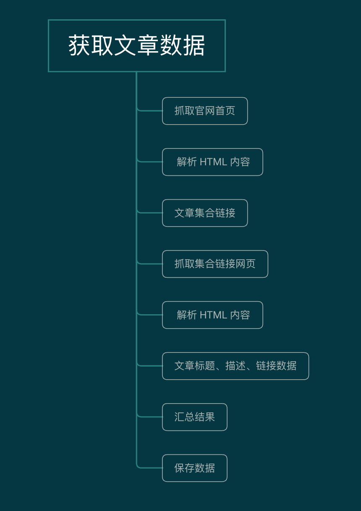
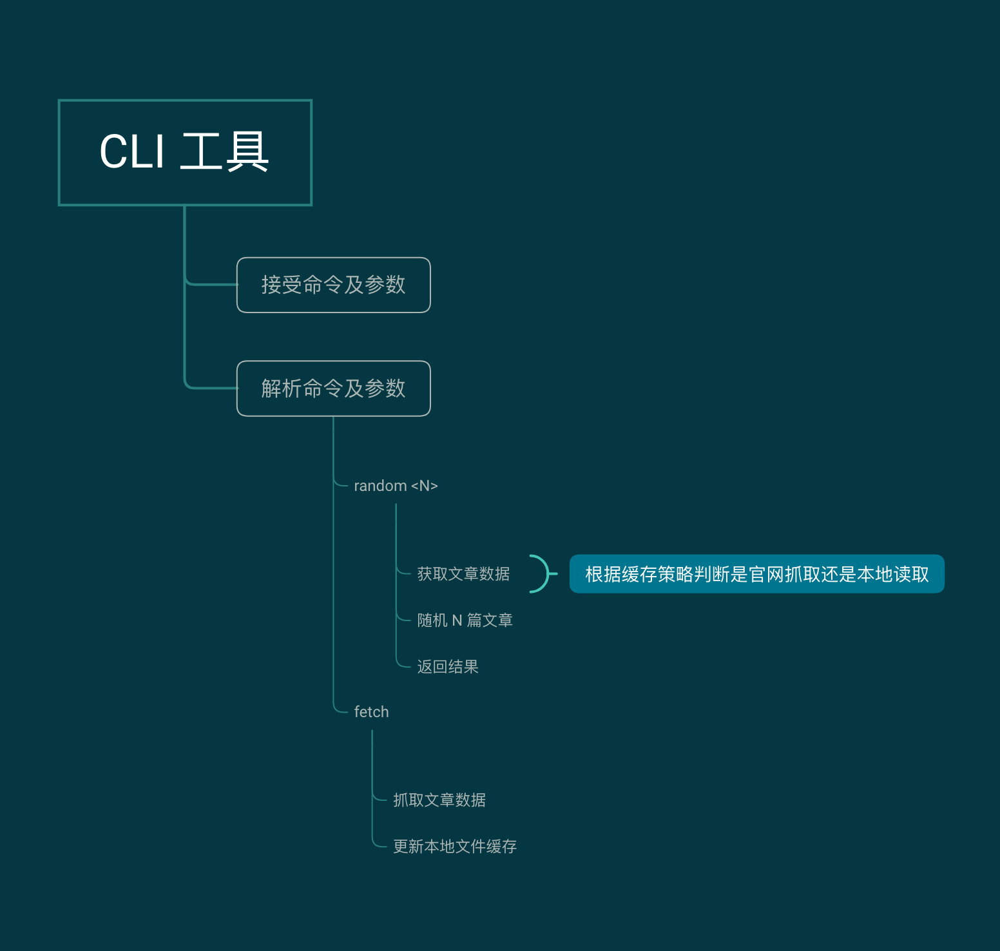
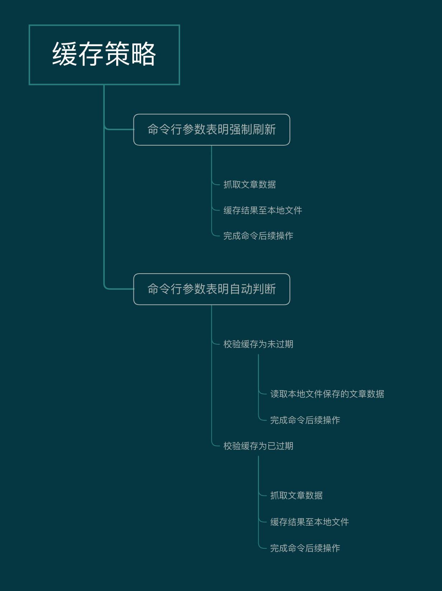
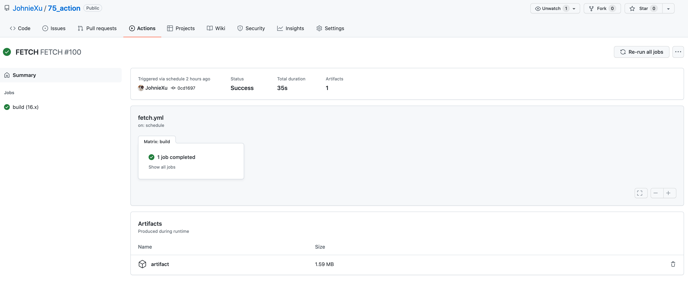

## 引言

前端er 应该都知道奇舞周刊，这是一个技术类博客，上面汇聚了一大批优秀博客作者投稿的技术类文章。我本人每隔几天就会去看看上面的文章，但是它的官网经常打不开，每次想看文章的时候还得一页一页的翻才能找到想看的文章。或者，有时候就想随便找一篇文章看一看作为知识扩展或是温故知新。

基于阅读文章的便利性的考虑，于是开始了本次 CLI 工具的探索，这款工具的核心功能是以开发者的角度来快速的找出奇舞周刊上发布的文章链接。

## 主要功能

- 抓取全部文章链接
- 随机 N 篇文章链接
- 定时任务自动抓取

### 抓取全部文章链接

这个功能目的主要是抓取文章链接数据，为CLI 工具开发提供数据支撑，以及为后续开发关键词检索、文章内容爬取、文章推荐等功能做铺垫。

```bash
npx 75_action fetch
```

### 文章数据本地缓存

作为命令行工具使用时，从官网抓取数据的过程实测会消耗 20s+ 的时间，因此采用本地文件来缓存已经抓取的文章数据。`npx 75_action random <N>` 命令执行完成后会自定缓存抓取数据到本地，缓存有效期为 24h。

### 随机 N 篇文章链接

CLI 工具主要功能之一，运行命令即可随机返回 N 篇文章的数据。

```bash
npx 75_action random <N>
```

### 定时任务自动抓取

借助 Github Actions 配置定时任务，每天0 8 16点执行自定执行[[#抓取全部文章链接]]任务，并将抓取到的文章数据打包上传至 GitHub 可供下载使用。


## 方案设计

1. 获取文章数据



2. CLI 工具



3. 缓存策略



## 功能实现
### 文章数据抓取

对应源码在这里查看：[https://github.com/JohnieXu/75_action/blob/master/lib/fetch.js](https://github.com/JohnieXu/75_action/blob/master/lib/fetch.js)

抓取奇舞周刊官网首页 HTML 并解析出文章集合数据

```js
function getCollections() {
  return fetch(homeUrl)
  .then(res => res.text())
  .then(res => {
    if (!res) {
      return Promise.reject(new Error('获取网页内容失败'))
    }
    return cheerio.load(res)
  })
  .then($ => {
    const list = $('ol.issue-list > li')
    const collections = list.map((i, l) => {
      const title = $(l).find('a').attr('title')
      const url = $(l).find('a').attr('href')
      const date = $(l).find('.date').attr('datetime')
      return { title, url, date }
    })
    return collections
  })
}
```

抓取集合 URL 页面的 HTML 并解析出集合下文章数据

```js
function getArticleDoc(url) {
  return fetch(homeUrl + url)
  .then(res => res.text())
  .then(res => {
    if (!res) {
      return Promise.reject(new Error("获取网页内容失败"))
    }
    return cheerio.load(res)
  })
}

function getArticles(doc) {
  const $ = doc
  const el = $('ul > li.article')
  const list = el.map((i, l) => {
    return {
      title: $(l).find('h3.title > a').text(),
      url: $(l).find('h3.title > a').attr('href'),
      desc: $(l).find('.desc').text()
    }
  })
  return list
}
```

整合文章数据并排序输出

```js
getArticleDoc(url).then(getArticles).then(list => list.map((_, item) => ({ ...item, issue: title, date }))).then(list => {
  all = [...all, ...list]
}) // 整合文章数据

all = all.sort((a, b) => b.date.localeCompare(a.date)) // date倒序排列
```

文章的 date 字段是对应集合的发布日期（期刊日期），例如：`2021-12-17`，需要进行日期倒序排列，使用 [String.prototype.localeCompare()](https://developer.mozilla.org/zh-CN/docs/Web/JavaScript/Reference/Global_Objects/String/localeCompare)  进行字符串排序。

### 文章数据缓存

对应源码在这里查看：[https://github.com/JohnieXu/75_action/blob/master/lib/file.js](https://github.com/JohnieXu/75_action/blob/master/lib/file.js)

缓存文件及有效期

```js
const CACHE_FILE = './.75_action/.data.json'
const CACHE_TIME = 1000 * 60 * 60 * 24; // 缓存24h
const homeDir = require('os').homedir()
const p = path.resolve(homeDir, CACHE_FILE) // 缓存文件路径在用户家目录
```

读取缓存文件的修改时间判断是否过期（不存在缓存文件也算缓存过期）

```js
function isCacheOutDate() {
  const p = path.resolve(require('os').homedir(), CACHE_FILE)
  if (!fs.existsSync(p)) {
    return true
  }
  const stat = fs.statSync(p)
  const lastModified = stat.mtime
  const now = new Date()
  return now - lastModified >= CACHE_TIME
}
```

未过期则读取缓存文件作为抓取到的文章数据

```js
function getHomeFileJson() {
  const homeDir = require('os').homedir()
  const p = path.resolve(homeDir, CACHE_FILE)
  const jsonStr = fs.readFileSync(p)
  let json
  try {
    json = JSON.parse(jsonStr)
  } catch(e) {
    console.error(e)
    json = []
  }
  return json
}
```

抓取到文章数据后写入本地缓存

```js
function writeFileToHome(json) {
  const homeDir = require('os').homedir()
  const p = path.resolve(homeDir, CACHE_FILE) // 写入路径为用户家目录
  return mkdirp(path.dirname(p)).then(() => {
    fs.writeFileSync(p, JSON.stringify(json, null, 2)) // 使用 JSON 格式序列化
  })
}
```

### CLI 工具开发
#### 配置 bin 入口

运行 `npx 75_action` 命令即使用 Node.js 执行此处指向的 `75_action.js` 脚本

```json
{
  "bin": {
    "75_action": "bin/75_action.js"
  }
}
```

指向的脚本文件源码在这里查看：[https://github.com/JohnieXu/75_action/blob/master/bin/75_action.js](https://github.com/JohnieXu/75_action/blob/master/bin/75_action.js)

#### 令行参数
> 使用 commander 库注册 CLI 命令和解析命令参数

```js
const program = require('commander')

// 注册命令
program.command('random [number]')
       .description('随机获取n篇文章链接')
       .option('-d, --debug', '开启debug模式')
       .action((number, options) => {
         number = number || 1
         if (options.debug) {
           console.log(number, options)
         }
         fetch({ save: 'home', progress: true }).then(({ collections, articles }) => {
           const selected = random(number, articles)
           console.log(JSON.stringify(selected, null, 2))
           process.exit()
         }).catch((e) => {
           console.log(e)
           process.exit(1)
         })
       })

program.command('fetch')
       .description('重新抓取文章链接')
       .option('-d, --debug', '开启debug模式')
       .action((options) => {
          if (options.debug) {
            console.log(options)
          }
          fetch({ save: 'home', progress: true, reload: true }).then(({ collections, articles }) => {
            console.log(`抓取完成，总共${collections.length}个集合，${articles.length}篇文章`)
            process.exit()
          })
       })

program.parse(process.argv)
```

#### 命令行进度条

> 使用 `cli-progress` 库实现命令行进度条效果


```js
const cliProgress = require('cli-progress')
const bar1 = new cliProgress.SingleBar({}, cliProgress.Presets.shades_classic)
bar1.start(collections.length, 0) // 文章集合数设置为进度总值
bar1.update(doneLen)              // 抓取完成任一集合文章后更新进度条
```

### 定时抓取数据

此功能使用 GitHub Actions 自动执行定时任务，在项目中添加对应的 yml 配置文件即可，对应源码在这里查看：[https://github.com/JohnieXu/75_action/blob/master/.github/workflows/fetch.yml](https://github.com/JohnieXu/75_action/blob/master/.github/workflows/fetch.yml)

```yml
name: FETCH
on:
  push:
    branches:
      - master
  schedule:
    - cron: "0 0,8,16 * * *" # 每天0 8 16点执行（有8小时时差）

jobs:
  build:

    runs-on: ubuntu-latest

    strategy:
      matrix:
        node-version: [16.x]
        # See supported Node.js release schedule at https://nodejs.org/en/about/releases/

    steps:
    - uses: actions/checkout@v2
    - name: Use Node.js ${{ matrix.node-version }}
      uses: actions/setup-node@v2
      with:
        node-version: ${{ matrix.node-version }}
        cache: 'npm'
    - run: npm i -g yarn
    - run: yarn
    - run: node index.js
    - name: Save
      uses: actions/upload-artifact@v2
      with:
        path: data.json
```

使用 `actions/checkout` 克隆仓库源码，使用 `actions/setup-node` 来切换 Node.js 版本为 16.X，最后使用 `actions/upload-artifact` 将执行 `node index.js` 命令生成的 `data.json` 文件打包输出上传至  GitHub。

执行效果



### Npm 包发布

要确保此项目支持命令 `npx 75_action` 执行，需要将此项目发布到 npm 官方仓库下，项目名称为 `75_action`。

发布流程如下（部分命令根据实际情况选择） ，其中 `nrm` 用法可在这里查看：[https://www.npmjs.com/package/nrm](https://www.npmjs.com/package/nrm) 。

```bash
nrm use npm # 切换 npm 源为官方
npm login	   # 登录 npm 账号
npm run publish# 发布
```

## 成品展示

> 以下命令均在终端执行，并且需要 Node.js 版本至少 10.X 及以上，并且终端内 node、npx 命令可正常使用

随机一篇文章

```bash
npx 75_action random
```

随机 5 篇文章

```bash
npx 75_action random 5
```

随机 N 篇文章（N 为正整数）

```bash
npx 75_action random N
```

抓取并更新本地文章数据

```bash
npx 75_action fetch
```

## 结语
本文实现了一个用于抓取奇舞周刊文章标题、描述及文章原始链接的 CLI 工具，该工具依托于 Node.js 运行。基本满足了快速获取奇舞周刊文章链接的需求，同时文章数据还能够缓存在本地，有效提升了使用体验。另外，还有一些进阶功能未开发，比如：**根据文章标题进行关键词搜索，返回最新一期文章集合，根据文章标题进行分类，文章链接有效性检测**等。

上述这些未开发的功能后续会视情况陆续进行开发，也欢迎各位关注此项目的后续进展，项目地址在这里：[https://github.com/JohnieXu/75_action](https://github.com/JohnieXu/75_action) 。


## 参考资料

[1] [String.prototype.localeCompare()](https://developer.mozilla.org/zh-CN/docs/Web/JavaScript/Reference/Global_Objects/String/localeCompare)

[2] [cheerio 使用文档](https://github.com/cheeriojs/cheerio/wiki/Chinese-README)

[3] [commander 使用文档](https://github.com/tj/commander.js/blob/master/Readme_zh-CN.md)

[4] [cli-progress 使用文档](https://github.com/npkgz/cli-progress#cli-progress)

[5] [GitHub Actions 使用教程](https://docs.github.com/cn/actions/quickstart)
