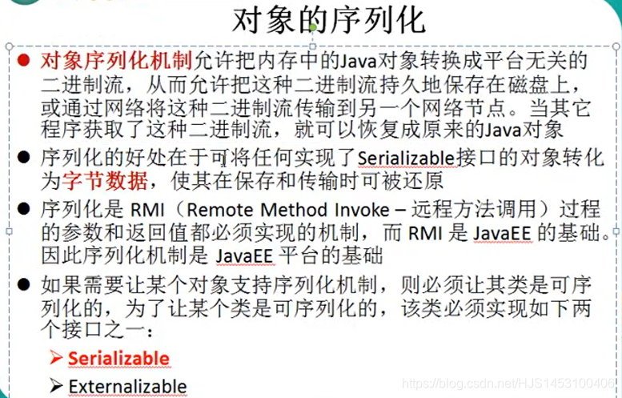
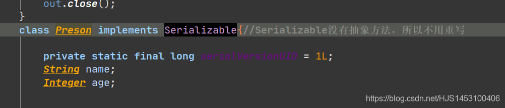
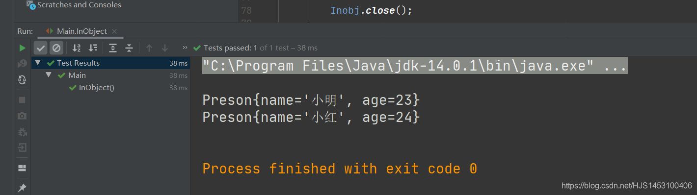
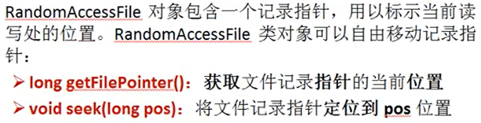
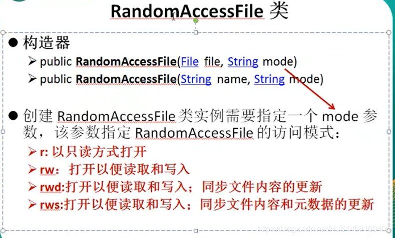
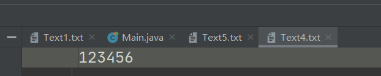
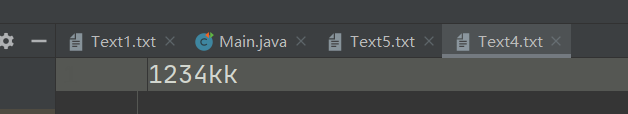
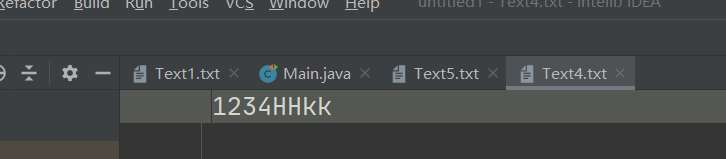
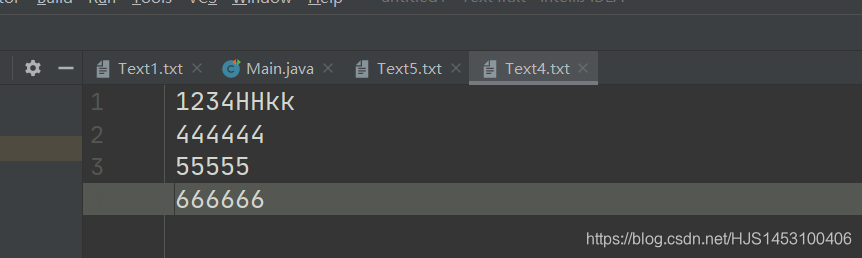
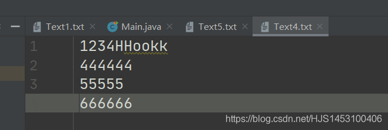

为了后面这两个重要的流，再单独开一篇。

#### IO流（三）

- [一、对象流](#_2)
- [二、RandomAccessFile类](#RandomAccessFile_107)

## 一、对象流

**作用：** 传输对象（引用数据类型）  
 **特点：**  
 1.基本数据类型使用**数据流**来实现传输，而引用数据类型则可以是用**对象流**传输；

2.使用**对象流**可以将对象存储到硬盘中，断电后不消失，所使用的机制称为**序列化机制**；  
   
 3.并不是所有的类都可以使用序列化机制，自定义类若想使用序列化则需要满足以下条件：

- 自定义类需实现**Serializable接口**或**Externalizable接口**
- 类中所用到的属性也需要实现**Serializable接口**或**Externalizable接口**
- **凡是实现Serializable接口的类必须声明一个版本的序列号serialVersionUID,默认情况下序列号会随生成，但是为了兼容版本的特性，最好自己声明；**  
   
- **ObjectOutputStream** 和 **ObjectInputStream**不能序列化被`static`和`transient`所修饰的成员变量

  

**分类：** 输入对象流（`ObjectInputStream`）\ 输出对象流（`ObjectOutputStream`）  
 **使用：**

```
import org.junit.jupiter.api.Test;

import java.io.*;

public class Main implements Serializable{
    //1.对象的序列化过程：对象转化为二进制流写入到硬盘中
    @Test
    public void Object()  throws Exception {

        Preson p1=new Preson("小明",23);
        Preson p2=new Preson("小红",24);

        //指明写入位置匿名类对象
        ObjectOutputStream out=new ObjectOutputStream(new FileOutputStream("Text4.txt"));
        //写入
        out.writeObject(p1);
        out.flush();

        out.writeObject(p2);
        out.flush();

        //关闭流
        out.close();
    }
    class Preson implements Serializable{//Serializable没有抽象方法，所以不用重写

        private static final long serialVersionUID = 1L;
        String name;
        Integer age;

        public Preson(String name, Integer age){
            this.name=name;
            this.age=age;
        }
        public String getName() {
            return name;
        }

        public Integer getAge() {
            return age;
        }

        public  void SetName(String name){
            this.name=name;
        }
        public void SetAge(Integer age){
            this.age=age;
        }

        @Override
        public String toString() {
            return "Preson{" +
                    "name='" + name + '\'' +
                    ", age=" + age +
                    '}';
        }

    }

    //2.对象的反序列化过程  为二进制流转化对象
    @Test
    public void InObject () throws Exception {

        //选择还原的位置
        ObjectInputStream Inobj=new ObjectInputStream(new FileInputStream("Text4.txt"));

        //输出
        Preson p1=(Preson)Inobj.readObject();
        System.out.println(p1);

        Preson p2=(Preson)Inobj.readObject();
        System.out.println(p2);

        Inobj.close();

    }

}
```



（关于序列化的问题找个需要另外写一篇博客）

## 二、RandomAccessFile类

**作用：** RandomAccessFile类是一个特殊的流，既实现输入，也可以实现输出，并且支持 “随机访问（在一段数据中指定的位置访问）” 的特点；  
 **特点：** RandomAccessFile类有两个特殊的方法：

- long getFilePointer()：获取文件记录指针的当前位置
- void seek(long pos)：将文件记录指针定位到 pos 位置  
   
- 如果想使用该类，必须先使用该类的构造器创建对象  
   

**方法和作用：**

- void seek​(long pos) 改变指针的位置，默认从0开始，数字代表指针前面字节的个数。
- long getFilePointer() 返回此文件中的当前偏移量。
- void write​(int b) 将指定的字节写入此文件。
- void write​(byte[] b) 从当前文件指针开始，将指定字节数组中的 b.length字节写入此文件。
- void write​(byte[] b, int off, int len) 将从偏移量 off开始的指定字节数组中的 len个字节写入此文件。
- String readLine() 从此文件中读取一行文本。

**使用：**

1.实现覆盖效果：  
 

```
 @Test
    public void  RandomAccessFile2() throws Exception{
        RandomAccessFile ran3=new RandomAccessFile(new File("Text4.txt"),"rw");
        ran3.seek(4);
        ran3.write("kk".getBytes());//getBytes()将字符串转换为字节数组
    }
```



  

2.插入效果


```
	@Test
       public void  RandomAccessFile2() throws Exception{
       RandomAccessFile ran3=new RandomAccessFile(new File("Text4.txt"),"rw");
       ran3.seek(4);
       String str=ran3.readLine();//读取4以后的字符并移动指针到末尾

       ran3.seek(4);
       ran3.write("HH".getBytes());
       ran3.write(str.getBytes());

}
```



3.多行文本插入效果（保留换行符）  
 

```
	@Test
    //2.从文件任意位置读取、写入
    public void  RandomAccessFile2() throws Exception{
        RandomAccessFile ran3=new RandomAccessFile(new File("Text4.txt"),"rw");

        ran3.seek(6);
        byte[] b=new byte[10];//创建一个可以存储10字节的数组
        int len;
        StringBuffer sb=new StringBuffer();//可变字符串
        while((len=ran3.read(b))!=-1){
            sb.append(new String(b,0,len));//将获取到的字符依次添加到可变字符串中
        }
        
        ran3.seek(6);
        ran3.write("oo".getBytes());
        ran3.write(sb.toString().getBytes());//调用toString方法转化为字符串，而后使用getBytes()方法转换为数组
        ran3.close();
    }
```



**PS:**  
 **1.使用StringBuffer的toString()方法，可以将StringBuffer转换成String**
