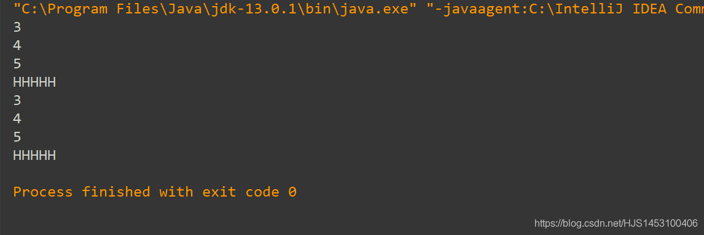
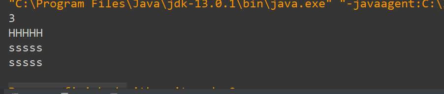

## 代码块

代码块是一个比较简单的概念，因为这里涉及到static所修饰，所以在这里写一篇为了以后的说明；

#### 概念

代码块：声明在类中，被一对“{}”所括起来，里面多为属性赋值的语句；

```
class sing{
   private int a;
   private int b;
   //代码块
    {
        a=3;
        b=4;
    }
```

看起来很简单对不对？其实这个东西很好玩；

首先，先说明一件事——**Java中关于赋值的操作** 的顺序

1.初始化的默认值——>2.显示的初始化或代码块（他们按照顺序进行）——>3.构造器——>4.通过方法对对象的属性进行修改。

然后，将代码块分成2类：静态代码块和非静态代码块；

#### 1.非静态的代码块

```
1.可以对类的属性（静态和非静态）进行初始化操作，同时也可以调用本类中所声明的方法（静态和非静态）；
2.里面可以有输出语句；
3.一个类中可以有多个代码块，按照顺序执行；
4.对于非静态的代码块，类每创建一个对象代码就执行一次；
5.非静态的代码块执行早于构造器。
```

简单代码：

```
public class Main{
    public static void main(String[] args) {
     sing a=new sing();
       sing b=new sing();
    }
}

class sing{
   private static int b;//声明静态变量；
   private int a;
   //空参构造器，放在代码块前面；
   public sing(){
       System.out.println("HHHHH");
   }
   //代码块1
    {
        a=3;
        System.out.println(a);//创建一个sing的实例就会执行；
    }
    //代码块2
    {
        a=4;
        b=5;
        System.out.println(a);//创建一个sing的实例就会执行；
        System.out.println(b);//调用静态变量；
    }
}
```

输出结果：  


#### 2.静态的代码块

```
1.里面可以有输出语句；
2.随着类的加载而加载，但是只是被加载一次；
3.多个静态代码块直接按顺序执行；
4.只能执行静态的结构（类属性，类方法）；
5.静态的代码块执行要早于非静态的代码块；
```

简单代码：

```
public class Main{
    public static void main(String[] args) {
        sing a=new sing();//这里实例化了两个对象；
        sing b=new sing();
    }
}

class sing{
    static private int age;
    static private String name;
    //无static代码块，虽然写在前面，却最后执行，并且重复执行；
    {   name="sssss";
        System.out.println(name);
    }
    //有static代码块
    static{//单次执行；
        age=3;
        System.out.println(age);
        ma();
    }

    public static void ma(){
        System.out.println("HHHHH");
    }

}
```

输出结果：  


2020年3月2日初写
