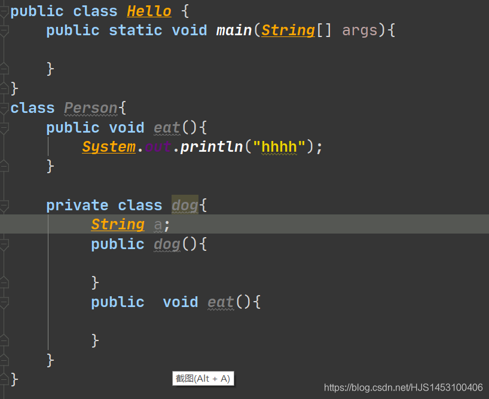
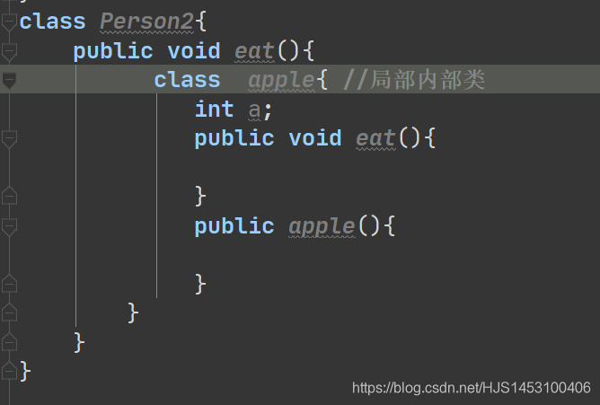
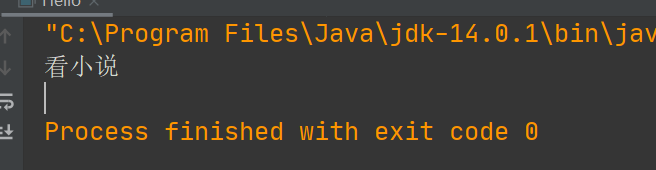
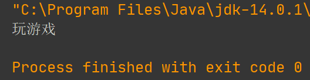
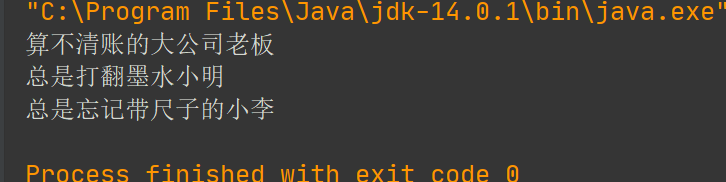
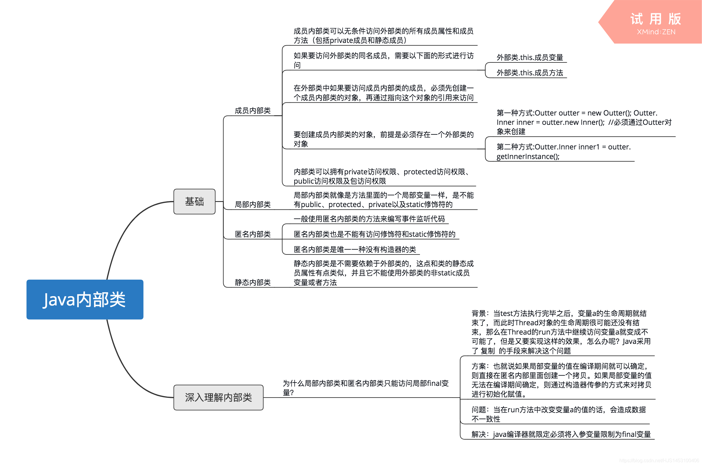

概念：内部类是类的第五个成员（属性、代码块、方法、构造器、内部类），所谓内部类，就是说**允许一个类定义于另一个类的内部**，前者称为内部类、后者称为外部类。

内部类又可分为两种：**成员内部类**和**局部内部类**；

## 一.成员内部类
概念：定义于外部类中，方法以外；
```java
public class Hello {
    public static void main(String[] args){

    }
}
class Person{
    public void eat(){
        System.out.println("hhhh");
    }

    class dog{

    }
}
```
特点：
	1.在外部类中，是外部类的成员；
	2.可以使用四个修饰符（普通只能使用默认和public修饰）
	3.可以使用static（全局/静态）、final（最终）、abstract（抽象）修饰；
	4.可以在内部定义属性、方法、构造器
	
**简单来说，内部类具有类和成员的特性；**



## 二.局部内部类
概念：定义于外部类中，方法以内;
```java
public class ceshi {
    public static void main(String[] args){

    }
}
class Person2{
    public void eat(){
        class apple{
            
        }
    }
}
```
特点：
	1.具有类的一般性质，可以在内部定义属性、方法、构造器
	2.不能使用四个修饰符
	3.不能使用static（全局/静态）、final（最终）、abstract（抽象）；
	

局部内部类的写法按照规格来说是这样



但是一般不这样用，那怎么用？一般这样用：
==使用一个方法，使其返回值为某个类或接口的对象，而这个类或接口**在方法内部创建**==
```java
public class ceshi {
    public static void main(String[] args){

    }
}
interface Study{//定义一个接口
public int durk();
}
class Person2{
    //使用方式1
    public Study getStudy(){
        //创建一个实现Study接口的类(局部内部类)
        class Mystudy implements Study{
            public int durk(){
                return 1;
            }
        }
        //返回一个实现类的对象
        return new Mystudy();
    }

    //使用方式2
    //匿名方式
    public Study getStudy1(){
        //返回一个实现接口Study接口的匿名内部类对象
        return new Study() {
            public int durk() {
                return 0;
            }
        };
    }
}
```
关于局部内部类，这里在附一段使用代码；
```java
public class ceshi {
    public static void main(String[] args){
        ceshi a=new ceshi();//实例化a用于调用getProduct()方法；
        Product p=a.getProduct();//实例化p用于接收a的调用结果；
        p.getPrice();
        p.getName();
    }
    //局部内部类使用
    public Product getProduct() {
        //实现Product接口的局部内部类
        class Camera implements Product{
            public void getName() {
                System.out.println("笔记本");
            }

            public void getPrice() {
                System.out.println("$1");
            }
        }
        return new Camera();//返回一个Camera的实例化对象
    }
}
interface Product{//定义接口
    void getName();
    void getPrice();
}
```

## 三.如何创建对象
(PS:接下来说到的都是成员内部类！！！)

首先，成员内部类可以分为两种：**静态内部类**和**非静态内部类**，区分的方法也很简单，看是不是被static所修饰的即可判断；
```java
class Person{
    class boy{//非静态内部类

    }
    static class  girl{//静态内部类

    }
}
```
### 1.静态内部类创建对象
格式：
外部类类名.内部类类名 对象 = new 外部类类名.内部类类名（）；
```java
public class Hello {
    public static void main(String[] args){
       Person.girl xiaoming =new Person.girl();
       xiaoming.like();
    }
}
class Person{
    static class  girl{//静态内部类
       public void like(){
           System.out.println("看小说");
       }
    }
}
```
输出结果：



==ps：外部类可以直接调用内部类的构造器==

#### 2.非静态内部类创建对象
格式：
1.创建外部类的对象
2.外部类类名.内部类类名 对象=外部类对象.new 内部类构造器（）；
```java
public class Hello {
    public static void main(String[] args){
      Person a=new Person();
      Person.boy b=a.new boy();
      b.like();
    }
}
class Person{
    class boy{//非静态内部类
        public void like(){
            System.out.println("玩游戏");
        }
    }
}
```
输出结果：



## 四.如何区分外部类与内部类重名的对象
==**补充一个点，在内部类中，可以调用来自外部类的属性和方法**==

我把可能出现重名的状态分成三种：

	1.外部类传进内部类的对象；（重名1号）
	2.外部类中的对象；（重名2号）
	3.当前内部类中的对象；（重名3号）

```java
public class Hello {
    public static void main(String[] args){
        Person a=new Person();
        Person.boy b=a.new boy();
        b.getName("算不清账的大公司老板");//重名1号
    }
}
class Person{
    String name="总是打翻墨水小明";//重名2号
    class boy{
        String name="总是忘记带尺子的小李";//重名3号
        public void getName(String name){
            System.out.println(name);//打印重名1号
            System.out.println(Person.this.name);//打印重名2号
            System.out.println(this.name);//打印重名3号
        }
    }
}
```
输出结果：



## 五:总结
我目前关于内部类掌握的知识并不多，所以只能简单的总结了一下，
但是，我是个会上网的孩子。。。。。。。。。。
用一下一张图做了很好的总结（非原创）



图片来源：[点这里](https://www.nowcoder.com/questionTerminal/3fd7690375a644a0aa0fdbfe43ec7b8d?orderByHotValue=1&page=1&onlyReference=false)
