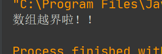
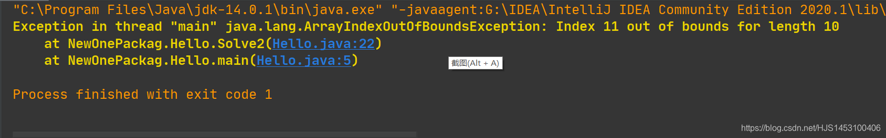
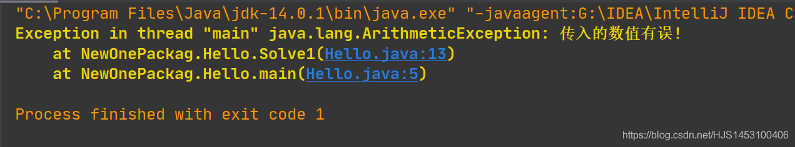
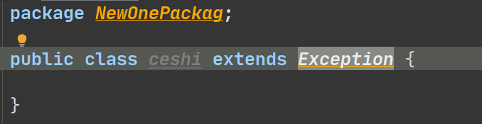
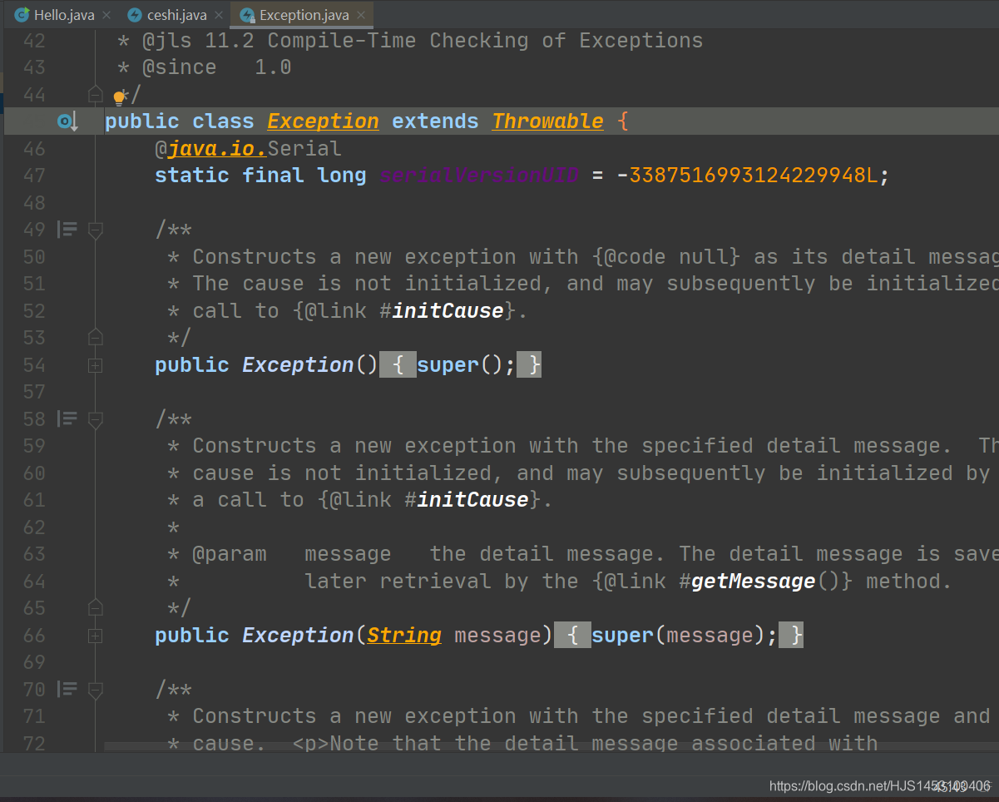
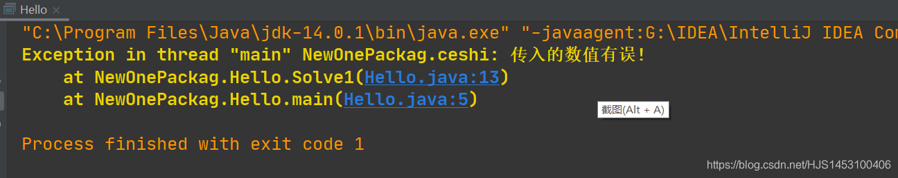

## 一、异常

“异常”是在程序开发过程中一定会遇到的一个点，无论一个程序写的多么完善，总会有意想不到的异常出现，可能来源于程序开发中忽略的点，也可能来自用户的不得当操作。

  

## 二、常见的异常

在Java中，异常（错误）分为两大块：**Error错误**和**Exception错误**  
并且他们都在`Java.lang.Throwable`下

##### 1.Error严重错误

在Java的虚拟机中，Error错误是一个无法没解决的错误，所以在程序中也无法处理，该错误一般出现的原因有以下几点：

- 电脑操作系统设置出现问题，需要进行修复或者重新安装操作系统；
- 电脑配置中出现器件的损坏或者失效，无法使Java程序正常运行；
- Java在安装过程中安装包出现损坏或安装不得当，需要重写下载安装；

##### 2.Exception错误

该错误则表示为“**一般性的错误问题**”可以在Java程序中通过代码解决，也就是说，我们说到的Java中的“**异常处理**”就是解决Exception错误（异常）

同时Exception异常又可以划分为两类：  
①Javac.exe的异常——**编译时异常**（在编译器中一般会提示）  
②Java.exe的异常——**运行时异常**（会在控制台提示：`RuntimeException`）

对于“**编译异常**”的出现，编译器一般会在代码编写中提示错误行并且无法编译成功，相对来说容易找到发生异常的代码，其发生的原因一般为**语法**或**格式**的错误；

而对于**运行异常**来说，编译器在编译过程中无法识别该类异常，只有在代码执行过程中才能被发现，常见的运行异常有以下几类：

- 算术异常类：`ArithmeticExecption`
- 空指针异常类：`NullPointerException`
- 类型(强制)转换异常：`ClassCastException`
- 数组负下标异常：`NegativeArrayException`
- 数组下标越界异常：`ArrayIndexOutOfBoundsException`
- 违背安全原则异常：`SecturityException`
- 文件已结束异常：`EOFException`
- 文件未找到异常：`FileNotFoundException`
- 字符串转换为数字异常：`NumberFormatException`
- 数据库操作异常：`SQLException`
- 输入输出异常：`IOException`
- 方法未找到异常：`NoSuchMethodException`

顺便说一下，一般的错误都可以视为`Exception`错误的子类；

对于**运行时异常**我们可以不显示的进行处理，但是对于**编译异常**必须显示的处理；

  

## 三、如何处理异常？

前面说到，异常是不可避免的，可是一个软件需要完整的体系，不允许执行过程中出现乱码，怎么办？  
所以，既然避免不了，那就解决他。  
在Java中提供了一种异常处理的机制——**抓抛模型**，用来预防可能出现异常的代码并解决出现的异常。

### 抓抛模型

抓抛模型分为两个部分：“**抓**”和“**抛**”（他们有两种方法进行操作）；

所谓“**抓**”和“**抛**”，通俗点来说“抓”代表处理，“抛”代表找错；

当一段代码“抛出”（即找到）一个异常类对象，则开始进行“抓”（处理），值得一说的是，如果当前的“抓”无法处理这个异常，则将该异常对象继续“抛”到下一个处理结构（一般是上一层调用这段代码的某个对象或方法），而这一步操作，也视为一次“抓”的处理；

“我处理不了，我给你找可以处理的人”—— ——这也算一次处理；

  

#### 1.“抓”的第一种方法：自己解决

“抓”的格式中一般为try—catch—finally；  
对应的代码格式如下：

```
try{
        //可能出现异常的代码;
    }
    catch(Exception e)//异常类型1，其中Exception为出现异常所得到的提示；
    {
        //处理方式
    }
    catch(Exception e)//异常类型2，e可以同名,类似与局部变量；
    {
        //处理方式
    }
    finally{
        //可选，不管有无异常或异常是否处理都会执行；
    }
```

###### 特点：

1.`try`内的变量类似于局部变量，错误处理的时候尽量避免包含原有的变量或者完整包含可能出现异常的地方；  
  
2. `finally`是可选项目,里面的内容一定会执行并且会在在错误处理执行前执行，一般用于对资源的释放；  
  
3. `catch`语句内部是对异常的处理，而用户可以自定义操作的内容，同时，java也提供了三个方法：

```
catch(Exception e)//异常类型2；e可以同名；
    {
        e.getMessage();//获得错误信息；
        
        e.toString();//获得异常的种类和错误信息；
        
        e.printStackTrace();//在控制台打印异常种类、错误信息与出错的位置；
    }
```

如果`catch`中也出现异常的话则不会执行下面的语句（finally里面的除外），同时，`finally`可以与`catch`嵌套使用（相互）；  
  
4.可以有多个`catch`语句，依次按照顺序判断是否满足自己对应的错误类型，一旦满足，则不会执行后面的`catch`语句；

所以，如果多个`catch`语句不是并列关系而是包含的关系，**我们必须将范围小的错误类型放在前面，** 否则会报错；

  

#### 2.“抓”的第二种方法：找其他人解决

原理：当一个**异常**自己（本层）处理了的时候，利用一种方法将**异常以及异常的类型** 抛给上一层，由上一层解决；

对应的格式一般为：  
一个方法（）`throws` 错误类型1，错误类型2{ //程序代码 }

我知道这样看不懂，无妨，上代码：

```
public class Hello {
    public static void main(String[] args){
          Solve1();//调用Solve1方法；
    }

    public static void Solve1(){//为了简化实例化对象过程，将方法都设置为static；
        try {
            //1.调用Solve2方法；
            Solve2();
            //4.得到Solve2()中反馈回来的异常及异常类型；

        }catch (ArrayIndexOutOfBoundsException a){//5.进行对应的异常处理；
            System.out.println("数组越界啦！！");
        }
    }

    public static void Solve2() throws ArrayIndexOutOfBoundsException{// 3.将异常和异常类型传到调用该方法的方法Solve1()中；

        int[] a=new int[10];
        System.out.println(a[11]);//2.出现数组越界的异常，但是本方法中没有解决的方法
    }
}
```

运行结果：  


###### 特点：

1.可以使用这样的方法（throws）将错误逐个向上抛出；

2.也可以在某一层中（或自己），用`try-catch-finally`进行处理；

#### 3.“抛”的第二种方法：手动触发

为什么不写第一种？因为如果不对异常进行处理，Java程序会自动抛出**异常类对象**；相信你也一定见过类似的，比如：  
  
为了完善软件的生态，我们有时候需要限制一下用户的操作，当用户执行不符合我们软件设计的操作时，就应该向用户发送一个错误，Java中提供了一种用户可以自定义的“异常提示”

用到的关键字是`throw` (注意！这里不是throws！不是throws！不是throws！)  
并且，`throw`只可以抛异常类，不可抛别的；

这次就不废话了，直接上一个小测试说明；

```
public class Hello {
    public static void main(String[] args){
        System.out.println(Solve1(-1));
    }

    public static int Solve1(int k){
        if(k>0) {
            System.out.println("输入合法");
            return 1;
        }
        else throw new ArithmeticException("传入的数值有误!");
        //注意：这里的异常只能写已有的异常类！
    }
    
}
```

运行结果：  
  
自定义异常一般用于当用户输入某些不适合软件的数据时，程序终止运行并返回一个异常，相较于`return`所返回的内容，‘异常’不存在变量类型的限制，开发者可以更方便的处理和完善；

在上面的代码注解中我写了这么一句话：  
`//注意：这里的异常只能写已有的异常类！`

Java中提供的异常类很多，大家可以去api自行查找；

又或者，**我们可以自己定义一个异常类**；

## 四、异常类与自定义异常类

异常类怎么定义？结构是怎么样的？不知道怎么办？

很简单，查看Java中已经有的异常类，按照他的格式，**照猫画虎**；

1.首先Java的异常类是一个类，如果我们不知道该怎么写，那就先创建一个类，让他 **继承** Java自带的异常类  


2.打开原有的异常类，查看里面的格式：

```
说一个点，IEDA中打开源码的方法：
1.选中要打开的对象；
2.Ctrl + Shift+i；
3.Ctrl + Enter；（继续第二步）
4.也可以直接快捷：Ctrl+鼠标左键；
```

  
很明显的我们可以看到Java自带异常类的格式，于是乎我们可以直接将异常类创建的方法归纳如下：

①自定义的异常类继承于现有的异常类；

②提供一个序列号（`serialVersionUID`）,用于表示异常类的唯一性；

③提供几个重载的构造器，用于实现多态的处理；

④补充：由于继承，所以自定义**异常类（子类)** 重写**原有异常类（父类）** 的方法所抛出的异常的范围只能比父类小（或者相同）；  
  
  
ok,我们可以自己创建自己的异常类了。

自定义异常类：

```
public class ceshi extends ArithmeticException {
    static final long serialVersionUID = -3387516945124L;
    public ceshi(String a){
        super(a);
    }
}
```

自定义异常类的使用：

```
public class Hello {
    public static void main(String[] args){
        System.out.println(Solve1(-1));
    }

    public static int Solve1(int k){
        if(k>0) {
            System.out.println("输入合法");
            return 1;
        }
        else throw new ceshi("传入的数值有误!");
        //注意：这里的异常只能写已有的异常类！
    }
}
```

输出结果：  


PS：增加一个练习，计算a/b；

```
public class Hello {
    public static void main(String[] args) {
        try {
            int a = Integer.parseInt(args[0]);//在程序运行开始前输入
            int b = Integer.parseInt(args[1]);
            ecm(a,b);
        }
        catch (ArrayIndexOutOfBoundsException e){
            System.out.println("输入的内容缺少！");
        } catch(NumberFormatException e){
            System.out.println("输入的数据类型不一致！");
        } catch (ArithmeticException e){
            System.out.println("输入数据有0的参与！");
        }
        catch (Ecdef e){
            System.out.println(e.getMessage());
        }
    }
    public static void ecm(int a,int b) throws Ecdef {
        if (a < 0 || b < 0) {
            throw new Ecdef("您输入的内容有负数");
        }
        System.out.println(a/b);
    }
}

class Ecdef extends Exception {//自定义输入负数的异常
    static final long serialVersionUID = -3316993124229948L;
    public Ecdef() {
    }
    public Ecdef(String msg) {
        super(msg);
    }

}
```
