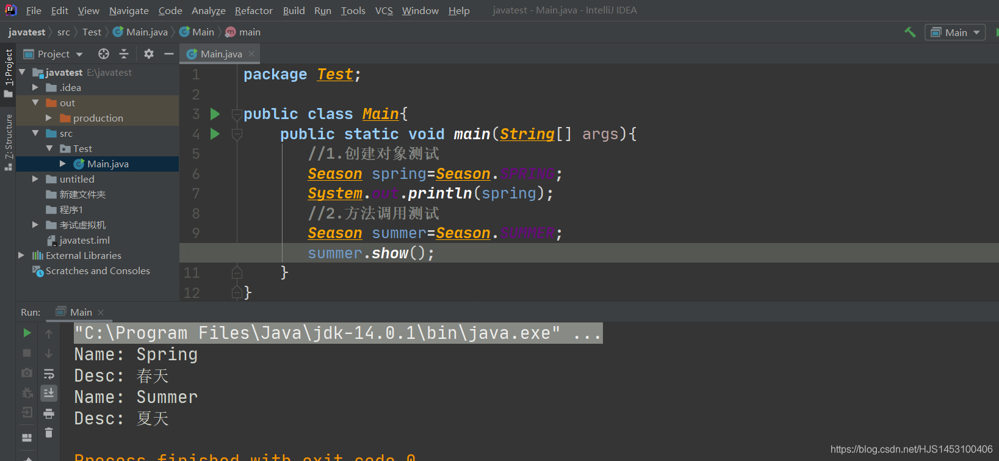
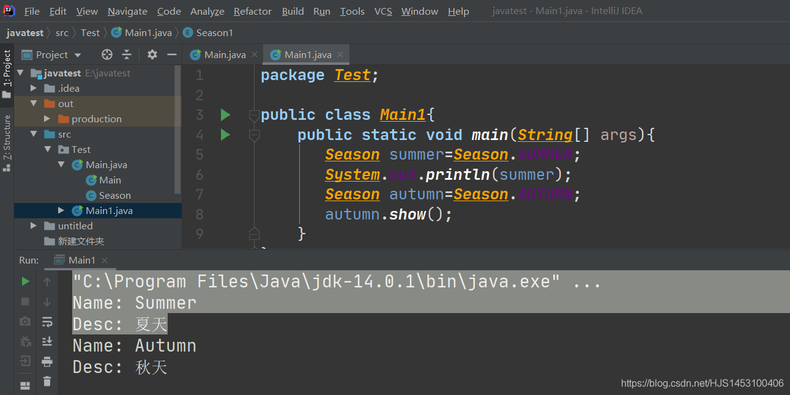
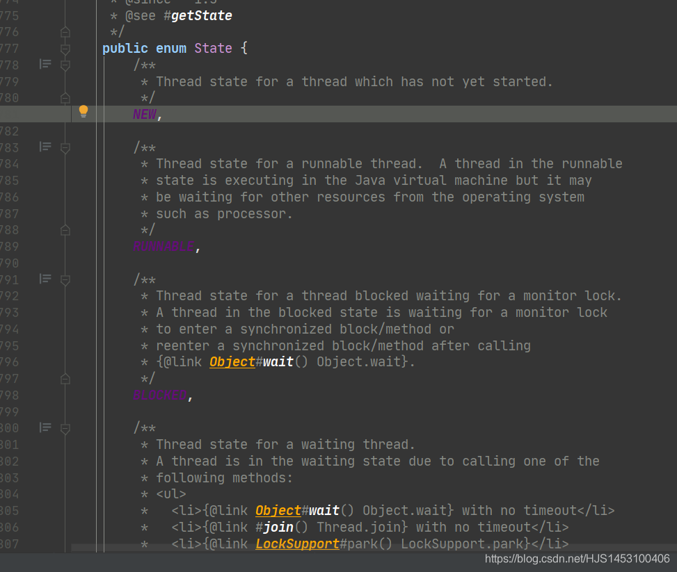
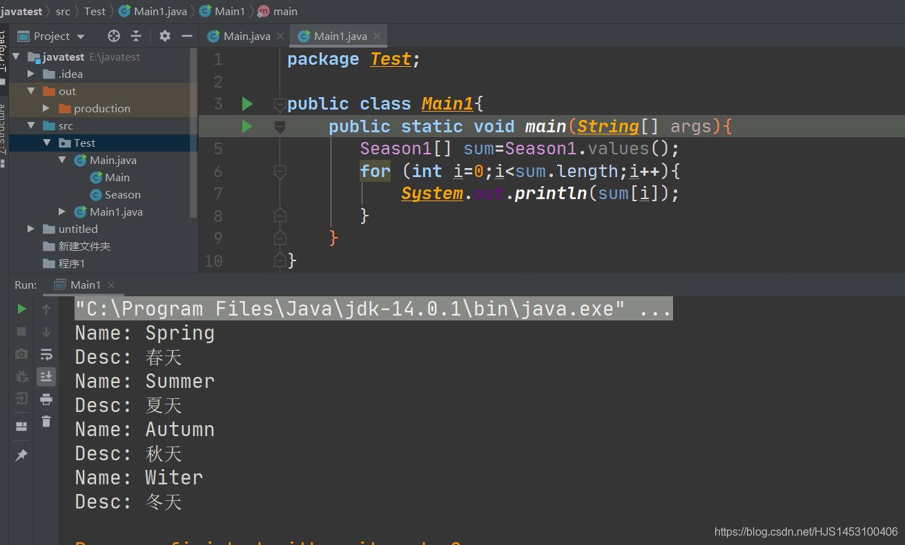
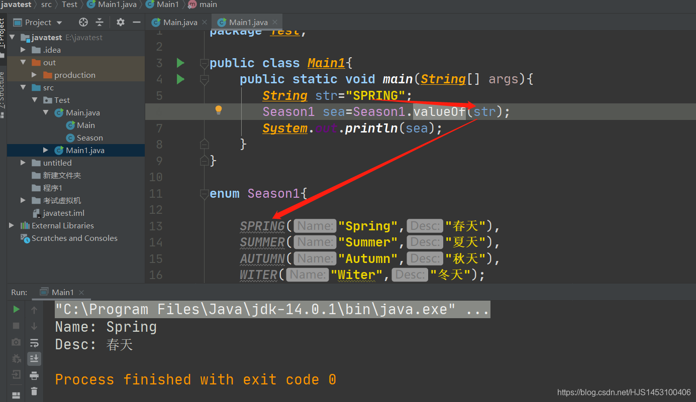
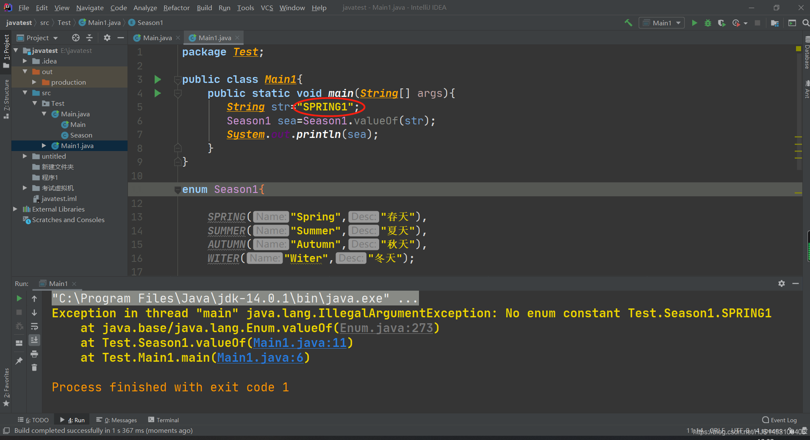
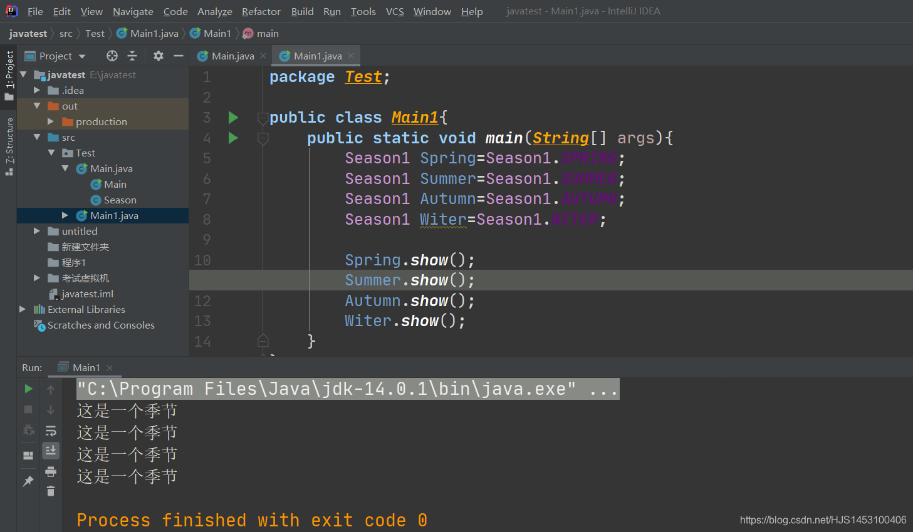
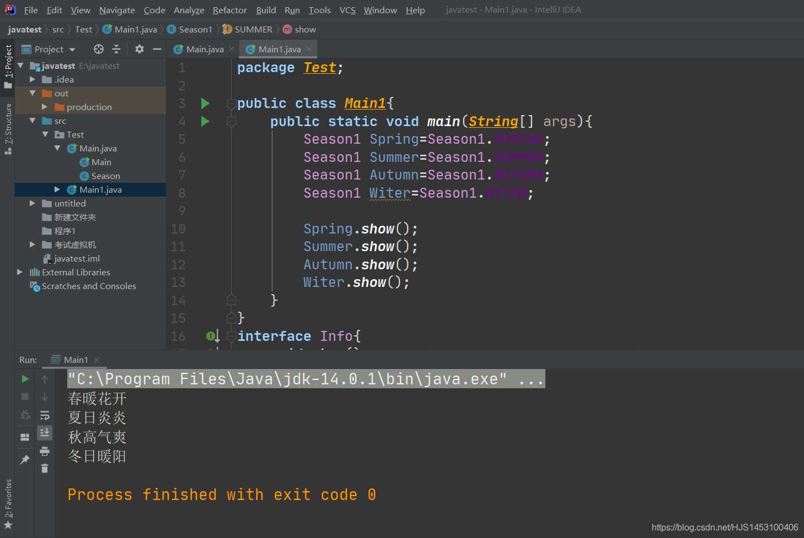

#### 枚举（枚举类）

- [一、枚举和枚举类](#_1)
- [二、如何自定义枚举类](#_10)
- - - [1、私有化构造器](#1_20)
    - [2、私有化属性并在构造器中初始化属性](#2_29)
    - [3、设置可以调用属性的公共方法](#3_45)
    - [4、提供方法与重写toString](#4toString_57)
    - [5、创建枚举类的对象](#5_68)
- [三、如何使用enum关键字创建枚举类](#enum_126)
- [四、枚举类常用的方法](#_231)
- - - [1.values（数组转换）](#1values_233)
    - [2.valueOf（属性查找）](#2valueOf_267)
- [五、如何让枚举类实现接口](#_304)

## 一、枚举和枚举类

在计算机科学中，**枚举**是一个集列出某些有穷序列集的所有成员的程序，或者是一种特定类型对象的计数。换句话说，枚举就是指一个集合中的数是有限个，而我们可以将他们一一读取。

继而，Java 中**枚举类**的概念也是如此：枚举类是指在一个类中，该类的对象是有限个的，如果只有一个对象，则视为单例模式

- **JDK1.5以前：使用枚举之前需要自定义枚举类**
- **JDK1.5以后：新增的enum关键字用于定义枚举类**
- **若枚举只有一个成员，怎可以作为一种单例模式的实现方式**

## 二、如何自定义枚举类

自定义枚举类需要满足以下的几个步骤：

```
1、私有化构造器；
2、私有化属性，声明为private final并在构造器中初始化属性；
3、设置可以调用属性的公共方法；
4、提供方法与重写toString；
5、创建枚举类的对象；
```

步骤有些麻烦，无妨，定义一个含有“四季”及其属性的枚举类然后让我们一一列举；

#### 1、私有化构造器

```
class Season{
    private Season(String Name,String Desc){  
    }
}
```

使用关键字`private`来私有化构造器，这一步的目的也很简单，为了使得在 *“ 外部 ”* 无法调用构造器，继而无法创建对象；

#### 2、私有化属性并在构造器中初始化属性

```
class Season{
    private final String Name;
    private final String Desc;
    
    private Season(String Name, String Desc){
        this.Name=Name;
        this.Desc=Desc;
    }
}
```

使用到的关键字有`private`和`final`；  
 其中`private`负责私有化属性不让外部获取。`final`使得属性只能被修改一次；  
 初始化属性在构造器中完成，使得在内部调用构造器时（外部也调不了）自动的初始化；

#### 3、设置可以调用属性的公共方法

```
	public String getName(){
        return Name;
    }

    public String getDesc(){
        return Desc;
    }
```

两个方法使用`public`修饰，使得外部可以获取到两个属性，注意，这里只能是获取属性并不是修改属性；（is get ，no set — —工地英语）

#### 4、提供方法与重写toString

```
	public void show(){
        System.out.println("Name: "+Name+'\n'+"Desc: "+Desc);
    }
    public String toString(){
        return "Name: "+Name+'\n'+"Desc: "+Desc;
    }
```

这一步没啥好说的，不算是关键，没有也可以；

#### 5、创建枚举类的对象

这一步很关键；

```
public static final Season SPRING =new Season("Spring","春天");
public static final Season SUMMER =new Season("Summer","夏天");
public static final Season AUTUMN =new Season("Autumn","秋天");
public static final Season WITER =new Season("Witer","冬天");
```

这里实例化了4个对象，用到了`public`、`static`、`final`三个关键字；  
 其中，`public`和`static`是为了使得在外部可以直接使用**类**调用该属性，不需要再使用公共的方法。`final`使得属性无法再被修改；

综上步骤，自定义枚举类就算是创建完了，我们实验一下；  
   
 附上完整代码：

```
public class Main{
    public static void main(String[] args){
       //1.创建对象测试
       Season spring=Season.SPRING;
       System.out.println(spring);
       //2.方法调用测试
       Season summer=Season.SUMMER;
       summer.show();
    }
}

class Season{//3.自定义枚举类
    private final String Name;
    private final String Desc;

    private Season(String Name, String Desc){
        this.Name=Name;
        this.Desc=Desc;
    }

    public static final Season SPRING =new Season("Spring","春天");
    public static final Season SUMMER =new Season("Summer","夏天");
    public static final Season AUTUMN =new Season("Autumn","秋天");
    public static final Season WITER =new Season("Witer","冬天");

    public String getName(){
        return Name;
    }

    public String getDesc(){
        return Desc;
    }
    public void show(){
        System.out.println("Name: "+Name+'\n'+"Desc: "+Desc);
    }
    public String toString(){
        return "Name: "+Name+'\n'+"Desc: "+Desc;
    }
}
```

  

## 三、如何使用enum关键字创建枚举类

前面有提到，在Java JDK1.5以后新增加了enum关键字用于创建枚举类；  
 为了方便说明（更重要的是我懒），我们直接在自定义类上修改；

同样的，我们需要进行以下几步：

```
1、将实例化对象的代码放到最上面；
2、使用enum代替自定义枚举类中上的class；
3、删除在实例对象的代码中重复出现的代码，多个对象之间用","隔开，最后使用";"；
```

附上代码：

```
enum Season1{//2.使用enum 代替 class

    //1.将实例化对象的代码放到实例类最上端;

    //2.删除实例化对象中重复出现的代码；
    /* public static final Season1 SPRING =new Season1("Spring","春天");*/
    SPRING("Spring","春天"),
    SUMMER("Summer","夏天"),
    AUTUMN("Autumn","秋天"),
    WITER("Witer","冬天");

    private final String Name;
    private final String Desc;

    private Season1(String Name, String Desc){
        this.Name=Name;
        this.Desc=Desc;
    }
    
    public String getName(){
        return Name;
    }

    public String getDesc(){
        return Desc;
    }

    public void show(){
        System.out.println("Name: "+Name+'\n'+"Desc: "+Desc);
    }

    public String toString(){
        return "Name: "+Name+'\n'+"Desc: "+Desc;
    }
}
```

同样的，我们再来测试一下，  
   
 完整代码：

```
public class Main1{
    public static void main(String[] args){
       Season1 summer=Season.SUMMER;
       System.out.println(summer);
       Season1 autumn=Season.AUTUMN;
       autumn.show();
    }
}

enum Season1{//2.使用enum 代替 class

    //1.将实例化对象的代码放到实例类最上端;

    //2.删除实例化对象中重复出现的代码；
    /* public static final Season1 SPRING =new Season1("Spring","春天");*/
    SPRING("Spring","春天"),
    SUMMER("Summer","夏天"),
    AUTUMN("Autumn","秋天"),
    WITER("Witer","冬天");

    private final String Name;
    private final String Desc;

    private Season1(String Name, String Desc){
        this.Name=Name;
        this.Desc=Desc;
    }

    public String getName(){
        return Name;
    }

    public String getDesc(){
        return Desc;
    }

    public void show(){
        System.out.println("Name: "+Name+'\n'+"Desc: "+Desc);
    }

    public String toString(){
        return "Name: "+Name+'\n'+"Desc: "+Desc;
    }
```

不得不说，真的简化了好多~~  
 参照的格式为`对象（属性1，属性2）`,有时候括号里面的属性也可以没有，仅仅保留前面的对象；  
 比如像这样：  
 

不过必要的方法还是要另外写

## 四、枚举类常用的方法

枚举类有一些方法，说两个常用的：

#### 1.values（数组转换）

`values`的作用是将枚举类中的对象按照数组的形式返回；  
   
 完整代码：

```
public class Main1{
    public static void main(String[] args){
       Season1[] sum=Season1.values();//数组的返回需要用数组接收
       for (int i=0;i<sum.length;i++){
           System.out.println(sum[i]);
       }
    }
}

enum Season1{

    SPRING("Spring","春天"),
    SUMMER("Summer","夏天"),
    AUTUMN("Autumn","秋天"),
    WITER("Witer","冬天");

    private final String Name;
    private final String Desc;

    private Season1(String Name, String Desc){
        this.Name=Name;
        this.Desc=Desc;
    }
    
    public String toString(){
        return "Name: "+Name+'\n'+"Desc: "+Desc;
    }
}
```

#### 2.valueOf（属性查找）

`valueOf`的作用是根据对象的名字查找对应的属性；  
   
 完整代码：

```
public class Main1{
    public static void main(String[] args){
       String str="SPRING";
       Season1 sea=Season1.valueOf(str);
       System.out.println(sea);
    }
}

enum Season1{

    SPRING("Spring","春天"),
    SUMMER("Summer","夏天"),
    AUTUMN("Autumn","秋天"),
    WITER("Witer","冬天");

    private final String Name;
    private final String Desc;

    private Season1(String Name, String Desc){
        this.Name=Name;
        this.Desc=Desc;
    }

    public String toString(){
        return "Name: "+Name+'\n'+"Desc: "+Desc;
    }
}
```

要注意的是，`valueOf（）`括号中的字符串必须是已有对象的名字，如果出错，返回的不是NULL而是直接报错；  
 

## 五、如何让枚举类实现接口

1.首先，先创建一个接口：

```
interface info{
    void show();
}
```

2.实现接口并重写抽象方法：

```
enum Season1 implements Info{//实现接口

    SPRING("Spring","春天"),
    SUMMER("Summer","夏天"),
    AUTUMN("Autumn","秋天"),
    WITER("Witer","冬天");

    private final String Name;
    private final String Desc;

    private Season1(String Name, String Desc){
        this.Name=Name;
        this.Desc=Desc;
    }

    public String toString(){
        return "Name: "+Name+'\n'+"Desc: "+Desc;
    }
    
    public void show(){//重写抽象方法
        System.out.println("这是一个季节");
    }
}
```

测试一下：  
   
 可以看到，枚举类可以正常的实现接口，

但是我们要说的不是这个；

在这之前我们看到，我创建的四个对象都是使用的一个`show`方法，输出的结果都是“这是一个季节”；

而枚举类，**枚举类实现接口有新的特性，可以使得一个对象对应着一个抽象方法**

其具体的操作方法就是在创建的枚举类对象后面添加小括号，在里面重写**自己专属**的抽象方法；

```
SPRING("Spring","春天"){
        public void show(){
            System.out.println("春暖花开");
        }
    },
    SUMMER("Summer","夏天"){
        public void show(){
            System.out.println("夏日炎炎");
        }
    },
    AUTUMN("Autumn","秋天"){
        public void show(){
            System.out.println("秋高气爽");
        }
    },
    WITER("Witer","冬天"){
        public void show(){
            System.out.println("冬日暖阳");
        }
    };
```

同样的，测试一下（之前的show方法已经被注解）  
   
 完整代码：

```
public class Main1{
    public static void main(String[] args){
        Season1 Spring=Season1.SPRING;
        Season1 Summer=Season1.SUMMER;
        Season1 Autumn=Season1.AUTUMN;
        Season1 Witer=Season1.WITER;

        Spring.show();
        Summer.show();
        Autumn.show();
        Witer.show();
    }
}
interface Info{
    void show();
}
enum Season1 implements Info{

    SPRING("Spring","春天"){
        public void show(){
            System.out.println("春暖花开");
        }
    },
    SUMMER("Summer","夏天"){
        public void show(){
            System.out.println("夏日炎炎");
        }
    },
    AUTUMN("Autumn","秋天"){
        public void show(){
            System.out.println("秋高气爽");
        }
    },
    WITER("Witer","冬天"){
        public void show(){
            System.out.println("冬日暖阳");
        }
    };

    private final String Name;
    private final String Desc;

    private Season1(String Name, String Desc){
        this.Name=Name;
        this.Desc=Desc;
    }

    public String toString(){
        return "Name: "+Name+'\n'+"Desc: "+Desc;
    }
}
```

Over~
