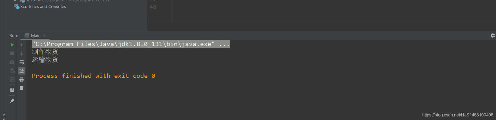

## 工厂设计模式

工厂设计模式基于接口的多态，是一种很方便的设计模式，其主要作用就是**接口和接口之间**进行交互操作，他们只进行对接，其它的任务交个实现类去完成但是他们不考虑实现类的操作。

举个例子来说：  
举例这次疫情，日本需要中国的援助，这时候只需要中方的外交部（接口C）和日方的外交部门（接口J）进行援助的对接即可，详细的制造、运输、接收等操作交给双方的其它部门去完成（实现类），这就是工厂设计模式；

代码实现：

```
public class Main {
    public static void main(String[] args) {
        J_Ministry a=new Receive();//J虚拟调用Receive；
        a.getmaterial().Command();//new Make().Command();

        J_Ministry b=new Arrive();//J虚拟调用Receive；
        b.getmaterial().Command();//new new Transtorp().Command();
    }
}

interface C_Ministry {//接口C
    void Command();
}

class Make implements C_Ministry{//执行制作指令
    public void Command(){
        System.out.println("制作物资");
    }
}

class Transtorp implements C_Ministry{//执行运输指令
    public void Command(){
        System.out.println("运输物资");
    }
}

interface J_Ministry{ //接口J
    C_Ministry getmaterial(); //获取接口C
}

class Receive implements J_Ministry{//制作请求
    public C_Ministry getmaterial(){
        return new Make();//实例化一个用来执行制作指令的实体；
    }
}

class Arrive implements J_Ministry{
    public C_Ministry getmaterial(){
        return new Transtorp();//实例化一个用来执行运输指令的实体；
    }
}
```

运行结果：  

