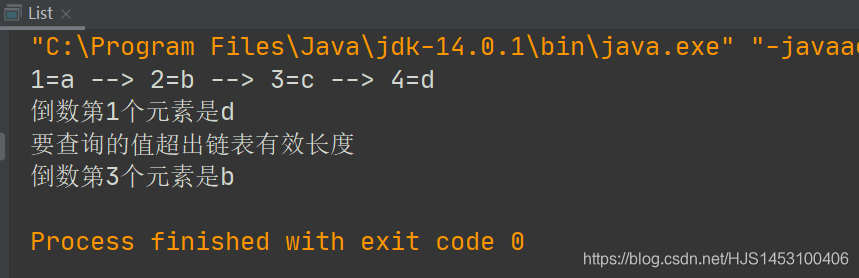
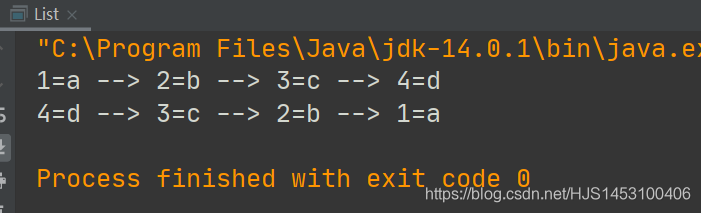
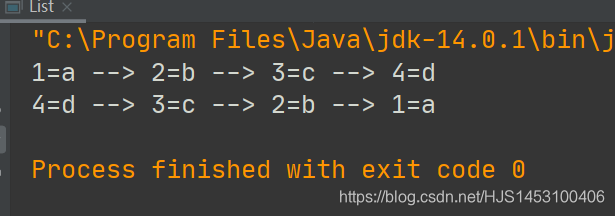
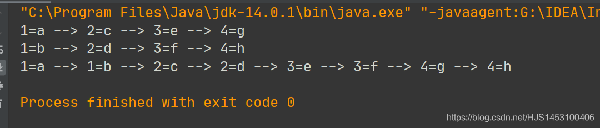
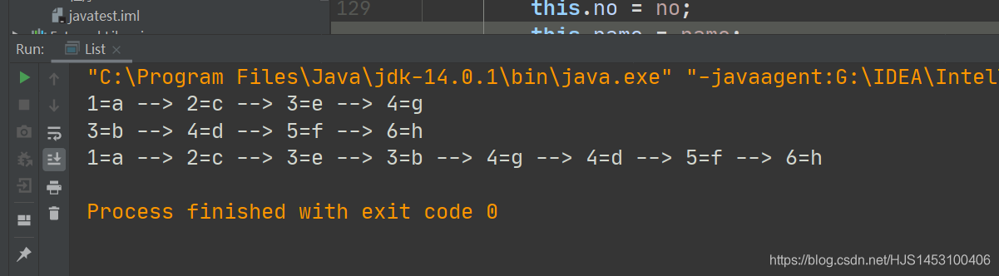

原计划将这些内容写在单链表的后面，后想了想，它的篇幅已经很长了；  
 写博客最大的目的是为了以后方便回忆，既然如此，就再开一个新篇幅吧  
 毕竟我也不喜欢翻来翻去

#### 单链表的简单使用

- [1.查找链表中倒数第K的元素](#1K_6)
- [2.反转链表](#2_118)
- [3.单链表的逆序打印](#3_227)
- [4.合并两个有序单链表](#4_337)

---

## 1.查找链表中倒数第K的元素

单链表不是不是双向链表，无法实现指针的返回，所以这一要求比较麻烦，但绝非实现不了；

思路：

```
①方法接收单链表的头节点（head）和要查找的值（K）
②遍历单链表中节点的个数（len）
③判断k是否合法（是否大于链表的长度/是否小于等于0）
④遍历寻找第（len-k）个元素
```

```
public class List {
    public static void main(String[] args){
        //创建链表
        Singlelist list =new Singlelist();

        //添加节点
       
        list.addByorder(new Node(1,"a"));
        list.addByorder(new Node(2,"b"));
        list.addByorder(new Node(3,"c"));
        list.addByorder(new Node(4,"d"));

        //显示链表
        list.show();
        //测试
        list.ListSeek(1);
        list.ListSeek(5);
        list.ListSeek(3);

    }
}
class Singlelist {
    public  Node head=new Node(0," ");//创建头节点;

    public void addByorder(Node a){
        Node temp2=head;
        boolean f=true;//是否可以添加

        while (true){
            if (temp2.Next==null) break;
            else if(temp2.Next.no==a.no) {temp2.Next.name=a.name;f=false;break;}//新元素覆盖
            else if (temp2.Next.no>a.no) break;

            temp2= temp2.Next;
        }
        if (f){
            a.Next=temp2.Next;
            temp2.Next=a;
        }

    }

    //显示链表
    public void show(){
        //先判度链表是否为空
        if(head.Next==null) {System.out.println("链表无数据");return;}

        Node temp1=head.Next;//头节点不打印

        while(temp1.Next!=null){
            System.out.print(temp1+" --> ");//为了输出结果好看，这里做了一些处理
            temp1=temp1.Next;
        } System.out.println(temp1);

    }

    //新建:判断有效元素个数的方法
    public  int Listlen(){
        Node temp=head;
        int k=0;
        while(temp.Next!=null){
            k++;
            temp=temp.Next;
        }
        return k;
    }

    //新建：寻找倒数第k个元素
    public  void ListSeek(int k){
        int len=Listlen();
        if (len<k || k<=0) {System.out.println("要查询的值超出链表有效长度");return;}
        Node temp=head;

        for (int i=0;i<=len-k;i++){
            temp=temp.Next;
        }
        System.out.printf("倒数第%d个元素是%s\n",k,temp.name);

    }

}
class Node{
    public int no;
    public String name;
    public Node Next;

    public Node(int no,String name){
        this.no=no;
        this.name=name;
    }

    @Override
    public String toString() {
        return no+"="+name;
    }
}
```

测试结果：  
 

## 2.反转链表

一开始想用"折半交换"的方法，但是后来想想单链表没有可靠的‘连续顺序’作为引子，果断放弃；不过想到了另一种方法；

思路：

```
①定义一个新的链表（头结点）；
②遍历原来的链表，依次取出节点；
③每取出一个节点元素就放置到新链表的最前面；
④将新链表的头节点更换为就链表的头节点；
```

```
public class List {
    public static void main(String[] args){
        //创建链表
        Singlelist list =new Singlelist();

        //添加节点
       
        list.addByorder(new Node(1,"a"));
        list.addByorder(new Node(2,"b"));
        list.addByorder(new Node(3,"c"));
        list.addByorder(new Node(4,"d"));

        //显示链表
        list.show();
        list.ListReversal();
        list.show();

    }
}
class Singlelist {
    public  Node head=new Node(0," ");//创建头节点;

    public void addByorder(Node a){
        Node temp2=head;
        boolean f=true;//是否可以添加

        while (true){
            if (temp2.Next==null) break;
            else if(temp2.Next.no==a.no) {temp2.Next.name=a.name;f=false;break;}//新元素覆盖
            else if (temp2.Next.no>a.no) break;

            temp2= temp2.Next;
        }
        if (f){
            a.Next=temp2.Next;
            temp2.Next=a;
        }

    }

    //显示链表
    public void show(){
        //先判度链表是否为空
        if(head.Next==null) {System.out.println("链表无数据");return;}

        Node temp1=head.Next;//头节点不打印

        while(temp1.Next!=null){
            System.out.print(temp1+" --> ");//为了输出结果好看，这里做了一些处理
            temp1=temp1.Next;
        } System.out.println(temp1);

    }

    //新建：反转链表
    public void ListReversal(){
        Node Newhead=new Node(0,"");//定义一个新的头节点
        Node next=null;//表示反转以后节点后接的元素，第一个元素后接null
        Node temp=head.Next;//头节点不能移动，替代指针,并且头节点不参与反转;

        //如果链表为空或者只有一个元素，则返回原链表
        if (temp==null || temp.Next==null) return;

        while(temp!=null){
            next=temp.Next;//保存当前节点的下一个节点;
            temp.Next=Newhead.Next;//旧链表中第二个节点执行新链表中首位
            Newhead.Next=temp;//结合上面，旧链表中第一个节点放在旧链表中第二个节点的后面
            temp = next;//后移
        }
        head.Next=Newhead.Next;

    }

}
class Node{
    public int no;
    public String name;
    public Node Next;

    public Node(int no,String name){
        this.no=no;
        this.name=name;
    }

    @Override
    public String toString() {
        return no+"="+name;
    }
}
```

输出结果：  
 

## 3.单链表的逆序打印

这道题的方式我想到了俩个（应该有很多）：  
 方法一：使用上面的单链表反转后打印，但是这样会破坏原链表；  
 方法二：使用**栈**，利用栈先进后出的特点；

关于**栈**的概念放到以后再说，现在先在这里使用一下即可；

思路：将链表中的所有数据压入栈，后从栈里取出；

```
import java.util.Stack;//栈的头文件

public class List {
    public static void main(String[] args){
        //创建链表
        Singlelist list =new Singlelist();

        //添加节点
       
        list.addByorder(new Node(1,"a"));
        list.addByorder(new Node(2,"b"));
        list.addByorder(new Node(3,"c"));
        list.addByorder(new Node(4,"d"));

        //显示链表
        list.show();

        //测试逆序打印单链表
        list.ListStack(list.head);

    }
}
class Singlelist {
    public  Node head=new Node(0," ");//创建头节点;

    public void addByorder(Node a){
        Node temp2=head;
        boolean f=true;//是否可以添加

        while (true){
            if (temp2.Next==null) break;
            else if(temp2.Next.no==a.no) {temp2.Next.name=a.name;f=false;break;}//新元素覆盖
            else if (temp2.Next.no>a.no) break;

            temp2= temp2.Next;
        }
        if (f){
            a.Next=temp2.Next;
            temp2.Next=a;
        }

    }

    //显示链表
    public void show(){
        //先判度链表是否为空
        if(head.Next==null) {System.out.println("链表无数据");return;}

        Node temp1=head.Next;//头节点不打印

        while(temp1.Next!=null){
            System.out.print(temp1+" --> ");//为了输出结果好看，这里做了一些处理
            temp1=temp1.Next;
        } System.out.println(temp1);

    }

    //新建：逆序输出单链表
    public  void ListStack(Node a){
        if (a.Next==null) {System.out.println("该链表当前为空，不可逆序");return;}
        Stack <Node> stack=new Stack<Node>();//生成一个栈，规定传入类型为Node

        Node b=a.Next;

        while(b!=null){
            stack.push(b);//将链表中所有节点压入栈;
            b=b.Next;//后移指针
        }

        while(stack.size()>1){//根据栈内的元素判断出栈次数（为了输出效果我把这里改成了1）
            System.out.print(stack.pop()+" --> ");//出栈

        }System.out.println(stack.pop());

    }

}
class Node{

    public int no;
    public String name;
    public Node Next;

    public Node(int no,String name){
        this.no=no;
        this.name=name;
    }

    @Override
    public String toString() {
        return no+"="+name;
    }
}
```

测试结果：  
 

## 4.合并两个有序单链表

要求是合并两个有序单链表，是其合并完以后仍然有序；

主思路：**利用分治**；

辅思路有两种：

第一种：使用递归

```
①重写show方法，其实可以传入节点后输出；
②比较数据，将较小的数据放入一个不带头节点的链表中；
③利用递归重复第二步，完成所有的比较；
```

```
public class List {
    public static void main(String[] args) {
        //创建链表
        Singlelist list = new Singlelist();
        Singlelist list1 = new Singlelist();
        Singlelist list2 = new Singlelist();

        //添加节点
        list.addByorder(new Node(1, "a"));
        list.addByorder(new Node(2, "c"));
        list.addByorder(new Node(3, "e"));
        list.addByorder(new Node(4, "g"));

        list1.addByorder(new Node(1, "b"));
        list1.addByorder(new Node(2, "d"));
        list1.addByorder(new Node(3, "f"));
        list1.addByorder(new Node(4, "h"));

        //显示链表
        list.show();
        list1.show();
        list2.show(list2.Listmerge(list.head.Next,list1.head.Next));
    }
}

class Singlelist {
    public Node head = new Node(0, " ");//创建头节点;
    public void addByorder(Node a) {
        Node temp2 = head;
        boolean f = true;//是否可以添加
        while (true) {
            if (temp2.Next == null) break;
            else if (temp2.Next.no == a.no) {
                temp2.Next.name = a.name;
                f = false;
                break;
            }//新元素覆盖
            else if (temp2.Next.no > a.no) break;
            temp2 = temp2.Next;
        }
        if (f) {
            a.Next = temp2.Next;
            temp2.Next = a;
        }
    }
    //显示链表
    public void show() {
        //先判度链表是否为空
        if (head.Next == null) {
            System.out.println("链表无数据");
            return;
        }

        Node temp1 = head.Next;//头节点不打印

        while (temp1.Next != null) {
            System.out.print(temp1 + " --> ");//为了输出结果好看，这里做了一些处理
            temp1 = temp1.Next;
        }
        System.out.println(temp1);
    }
    public void show(Node a) {
        //先判度链表是否为空
        if (a.Next == null) {
            System.out.println("链表无数据");
            return;
        }

        Node temp1 = a;//无头节点

        while (temp1.Next != null) {
            System.out.print(temp1 + " --> ");
            temp1 = temp1.Next;
        }
        System.out.println(temp1);
    }

    //合并链表(递归方式)
    public   Node Listmerge(Node a, Node b) {
       if (a == null || b == null){
            return a!=null ? a:b;
        }
        Node head;
        if (a.no<=b.no){
            head=a;
            head.Next=Listmerge(a.Next,b);
        }else
        {
            head=b;
            head.Next=Listmerge(a,b.Next);
        }
        return head;
    }
}

class Node {
    public int no;
    public String name;
    public Node Next;
    public Node(int no, String name) {
        this.no = no;
        this.name = name;
    }
    @Override
    public String toString() {
        return no + "=" + name;
    }
}
```

输出结果：  
   
 第二种：非递归

```
①接收到的链表为a和b
②新建一个节点head，指向首元素小的链表a（此处是head）
③将head所在的链表视为主链表（a），另外一个视为次链表（b）
④如果主链表中的元素小于次链表中的元素（a<b）则直接将链表指针后移
⑤如果第④步结论相反，则将次链表中的元素插入到主链表中
```

```
//合并链表(非递归)
    public   Node Listmerge(Node a, Node b) {
        if (a == null || b == null){//如果有一个链表为空，直接返回另外一个链表
            return a!=null ? a:b;
        }

        Node head= (a.no < b.no ?a:b);//head指向a和b中首元素最小的链表

        Node cur1= head == a ? a : b;//cur1指向a和b中首元素最小的链表
        //此时cur1与head操作的为同一块内存区域
        Node cur2= head == a ? b : a;//cur2指向a和b中首元素最小的链表

        Node pre=null;//cur1的前一个元素
        Node next=null;//cur2的后一个元素

        while(cur1!=null && cur2!=null){
            //无论怎么样第一步先走这里
            if (cur1.no<=cur2.no){//1.如果cur1中的元素小于cur2
                pre=cur1;//2.保存当前最小元素
                cur1=cur1.Next;//3.指针直接后移
            }else{
                next=cur2.Next;//1.next保存当前cur2中的当前最小值的下一个元素
                //插入开始
                pre.Next=cur2;//2.将cur2连接到上一个最小元素的后面
                cur2.Next=cur1;//3.cur2后面连接上一个最小元素的后面的元素
                pre=cur2;//4.保存当前最小元素
                cur2=next;//5，将cur2指向刚刚保存的next
            }
        }
        pre.Next = cur1 == null ? cur2 : cur1;//如果有一个链表为空，另一个链表直接接在后面；
        return head;//由于操作的是同一片区域，所以可以直接输出head
    }
}
```

完整代码：

```
public class List {
    public static void main(String[] args) {
        //创建链表
        Singlelist list = new Singlelist();
        Singlelist list1 = new Singlelist();
        Singlelist list2 = new Singlelist();

        //添加节点
        list.addByorder(new Node(1, "a"));
        list.addByorder(new Node(2, "c"));
        list.addByorder(new Node(3, "e"));
        list.addByorder(new Node(4, "g"));

        list1.addByorder(new Node(3, "b"));
        list1.addByorder(new Node(4, "d"));
        list1.addByorder(new Node(5, "f"));
        list1.addByorder(new Node(6, "h"));

        //显示链表
        list.show();
        list1.show();
        list2.show(list2.Listmerge(list.head.Next,list1.head.Next));

    }

}

class Singlelist {
    public Node head = new Node(0, " ");//创建头节点;

    public void addByorder(Node a) {
        Node temp2 = head;
        boolean f = true;//是否可以添加

        while (true) {
            if (temp2.Next == null) break;
            else if (temp2.Next.no == a.no) {
                temp2.Next.name = a.name;
                f = false;
                break;
            }//新元素覆盖
            else if (temp2.Next.no > a.no) break;

            temp2 = temp2.Next;
        }
        if (f) {
            a.Next = temp2.Next;
            temp2.Next = a;
        }

    }

    //显示链表
    public void show() {
        //先判度链表是否为空
        if (head.Next == null) {
            System.out.println("链表无数据");
            return;
        }

        Node temp1 = head.Next;//头节点不打印

        while (temp1.Next != null) {
            System.out.print(temp1 + " --> ");//为了输出结果好看，这里做了一些处理
            temp1 = temp1.Next;
        }
        System.out.println(temp1);
    }
    public void show(Node a) {
        //先判度链表是否为空
        if (a.Next == null) {
            System.out.println("链表无数据");
            return;
        }

        Node temp1 = a;//头节点不打印

        while (temp1.Next != null) {
            System.out.print(temp1 + " --> ");//为了输出结果好看，这里做了一些处理
            temp1 = temp1.Next;
        }
        System.out.println(temp1);

    }

    //合并链表(非递归)
    public   Node Listmerge(Node a, Node b) {
        if (a == null || b == null){//如果有一个链表为空，直接返回另外一个链表
            return a!=null ? a:b;
        }

        Node head= (a.no < b.no ?a:b);//head指向a和b中首元素最小的链表

        Node cur1= head == a ? a : b;//cur1指向a和b中首元素最小的链表
        //此时cur1与head操作的为同一块内存区域
        Node cur2= head == a ? b : a;//cur2指向a和b中首元素最小的链表

        Node pre=null;//cur1的前一个元素
        Node next=null;//cur2的后一个元素

        while(cur1!=null && cur2!=null){
            //无论怎么样第一步先走这里
            if (cur1.no<=cur2.no){//1.如果cur1中的元素小于cur2
                pre=cur1;//2.保存当前最小元素
                cur1=cur1.Next;//3.指针直接后移
            }else{
                next=cur2.Next;//1.next保存当前cur2中的当前最小值的下一个元素
                //插入开始
                pre.Next=cur2;//2.将cur2连接到上一个最小元素的后面
                cur2.Next=cur1;//3.cur2后面连接上一个最小元素的后面的元素
                pre=cur2;//4.保存当前最小元素
                cur2=next;//5，将cur2指向刚刚保存的next
            }
        }
        pre.Next = cur1 == null ? cur2 : cur1;//如果有一个链表为空，另一个链表直接接在后面；
        return head;//由于操作的是同一片区域，所以可以直接输出head
    }
}

class Node {
    public int no;
    public String name;
    public Node Next;

    public Node(int no, String name) {
        this.no = no;
        this.name = name;
    }

    @Override
    public String toString() {
        return no + "=" + name;
    }
}
```



特别鸣谢：[橙子小姐姐](https://me.csdn.net/weixin_42988781)
