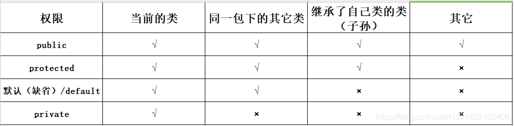
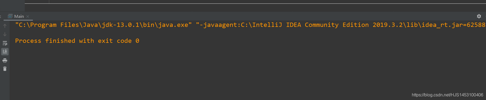
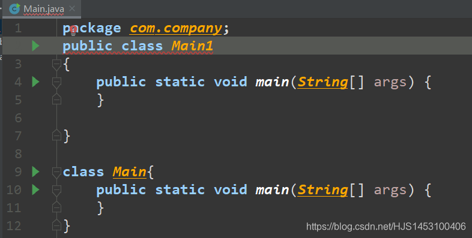
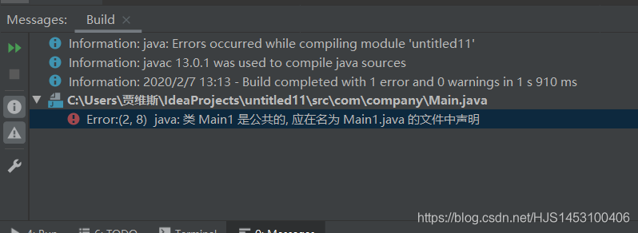
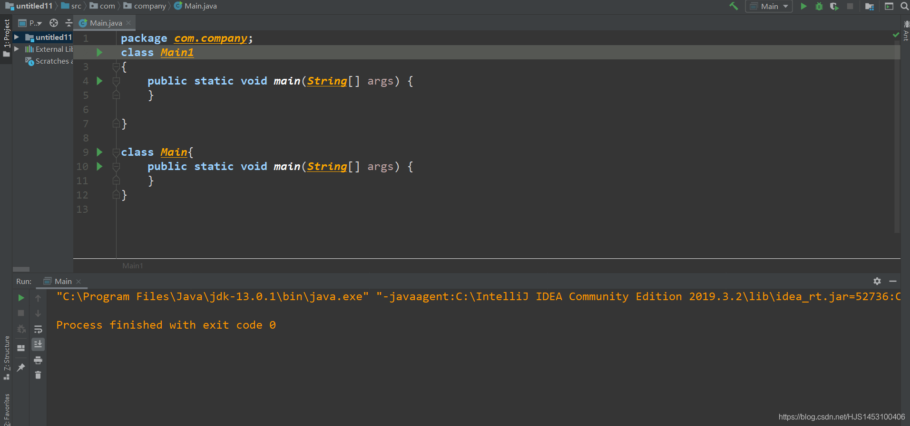
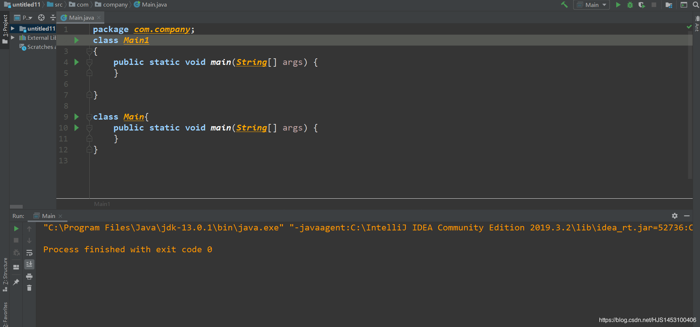
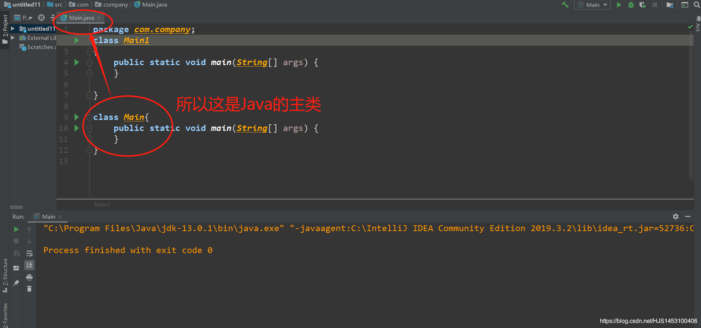
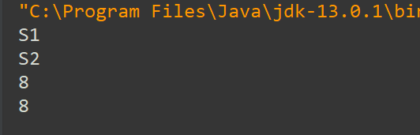
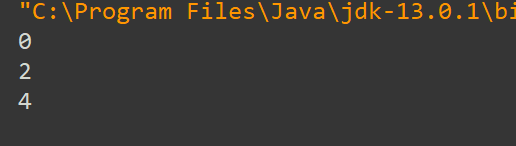

# 初识Java总结2.

前一篇写了一些基本的理解。后来发现有些不足，改进了一些，另外最近又初步了解了一些，现在将这些总结到第二篇。

## (！*1.)访问修饰符关键字：public、private、protected、和default（缺省）的区别
==***所谓的访问修饰符，就是用来修饰类(接口、抽象类)、方法、属性、构造方法、常量、主函数、关键字（int、float....）的访问权限***==
### 1.public（公共的，开放的）：
可以被该类的和非该类的任何成员访问；
#### 2.private（私有的）：
只能被该类的成员访问；
#### 3.protected（受保护）：
仅可以被自己的类和自己的子类以及同一个包内的类访问；
#### 4.缺省默认：
仅可以被自己当前类和同一包下的类访问和调用；

#### 区别



## (！*2.)class、public class、public static的区别
在搞清楚它们的区别之前，有一个困扰我很久的问题：怎么判别一个Java程序中的主类？这个问题先放下，稍后再谈；
### 1.class
1.在Java中用class修饰一个类，其格式为``class.类名{}``
2.在一个Java程序中，可以有多个类，一个类可以生成一个字节码文件（前提是类中必须有入口）
```java
class Main
{
    public static void main(String[] args) {
    }

}

class Main2{
    public static void main(String[] args) {
    }
}

class Main3{
    public static void main(String[] args) {
    }
}
```
以上都可以运行。



#### 2.public class
1.一个public class前的public是可有可无的；
2.如果文件中只有一个类，则文件名必须与类名一致，有没有public修饰都可以；
2.如果在class前面加了public：
（1）文件中不止一个类，则public class类，文件名必须与public类名一致；

  
  
  结果：
  
  
  
（2）如果文件中不止一个类，而且没有public类，文件名可与任一类名一致。



==在这里解决一下一开始的问题，怎么区别Java的主类？==

有很多人说因为public class类的类名是唯一的，所以public class的类就是主类，其实是这样吗？如果是，那为什么这段代码可以正常编译运行？两个class前面我都没有加 public呀！



并不是这样，其实判断Java的主类并不是去寻找public class，而是去寻找**和文件名一样的类名**它所对应的类，就是Java的主类



然而大部分的程序中，主类的名的唯一性和public class类名的唯一性相互重叠，所以才有了``public class Main(与文件名同名){}``作为主类,但是主类不一定要被public修饰；
顺便说一下，主类、要运行的类中必须加入口：
main函数里面的代码就是运行时的主体
```java
     public class Main
{
    public static void main(String[] args) {}
}

```
其它的类可以不加，但是做好加上，方便做测试使用；
作为被调用的类可以不加入口；
```java
public class Main
{
    public static void main(String[] args) {
      SZ d=new SZ();
        for (int i = 0; i <d.t.length ; i++) {
            System.out.println(d.t[i]);

        }
    }

}

class SZ{
     int [] t=new int[5];
}
```
### 3.public static
1.public static 表示公共的静态方法；
这里先说static：
（1）static是一个修饰符，表示静态的意思，在Java中也表示“全局”，因为Java是面向对象的语言，并且万物皆对象，无论你做什么都需要一个对象，所以，不可能存在一个“万物通用”的对象。
但是有些时候，在一定的范围内，我们需要一个“共同拥有”的属性，比如我们虽然名字、性别、年龄这些属性都不一样，但是我们的国籍都是一样的，static就可以实现这个作用；
（2）在内存空间中，被static修饰过的属性仅仅在**静态域**中保存一份，所有栈空间的变量共用这一份，顺序：栈（多）——>堆（多）——>静态区域（一）。
```java
public class Main
{
    public static void main(String[] args) {
        SZ a1=new SZ();
        SZ a2=new SZ();
        a1.name="S1";
        a2.name="S2";
        System.out.println(a1.name);
        System.out.println(a2.name);
        a1.a=7;
        a2.a=8;
        System.out.println(a1.a);
        System.out.println(a2.a);

    }
}

class SZ{
      String name;
      static int a;
}
```
输出结果：



可以看到，a1与a2的name值互补影响，但是a值却是一样的，其值取了最后改变的“8”。
2.public static 特性：
静态方法不需要实例化，直接通过 类名.方法（）调用；
公共方法需要实例化，通过new 类名.方法（）调用；


## 1.循环
### （1）特殊
在使用阶段（做题）与c语言的语法和格式完全一样；唯一有些不同的是Java中的循环可以**迭代**，使循环中的判断条件同时进行；
```java
 for(int i=0,j=0;i+j<5;i++,j++)//可以这样写
  /*for(int i=0,j=0;i<5,j<4;i++,j++)*///不可以这样写，中间的条件不能有多个
            System.out.println(j+i);
```
输出结果：



#### （2）continue、break与标签
```java
boolean T=false;//定义一个判断器（旗杆）；
label: for (int i = 0; i <5 ; i++) {//label为一个标签
                 for (int j = 0; j <6 ; j++) {
                     if(j+i>2) continue label;//这里便可以实现直接跳过外侧循环，用法和c的goto类似；
                     if（j+i==4） {T=true;break;}//主要作用是优化，比如查找一个数是否存在，如果找到以后可以直接就可以直接退，继续运行浪费时间；
                
            }
            
        }
```

#### （3）补充自己
两个死循环：
```java
for(;;){};
while(true){};
```
测试程序运行时间：
```java
long start=System.currentTimeMillis();//从1970年1月1日到现在；
--程序代码--
long end=System.currentTimeMillis();
int n=end-start;//程序运行时间，单位毫秒
```
开根号：
```java
important Java.util.*;
Math.sqrt(i);//比如判断质数的时候，从2判断到*范围的根号*就好；
```


## 2.初次调用和递归
实现斐波那契数列，调用目前理解为VB中的主/子程序
```java
import java.util.*;
public class Main {

    public static void main(String[] args) {//主程序
        Scanner sc=new Scanner(System.in);
        while (sc.hasNext())
        {
            int n = sc.nextInt();
            System.out.println(f(n));
        }
    }
    public static int f(int x) //子程序
    {   if(x==0) return 0;
        if(x==1 || x==2)
            return 1;
        else
        {
            return f(x-1)+f(x-2);
        }
    }
}
```

2020年2月7日 初写
