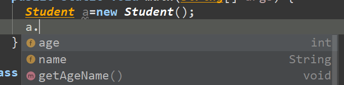
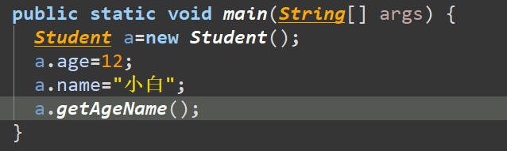
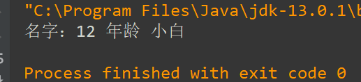
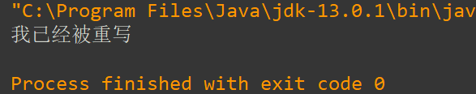
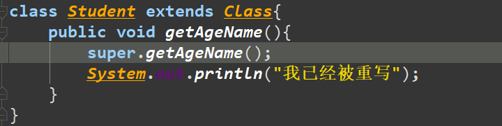
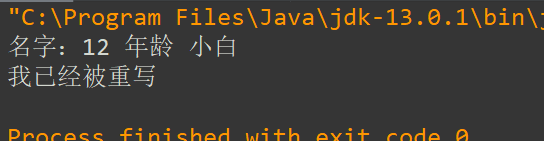
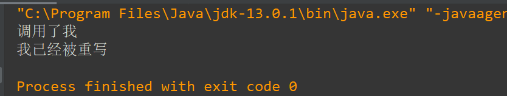

序言：最近有几天没写博客了，原因有两方面：  
第一是自我学习的态度松散了，虽然也有一些外部原因，但归根结底的错永远是自己的；  
第二是因为**继承**这一块的知识相对于我的理解能力来说内容有些庞大，里面的分支体系比较多，花了一段时间才将这些零散的东西大致搞清楚，所以，这篇博客的内容也相较于其它篇略有些长。  
总的来说，愧对于我那仅有4个粉丝啊。。。。

## 一.继承

#### 1.概念：

继承的概念通俗的来说就是一个类通过extends关键字获得另一个的类中的可以被获取到的属性和方法，构造器不能被获得；

#### 2.格式：

`class A extends B{}` 所代表的是A类继承了B类，B类成为了A类的子类，B类中不需要写就拥有的A类中可以被获取到的属性和方法，(不同包下，被**public或protected**关键字所修饰的属性和方法，同一包下，缺省关键字的属性和方法也能被获取到);  
例：

```
public class Main {
    public static void main(String[] args) {
      Student a=new Student();
    }
}
class Class{
    protected int age;
    protected String name;

     public void getAgeName(){
         System.out.println("名字："+this.age+" 年龄 "+this.name);
     }
     public Class(){ //第9行
         //为了说明构造器并不传递给子类这里需建一个空参的构造器，其目的是不被下面与之重载的 public Class(String name)构造器所覆盖
     }
    public Class(String name){
    }
}

class Student extends Class{
    //什么都不写
}
```

当我为类`Student`所实例化的`a`调用属性和方法的时候，可以看到，`a`可以调用`Class` 类中所有的属性和方法：  
  
将其一一赋值，调用方法打印，得到以下的结果：  
  


#### 3.作用及注意事项：

1.继承的主要作用有优化代码，减少代码冗余，提高代码的利用性。他的思想也很简单，当有多个类（>=2个类）中含有相同的属性或方法的时候，将这些属性和方法提出来创建一个新的类，其它的类可以通过**继承**使用该类中的属性或方法，并且互不影响；

2.当父类中有私有的属性或方法时，子类其本身可以继承的到，但是由于代码设计的**封装性**所以无法直接调用；

3.子类所调用的父类必须有一个 “无参的构造器”，在类中没有声明构造器的时候，“无参器” 默认存在，但是当声明任意一个构造器时候，“无参器” 将被覆盖，所以，最好将这个无参的构造器在父类中利用**重载**的特性将其写出；例如我上面所以写代码的第9行；

4.子类只能继承一个父类，但是父类可以有多个子类；

5.子类不继承父类中的构造器；

## 二.重写

#### 1.概念：

当子类继承的父类中所有的方法和属性的时候，如果遇到某些属性或方法与自己要求的不符，这时候就在子类中重写编写与父类中格式一样（“修饰符”、返回类型、方法名、参数列表）的方法或属性，这种操作就叫做**重写**；  
例：

```
public class Main {
    public static void main(String[] args) {
      Student a=new Student();
      a.age=12;
      a.name="小白";
      a.getAgeName();//6
    }
}
class Class{
    protected int age;
    protected String name;
     public void getAgeName(){
         System.out.println("名字："+this.age+" 年龄 "+this.name);//13
     }
     public Class(){
     }
    public Class(String name){
    }
}

class Student extends Class{
    public void getAgeName(){
        System.out.println("我已经被重写");//23
    }
}
```

输出结果：  
  
可以看到，第6行的方法调用并没有调用父类中的方法，而是使用了子类中重构的方法；

#### 2.特性与注意事项：

1.重写的前提是子类的方法或属性格式必须与父类中一样，并且两个方法或属性必须同时为`static型`或者同时为`非static型`;

2.在子类中的重写并不影响主类中原有的方法和属性，很多人将重写理解为“覆盖”，我认为这个理解有些不妥，重写并不是覆盖父类中的方法，而是做了一个同格式的备份，子类中使用的时候默认使用这个备份，但如果还想使用父类中的原方法，使用`super`关键字也可以使用到，这里先不详谈`super`,我先将改变的代码和输出的结果附上：

3.重写时方法和属性前面的修饰符可以修改，但是作用范围只能从小变大，例如父类中被protected所修饰，则子类中只能使用protected或更大范围的public；  
  


#### 3.重写与重构：

这是一个纠结了我很多天的问题，重写和重构有什么区别？查了很多资料，也问了很多老师，但都得不到一个准确的答案，我将这些整理汇总起来得出一个可能会被喷但是我想你们也不知道从那喷起的答案：**重构==重写** ，起码在很多时候他们是相等的，如果非要说有什么区别，就是在于前面的修饰符。在《Java从入门到精通 第5版》一书中，我找到了下面这样一句话：  
“重构：是重写的一种特殊方式，子类与父类的成员方法的返回值、方法名称、参数类型及个数完全相同，唯一不同的是方法实现内容，这种特殊重写方式被称为重构。”  
上面说到的 ‘子类与父类的成员方法的返回值、方法名称、参数类型及个数完全相同’ 一说，这也是重写的定义呀！如果有上面任意一条不符合，那就是构成了**重载**，显然这并没有将**重构**与**重写**分开。后来，经过网上查找资料，我发现  
**重构** 用于程序中比较细节的调整，如果说细节，还得满足重写，**那只能是修改前面的修饰符了**

如果我说错了或者惹到了某位大牛 欢迎来喷！欢迎来喷！欢迎来喷！  
**因为我迫切的想知道正确的答案！！！！**

## 三.this和super的使用

#### 1.概念和使用

之前有专门的博客介绍过，不多说，重点来说一下`super`的使用：  
1.当子类重写父类方法的时候，`super`调用父类中可以被调用的属性、方法和**构造器**；

2.super使用的方法和this类似，做一个表格来说明他们的差异；

| No. | 事件 | this | super | 格式 |
| --- | --- | --- | --- | --- |
| 1 | 访问属性 | 访问本类中的属性，如果本类没有该属性，则从父类查找 | 访问父类的属性 | this\super.属性 |
| 2. | 调用方法 | 调用本类中的方法 | 直接访问父类中的方法 | this\super.方法 |
| 3. | 调用构造器 | 必须放在构造器内，必须放在首行，调用本类中的构造器 | 必须放在构造器内，必须放在首行，调用父类中的构造器 | this\super()，括号里面放和将要调用的构造器形参类型相匹配的值； |
| 4. | 特殊性 | 表示当前对象 | 无 | 操作（this） |

演示：

```
public class Main {
    public static void main(String[] args) {
      Student a=new Student();
      a.getAgeName();
    }
}
class Class{
     public Class(){
     }
    public Class(String name){
        System.out.println("调用了我");
    }
}

class Student extends Class{
    public Student(){
        super("hhhhhhh");//这里随便写一个String型的字符串；
    }
    public void getAgeName(){
        System.out.println("我已经被重写");
    }
}
```

输出结果：  


#### 2.注意事项

在构造器中，如果不显示的调用this(形参列表)或super(形参列表)，则构造器默认调用父类空参的构造器，也就是说，每个构造器都有一个默认的`super()` 语句。这时候出现了一个问题，最终父类所调用的是谁的空参构造器？  
答：类 Object ，Object是类层次结构的根类；  
（这个以后再详谈，我还没学会。。。）

#### 3.一个练习，说明子类实例化的全过程

这里写一段代码，并它的运行轨迹，方便我们更好的理解this和super的使用

```
class Creature{//1
    public Creature(){//2
        System.out.println("Creature无参数的构造器");//3
    }
}

class Animal extends Creature{//4
    public Animal(String name){//5
        System.out.println("Animal带一个参数的构造器");//6
    }
    public Animal(String name,int age){//7
        this(name);//8
        System.out.println("Animal带两个参数的构造器");//9
    }
}

public class Main extends Animal{//10
    public Main(){//11
        super("小白",3);//12
        System.out.println("Main无参数的构造器");//13
    }
    public static void main(String[] args){//14
        new Main();//15
    }
}
```

它的运行顺序是14->15->11->12->7->8->5->**2**(这里要注意，5进入构造器以后，先调用的是默认的super（）空参的构造器)->3->（**输出**：Creature无参数的构造器）->6->（**输出**：Animal带一个参数的构造器）->9->**输出**：Animal带两个参数的构造）->13->**输出**：Main无参数的构造器）

over~~

2020年2月9日初写
