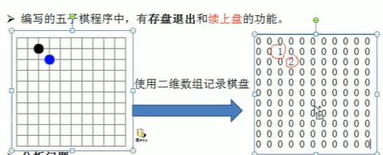
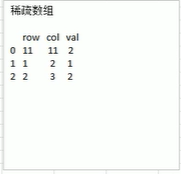
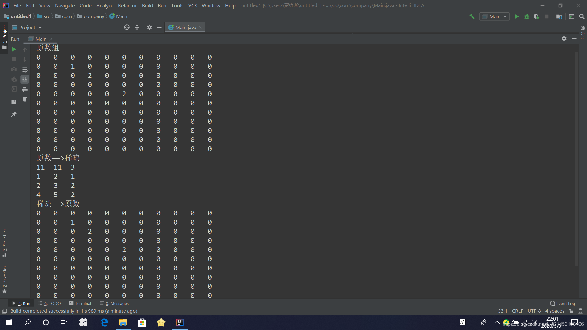

#### 稀疏矩阵：

**如果想在计算机中保存一个棋盘（围棋）中各个棋子的位置，你会怎么做？**  
很简单，用数组

比如下面这张图，用一个很简单的二维数组（11\*11）就可以保存上面所有的棋子，虽然棋子没有多少；  
用1代表黑色棋子，用2代表蓝色，用0代表没有棋子的空缺。  
  
ok存好了！  
但是有一个问题，刚刚也说了，棋子没有多少，这样做是不是太浪费内存了？废话。。。。

于是乎，引入了这样一个比较简单的算法：**稀疏数组**  
作用很简单：**压缩数组，除去不必要的空间浪费**

这里说的“不必要”不是真的不必要，而是在一个数组中过多出现的重复的元素（这里的0），我们不必保存它们，因为在建立数组的时候我们大可以将所有的数组置成 **“过多出现的重复的元素”** ，我们只需要修改在一些特定的位置上那些 **“与众不同的值”** 就好。

那怎么保存与众不同的值？也很简单，  
新建一个大小合适的二维数组；  
“三项定一点”；行、列、值确定了

如上图所得下图  
  
PS：有效值的个数（这里指非0元素）==count  
首先，创建一个行值为count、列值为3的数组，将第0行保存原二维数组的行、列、count的个数。  
这样就可以了；

代码：

```
public class Main {
    public static void main(String[] args){
        System.out.println("原数组");
        int [][] arry=new int[11][11];
        arry[1][2]=1;
        arry[2][3]=2;
        arry[4][5]=2;
        for(int[]sc:arry)
        {
           for(int k:sc){
               System.out.printf("%d\t",k);
           }
           System.out.println();
        }

       System.out.println("原数——>稀疏");
       int sum=0;
       for(int []sc:arry){
           for(int k:sc){
               if(k!=0) sum++;
           }
       }
        int sparseArr[][]=new int[sum+1][3];

        sparseArr[0][0]=11;//原始行数
        sparseArr[0][1]=11;//原始列数
        sparseArr[0][2]=sum;//有效数据个数

        int count=0;
        for (int i = 0; i <arry.length; i++) {
            for (int j = 0; j <arry.length ; j++) {
                if(arry[i][j]!=0){
                    count++;
                    sparseArr[count][0]=i;
                    sparseArr[count][1]=j;
                    sparseArr[count][2]=arry[i][j];

                }
            }

        }
        for (int i = 0; i <sparseArr.length ; i++) {
            System.out.printf("%d\t%d\t%d\n",sparseArr[i][0],sparseArr[i][1],sparseArr[i][2]);

        }

        System.out.println("稀疏——>原数");
        int[][] shu=new int[sparseArr[0][0]][sparseArr[0][1]];
        for (int i = 1; i <sparseArr.length ; i++) {
            shu[sparseArr[i][0]][sparseArr[i][1]]=sparseArr[i][2];
        }

        for(int[] sc1:shu){
            for(int k1:sc1) System.out.printf("%d\t",k1);
            System.out.println();
        }
    }
```

运行结果:  

