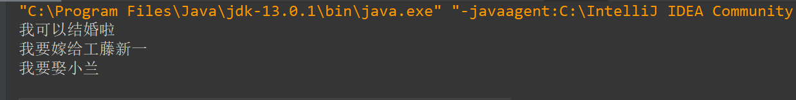

### 用三个类不同的类来练习this

这里写一条关于this很重要的概念：  
this表示当前类的对象或者表示当前的类正在创建的对象

**1.运行的主类**

```
public class Main {
    public static void main(String[] args){
     Boy boy =new Boy();//1
     boy.boyname("工藤新一");//2
     boy.boyage(23);//3
     boy.panduan();//4

     Girl girl=new Girl();//5
     girl.Girlname("小兰");//6
     
     girl.marry(boy);//7
    }
}
```

**2.Boy类**

```
public class Boy {
   private String name;
    private int age;
    public void boyname(String name){//8
          this.name=name;
    }

    public String getboyname(){//9
        return name;
    }

    public void boyage(int age){//10
        this.age=age;
    }

    public int getboyage(){//11
        return age;
    }
    public void marry(Girl girl)//12
    {
        System.out.println("我要娶"+girl.girlname());
    }
    public void panduan(){//13
          if(age>=23) System.out.println("我可以结婚啦");
          else System.out.println("不行，再谈谈恋爱吧");
    }
}
```

**3.Girl 类**

```
public class Girl {
    private String name;

     public void Girlname(String name)//14
     {
         this.name=name;
     }
     public String girlname()//15
     {
         return name;
     }
     public void marry(Boy boy1)//16
     {
         System.out.println("我要嫁给"+boy1.getboyname());//17
         boy1.marry(this);//18
     }
}
```

**4.结果**  
  
**5.分析输出结果是怎么来的**

```
1.主代码中1，2，3，5，6行，Boy中的8，9，10，11，Gir中的14，15是基本的赋值语句，没什么说的。
2.输出结果的第一句，是主代码中的的4行调用Boy中的13行，输出的判断依据是Boy类中的age。
3.输出结果的第二句，是从主代码中的第7行，调用Girl 类中的第16行，输出的结果依据是17行中传进来的boy的name属性；
```

4.输出结果的第三句，代码从18行开始，boy1的值是第7行的girl所给的，所以这里的this表示的是第7行的对象————Girl 型的girl；  
**所以是用Boy型的boy1的方法，传递的是第7行Girl 型的girl；**

2020年2月16日初写
