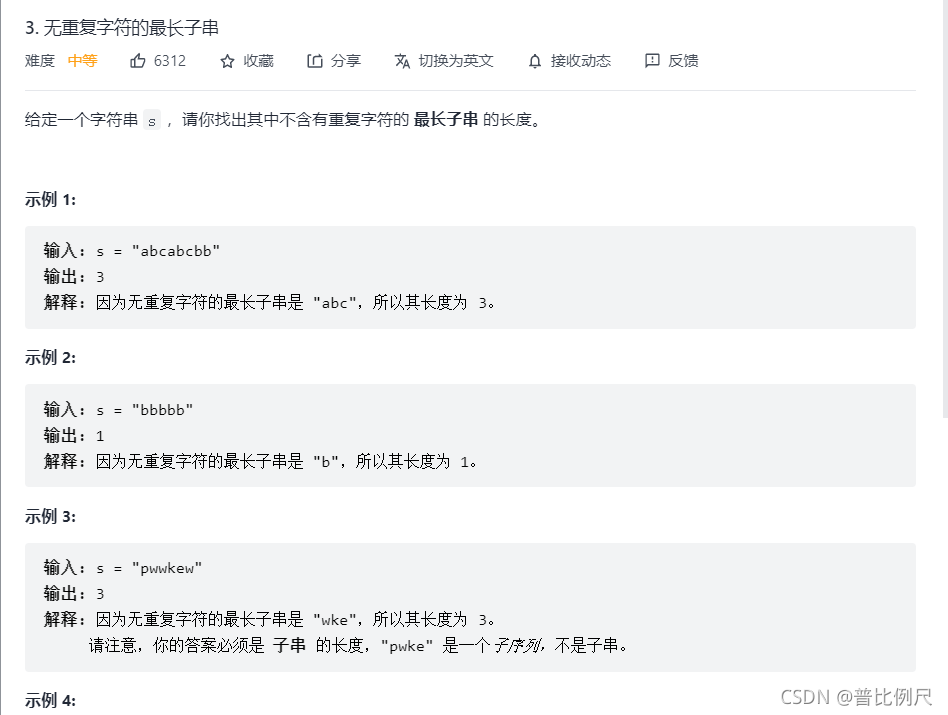

  
思路:  
1.桶排序的思想，用字符对应的数组来确定字符第一次出现和第二次出现的位置，相差之和便是字串的长度  
2.选出最长的字串长度输出即可。

代码：

```
		public int lengthOfLongestSubstring(String s){
        //定义128个数组是因为128以下包含了所有的常规符合、字母、字母
        int [] ascii=new int[128];

        //用数组ascii表示字母首次出现的位置
        for (int i = 0; i <ascii.length-1 ; i++) {
            ascii[i]=-1;
        }

        int len=s.length();

        int maxString=0;//存放最长的字串长度
        int start=0;//字母出现的位置

        for (int i = 0; i <len ; i++) {
            //将出现的字母转化为ascii码
            int index = s.charAt(i);

            //start初值是0，如果当前字符是第一次出现则start里面必然是0；
            //如果这个字符不是第一次出现，则start里面的值为该字母上一次出现的位置+1;
            //也就是去掉第一次字符以后字串的长度
            //abcdfa --------> bcdfa
            start = Math.max(start, ascii[index] + 1);

            //将最长的字串的长度与 （i-start（当前重复出现的位置）+1）计算后的结果比较
            maxString = Math.max(maxString, i - start + 1);

            //保存当前字母出现的位置
            ascii[index] = i;
        }
        return maxString;
    }
```
