## 前言

某天，我在使用 PS 时接触到一个提取色卡的插件。突然间很好奇这个插件是如何实现这个功能的呢？经过一番折腾，最终我成功地使用纯客户端技术实现了提取色卡的功能。

色卡提取如下图所示：

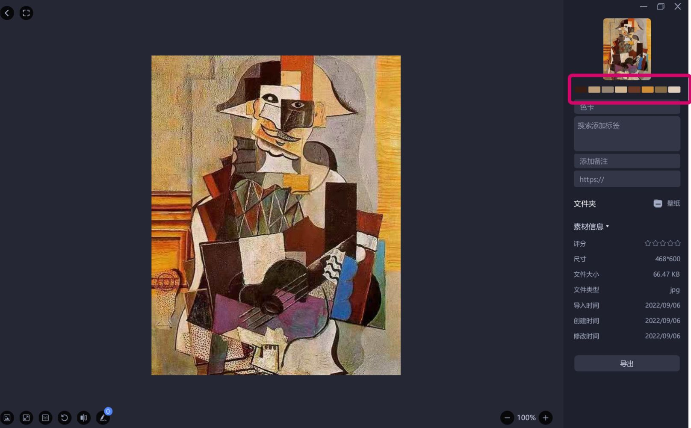

上图框选的部分正是色卡，是根据选择的图片实时分析计算得出的，色卡数据会随着图片编辑、修改而更新。

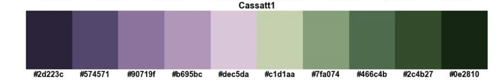


实现的简单 demo 效果如下：

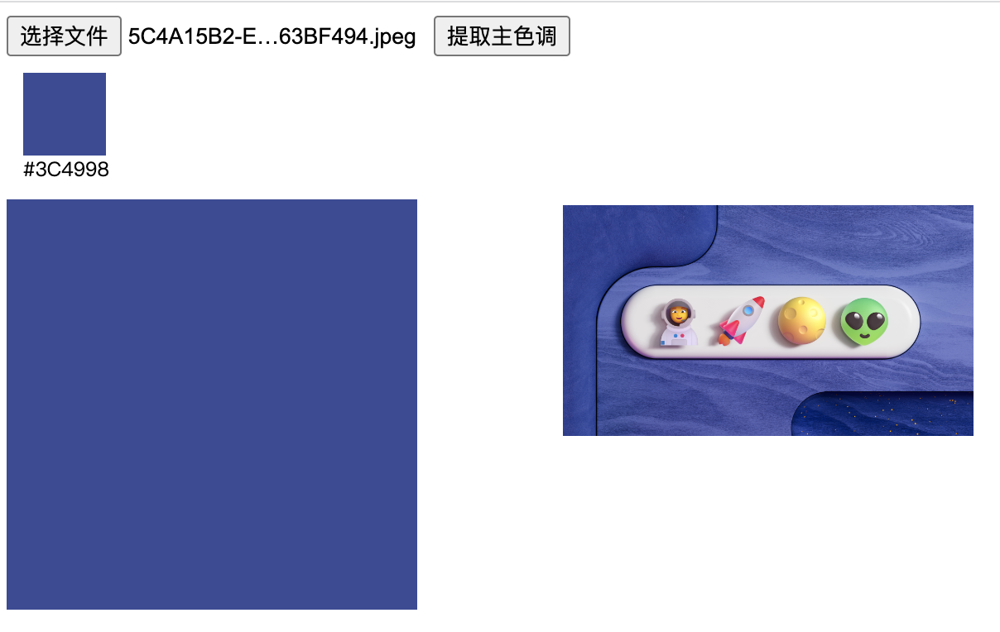
通过【选择文件】选择本地的图片后，点击【提取主色调】会计算出图片中像素点占比最多的颜色值（即：**主色调**），并其显示出来。

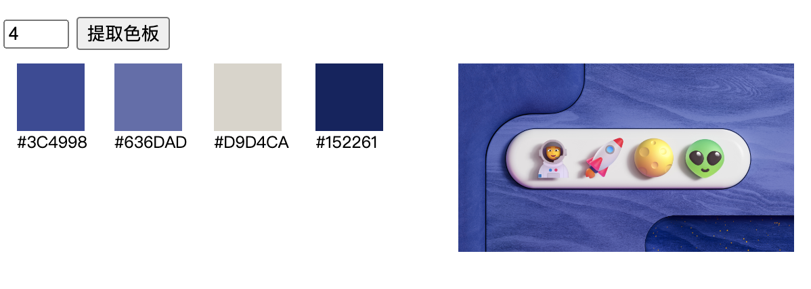

点击【提取色卡】，则会分析图片中像素点占比排名靠前的多个颜色值（即：**色卡**），并将其显示出来。

在线预览地址：[https://dominant-color.surge.sh/](https://dominant-color.surge.sh/)

## 主要思路

本次考虑采用 `Go + WebAssembly + JS` 实现这个功能，关键流程如下图：

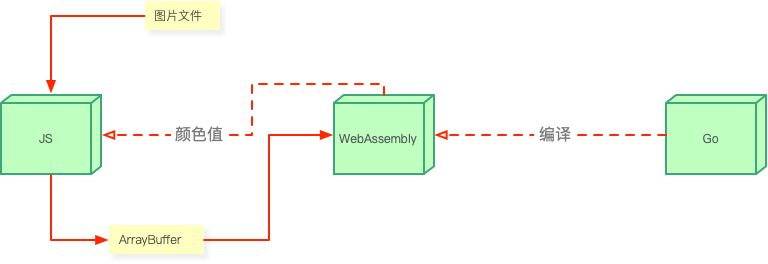

**WebAssembly 简介：**

下文中简称为：**Wasm**，是 Go 部分编译输出的一个二进制模块，在 JS 环境中运行，Go 部分实现的功能最终是通过 Wasm 在浏览器中运行的。

**JS 部分主要负责：**
1. Wasm 实例的初始化
2. 图片文件的选择、转换为 ArrayBuffer 传输给 Wasm 实例
3. 回显 Wasm 计算得到的色值

**Go 部分主要负责：**
1. 编译 Go 代码并输出 Wasm 模块
2. 接收 JS 传递的 ArrayBuffer 数据
3. 通过算法分析 ArrayBuffer 数据中色彩的权重信息
4. 计算主色调值的字符串传递给 JS（提取主色调）
5. 计算色卡颜色值的数组传递给 JS（提取色卡）

其中，关键逻辑的实现见下文分析。

## 关键步骤实现

### 1.File 转为 ArrayBuffer

使用 HTML5 的 [FileReader API](https://developer.mozilla.org/zh-CN/docs/Web/API/FileReader) 读取 `Input` 控件选择的 `File` 文件对象为 [ArrayBuffer](https://developer.mozilla.org/zh-CN/docs/Web/JavaScript/Reference/Global_Objects/ArrayBuffer) 对象。

> `input` 控件选择文件比较简单，其实现略过

转换方法封装如下：

```js
function fileToArrayBuffer(file) {
  return new Promise((resolve, reject) => {
    const reader = new FileReader();
    reader.onload = () => {
      resolve(reader.result); // reader.result 就是 ArrayBuffer 对象
    };
    reader.onerror = reject;
    reader.readAsArrayBuffer(file);
  });
}
```

### 2.JS 的数据如何传递到 Wasm

前面读取 `File` 对象得到的是 JS 环境中的 `ArrayBuffer` 对象，是一个二进制对象和 Go 里面的字节数组 `[]byte` 相对应。

对于 `ArrayBuffer` 这种体积较大的数据需要借助 [WebAssembly.Memory()](https://developer.mozilla.org/zh-CN/docs/WebAssembly/JavaScript_interface/Memory) 进行传递，之前的文章介绍过 [JS 与 Wasm 之间的数据传递](https://juejin.cn/post/7219899306945806394#heading-21)，不再赘述。

传递  `ArrayBuffer`  过程原理概括为下图所示：

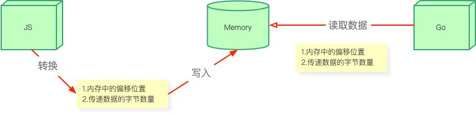

在 JS 环境将 `ArrayBuffer` 写入到 `Memory` 中，会得到写入时的偏移位置、`ArrayBuffer` 字节数量两个参数；在调用 Wasm 导出的方法时传入这两个参数，在 Wasm 中可以根据这两个参数从 `Memory` 中读取写入的 `ArrayBuffer` 数据。

这一过程，在 Go 里面已经有官方的封装—— [`syscall/js`](https://pkg.go.dev/syscall/js)，我们直接按规范使用就可以。

```go
// 在 JS 的 window 对象上添加名为 getDominantColor 的方法
js.Global().Set("getDominantColor", js.FuncOf(getDominantColor))

// args 参数对应 JS 中调用时传入的参数
func getDominantColor(this js.Value, args []js.Value) interface{} {
	// 相当于 JS 中执行：new Uint8Array(args[0])
	byteArray := js.Global().Get("Uint8Array").New(args[0])
	buffer := make([]byte, byteArray.Length())
	// 将 Unint8Array 转换为 []byte
	js.CopyBytesToGo(buffer, byteArray)
	// 省略其他代码...
}
```

在 Go 里面通过 `js.Global().Get("Uint8Array")` 将接收到的 `ArrayBuffer` 转为 `Uint8Array` ，然后 `js.CopyBytesToGo` 将 `Uint8Array` 拷贝为 Go 里面的字节数组 `[]byte`。

在 JS 里面使用如下：

```js
// 省略了 Wasm 实例初始化过程
window.getDominantColor(arrayBuffer)
```

### 3.Go 函数返回数组给 JS

JS 中调用原生 Wasm 导出的函数，得到的返回值只能是 `i32` 类型，相应地 Go 的 Wasm 函数返回值只能是 JS 的基本数据类型。

> **原生 Wasm 导出的函数**是指：直接使用原始的 wat 文本描述语言编写的 Wasm 模块、或者经过 Go 等三方语言编译输出**不带辅助函数**的 Wasm 模块

数组不属于基础类型，没法直接当做函数返回值返回给 JS 环境，需要使用 `js.Global()` 调用 JS 环境的 `Array` 方法创建一个数组实例来返回。

示例代码如下：

```go
func getColorPalette(this js.Value, args []js.Value) interface{} {
	// 省略其他代码...
	colors := dominantcolor.FindN(image, count)
	// 相当于在 JS 环境执行：let colorsArray = new Array(colors.length)
	// 得到的 colorsArray 就是 JS 中的数组
	colorsArray := js.Global().Get("Array").New((len(colors)))
	// 遍历 colors 切片，给 colorsArray 数组元素赋值
	for i, color := range colors {
		colorsArray.SetIndex(i, dominantcolor2.Hex(color))
	}
	// 返回 colorsArray 数组
	return colorsArray
}
```
### 4.k-均值算法分析图片像素

前面得到的字节数组 `[]byte`，也就是图片的像素点数据的集合，那如何计算图片中占比较多的颜色值？

对像素点集合包含的所有颜色值进行排序，取出排序靠前的几个颜色值作为色卡值，这样可行吗？

这种方案显然是**不准确的**，如果图片中的颜色值不存在渐变过度，只是简单的几个大色块是可行的。

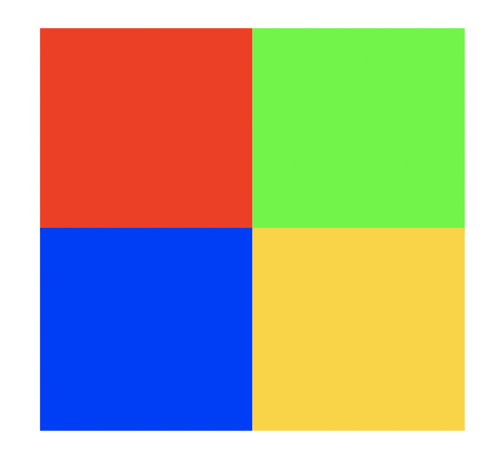
这种简单的色块图片可以识别

但是，一般的图片都存在人眼无法分辨的渐变过渡色，比如：

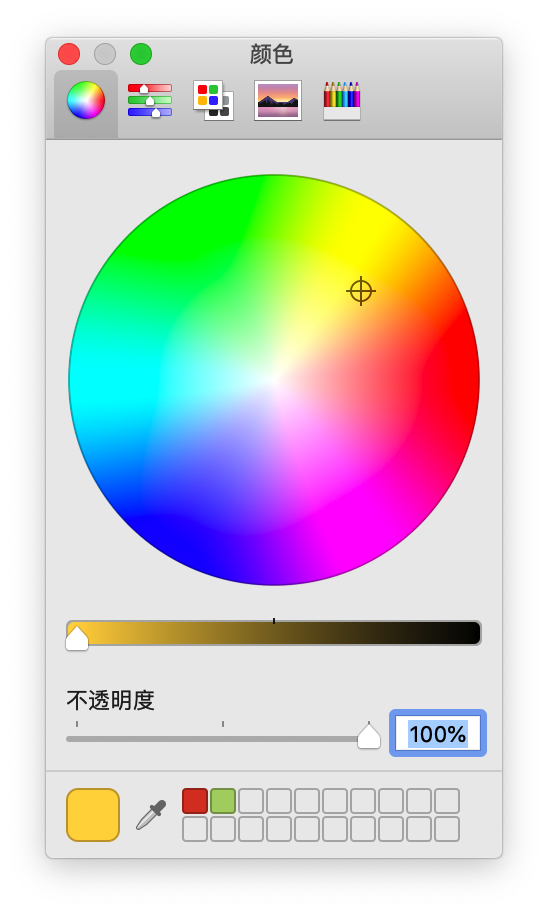
这种带有渐变色的图片就识别不了

例如：这里非常接近的两个红色人眼应该看做一个颜色，但是上面说的识别算法却只能当做两个颜色。

因此，我们**需要将某一个范围之内的颜色算作一个颜色**再去排序，而这就是 `k-均值算法` 的作用了。

#### 算法简介

**k-均值算法**是一种常用的聚类算法，用于将数据集划分为 k 个不同的**簇**。它的主要思想是通过计算数据点之间的距离，将数据点划分到距离最近的**簇中心**。

算法步骤如下：

1. 随机选择 k 个数据点作为初始的簇中心。
2. 对于每个数据点，计算其与各个簇中心的距离，并将其划分到距离最近的簇中心所在的簇。
3. 更新每个簇的中心点，即将簇中所有数据点的均值作为新的簇中心。
4. 重复步骤 2 和 3，直到簇中心不再发生变化或达到预定的迭代次数。

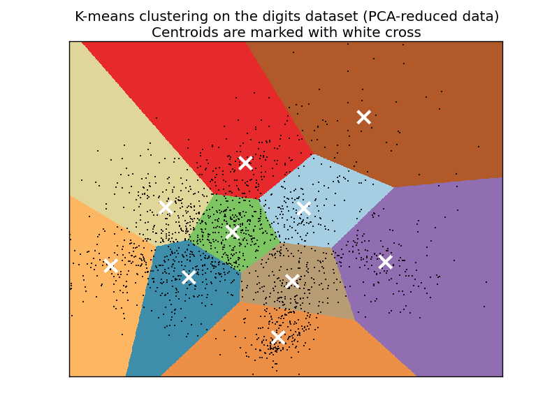
k-均值算法示意图

#### 如何使用

使用 `k-均值算法` 将图片的像素点分类聚合成不同簇，每一个簇中心代表着图片中占比较大的一个色值。

我在 github 找到了一个 Go 语言比较可靠的实现：[dominantcolor](https://github.com/cenkalti/dominantcolor)，使用方法如下：

```go
// buffer 就是前面得到的 []byte
// 将 []byte 转为 Image
image, err := ConvertBytesToImage(buffer)
// 使用 dominantcolor 提供的 Find 方法查找图片主色调
color := dominantcolor.Find(image)
// 使用 dominantcolor 提供的 FindN 方法查找色卡
colors := dominantcolor2.FindN(image, count)
// 将 RGA 结构转为字符形式，例如：#AA33FF
colorStr := dominantcolor.Hex(color)
// 省略将 colors 转换数组返回给 JS 的逻辑
```

综上，我们就实现了图片主色调、色卡提取的所有关键功能，完整代码如下：

```go
package main

import (
	"bytes"
	"image"
	"image/jpeg"
	"syscall/js"

	"github.com/johniexu/dominantcolor"
)

// 将[]byte转换为图像
func ConvertBytesToImage(data []byte) (image.Image, error) {
	img, err := jpeg.Decode(bytes.NewReader(data))
	if err != nil {
		return nil, err
	}
	return img, nil
}

// 提取主色调
func getDominantColor(this js.Value, args []js.Value) interface{} {
	// 将ArrayBuffer转换为字节数组
	byteArray := js.Global().Get("Uint8Array").New(args[0])
	buffer := make([]byte, byteArray.Length())
	js.CopyBytesToGo(buffer, byteArray)
	image, err := ConvertBytesToImage(buffer)
	if err != nil {
		println(err.Error())
		return nil
	}
	color := dominantcolor.Find(image)
	colorStr := dominantcolor.Hex(color)
	println("success")
	return colorStr
}

// 提取色卡
func getColorPalette(this js.Value, args []js.Value) interface{} {
	println("doing")
	// 将ArrayBuffer转换为字节数组
	byteArray := js.Global().Get("Uint8Array").New(args[0])
	count := args[1].Int()
	buffer := make([]byte, byteArray.Length())
	js.CopyBytesToGo(buffer, byteArray)
	image, err := ConvertBytesToImage(buffer)
	if err != nil {
		println(err.Error())
		return nil
	}
	colors := dominantcolor2.FindN(image, count)
	colorsArray := js.Global().Get("Array").New((len(colors)))

	for i, color := range colors {
		colorsArray.SetIndex(i, dominantcolor2.Hex(color))
	}
	println("success")
	return colorsArray
}

func main() {
	js.Global().Set("getDominantColor", js.FuncOf(getDominantColor))
	js.Global().Set("getColorPalette", js.FuncOf(getColorPalette))
	// 确保 main 方法中挂载到 window 对象上的方法可以正常执行
	select {}
}
```

### 编译输出 Wasm

编译上面代码只需执行下面命令即可，需要注意的是本机安装的 Go 需要使用比较新的支持 Wasm 编译目标的版本。

> 编译生成 Wasm 之后在浏览器等 JS 环境运行 Wasm 时不需要安装 Go 开发环境

我本机 Go 的版本：
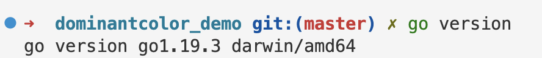

编译为 Wasm 二进制文件命令：
```bash
GOOS=js GOARCH=wasm go build -o ./build/dominant_color.wasm ./wasm
```

另外，如果使用 `VS Code` 开发这个 Go 项目，可能会遇到如下报错：
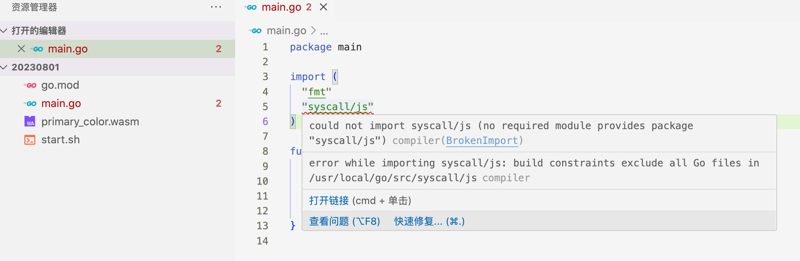

这是因为 `VS Code` 安装的 Go 的插件默认的 `GOOS`、`GOARCH` 与上述编译命令的设置不一致。

解决方法为：增加 `VS Code` 配置文件告知插件项目的 `GOOS`、`GOARCH`

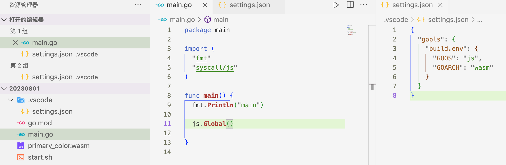

### JS 环境使用 Wasm 模块

加载上面编译得到的 `dominant_color.wasm` 文件

```js
if (!WebAssembly.instantiateStreaming) { // polyfill
    WebAssembly.instantiateStreaming = async (resp, importObject) => {
        const source = await (await resp).arrayBuffer();
        return await WebAssembly.instantiate(source, importObject);
    };
}
// Go 来自于 html 中通过 script 加载的 wasm_exec.js 文件
const go = new Go();
WebAssembly.instantiateStreaming(fetch("./dominant_color.wasm"), go.importObject).then((result) => {
  // go.run 相当于执行 Go 里面的入口函数 main，
  // 执行完成后会在 window 上挂载方法：getDominantColor
  return go.run(result.instance);
}).then(() => {
  toggleLoading(false)
}).catch(e => {
  console.log(e)
  window.alert("出错了，请检查控制台")
  toggleLoading(false)
});
```

> 上面 `const go = new Go();`  里面的 `Go` 来自于 `wasm_exec.js` 文件，这是从 Go 开发环境安装目录下拷贝出来的一个文件，它是初始化 Wasm 运行时环境的**胶水代码**，目前使用 Go 开发 Wasm 是必须的。

待加载完成后执行 `window.getDominantColor` 可以获取图片的主色调，调用 `window.getColorPalette` 可以获取图片的色卡数据

```js
function fileToArrayBuffer(file) {
  return new Promise((resolve, reject) => {
    const reader = new FileReader();
    reader.onload = () => {
      resolve(reader.result);
    };
    reader.onerror = reject;
    reader.readAsArrayBuffer(file);
  });
}
// file 是用户选择的图片文件
const arrayBuffer = await fileToArrayBuffer(file);
// 调用 Wasm 挂载到 window 上的 getDominantColor
const color = window.getDominantColor(arrayBuffer);
```

至此，获取单张图片的主色调、色卡功能已实现，完整的代码可以在这里查看：[https://github.com/JohnieXu/demo/tree/20230819/dominantcolor_demo](https://github.com/JohnieXu/demo/tree/20230819/dominantcolor_demo)。

## 效果对比

文中 demo 提取的色卡和我使用 PS 插件提取的色卡对比如下：

Demo 提取色卡
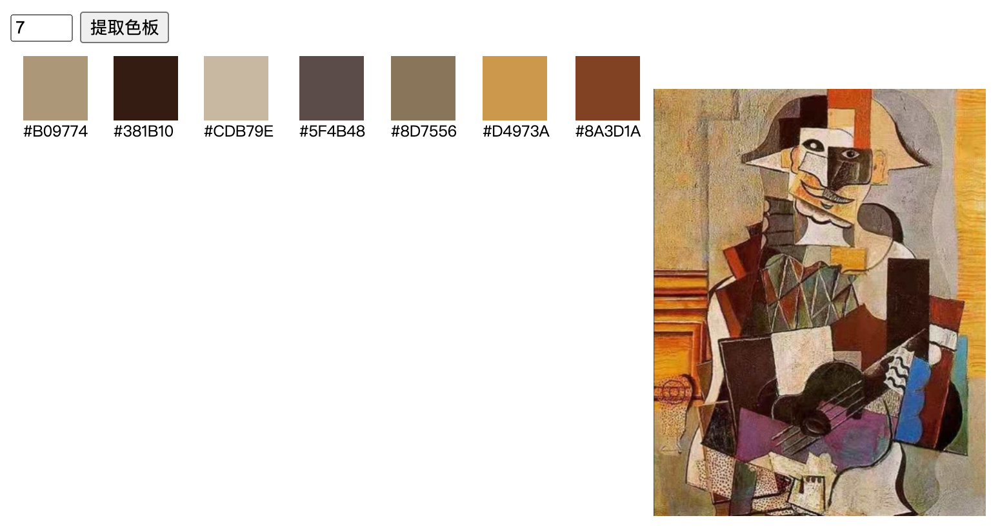

PS 插件提取色卡


可见，两者提取到的颜色值还是很接近的。

## 一些想法

### 1.打包成通用包

本文使用 Go 项目打包成了一个独立的二进制的 Wasm 文件，任何有 Wasm 运行时环境的平台都可以使用，因此理论上这个功能可以完全做成一个绝对通用模块。

目前了解到支持 Wasm 运行时环境的平台有：Node.js、Electron、微信小程序、JVM。

### 2.移植到微信小程序

微信小程序也支持 Wasm 运行了，那么本 demo 中的提取主色调、提取色卡功能可以尝试移植到微信小程序中。

### 3.扩展更多功能

通过 Go 开发 Wasm 可以将很多已有 Go 项目的库编译打包成其他环境可运行的 Wasm，因此可以借此实现一些 Web 环境不擅长的功能，例如：图片处理、视频处理、文件加密等。

目前正在尝试这些：

1. Go 的图片处理相关方法扩展到 Web 环境
2. Go 的加密算法扩展到 Web 环境

### 4.兼容性处理

文中的实现方式是依赖于 Wasm 环境的，目前来看还是有有一些兼容性问题。生产环境需使用要使用**纯 JS 实现**的方案来做兼容性处理。

兼容性见下图：

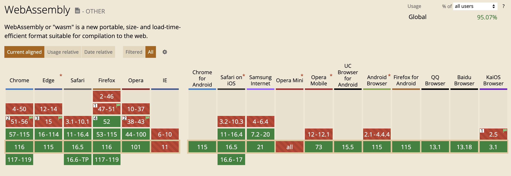

目前在安卓上最新版微信也支持：

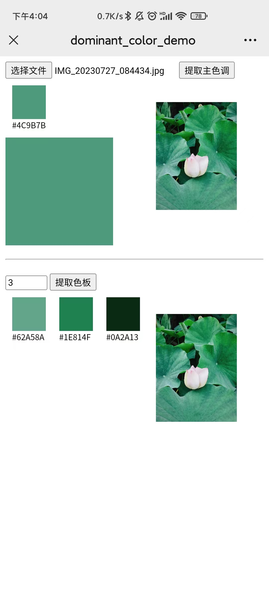
微信浏览器使用正常

> iOS 和电脑版微信没有试过，大家感兴趣可以尝试一下看是否支持

## 总结

本文使用 Go 打包输出了一份 Wasm 二进制文件，前端只需要初始化 Wasm 实例调用其挂载到 window 对象上的方法即可，不需要服务端提供任何接口、也不需要部署 Go 程序，所以算作**纯前端实现**。

另外文中 demo 例子采用了 WebAssembly 技术，也算是对 WebAssembly 技术在前端场景的使用补充了一个案例。

经过这个色卡提取功能的开发，我也深刻体会到 WebAssembly 在**通用性、性能、移植现有项目**方面真的是大有可为。我后续还会继续研究这项技术，欢迎大家跟进😊😊。

## 参考资料

1. [https://zh.wikipedia.org/wiki/K-%E5%B9%B3%E5%9D%87%E7%AE%97%E6%B3%95](https://zh.wikipedia.org/wiki/K-%E5%B9%B3%E5%9D%87%E7%AE%97%E6%B3%95)
2. [https://github.com/Zyzle/image-kmeans](https://github.com/Zyzle/image-kmeans)
3. [https://zyzle.dev/projects/image-kmeans](https://zyzle.dev/projects/image-kmeans)
4. [https://developer.mozilla.org/zh-CN/docs/WebAssembly](https://developer.mozilla.org/zh-CN/docs/WebAssembly)
