## 前言

前段时间小米出的水印边框照片模板被大家玩的不亦乐乎，本来想着写一个实现合成各厂商带水印边框照片的工具。这个头脑一热想要开发的工具最终也没有着手实现，不过这里面有一个知识点倒是令我很感兴趣。


这一点就是：**合成水印边框通常会自动带上照片的拍摄数据——光圈、快门、感光度、品牌 LOGO，那这些数据都是从哪里获取照片里面又是怎么存储的呢？**

在查询了大量资料之后得知，**这些参数都来自于 Exif 数据**，于是对 Exif 的技术标准、读写 Exif 的 JS 框架做了一些研究，这篇文章就是据此研究总结而来。

最后，笔者还写了一个 Exif 数据编辑的 Vue 组件——[exif-edit](https://github.com/JohnieXu/exif-edit)。
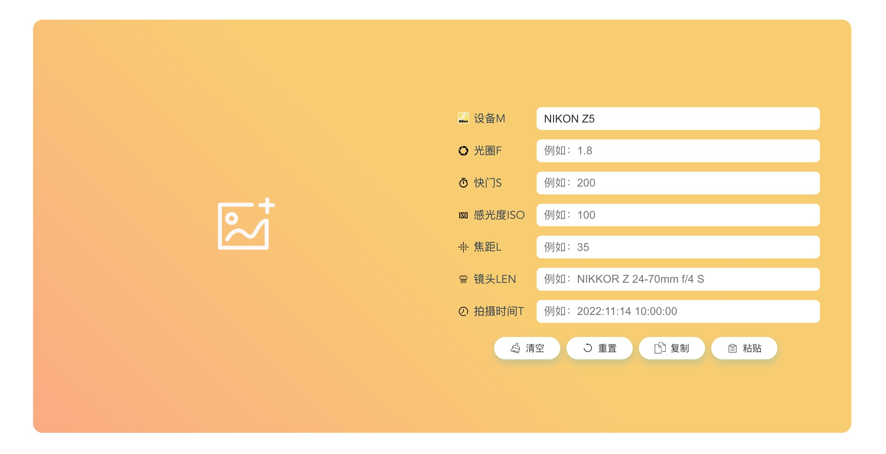

## 图片格式与 Exif 数据

图像元数据有两种格式：Exif、XMP，而 Exif 就是其中一种。

Exif 全称是**可交换图像文件格式**（英语：Exchangeable image file format，官方简称 **Exif**），是用于记录数码照片的属性和拍摄数据的。属性主要是指照片的分辨率大小、缩略图，而拍摄数据主要是指光圈、快门、感光度、焦距、设备型号、镜头、GPS 位置等。

维基百科上给出的 Exif 包含的信息示例如下：

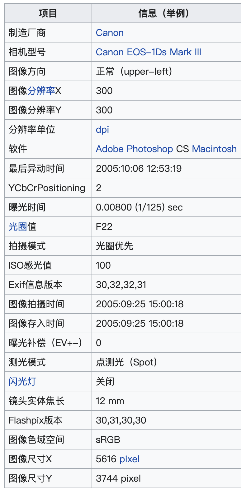

常见图片格式有 JPEG、PNG、GIF、HEIF、DNG、TIFF 等，其中已经明确能够支持写入 Exif 数据的格式有：JPEG、DNG、TIFF、HEIF。

各图片格式对于 Exif 数据支持情况如下：

| 格式     | JPEG | PNG    | GIF    | HEIF | DNG  | TIFF | BPG    | BMP | 
| -------- | ---- | ------ | ------ | ---- | ---- | ---- | ------ | --- |
| Exif | 支持 | 不支持 | 不支持 | 支持 | 支持 | 支持 | 不支持 |   不支持  |

目前在互联网上最常见的图片格式是 JPEG 格式（文件名后缀 `.jpeg`），又称为 JPG 格式（文件名后缀 `.jpg`），我们暂且只分析 JPEG 图片中的 Exif 数据。

## Exif 格式规范
Exif 数据能够嵌入到不同格式的图片中，那各个格式的图片是如何识别并解析 Exif 数据的呢？这就涉及到 Exif 数据的格式规范了。

可以简要描述为：**Exif 信息数据以两个字节长度的特定标记开头，这个标记之后的两个字节记录Exif数据总的字节长度**。有了 Exif 标记和所有数据总字节长度，就能知道哪些是 Exif 数据了。

这个标记是 2 字节长的 `0xFFE1`，这是十六进制表示，表示的是什么意思呢？且看下文解释。

我们知道计算机世界里一个字节是由 8 个二进制位组成，即 `1Byte = 8bit` （`Btye` 可以简写为 `B`，`bit` 可以简写为 `b`），8 个二进制位的所有排列组合有 `2**8 = 256` 种结果；二进制中一个位有 2 种可能结果，而假设一个位有 16 种可能结果的话，8 个二进制位则可以用 2 个 十六进制位表示，因为 2 个 16 进制位所有的排列组合正好有 `16**2 = 256` 种结果。

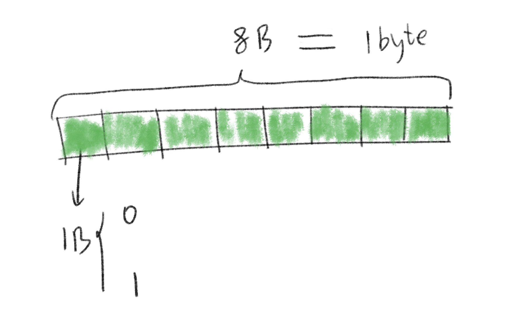

这里的一个位有 16 种可能结果就是**十六进制**，一个位的 16 种可能结果分别用 `1,2,3....10,A,B,C,D,E,F` 表示，所以一个字节用十六进制表示

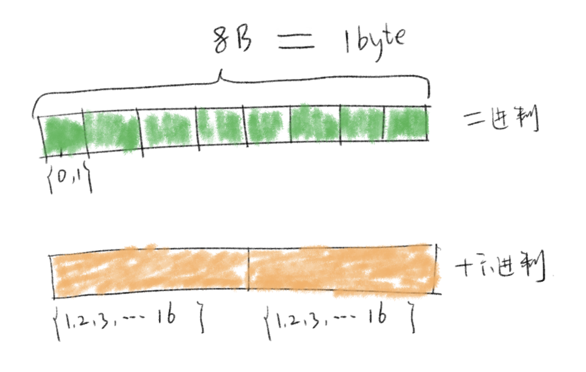
1 字节的 8 个二进制为都为 1 的话，可以用字符串表示为 `11111111` ，这是 256 种可能结果中的第 256 个，所以相当于十进制的 255（从 0 开始算的话，是十进制 255）。

按照十六进制换算的话，这 1 字节包含 2 个位，表示上述 256 的话需要第 1、2 位都是 16，可用 `FF` 表示。

并且，在 JS 的 Number 类型中，以 `0x` 开头来表示十六进制，字符串中则以 `\x` 开头来表示十六进制。

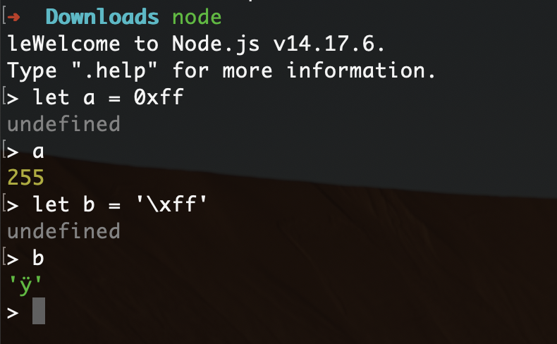

综上，**二进制 `11111111` 等价于十六进制的 `FF`，即 `0xFF`。**

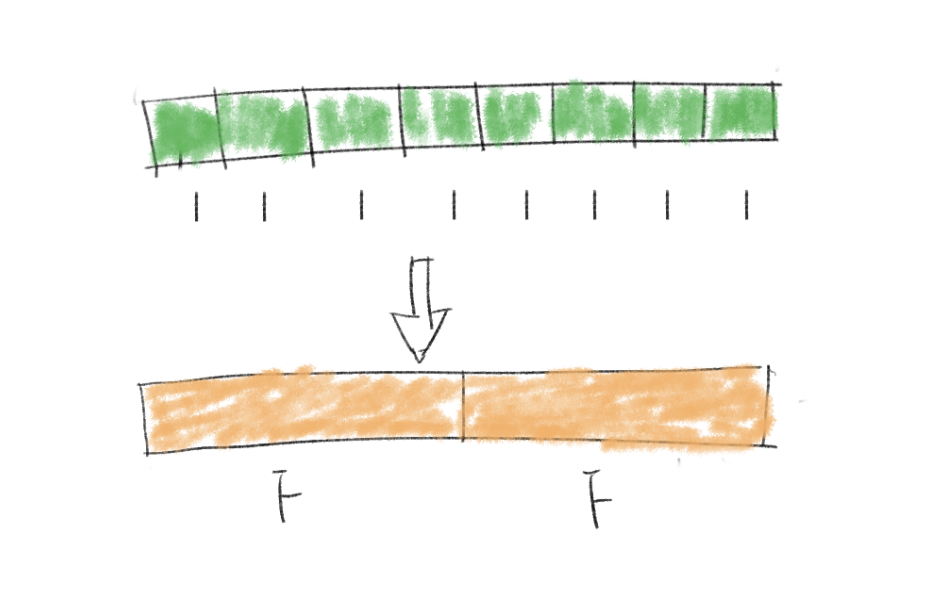

所以，Exif 数据的开始标记 `0xFFE1` 表达的意思如下：

1. 这是十六进制表示，包含 2 个字节的数据
2. 第 1 字节对应二进制数 `11111111`
3. 第 2 字节对应二进制数 `11100001`
4. 该标记之后的 2 个字节表示 Exif 数据的总长度

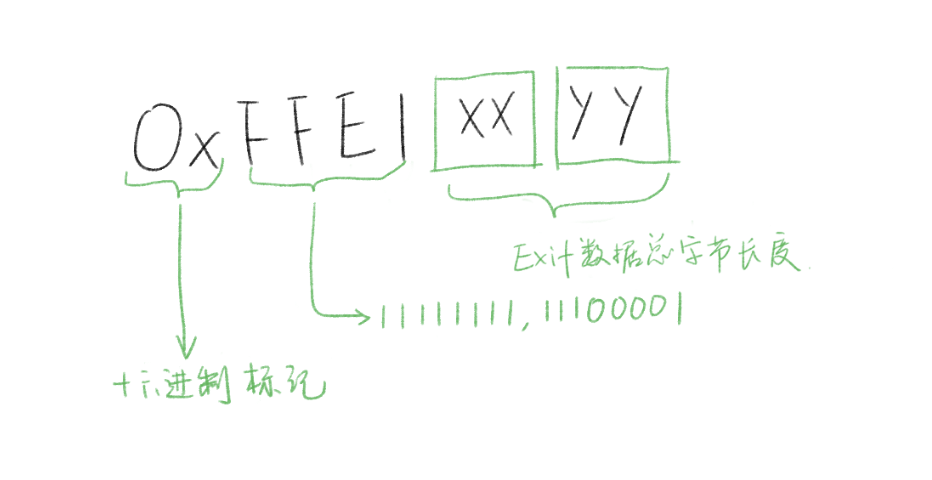

Exif 数据在 JPEG 图片中的位置示意图如下，`0xFFE1` 标记之后的两个字节 `XXXX` 表示 Exif 数据总的字节长度，这两个字节的最大值为 `0xFFFF`，相当于十进制的 `2**16 = 65536`，也就是 `65536B = 64kB`，即 Exif 数据长度最大为 64kB。


所以，**解析 JPEG 图片中的 Exif 信息只需要找到标记 `0xFFE1` 的位置，然后根据其后 2 字节的 `0xXXXX` 表示的数据大小往后找出 Exif 数据部分即可**。同样，对于其他支持写入 Exif 信息的图片格式可使用同样方法找到 Exif 信息。

这个标记 `0xFFE1` 是 Exif 技术标准规定的，是 Exif 数据专用标记，称为 `APP1`，当 Exif 数据嵌入到其他的图片格式中时，Exif 数据的开始标记也是这个；同样的标记还有 `APP0` 等，这里不做赘述。

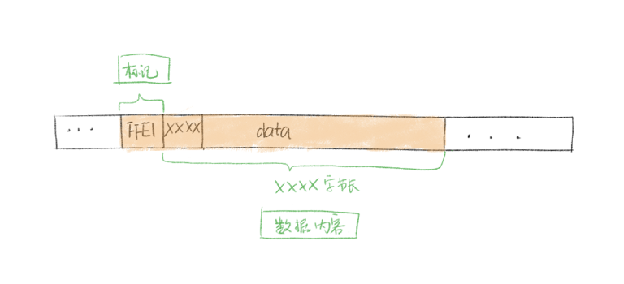

图中 APP1 Data 就是 Exif 的数据部分，它内部又是如何记录照片的属性和拍摄数据的呢？这就涉及到 Exif 数据部分的结构，见下文介绍。

### Exif 数据部分结构

这里说的 Exif 数据部分指的是上面 APP1 Data 部分，其以 2 字节的 `xxxx` 开头表示 APP1 Data 部分总字节长度，随后跟上占用 4 字节的字符串 `Exif` 和占用 2 字节的固定值 `0x00`，随后就是 TIFF 格式的数据了。
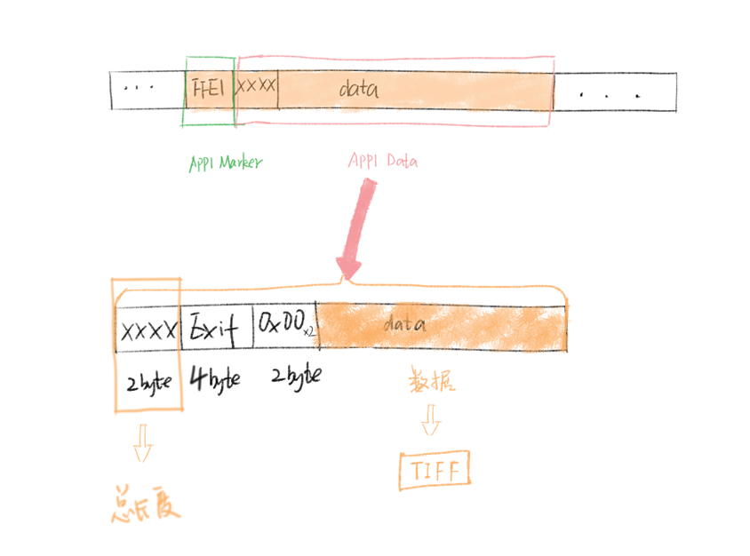
这里字符串 `Exif` 是 ASCII 编码，一个字符占用 1 个字节，总共占用 4 个字节。

## TIFF 格式规范
TIFF 可以理解成和 MySQL 数据库中表一样，是一条一条记录数据的，一条记录代表了一个数据体，称为：Tag。下图中黄色部分为一个 Tag 的结构，Tag 分为 Header 部分和 IFD 部分。

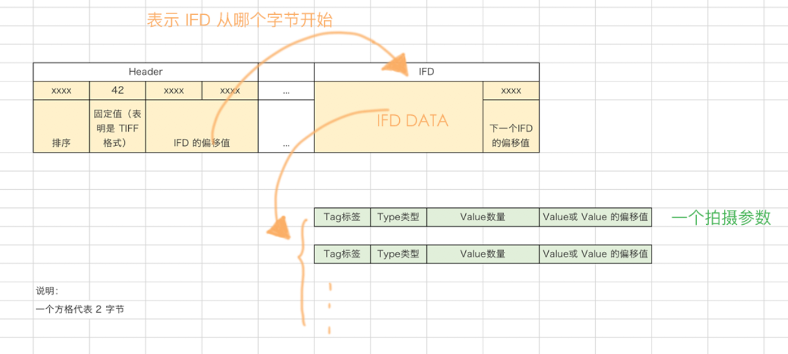

一个 Tag 的拥有一个 8 字节的 TIFF Header（头部），和 IFD 数据部分。头部主要记录了当前 Tag 的序号、数据格式以及下一个 Tag 的偏移值，通过偏移值将多条 Tag 依次串联起来；通过头部指定了数据格式，每一个 Tag 所占用的字节数也就确定了，因此 TIFF 不需要像 Exif 一样标记数据部分的字节大小，即没有 64kB 的大小限制。

上图中最关键的绿色部分记录了图片的属性、拍摄参数（即通常说的 Exif 参数），每一条的数据值的字节大小不一样，所以各个位置的字节代表的含义不一样，这里暂不展开。图中这样绿色的一条数据我们称为：Entry。

一个 Entry 展开为如下图，光圈、快门等拍摄参数根据标签序号映射向左边 IFD Data 数据中查找即可。

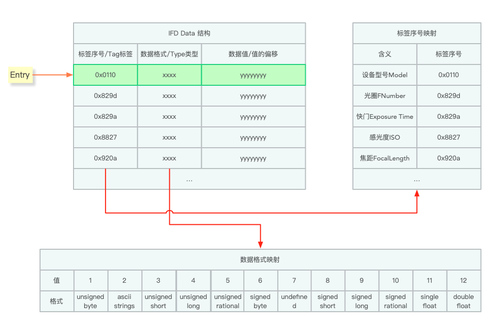

例如：要查找图片的感光度 ISO，先从标签序号映射找到标签序号 `0x8827`，然后从 IFD Data 中找到标签序号和次序号对应的 Entry，取值数据值部分，然后根据数据格式映射做格式转换，最后就可以知道感光度 ISO 的值是多少。

## Exif 数据读取写入

知道了 Exif 数据在二进制数据中的存储规范了，那在前端项目中如何实现读取、写入 Exif 数据呢？且看下文解释。

### 主要思路

从本地图片文件解析 Exif 数据的过程如下：


编辑 Exif 数据并保存到文件的过程如下：


上述过程中从二进制到解析出 Exif 拍摄参数和 Exif 拍摄参数序列化为二进制格式的过程为核心点，已在 github 上找到了开源的工具库来实现，后续文章再讲解如何实现这一过程。

### piexifjs 工具库

piexifjs 是一个专门读取和编辑 JPEG 图片中 Exif 数据的工具库，源码在这里：[https://github.com/hMatoba/piexifjs](https://github.com/hMatoba/piexifjs)。

读取 Exif 数据

```js
import piexifjs, { piexif } from 'piexifjs'
piexifjs.load(imgData) // imgData 为 JPEG 图片的 base64 字符串

// piexifjs 解析出来的 Exif 参数对象可读性不强，需要格式化处理一下
const parseExifData = (exifData) => {
  if (!exifData) { return null }
  const M = exifData['0th'][piexif.ImageIFD.Model]
  const F = exifData.Exif[piexif.ExifIFD.FNumber]
  const S = exifData.Exif[piexif.ExifIFD.ExposureTime]
  const ISO = exifData.Exif[piexif.ExifIFD.ISOSpeedRatings]
  const L = exifData.Exif[piexif.ExifIFD.FocalLength]
  const LEN = exifData.Exif[piexif.ExifIFD.LensModel]
  const T = exifData.Exif[piexif.ExifIFD.DateTimeOriginal]
  console.log('parseExifData\nM, F, S, ISO, L, LEN, T\n', M, F, S, ISO, L, LEN, T)
  return {
    M: M || null,
    F: F && F[0] && F[1] ? F[0] / F[1] : null,
    S: S && S[0] && S[1] ? S[1] : null,
    ISO: ISO || null,
    L: L && L[0] && L[1] ? L[0] / L[1] : null,
    LEN: LEN || null,
    T: T || null
  }
}
```

写入 Exif 数据

```js
import piexifjs, { piexif } from 'piexifjs'

// 将 Exif 参数对象按 TIFF 格式序列化
const exifStr = piexifjs.dump({ '0th': th, Exif: exif })

// 将序列化结果写入 JPEG 图片base64 字符串中，返回新的 base64 字符串
const nb64 = piexifjs.insert(exifStr, imgData)
```

序列化时传入的 Exif 对象有格式要求，需要转换一下格式

```js
const th = {
	[piexif.ImageIFD.Model]: M || this.exif.M
}
const _F = F || this.exif.F
const _S = S || this.exif.S
const _L = L || this.exif.L
const exif = {
	[piexif.ExifIFD.ExifVersion]: this.exif.version,
	// 光圈值包含小数时需要x100
	[piexif.ExifIFD.FNumber]: `${_F}`.includes('.') ? [_F * 100, 1 * 100] : [_F, 1],
	[piexif.ExifIFD.ExposureTime]: [1, Number(_S)],
	[piexif.ExifIFD.ISOSpeed]: Number(ISO || this.exif.ISO),
	[piexif.ExifIFD.ISOSpeedRatings]: Number(ISO || this.exif.ISO),
	[piexif.ExifIFD.FocalLength]: [Number(_L) * 10, 10],
	[piexif.ExifIFD.LensModel]: LEN || this.exif.LEN,
	[piexif.ExifIFD.DateTimeOriginal]: T || this.exif.T,
	[piexif.ExifIFD.DateTimeDigitized]: T || this.exif.T
  }
  removeNull(th)
  removeNull(exif)
```


## Exif 数据读取编辑应用开发

封装一个 ExifEdit 组件，实现功能有： Exif 读取并查看、编辑、保存修改后数据为 base64 、未传入 base64 图片数据时可通过交互选择本地图片文件。

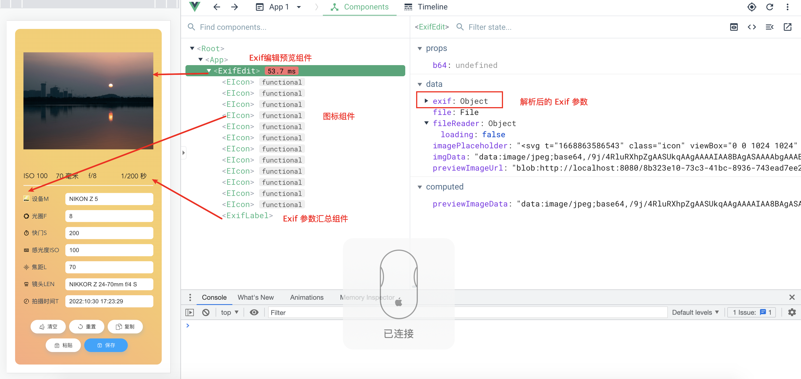

ExifEdit 组件还同时拥有清空、重置、复制、粘贴、保存功能。

### 清空

清空选择的文件、或者传入组件的图片 base64 数据，恢复为组件默认的无数据状态，可以点击从本地文件选择图片。

### 重置

放弃当前对 Exif 数据的修改，重新从选择的文件或者传入组件的 base64 数据解析 Exif 数据。

### 复制

复制当前解析到的 Exif 数据的JSON 字符串到系统剪贴板。

### 粘贴

尝试从系统剪贴板读取数据，进行 JSON 序列化，若符合 Exif 数据结构，则将其关联到当前 Exif 数据上填充在表单上，但是不会自动像图片 dataURL 中插入 Exif，也不会触发组件的 change 事件。

### 保存

将表单绑定的 Exif 数据进行序列化，并将序列化结果插入到传入的 base64 字符串或者从选择的文件读取到的 dataURL 中，若插入成功，则会触发组件的 change 事件。

## Exif 读取功能实现

通过 ExifEdit 组件接受图片 dataURL 数据或者通过交互选择本地文件，读取为 dataURL 字符串，然后调用 piexifjs 库获取对应的 Exif 数据对象，然后解析 Exif 数据对象中的设备型号、拍摄参数等。

## Exif 写入功能实现

收集页面表单的数据并做校验，校验通过后根据 piexifjs 库对 Exif 数据的格式要求做数据转换，然后依次调用 `piexifjs.dump` `piexifjs.insert` 写入 Exif 二进制数据，写入之后返回的是插入了 Exif 数据的 dataURL。

## 保存文件功能实现

ExifEdit 组件在完成 Exif 数据写入功能后仅返回 dataURL 数据，组件不实现文件保存功能，在写入 Exif 数据成功后会向外 emit 一个 `change` 事件，事件携带上 dataURL 和新的文件名。

当该项目作为组件库 lib 被第三方使用时，需要使用方自行监听 change 事件，并使用事件传递的 dataURL 去实现保存到本地功能。

不过当前项目在 `App.vue` 中实现了保存文件功能，实现方法如下：

监听 ExifEdit 组件的 change 事件，使用 `downloadjs` 库将得到的 dataURL 保存到本地。

```vue
import download from 'downloadjs'
export default {
	methods: {
		handleExifEditChange ({ b64: imgData, fileName }) {
			download(imgData, fileName, 'image/jpeg')
		}
	}
}
```

若 ExifEdit 通过 UI 交互引导用户选择了本地文件，则明文件会使用 `${用户选择的文件名去掉后缀}_1.jpg` 作为新文件名，否则使用 `${Date.now()}.jpg` 做新文件名。

## 打包为 Vue 组件

笔者在查找 Exif 相关资料时并未发现有项目将 Exif 数据读写封装成 Vue 组件，因此就有了这一想法。

打包成 Vue 组件也比较简单，组件库的打包使用 vue-cli 脚手架工具，执行下面打包命令即可。

```bash
npm run build:lib
```

## 打包为 Web Component 组件

基于 vue-cli 搭建的项目可以很方便的打包成 Web Component 组件，同时 Web Component 组件是浏览器内核支持的自定义组件，与 Vue、React、Angular 等 UI 框架无关，所以考虑打包为 Web Component 组件。

```bash
npm run build:wc
```

Web Component 组件可能有兼容性问题，具体见下方 MDN 截图

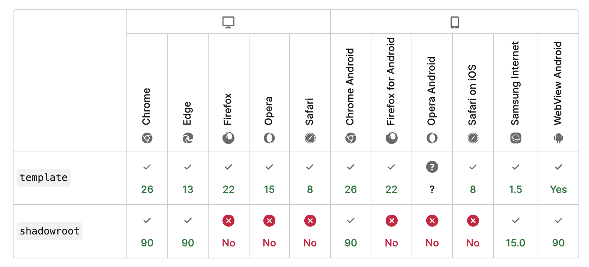

## 结语

本文重点介绍了图片的 Exif 数据的二进制结构，Exif 数据是如何嵌入到 JPEG 格式的图片中的。最后也使用 Vue 实现了一个可以读取、编辑并保存 JPEG 图片 Exif 数据的应用，同时可以打包为 Vue 组件和 Web Component 方便第三方复用。

另外，这个应用在读取文件、解析 Exif 过程的性能优化、组件 E2E 测试方面还有欠缺，并且不支持 TIFF 格式图片的 Exif 数据读取便秘和预览功能，后续会再考虑补充完善。

最后，这个项目代码是开源的，地址在这里：[https://github.com/JohnieXu/exif-edit](https://github.com/JohnieXu/exif-edit)，欢迎各位大佬参与贡献 PR。

## 参考资料

1. TIFF6技术标准 [https://web.archive.org/web/20120703095221/http://partners.adobe.com/public/developer/en/tiff/TIFF6.pdf](https://web.archive.org/web/20120703095221/http://partners.adobe.com/public/developer/en/tiff/TIFF6.pdf)
2. Exif 文件格式 [https://web.archive.org/web/20111025004429/http://park2.wakwak.com/~tsuruzoh/Computer/Digicams/exif-e.html](https://web.archive.org/web/20111025004429/http://park2.wakwak.com/~tsuruzoh/Computer/Digicams/exif-e.html)
3. JS 中的 unicode 编码 [https://www.ruanyifeng.com/blog/2014/12/unicode.html](https://www.ruanyifeng.com/blog/2014/12/unicode.html)
4. Exif 维基百科 [https://zh.wikipedia.org/wiki/Exif](https://zh.wikipedia.org/wiki/Exif)
5. piexifjs 文档 [http://piexifjs.readthedocs.org/en/latest/index.html](http://piexifjs.readthedocs.org/en/latest/index.html)
