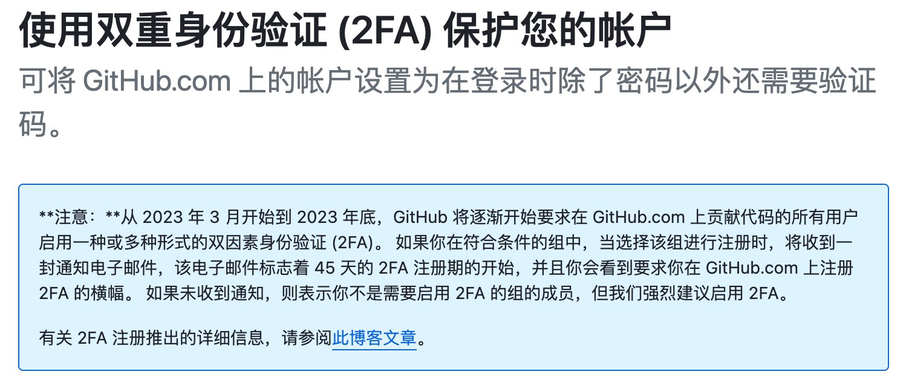
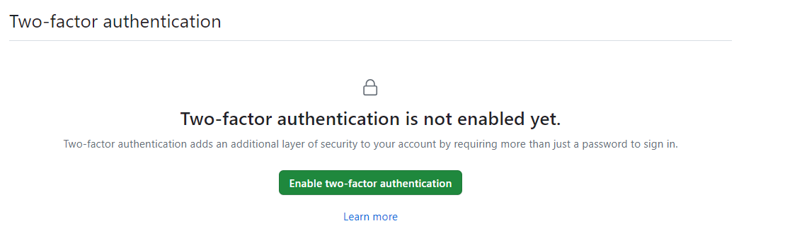
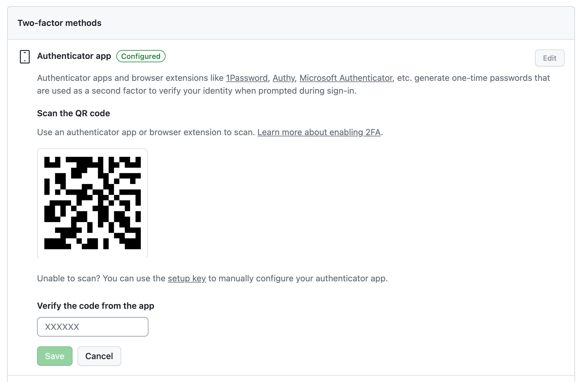
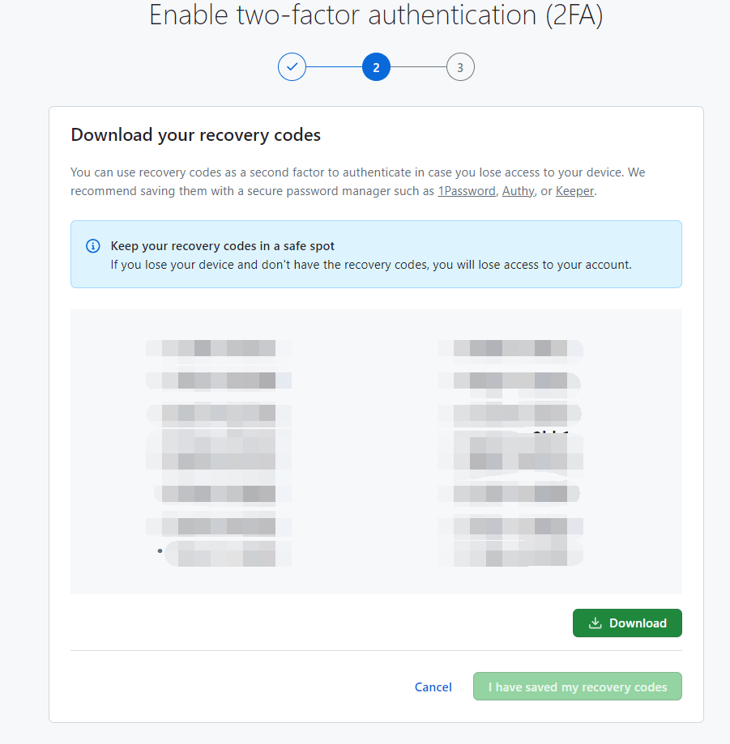
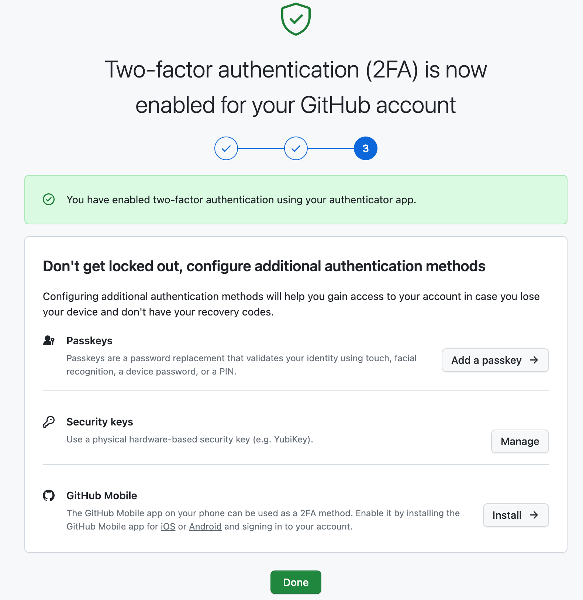
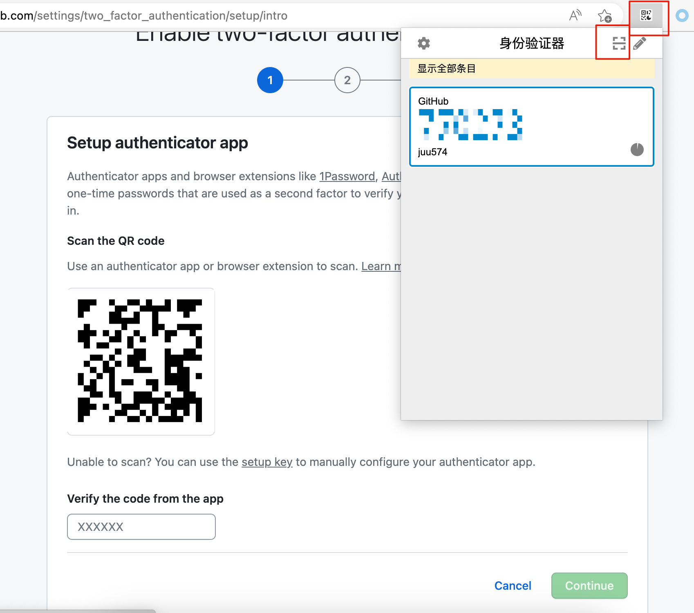
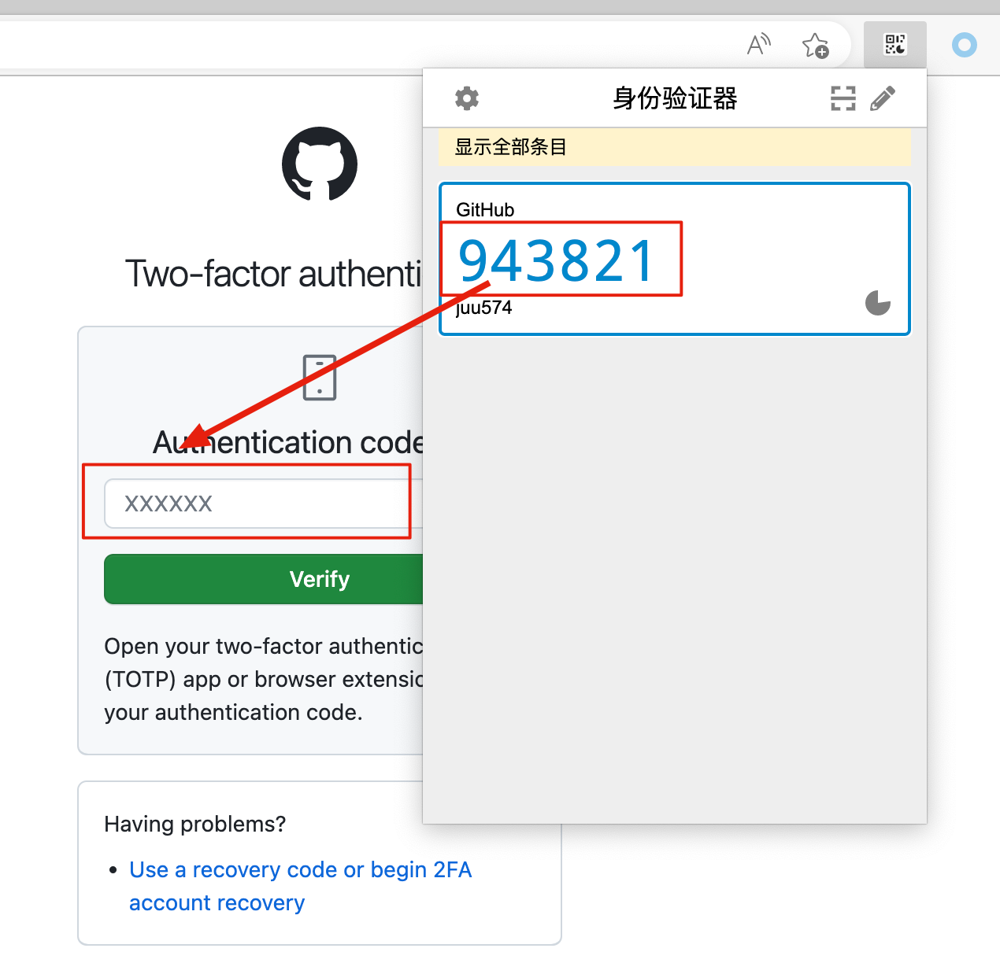
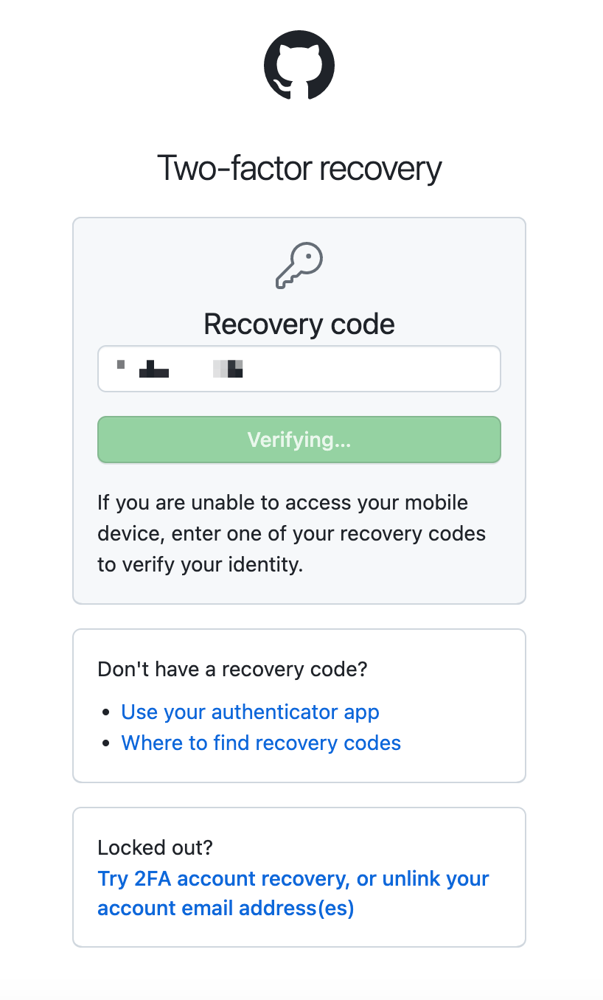

## 背景

GitHub 开始逐步要求账号登录时启用**双重验证（2FA）**，并且在 2023 年底过后，**没有启用双重验证的账号将不能使用**。

看来，启用双重验证势在必行，但是在启用双重验证的过程中**不支持国内的手机号**来接收验证码 : (。

经过一番尝试，终于找到了两种解决方法，见下文。

## 解决方法

按照官方文档说明，要启用双重验证方法有：

- **GitHub APP**
- **短信验证码**
- **TOTP应用**的一次性验证码

GitHub APP 在国内应用商店无法下载，同时国内手机号无法接收短信验证码，所以我们使用[[TOTP应用]]接收一次性验证码来解决。

并且，使用TOTP应用接收验证码方法是**完全免费**的。

### 方法一：微软Authenticator应用接收验证码

微软的[Authenticator](https://support.microsoft.com/zh-cn/account-billing/%E4%B8%8B%E8%BD%BD%E5%B9%B6%E5%AE%89%E8%A3%85microsoft-authenticator%E5%BA%94%E7%94%A8-351498fc-850a-45da-b7b6-27e523b8702a)应用就是一个TOTP应用，支持Android、iOS系统，国内应用商店均可下载。

安装后初次打开出现报错：“由于 Google Pay 服务当前在此设备上不可用，因此无法使用一些功能”，可以直接忽略。

在 GitHub 网页上 `首页>个人头像>Settings>Password and authentication>Two-factor authentication` 位置找到启用双重验证的入口。

打开微软 Authenticator 应用，点击右上角“+”选择“其他账户(Google、Facebook 等)”唤起相机扫码，扫描上面页面的二维码，成功后就在微软 Authenticator 应用上**添加了**你的 GitHub 账号。

在微软 Authenticator 应用点击刚添加的应用，生成一个**一次密码代码**，在上面页面输入这个验证码，验证通过后就将 GitHub 账号**绑定**到了微软 Authenticator 应用了。

> 一定注意：上面这两步操作时一定不要刷新上图这个网页

绑定成功会到这个页面。

GitHub 给出了一个**Recovery Codes** 的文件（类似于私钥，一定要保存好）。

点击“I have saved my recovery codes”，跳转到绑定成功页面。

后面在登录 GitHub 时若出现要填写验证码的地方，输入手机上微软 Authenticator 应用生成的验证码即可。

### 方法二：Chrome/Edge插件接收验证码

Chrome扩展：[身份验证器 - Chrome 应用商店 (google.com)](https://chrome.google.com/webstore/detail/authenticator/bhghoamapcdpbohphigoooaddinpkbai)

Edge扩展：[Authenticator: 2FA Client - Microsoft Edge Addons](https://microsoftedge.microsoft.com/addons/detail/authenticator-2fa-client/ocglkepbibnalbgmbachknglpdipeoio)

根据浏览器自行安装对应版本插件，这个插件相当于一个简洁版的微软 Authenticator 应用。

按照**方法一**打开 GitHub 的启用双重验证页面，然后点击插件弹窗右上角的扫码按钮，拖拽框选二维码，即可**添加** GitHub 账号，然后在网页验证码窗口输入插件给出的一次性验证码，即可完成**绑定**。

绑定成功 GitHub 同样会给出一个**Recovery Codes**的文件（类似于私钥，一定要保存好）。

看到上面页面表示**绑定成功**。

后面在登录 GitHub 时若出现要填写验证码的地方，填写这个插件自动生成的验证码即可。

## 恢复双重验证

如果微软 Authenticator 应用、浏览器插件中的 GitHub 账号被删掉了，或者应用、插件本身被卸载了，则需要进行这一步操作来**重新启用双重验证**。

从 **Recovery Codes** 文件随便复制一行，登录进GitHub。
![[Pasted image 20231024190647.png]]
进入设置页面，点击 “Edit”，重新添加、绑定验证码生成设备（微软 Authenticator 应用或者浏览器插件），步骤和**解决方法**中完全一样。

重新添加、绑定验证码生成设备之后，**Recovery Codes** 文件和之前一样不会重新生成。

## 参考资料

- https://docs.github.com/zh/authentication/securing-your-account-with-two-factor-authentication-2fa/configuring-two-factor-authentication
- https://support.microsoft.com/zh-cn/account-billing/%E4%B8%8B%E8%BD%BD%E5%B9%B6%E5%AE%89%E8%A3%85microsoft-authenticator%E5%BA%94%E7%94%A8-351498fc-850a-45da-b7b6-27e523b8702a
- https://github.blog/2023-03-09-raising-the-bar-for-software-security-github-2fa-begins-march-13/
