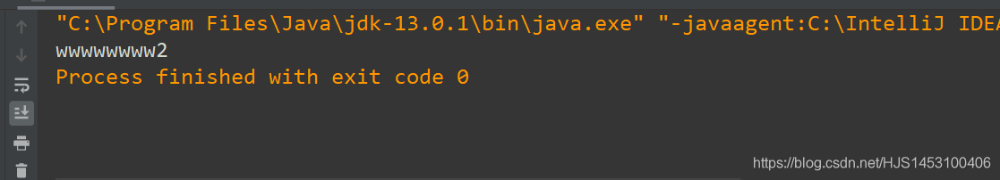

匿名对象类：创建的类的对象没有名字；  
作用：当只需要调用一次的时候可以使用；  
代码：

```
public class Main {
    public static void main(String[] args)
    {
        new min().show();
        new min().height(2);
    }
}
class min{
    public void show()
    {
        System.out.print("wwwwwwww");

    }
    public void height(int a)
    {
        System.out.print(a);
    }
}
```

输出结果：  


2020年2月11日 初写