```
写在最前面的废话：
我曾在大二下学期刚刚开始的时候听过一位学长给我的忠告：在我们这个学校考研是不受支持的（虽然我还是想考），就业一直占比很大的趋势比例，而如果想找到一份体面的工作，Java是敲门砖，很重要 应该尽早的去学习Java的一整套体系，而其中Java的基础，更重要；
在这之前我曾经了解过该“体系”所指的含义，用“庞大”形容其不为过，于是乎，我便又问学长，Java学到什么程度方为学过？
学长答曰：“最起码学到IO流”
一开始我不理解这句话，到现在，有些理解了；
```

`因为从这一章开始，才算是真正操作计算机的文件进行编程。`

#### IO流（一）

- [一、概述](#_10)
- - [1.含义](#1_11)
  - [2.分类](#2_14)
- [二、抽象基类](#_28)
- [三、File（节点/文件流）实现抽象基类](#File_34)
- - [1.FileInputStream](#1FileInputStream_47)
  - [2.FileOutputStream](#2FileOutputStream_190)
  - [3.使用FileInputStream和FileOutputStream实现文件的复制](#3FileInputStreamFileOutputStream_239)
  - [4.FileReader和FileWritel实现复制](#4FileReaderFileWritel_350)

## 一、概述

### 1.含义

所谓的“IO”，故名意思是输入（Input）/出（Output），而“流”则可以理解为多个数据的传输过程，类似于电流（传输电子）、水流（传输水分子）；说白了，也就是一次处理多个数据，而这一点科幻电影里面常常很为我们表达的很形象，如图：

### 2.分类

IO流根据不同的环境可以分为多个不同的类型，基本的有以下三种：

- 按照操作数据单位不同：**字节流**（8bit）、**字符流**（16bit，文本文件）；
- 按照数据流向不同：**输入流**、**输出流**；
- 按照角色的不同：**节点流**、**处理流**；

前面两种大致略过（大家基本都知道），这里说一下**节点流**和**处理流**

所谓的**节点流**其实就是指一般的数据流（**字节流**/**字符流**），而**处理流**是指在**节点流**外部所包裹的一层或多层辅助**节点流**的流；  
 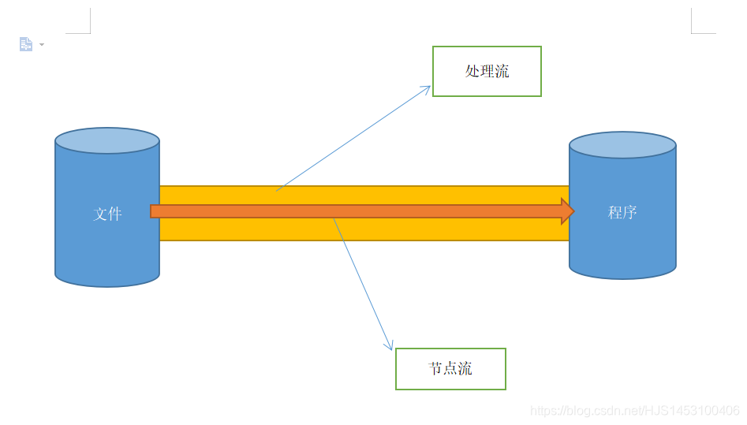  
 如果对这个概念还是有些模糊也没关系，因为后面会说到一个典型的处理流——**缓冲流**

顺便说一下，IO流使用到的设计模式为**装饰者设计模式**

## 二、抽象基类

Java的IO流实现方式是依靠类，所涉及到约有40多个类，但这些类其实都是从四个抽象基类所派生出来的。

  
 这四个抽象基类**没有具体的实现类**，功能都是由其子类完成（也就是那40多个类）

## 三、File（节点/文件流）实现抽象基类

首先，使用File实现抽象来实现抽象基类，与之对于的体系如下：

| 抽象基类 | File(节点流/文件流) |
| --- | --- |
| InputStream | FileInputStream（从硬盘读取一个内容） |
| OutputStream | FileOutputStream（输出内容到硬盘的文件内/创建文件） |
| Reader | FileReader |
| Writer | FileWriter |

  

**其中：`FileInputStream` 与 `FileOutputStream` 用于处理字节(任何文件)；`FileReader`与`FileWriter`用于处理字符（文本文件）；**

### 1.FileInputStream

`FileInputStream`的作用是读取信息到硬盘的文件中，前提要求被读取的文件必须存在，否则报错；

```
import org.junit.jupiter.api.Test;//测试类引入的包
import java.io.File;
import java.io.FileInputStream;
import java.io.IOException;

public class Main {
    //目的：从硬盘中存在的一个文件，读取其内容,使用FileInputStream
    @Test
    public void FileInputStream1() throws Exception {
        //1.创建File类的对象(指明文件路径)
        File file=new File("E:/ceshi.txt");

        //2.创建FileInputStream的对象(用于操作)
        //这里可能会出现文件不存在的情况，所以需要抛出异常;
        //读取时候不存在会抛出FileNotFoundException异常;
        //写入时候不存在会自动创建;
        FileInputStream fileInputStream=new FileInputStream(file);

        //3.调用fileInputStream的方法进行读取(字节形式，非字符);

        /*int b=fileInputStream.read();
        while(b!=-1){
            System.out.print((char) b);
            b=fileInputStream.read();
        }*/

        int b;
        //read()查API2
        while((b=fileInputStream.read())!=-1){
            System.out.print((char)b);
        }

        //4.关闭流(不是内存资源，不会自动回收)
        fileInputStream.close();
    }
```

前面有说到，使用`FileInputStream`读取的文件**必须存在**，由于文件有不存在的可能性，我们需要提前告诉编译器如果文件找不到该怎么办，也就是做**错误的预处理**，这一点也是必须要做的，否则编译器无法正常执行；

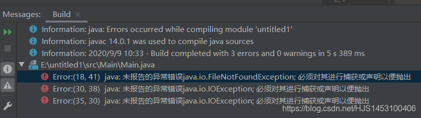  
 我们刚刚使用了`throws Exception`将可能出现的进行抛出，程序可以正常执行

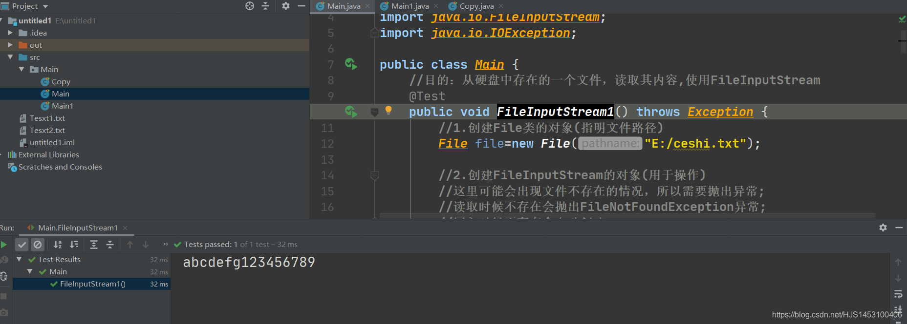  
 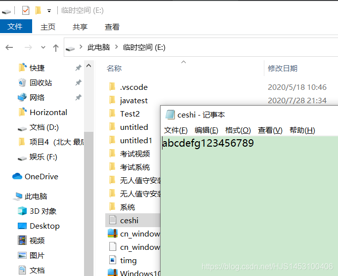  
 但是，仅仅抛出错误将错误抑制就可以了吗？  
 并不是，刚刚只是为了测试的可执行性，但是在实际开发过程中我们必须要考虑到一点——**“JVM的回收机制不会关闭IO流的资源”**

嗯？为什么说了这样一句看似毫不相干的话？其实原因很简单

在上面的代码中有一条语句是专门用于关闭流的语句  
 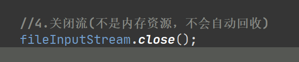  
 **并且，这条语句也需要在工作全部完成后才可执行**

**所以，就是如果将错误抛出了但是上层没有在第一时间解决错误，那么流就一直会开着，浪费内存的空间**

所以~~抛出错误是不可靠的（并不是说不能用，有些程序必须使用抛出），自己动手解决才是最好的，好了，`try-catch`可以登场了

```
	//目的：使用try—catch处理异常（保证流在出现异常时也一定被关闭）
    //IDEA快速try-catch：选中代码，然后ctrl+alt+t;
    //此方法更合理
    @Test
    public void FileInputStream2(){
        FileInputStream fileInputStream= null;
        try {
            File file=new File("E:/ceshi.txt");
            fileInputStream = new FileInputStream(file);
            int b;
            while((b=fileInputStream.read())!=-1){
                System.out.print((char)b);
            }
        } catch (IOException e) {
            //打印原始的错误信息
            e.printStackTrace();
        }finally{
            if (fileInputStream!=null) {
                try {
                    fileInputStream.close();
                } catch (IOException e) {
                    e.printStackTrace();
                }
            }
        }
    }
```

这样的就是完美的了吗？  
 NO~既然我这么问了，那肯定是还能改进啊

在前两段的代码中，我定义了一个int型的变量`b`,其作用有两个，一个是**保存读取到的数据**，因为默认读取到的是ASCII码所以使用整型变量读取；第二个作用则是**判断是否已经读取完文件**，也就是是否等于-1，要说明这个我们还需要看一下`read`的作用  
 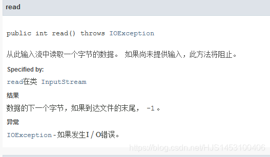  
 当然，这种方法也有一个小缺点，原因在与`b`只是一个变量，一次只能运输一个字节的数据，对于小文档来说可能够用了，但是当面对大文档会显得捉襟见肘。

于是乎，我们引入了**数组**来一次处理多个数据

在我们使用数组处理之前，还是查一下API文档  
 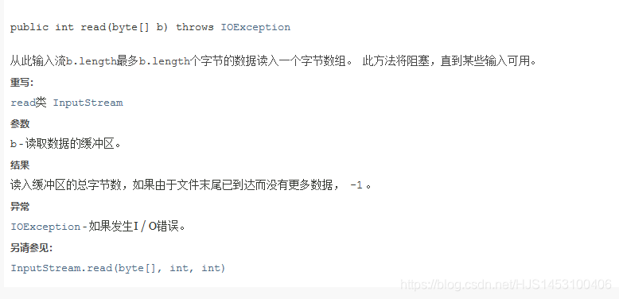  
 我们发现，`read`所用到的数组是`byte`型的（非`int`）

```
//目的：使用数组读取文件内部的信息（一次读取多个字节）
    @Test
    public void FileInputStream3(){
            FileInputStream fileInputStream= null;
            try {
                File file=new File("E:/ceshi.txt");
                fileInputStream = new FileInputStream(file);
                //数组定义为5，表示每次最多传输的数据
                byte[] b=new byte[5];//读取到的数据写入的数组
                int len;//记录每次读入到byte[]中的长度（读取到最后会返回-1）
                while((len=fileInputStream.read(b))!=-1){
//                    for (int i=0;i<len;i++)
//                    {System.out.print((char)b[i]);}
//                    System.out.println();

                    String str=new String(b,0,len);//将字符数组合并为字符串
                    System.out.println(str);
                }
            } catch (IOException e) {
                //打印原始的错误信息
                e.printStackTrace();
            }finally{
                if (fileInputStream!=null) {
                    try {
                        fileInputStream.close();
                    } catch (IOException e) {
                        e.printStackTrace();
                    }
                }
            }
        }
```

值得强调的是，我们需要额外定义一个`int`型的变量而不是简单的用`b.length`去输出，这样做的目的也是有两个，第一个是为了增加代码的可读性（其实不是很重要），第二个是为了确保输出结果的正确性（这个很重要）

1.使用整形变量输出的结果：  
 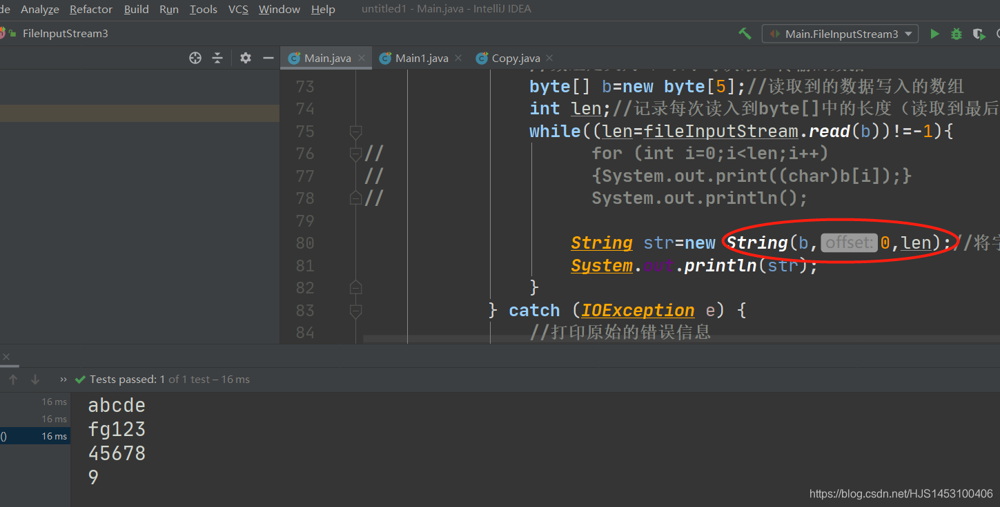

2.使用`b.length`输出的结果：  
 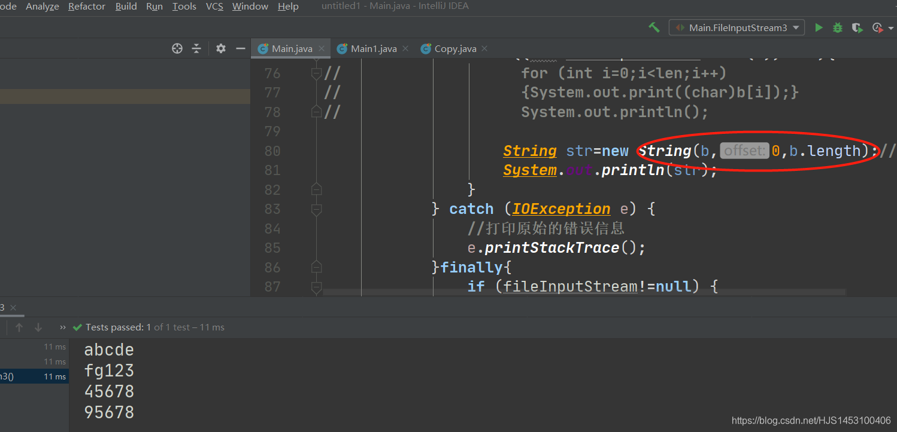  
 出现错误的原因不难想到，是因为当数组走到-1时便直接退出了循环，并未将其余的数组清空。

好了，前面啰啰嗦嗦说了一堆，后面就可以简化的说了~

### 2.FileOutputStream

`FileOutputStream`的作用是将一些内容写入到硬盘的文件中，与`FileInputStream`作用正好相反；当被写入的文件不存在的时候，系统会自动创建新文件。

在这之前，我们还需要知道一个方法——`write`  
 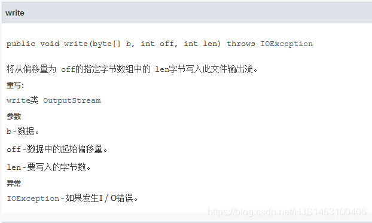  
 简单来说，就是负责写入的~~  
 好了，开始吧！

```
import org.junit.jupiter.api.Test;
import java.io.File;
import java.io.FileOutputStream;
import java.io.IOException;

public class Main1 {
    @Test
    public void FileOutputstream(){
        //创建File对象，表明文件的写入位置，引包import java.io.File;
        //file为写入的文件，如果不存在则自动创建一个文件
        File file =new File("Text1.txt");
        //创建声明，引包import java.io.FileOutputStream;
        FileOutputStream fos=null;
        try{
            //创建一个FileOutputStream的对象，file作为形参传入给所创建对象的构造器
            fos=new FileOutputStream(file);
            //输入多个字符，利用数组
            //getBytes()将字符串转成数组
            fos.write(new String("Pole Star").getBytes());
        }catch(Exception e){
            //打印原始的错误信息
            e.printStackTrace();
        }finally{
            if (fos!=null){
                try{
                    fos.close();
                }catch(IOException e){
                    //流的关闭异常处理，引包import java.io.IOException;
                    e.printStackTrace();

                }
            }
        }
    }

}
```

运行结果：  
 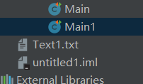  
 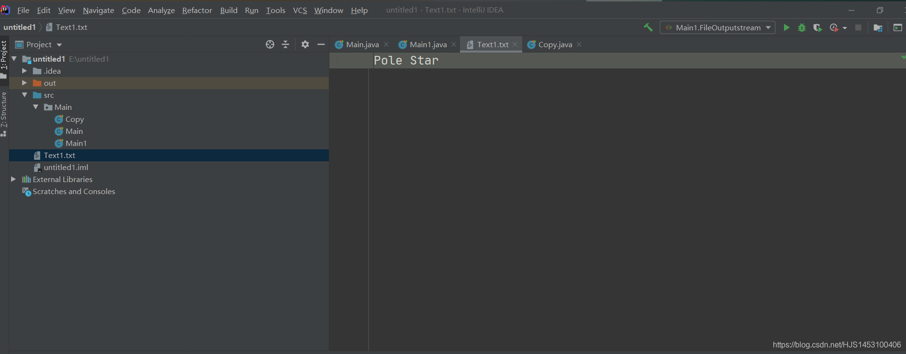

### 3.使用FileInputStream和FileOutputStream实现文件的复制

到了这里，我们就可以实现一下文件的复制功能，其核心内容也就是前面说到的FileInputStream的读取和FileOutputStream的写入；

```
import org.junit.jupiter.api.Test;
import java.io.File;
import java.io.FileInputStream;
import java.io.FileOutputStream;
import java.io.IOException;
public class Copy {
    @Test
    public void Copy(){
        //文件的复制操作：读取文件并写入到另一处地方

        //1.提供写入的文件
        File file1=new File("Tesxt1.txt");
        //2.提供要输出的文件（不存在则新建）
        File file2=new File("Tesxt2.txt");

        //提供相应的流
        FileInputStream fis=null;
        FileOutputStream fos=null;
        try{
            fis=new FileInputStream(file1);
            fos=new FileOutputStream(file2);

            //实现文件的复制

            //创建字节的数组
            byte [] b=new byte[1024];
            //记录每次写入的的字节个数
            int len=0;

            while((len=fis.read(b))!=-1){//提取被复制文件的内容字节
                //复制到文件里,从头开始写，写len个
                //fos.write(b)或者fos.write(b,0,b.length)为错误
                fos.write(b,0,len);
            }
        }catch(Exception e){
            e.printStackTrace();
        }finally{
            if(fos!=null){
                try{
                    fos.close();
                }catch(IOException e){
                    e.printStackTrace();
                }
            }

            if(fis!=null){
                try{
                    fis.close();
                }catch(IOException e){
                    e.printStackTrace();
                }
            }

        }


    }
}
```

当然，我们还可以将其构造为一种通用的方法

```
	//生成复制文件的方法(通用)
    public static void copyFile(String src,String dest){//文件路径
        //1.提供写入的文件
        File file1=new File(src);
        //2.提供要输出的文件（不存在则新建）
        File file2=new File(dest);

        //提供相应的流
        FileInputStream fis=null;
        FileOutputStream fos=null;
        try{
            fis=new FileInputStream(file1);
            fos=new FileOutputStream(file2);

            //实现文件的复制

            //创建字节的数组
            byte [] b=new byte[1024];
            //记录每次写入的的字节个数
            int len=0;

            while((len=fis.read(b))!=-1){//提取被复制文件的内容字节
                //复制到文件里,从头开始写，写len个
                //fos.write(b)或者fos.write(b,0,b.length)为错误
                fos.write(b,0,len);
            }
        }catch(Exception e){
            e.printStackTrace();
        }finally{
            if(fos!=null){
                try{
                    fos.close();
                }catch(IOException e){
                    e.printStackTrace();
                }
            }

            if(fis!=null){
                try{
                    fis.close();
                }catch(IOException e){
                    e.printStackTrace();
                }
            }
        }
    }
```

### 4.FileReader和FileWritel实现复制

`FileReader`与`FileWritel`操作的对象为字符，与前面提到过的`FileInputStream`和`FileOutputStream`的区别在于前者只能操作文本文件，后者则可以操作任意文件（我知道这个前面说过，但是这个很重要，所以我再说一次）；

他们的区别**目前据我所知**也只是这一点，关于格式的操作以及一些细节在我看来他们真的一毛一样，所以，过多的啰嗦反而不好，就直接用他们实现“复制的操作吧”

```
import org.junit.jupiter.api.Test;
import java.io.FileWriter;
import java.io.FileReader;
import java.io.File;
public class FileCopy {
    @Test
    public void FileCopy(){
        FileReader fr=null;
        FileWriter fw=null;
        try{
            File src=new File("Text1.txt");//文件必须存在
            File dest=new File("Text2.txt");//文件可以不存在

            fr=new FileReader(src);
            fw=new FileWriter(dest);

            char [] c=new char[24];
            int len=0;

            while((len=fr.read(c))!=-1){
                fw.write(c,0,len);
            }
        }catch(Exception e){
            e.printStackTrace();
        }finally{
            if(fw!=null){
                try {
                    fw.close();
                }catch(Exception e){
                    e.printStackTrace();
                }
            }
            if(fr!=null){
                try {
                    fr.close();
                }catch(Exception e){
                    e.printStackTrace();
                }
            }
        }
    }
}
```

运行结果：  
 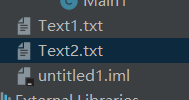

IO流第一小节over~~