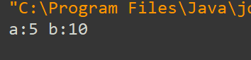
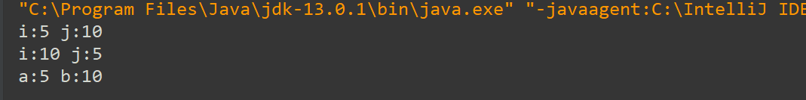
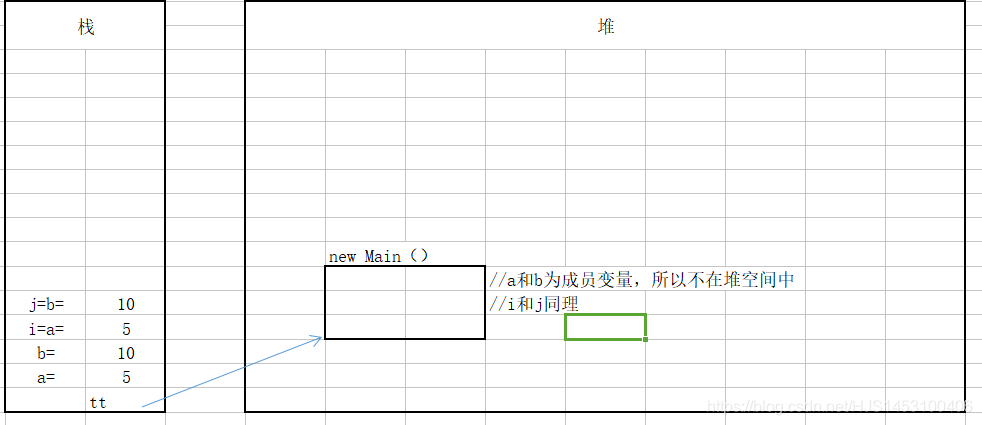
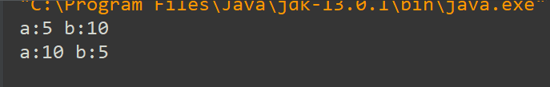
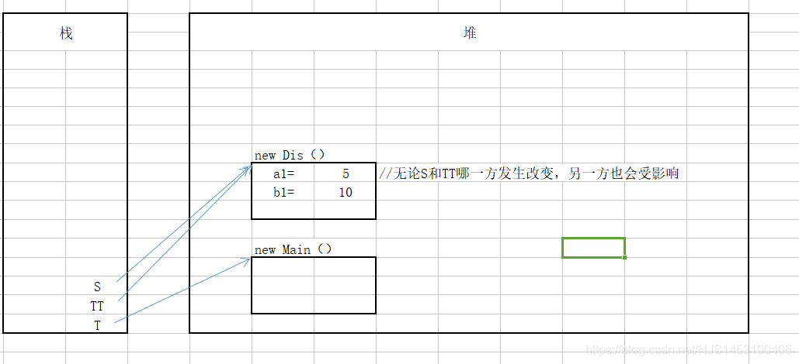

## Java 参数传递机制

#### 1.形参和实参

```
1.形参：方法声明的时候，方法小括号里面的参数；
2.实参：调用方法时，实际传入的参数值；
```

```
 public class Main{
 	public static void main(String[] args)
 	{ int i=5;
 	  int j=10;
 	  Main tt=new Main();
 	  tt.function(i,j);//i和j为形参；
 	}
 	public void function(int a,int b)//a和b为实参；
 	{
 	  a=a+b;
 	  System.out.println(a);
 	}
 }
```

#### 2.传递规则

```
1.规则：Java中的参数传递机制是“值”传递；
2.当形参是基本数据类型的时候，将实参传递（这里的传递可以理解为拷贝）给方法内的基本类型的变量（传值）；
3.当形参是引用数据类型的时候，将栈空间的值传递给方法内的引用数据类型的变量，也就是将栈空间变量所对应（指向）的堆空间的首地址值传递给方法内的引用数据类型的变量（传址）；
```

#### 在这里说明一个很重要的点，局部变量和成员变量，因为下面会用到，所以单独强调。

1.成员变量：存储：对象没有实例化（new）之前存在栈中，实例化以后变量和值放在**堆空间**中，对象名和引用地址放在**栈空间**中。  
2.局部变量：存储：变量名放在栈中，new的对象放在堆中。  
怎么判断是成员变量还是局部变量？  
成员变量：代码写在类以内，方法以外  
局部变量：在方法定义中或者方法声明上  
初始化值不同：成员变量：有默认值初始化。局部变量：没有默认值初始化，必须定义，赋值，然后才能使用。

好了，接下来开始解析：

**1.基本数据类型代码解析：**

以下代码为实现a与b的交换:

```
public class Main {
    public static void main(String[] args)
    {   int a=5;
        int b=10;
        Main tt=new Main();
        tt.swap(a,b);
        //这里可以理解为拷贝一份a和b的值传递给swap方法，但是实际的a和b并没有改变
        System.out.println("a:"+a+" b:"+b);
    }
    public  void swap(int i,int j)
    {
        int swap=i;
        i=j;
        j=swap;
    }
}
```

输出结果：a与b并没有交换；  
  
解释：首先，每一个方法所声明的成员变量都是在栈空间内存放，互相并不影响；当执行主方法中的`int a=5;iint b=10;`的时候，在栈空间内存放a=5和b=10。在执行swap中i和j接收a和b的值的时候，程序自动在栈空间内新开辟两个空间，用来保存a和b的副本，也就是i=a=5和j=b=10；当改变i和j的值，a与b并不改变；  
例如，在swap中加入输出i和j的语句，就会发现i和j其实已经互换；  
代码：

```
public class Main {
    public static void main(String[] args)
    {   int a=5;
        int b=10;
        Main tt=new Main();
        tt.swap(a,b);
        //这里可以理解为拷贝一份a和b的值传递给swap方法，但是实际的a和b并没有改变
        System.out.println("a:"+a+" b:"+b);
    }
   public  void swap(int i,int j)
    {   System.out.println("i:"+i+" j:"+j);
        int swap=i;
        i=j;
        j=swap;
        System.out.println("i:"+i+" j:"+j);
    }
}
```

运行结果：  
  
模拟内存图：  


**2.引用数据类型代码解析：**  
以下代码为实现a与b的交换:

```
class Dis
{
    int a1=5;
    int b1=10;
}
public class Main {
    public static void main(String[] args)
    {
        Main T=new Main();
        Dis TT=new Dis();
        System.out.println("a:"+TT.a1+" b:"+TT.b1);
        T.Swap(TT);
        System.out.println("a:"+TT.a1+" b:"+TT.b1);
    }
    public  void Swap(Dis S)
    {
        int swap=S.a1;
        S.a1=S.b1;
        S.b1=swap;
    }
}
```

输出结果：a与b发生了交换；  
  
解释：在交换引用类型数据中的数据时，所创建引用的对象名（类名，这里为`TT`）在**栈空间**内存放，但是引用的对象（类）的局部变量和值在**堆空间**内存放（凡是“new”出来的都在**堆空间**）内存放，**栈空间**的对象名指向**堆空间**存放的数据。当进行值传递时，其实是将`TT`的首地址复制给系统自动创建的`Dis`类型的`S`，也就是说，现在的`s`和`TT`共同指向并操作同一处存在于堆空间的区域，所有，Swap发生的互换也就可以理解了。

模拟内存图：  
  
完毕！  
2020年2月13日初写；