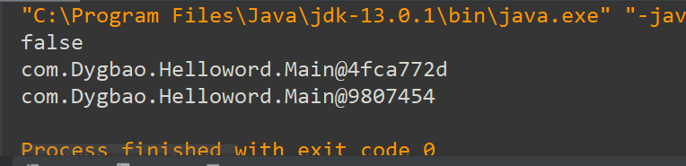
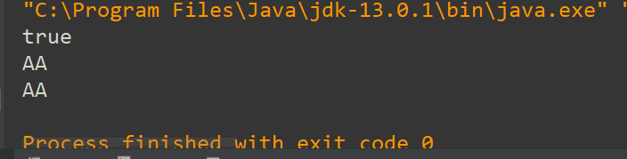
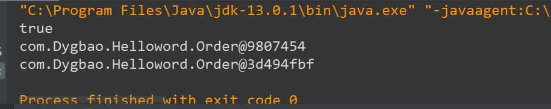
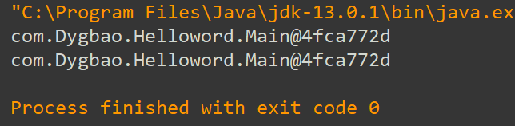
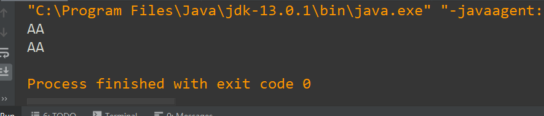

前言：略；

以下均为`java.lang.object`下的方法；

## 一.equals（）方法；

#### 1.特性和作用

1.equals（）默认的是用来比较两个引用类型的地址值是否相等，并且只能处理引用数据类型；  
测试代码：

```
public class Main {
    public static void main(String[] args) {
      Main a=new Main();
      Main b=new Main();
      System.out.println(a.equals(b));
      System.out.println(a);
      System.out.println(b);
    }
}
```

结果：  
  
2.如果引用的是date类、string类、包装类、file类，作用改为比较两个对象的实体内容；  
测试代码：

```
public class Main {
    public static void main(String[] args) {
      String a=new String("AA");
      String b=new String("AA");
      System.out.println(a.equals(b));
      System.out.println(a);
      System.out.println(b);
    }
}
```

结果：  


#### 2.实现概念

1.为什么可以使用？  
原因很简单，因为这个方法是在根类Object类中，而Object类又是所有类的父类，根据继承的特性，则可以直接通过`对象.方法`使用  
2.为什么date类、string类、包装类、file类实现的是实体内容的比较？  
因为在Java 中这些类中的equals（）方法被自动重写，比较结果由地址转变为实体内容：  
源代码如下：

```
Override
    public boolean equals(Object o) {
        if (this == o) return true;
        if (o == null || getClass() != o.getClass()) return false;//直接用getClass()获取对象的类；
        Order order = (Order) o;
        return orderld == order.orderld &&
                Objects.equals(OrderName, order.OrderName);//
    }
```

#### 3.练习

我们手动的重写一个equals（）方法，使他们比较实体内容；

```
public class Main{
    public static void main(String[] args){
        Order a=new Order(34,"hhhhhh");
        Order b=new Order(34,"hhhhhh");
        System.out.println(a.equals(b));//这里直接调用该方法，比较的是两个对象的地址值，输出结果为falsee
        System.out.println(a);//输出两个对象的地址值；
        System.out.println(b);
    }
}
class Order {
    int orderld;
    String OrderName;

    public Order(int orderld, String orderName) {
        super();
        this.orderld = orderld;
        this.OrderName = orderName;
    }

    public void setOrderld(int orderld) {
        this.orderld = orderld;
    }

    public void setOrderName(String OrderName) {
        this.OrderName = OrderName;
    }

    public int getOrderld() {
        return orderld;
    }

    public String getOrderName() {
        return OrderName;
    }

    public boolean equals(Object obj) {//所有的类都是Object的子类或者孙子类。所以这里可以直接虚拟方法调用（父类引用，子类实体；多态的性质）
        if (this == obj) return true;//如果对象的引用相等，直接输出true；
        else if (obj instanceof Order) { //如果obj是Order的实例，然后进行比较；
            Order o1 = (Order) obj;//强制类型转换，只有转化为Order型才可以调用该类的属性；
            return this.orderld == o1.orderld && this.OrderName.equals(o1.OrderName);
            //第一个比较，不多说
            //第二个：当前方法以及被重写，他可以调用自身，即if(this==obj) return true;
        } else return false;//如果如果obj不是Order的实例，直接输出false；
    }
}
```

输出：  


## 二.toString方法；

#### 1.特性和作用

1.当我们打印对象的时候，如果没有明显调用其它方法并且没有重写toString（），则默认调用Object中的toString（）方法，作用为输出对象在堆空间中的首地址；

```
public class Main{
    public static void main(String[] args) {
        Main a=new Main();
        System.out.println(a);
        System.out.println(a.toString());
    }
}
```

输出结果：两个一样；  
  
2.输出的格式：

```
public String toString(){
    return getClass().getName()+"@"+Integer.toHexString((hashCode()));
}//打印对象所在的类，以及对象所在的实体空间；
```

3.如果引用的是date类、string类、包装类、file类，作用输出对象属性的信息；

```
public class Main{
    public static void main(String[] args) {
        String a=new String("AA");
        System.out.println(a);
        System.out.println(a.toString());
    }
}
```



#### 2.其它；

略；  
因为手动重写和equals（）方法基本一样；

2020年2月29日初写；