#### 多线程

- [一、实现多线程](#_1)
- - [1.1.前导](#11_2)
  - [1.2.继承Thread类](#12Thread_14)
  - [1.3.实现Runnable接口](#13Runnable_58)
  - [1.4.两种方法的区别](#14_128)
  - [1.5.练习](#15_139)
- [二、生命周期](#_209)
- [三、线程同步安全](#_211)
- - [3.1.线程协作安全](#31_212)
  - [3.2.线程同步安全](#32_264)
  - - [3.2.1方法一：同步代码块](#321_266)
    - [3.2.2方法二：同步方法](#322_319)
  - [3.3互斥锁](#33_360)
  - [3.4练习](#34_385)
- [四、线程通信](#_417)
- - [4.1线程通信用到的方法](#41_418)
  - [4.2练习](#42_420)
- [五、最终练习：生产者消费者问题](#_460)

## 一、实现多线程

### 1.1.前导

- 实现继承有两种方法：  
   1.使实例化对象的类继承与`Thread`类；  
   2.使实例化对象的类实现`Runnable`接口；
- 其实`Thread`类也是实现与`Runnable`接口的，在加上Java有着单继承多实现的特性，所以第二种方法要优于第一种；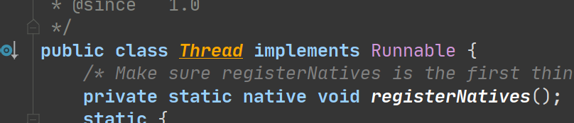
- 无论那种方法都必须重写`run()`方法，并且完成工作的代码段需要放到里面；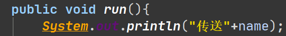
- 多线程的启动方式为`对象.start()`,而不能使用`对象.run()`,否则将失去多线程的效果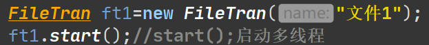
- Thread.currentThread()方法：返回当前线程执行的引用；
- Thread.sleep（）方法：使得该线程睡眠一段时间后执行，并不会释放锁；

  

### 1.2.继承Thread类

```
public class Testclass {
    public static void main(String[] args){
        FileTran ft1=new FileTran("文件1");
        ft1.start();//start();启动多线程
        FileTran ft2=new FileTran("文件2");
        ft2.start();
        FileTran ft3=new FileTran("文件3");
        ft3.start();
    }
}
class FileTran extends Thread{
    private String name;
    public FileTran(String name){
        this.name=name;
    }
    public void run(){
        System.out.println("传送"+name);
        try{
            Thread.sleep(1000);//sleep让程序睡眠1秒（1000毫秒）
        }catch (Exception e){}

        System.out.println(name+"传送完毕");
    }
}
```

运行结果：  
 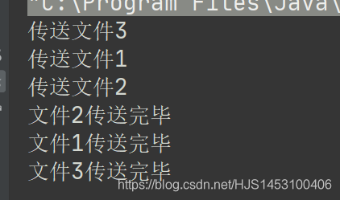  
 也可以使用匿名对象来实现：

```
public class Testclass {
    public static void main(String[] args){
        new Thread(){
            public void run(){
                System.out.println("文件传输1");
            }
        }.start();
    }
}
```

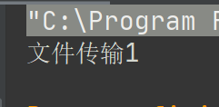

### 1.3.实现Runnable接口

**由于接口Runnable中没有`start`方法，而启动多线程又必须需要start方法,所以在对象外面包装一个`Thread`的实例化的对象；将原有对象作为形参传递进去便可包装出一个`线程`**

```
public class Testclass {
    public static void main(String[] args){
      FileTran ft1=new FileTran("文件");
      //由于接口Runnable中没有start方法，而启动多线程又必须需要start方法；
      //所以在对象外面包装一个Thread的实例化的对象;
      Thread t1=new Thread(ft1);
      t1.start();

      Thread t2=new Thread(ft1);//实现多线程
      t2.start();
    }
}
class FileTran implements Runnable{//这些为线程要执行的代码，并非多线程；
    private String name;
    public FileTran(String name){
        this.name=name;
    }

    @Override
    public void run() {
        System.out.println(Thread.currentThread()+"传送"+name);
        try {
            Thread.sleep(1000);
        } catch (InterruptedException e) {
            e.printStackTrace();
        }
        System.out.println(Thread.currentThread()+name+"传送完毕");
    }

}
```

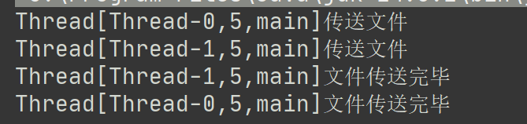  
 也可以使用匿名对象来实现：

```
public class Testclass {
    public static void main(String[] args){
        new Thread(new Runnable() {
            @Override
            public void run() {
                System.out.println(Thread.currentThread()+"传送文件");
                try {
                    Thread.sleep(1000);
                } catch (InterruptedException e) {
                    e.printStackTrace();
                }
                System.out.println(Thread.currentThread()+"文件传送完毕");
            }
        }).start();
        //创建第二个线程
        new Thread(new Runnable() {
            @Override
            public void run() {
                System.out.println(Thread.currentThread()+"传送文件");
                try {
                    Thread.sleep(1000);
                } catch (InterruptedException e) {
                    e.printStackTrace();
                }
                System.out.println(Thread.currentThread()+"文件传送完毕");
            }
        }).start();
    }
}
```

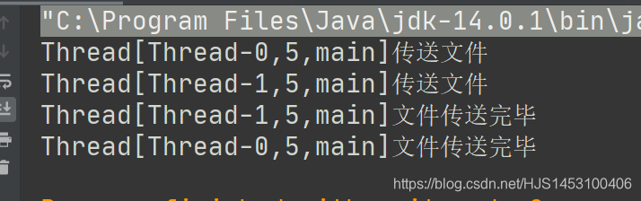

### 1.4.两种方法的区别

继承Thread有以下几个特点：

- 每一个对象都是一个线程，其对象有自己的成员变量；
- 继承了Thread类就不能再继承其它的类；

所以，“继承Thread”的使用常常用于实现**多个完全不同的线程**的对象处理和声明，同时也用于创建一个专用的线程类；  
   
  
 实现Runnable接口有以下几个特点：

- 当前类实现接口后仍然可以实现别的接口或继承其它类；
- 实现的方法更适合用来处理**共享数据**的问题，所直接创建的对象并不是一个线程，必须将其传入到Thread中对象才能运行，各个对象是否使用一个Runnable成员对象视情况而定；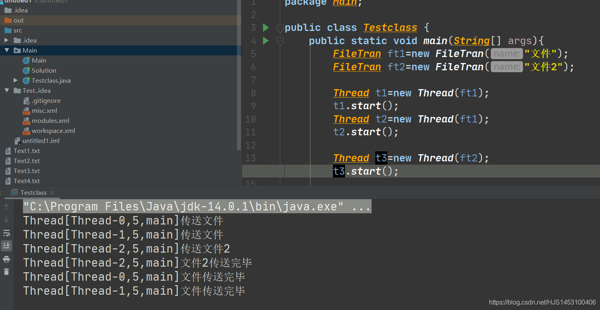

### 1.5.练习

模拟火车票售票窗口，总票为100张

**1.继承的方式实现：**

```
//模拟火车票售票窗口，总票为100张（继承方式实现）
public class Testclass {
    public static void main(String[] args){
        Windows w1=new Windows();
        Windows w2=new Windows();
        Windows w3=new Windows();

        w1.setName("窗口1");//setName为Thread中的;
        w2.setName("窗口2");
        w3.setName("窗口3");

        w1.start();
        w2.start();
        w3.start();

    }
}
class Windows extends Thread{
    static int ticket=100;//添加static声明为共用变量
    public void run(){
        while(true){
            if (ticket>0){
                System.out.println(Thread.currentThread().getName()+
                        "售出票号为"+ticket--);
            }else break;
        }
    }
}
```

**2.实现的方式实现**

```
//模拟火车票售票窗口，总票为100张（实现的方式实现）
public class Testclass {
    public static void main(String[] args){
        Windows w=new Windows();

        Thread w1=new Thread(w);
        Thread w2=new Thread(w);
        Thread w3=new Thread(w);

        w1.setName("窗口1");
        w2.setName("窗口2");
        w3.setName("窗口3");

        w1.start();
        w2.start();
        w3.start();

    }
}
class Windows implements Runnable{
    int ticket=100;//添加static声明为共用变量
    public void run(){
        while(true){
            if (ticket>0){
                System.out.println(Thread.currentThread().getName()+
                        "售出票号为"+ticket--);
            }else break;
        }
    }
}
```

  

## 二、生命周期

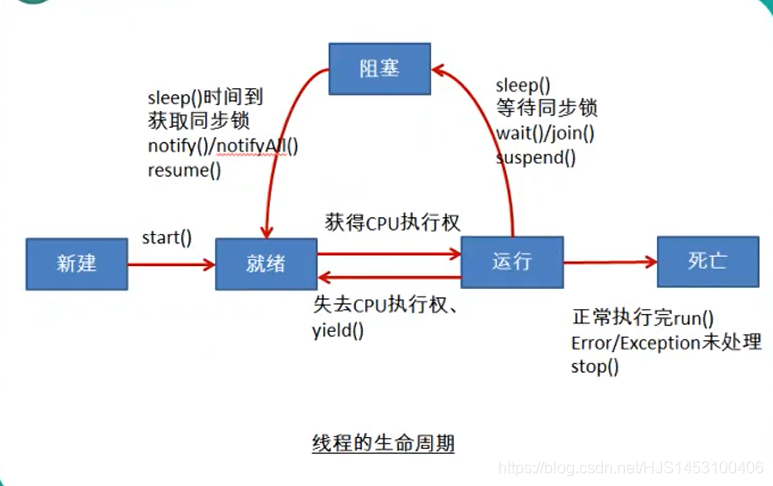

## 三、线程同步安全

### 3.1.线程协作安全

上面所练习的两种方法均存在错误——当线程抢到CPU资源后如果没有来得及**执行当前代码程序**便被挂起，当下一个线程进入后仍然可以操作**执行当前代码程序**  
 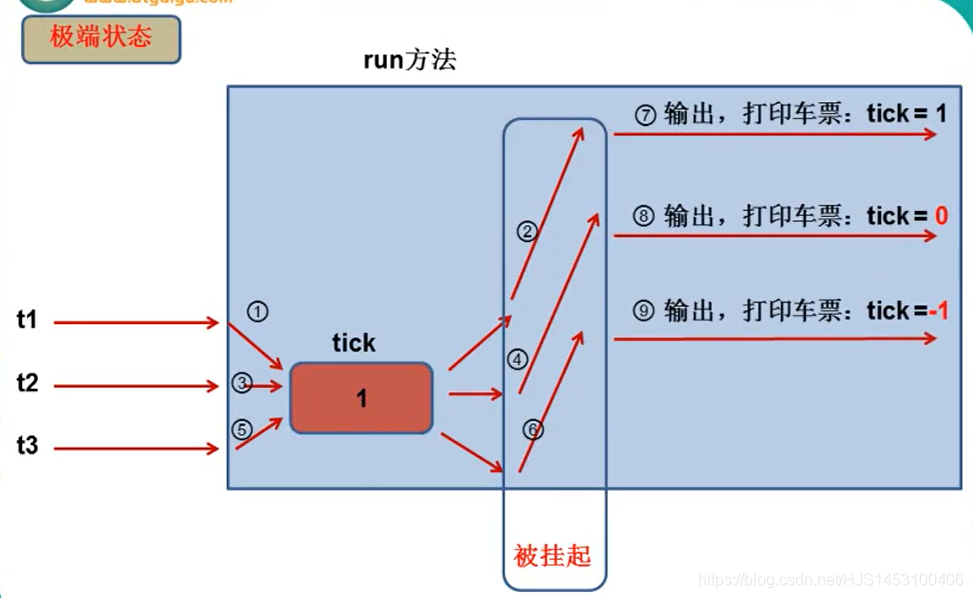  
 使用`Thread.currentThread().sleep(100)`使得线程的存在的隐患放大；

```
class Windows implements Runnable{
    int ticket=100;//添加static声明为共用变量
    public void run(){
        while(true){
            if (ticket>0){
                try {
                    Thread.currentThread().sleep(100);//睡眠0.1秒
                } catch (InterruptedException e) {
                    e.printStackTrace();
                }
                System.out.println(Thread.currentThread().getName()+
                        "售出票号为"+ticket--);
            }else break;
        }
    }
}
```

运行结果：  
 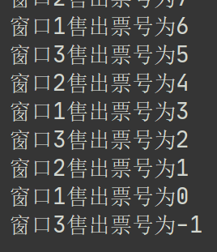  
   
  
 解决方法：使用`join()`方法；  
 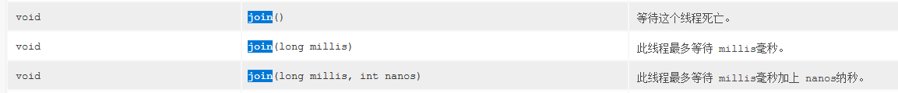

```
public class Testclass {
    public static void main(String[] args) throws Exception {//join需要异常处理
        Windows w=new Windows();
        Thread w1=new Thread(w);
        Thread w2=new Thread(w);
        Thread w3=new Thread(w);
        
        w1.setName("窗口1");
        w2.setName("窗口2");
        w3.setName("窗口3");
        w1.start();
        w1.join();//等待这个线程死亡。 
        w2.start();
        w3.start();
    }
}
```

运行结果：  
   
 可以明显看到，虽然解决了极端状态的隐患，但是这样一来所有的操作都是由`线程w1`来完成，其它的线程根本不参与，这违背了多线程的意义；

结论：`join()`方法多适用于完成不同工作的多线程操作，当下一线程的操作需要当前线程操作的**最终结果**才能完成时，应使用此方法；

### 3.2.线程同步安全

**确保Java程序的线程安全：线程的同步机制**

#### 3.2.1方法一：同步代码块

格式：

```
synchronized (同步锁对象/同步监视器) {
	//需要被同步的代码
}
```

同步监视器也称之为 **“锁”**， 哪个线程获得此监视器便可以执行代码块里面的代码；该监视器可以被任意一个对象充当,但是必须要**确保锁的唯一性**

模拟火车票售票窗口，总票为100张（实现的方式实现）

```
//模拟火车票售票窗口，总票为100张（实现的方式实现）
public class Testclass {
    public static void main(String[] args) {//join需要异常处理
        Windows w=new Windows();

        Thread w1=new Thread(w);
        Thread w2=new Thread(w);
        Thread w3=new Thread(w);

        w1.setName("窗口1");
        w2.setName("窗口2");
        w3.setName("窗口3");

        w1.start();
        w2.start();
        w3.start();
    }
}
class Windows implements Runnable{
    int ticket=100;//共用变量
    Object obj=new Object();//任意对象
    public void run(){

        while(true){

            synchronized (this) {//这里也可以写obj
                if (ticket>0){
                    try {
                        Thread.currentThread().sleep(10);
                    } catch (InterruptedException e) {
                        e.printStackTrace();
                    }
                    System.out.println(Thread.currentThread().getName()+
                            "售出票号为"+ticket--);
                }else break;
            }

        }
    }
}
```

#### 3.2.2方法二：同步方法

同步方法的核心：

```
public synchronized void f1(){
       //f1代码段
}
```

等价于

```
public void f1(){
    synchronized (this){
      //f1代码段
    }
}
```

同步方法：将操作共享数据的方法声明为**synchronized**， 即此方法为同步方法。

```
class Windows implements Runnable{
    int ticket=100;//共用变量
    Object obj=new Object();//任意对象

    public void run(){
        while(true){
            show();
        }
 }
public synchronized void show(){
        if (ticket>0){
            try {
                Thread.currentThread().sleep(10);
            } catch (InterruptedException e) {
                e.printStackTrace();
            }
            System.out.println(Thread.currentThread().getName()+
                    "售出票号为"+ticket--);
        }
    }
}
```

同步方法也有锁，锁为当前对象，继而在使用 **继承Thread类** 的时候不能用同步方法

### 3.3互斥锁

单例模式懒汉式使用同步机制优化；

```
//单例模式懒汉式
//优化线程安全，使用同步机制
class Singlen {
    private Singlen() {
    }

    private static Singlen instance = null;

    public static Singlen getInstance() {
        if (instance == null) {
            synchronized (Singlen.class) {//由于在static修饰的方法中，所以不能使用this
                //Singlen.class返回时是Class类的对象
                if (instance == null) {//
                    instance = new Singlen();
                }
            }
        }

        return instance;
    }
}
```

### 3.4练习


```
public class Testclass {
    public static void main(String[] args) {//join需要异常处理
        bank k=new bank();
        Thread k1=new Thread(k,"操作人1");
        Thread k2=new Thread(k,"操作人2");
        k1.start();
        k2.start();
    }
}
class bank implements Runnable{
    private int account;
    public void run(){
        synchronized (this){
        for (int i = 0; i <3 ; i++) {
            try {
                Thread.sleep(1000);
            } catch (InterruptedException e) {
                e.printStackTrace();
            }
            account+=1000;
            System.out.println(Thread.currentThread().getName()+"存入1000元后账户余额为"+account);
        }}
    }
}
```

运行结果：  
 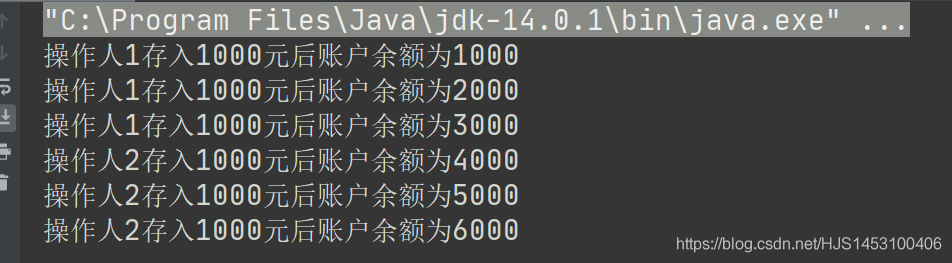

## 四、线程通信

### 4.1线程通信用到的方法

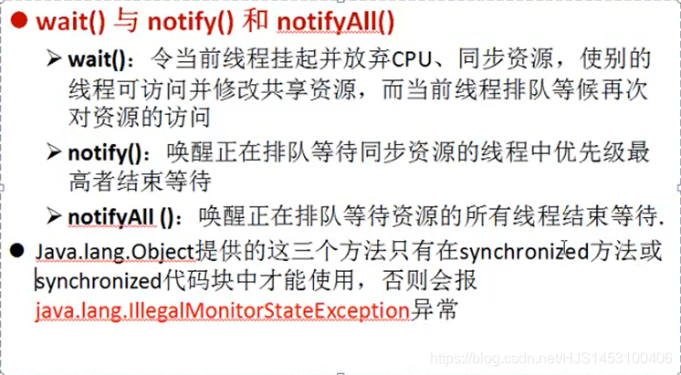

### 4.2练习


```
public class Testclass {
    public static void main(String[] args) {
        Number n=new Number();
        Thread n1=new Thread(n,"线程1");
        Thread n2=new Thread(n,"线程2");
        n1.start();
        n2.start();
    }
}
class Number implements Runnable {
    private int i=1;

    @Override
    public void run() {
        while(true){
            synchronized (this){
                notify();//唤醒wait()的进程
            if (i<=100){
                try {
                    Thread.sleep(100);
                } catch (InterruptedException e) {
                    e.printStackTrace();
                }
                System.out.println(Thread.currentThread().getName()+"打印"+i++);
                }else break;
                try {
                    wait();//进入休眠并释放当前的锁
                } catch (InterruptedException e) {
                    e.printStackTrace();
                }
            }

        }
    }
}
```

## 五、最终练习：生产者消费者问题

**题目**：  
 

```
class Clerk{
    int Product;

    public synchronized void addProduct() throws Exception {
       if (Product>=20){
           this.wait();
       }else {
           Product++;
           System.out.println(Thread.currentThread().getName()+"生产了第"+Product+"个产品");
           notifyAll();
       }
    }

    public synchronized void consumeProduct()throws Exception{
        if (Product<=0){
            this.wait();
        }else {
            System.out.println(Thread.currentThread().getName()+"消耗了第"+Product+"个产品");
            Product--;
            notifyAll();

        }
    }
}


class Productor implements Runnable{

    Clerk clerk;//创建一个店员的变量;

    public Productor(Clerk clerk){
        this.clerk=clerk;
    }


    public void run() {
        System.out.println("生产者开始生产产品");
        while (true){
            try {
                Thread.currentThread().sleep(1000);
            } catch (InterruptedException e) {
                e.printStackTrace();
            }

            try {
                clerk.addProduct();
            } catch (Exception e) {
                e.printStackTrace();
            }
        }
    }
}

class Consumer implements Runnable{
    Clerk clerk;
    public Consumer(Clerk clerk){
        this.clerk=clerk;
    }
    @Override
    public void run() {
        System.out.println("消费者开始消费产品");
        while (true){
            try {//处理wait（）抛出的异常
                Thread.currentThread().sleep(1000);
            } catch (InterruptedException e) {
                e.printStackTrace();
            }

            try {
                clerk.consumeProduct();
            } catch (Exception e) {
                e.printStackTrace();
            }
        }
    }
}

public class Testclass {
    public static void main(String[] args) {
      Clerk clerk=new Clerk();
      Productor p1=new Productor(clerk);
      Consumer c1=new Consumer(clerk);

      Thread T1=new Thread(p1,"生产者1");
      Thread T2=new Thread(c1,"消费者1");

      T1.start();
      T2.start();
    }
}
```

运行结果：  
 