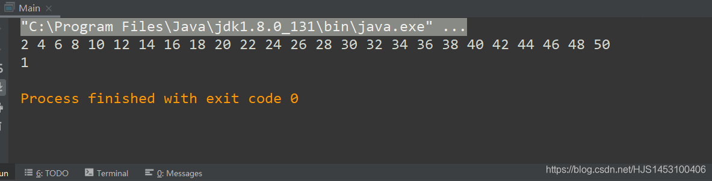

## 模板设计模式

由“抽象”派生出来的一种设计模式

#### 主要作用：

将主类（伪·根父类）利用abstract关键字设置为抽象的模式，将一些已经确定要的实现方法放入主类中，其它的暴露出去交给子类根据情况自己设计；

简单来说，就是将父类设置为抽象类，但是保留所有子类都会执行共同操作（方法）。同时也为多个形态不同的子类提供一个（或多个）用于在子类中重写方法的“模板”；

#### 引入题目：

**设计一个抽象的父类，使得无论子类方法中进行什么操作都要返回该操作的运行时间（微秒）；**

这里举例说明，就将“无论什么操作”定义为寻找50以内2的倍数；

代码：

```
public class Main {
    public static void main(String[] args) {
        Person xm=new Person();
        xm.time();
    }
}

abstract class Time{//抽象的父类

    public abstract void code();
    //抽象的方法，“模板”，声明只是为了提供子类可以重写的模板，用于实现“无论什么操作”；

    public void time(){//确定要执行的方法，返回操作执行时间；
        long start=System.currentTimeMillis();
        this.code();
        long end=System.currentTimeMillis();
        System.out.println(end-start);
    }

}

class Person extends Time{//子类自己的“无论什么操作”
    public void code(){
        for (int i = 1; i <=50 ; i++) {
            if(i%2==0) System.out.print(i+" ");
        }
        System.out.println();
    }
}
```

输出结果：  
