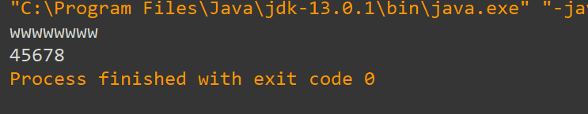

### 重载

```
方法重载：
1.重载的方法必须在同一个类中；
2.方法名必须相同；
3.方法的参数不同：(1).参数个数（2）参数类型不能一一对应相同 //满足一个即可；
4.重载和返回值类型无关；
```

```
public class Main {

    public static void main(String[] args) {
        String name;
        int a=1;
        int b=2;
        int c=3;
        System.out.println(Max(a,b));
        System.out.println(Max(a,b,c));

    }
    public static int Max(int a,int b){
        return (a>b)? a:b;
    }
    public static int Max(int a,int b,int c){
        return (Max(a,b)>c)? Max(a,b):c;//方法可以互相调用
    }
}
```

### 可变参数的形参

```
可变参数个数的形参的使用：
1.格式：（类型....形参名）
2.个数：0~无穷
3.注意事项：Java将可变个数的形参与数组视为一致（但并不是说完全代表了数组，不过他们不能一起出现）
4.如果“方法”过程中使用了可变个数的形参，一定要放在方法的后面；
```

代码：

```
   public class Main {
    public static void main(String[] args)
    {
      main2();//无参数 1.
      main2(3,4,5,6,7,8);//多个参数 2.
    }
    public static void main2() //调用 1.
    {
        System.out.println("wwwwwwww");
    }
    public static void main2(int a) //无调用
    {
        System.out.println(a);
    }
    public static void main2(int j,int...a)//，调用 2.（遍历的方法和数组一样）
    {
        for (int i = 0; i <a.length ; i++) {
            System.out.print(a[i]);

        }
    }
    /*public static void main2(int[] a)//不能和数组同时出现，否则会报错，这里注释掉；
    {
        System.out.println(a[0]);
    }*/
}
```

输出结果：  


小总结：可变个数的形参的传递是在5.0版本之后新加的，是建立在方法的重载上的。在某些时候，如计算多个数的和，就不需要一个个去根据参数的个数去写重载方法，可以直接使用“可变”

例子：

```
public class Main {
    public static void main(String[] args)
    {
        main2(2,3,4,5,6,7,8,10);
    }
    public static void main2(int...a)
    {   int sum=0;
        for (int i = 0; i <a.length ; i++) {
            sum+=a[i];
        }
        System.out.println(sum);
    }

}
```

2020年2月11日 第一次修改；