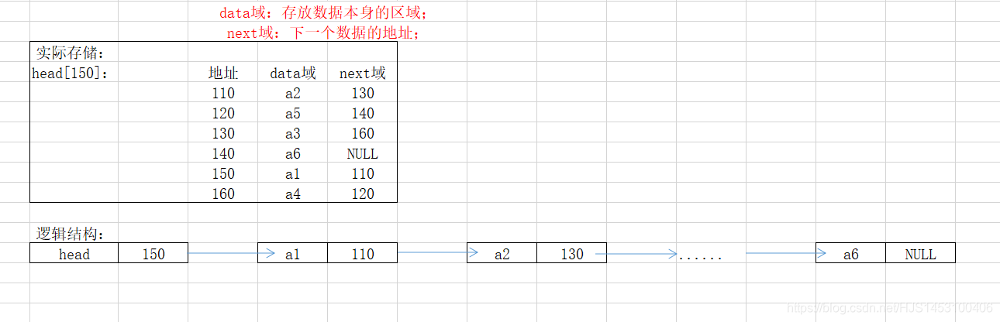
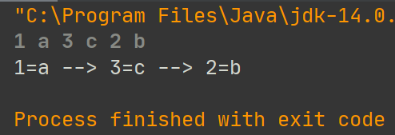
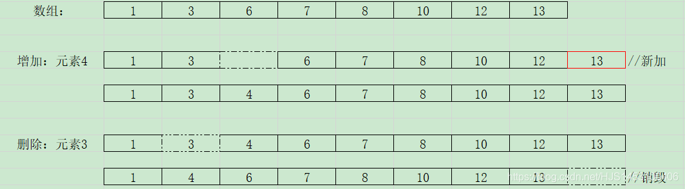
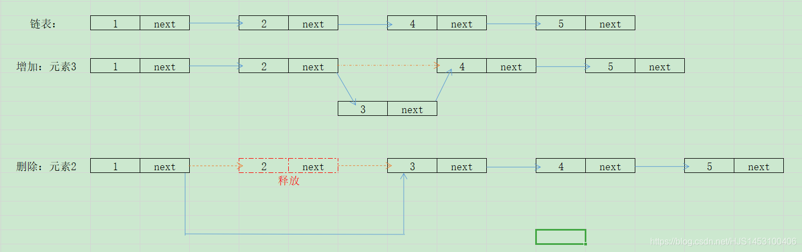
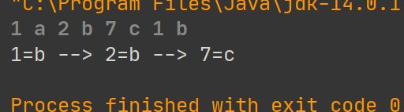
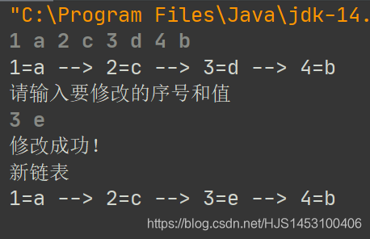
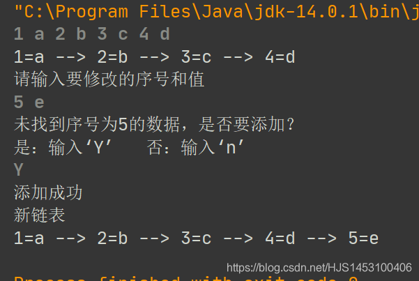
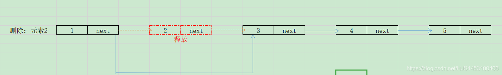
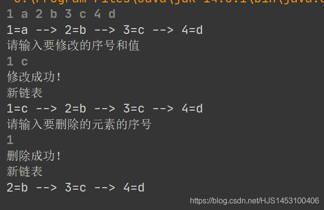

## 一、单链表

链表是线性结构中非常重要的一块内容，核心内容是将存在于存储空间中多个零碎的不相干的空间利用“**指针**”将其“**链**”到一起，形成一个理论上的线性结构；

其分支有很多，但无外乎就是有没有带头节点、静态还是动态、单项还是双向…

虽然有这么多变化，但归根结底来说总算是换汤不换药，掌握链表的一些核心知识，其他的自然水到渠成；

首先，来聊单链表，聊什么样的？ **带头节点的单链表**；

用一个简单的图便可说明其存储原理  
  
链表的实现在C/C++中一般使用结构体，在Java中则使用类；

好了，可以开始写了；

### 第一操作：无序链表的创建

  

1.首先，创建一个专属于**节点**的类，里面包含所需要的数据

```
class Node{
    public int no;//编号，如果要初步实现no和name设置一个即可;
    public String name;
    public Node Next;//Node型的变量，用于存储下一个节点的地址;

    public Node(int no,String name){
        this.no=no;
        this.name=name;
    }

    @Override
    public String toString() {
        return no+" = "+name;
    }
}
```

2.创建一个专属于链表的类，将多个节点以特点的方式**链**起来，并提供一些方法；

```
cclass Singlelist {
    private Node head=new Node(0," ");//创建头节点;

    public void add(Node a){//添加节点
        //头节点不可动，新加辅助节点
        Node temp=head;
        //判断当前节点是否为尾节点
        while(true){
            if (temp.Next==null) break;//如果是，退出;
            temp=temp.Next;//如果不是，后移;
        }

        temp.Next=a;//最后一个节点指向新节点;
    }

    //显示链表
    public void show(){
        //先判度链表是否为空
        if(head.Next==null) {System.out.println("链表无数据");return;}

        Node temp1=head.Next;//头节点不打印,所以先后移一位；

        while(temp1.Next!=null){
            System.out.print(temp1+" --> ");//为了输出结果好看，这里做了一些处理
            temp1=temp1.Next;
        } System.out.println(temp1);


    }
}
```

3 加入输入的操作，与键盘建立交互，便可以开始测试了  
（完整代码）

```
import java.util.Scanner;

public class List {
    public static void main(String[] args){
        //创建链表
        Singlelist list =new Singlelist();
        
        //添加节点
        Scanner sc =new Scanner(System.in);
        list.add(new Node(sc.nextInt(),sc.next()));
        list.add(new Node(sc.nextInt(),sc.next()));
        list.add(new Node(sc.nextInt(),sc.next()));
        list.show();

    }
}
class Singlelist {
    private Node head=new Node(0," ");//创建头节点;

    public void add(Node a){//添加节点
        //头节点不可动，新加辅助节点
        Node temp=head;
        //判断当前节点是否为尾节点
        while(true){
            if (temp.Next==null) break;//如果是，退出;
            temp=temp.Next;//如果不是，后移;
        }

        temp.Next=a;//最后一个节点指向新节点;
    }

    //显示链表
    public void show(){
        //先判度链表是否为空
        if(head.Next==null) {System.out.println("链表无数据");return;}

        Node temp1=head.Next;//头节点不打印

        while(temp1.Next!=null){
            System.out.print(temp1+" --> ");//为了输出结果好看，这里做了一些处理
            temp1=temp1.Next;
        } System.out.println(temp1);


    }
}
class Node{
    public int no;
    public String name;
    public Node Next;

    public Node(int no,String name){
        this.no=no;
        this.name=name;
    }

    @Override
    public String toString() {
        return no+"="+name;
    }
}
```

输出结果：  
  
可以看到，**此时的单链表顺序就是我们添加元素时的顺序**；

那有没有什么办法可以让顺序变成我们指定的呢？（比如按照前面的数字排序）

答：有,

### 第二操作：有序链表的创建

  

首先，先扯一些看似不相关的内容~~

很清楚的记得大二开数据结构的时候（那时候用的是C语言），那位“很厉害”的老师全程讲理论，唯一可见的代码就是伪码，这样当然学不好，起码我是这样。隐约记得在讲链表的这一块的时候，提到了数据的增、删、改、查，与链表相对应的是数组；最后也是隐约记得——

**增、删，链表占优势；改、查，数组占优势**

改、查先不谈，只说增、删。

对于**增**和**删**，数组做的是先找到要修改的元素的位置（这一点比链表快），如果是增，则先在数组的末尾新加一个空间，再将该处之后的数据全部向**后**移动一个单位，新数据存放于空出的这个单位；同样删也是这个道理，找到元素，将其后面的全部数据向**前**移动一个单位（将要删除的数据覆盖），最后释放末尾的空间；  
  
可以看出，无论是增还是删，单是 **“移动后面的元素”** 就已经是灾难，数据小了还好说，但如果数据很多呢？要修改的位置靠后还好说，但如果是第一个呢？好吧，cpu什么都别做了，就处理这个数组吧~~

**This led to disaster！！！**

相较于数组，链表的增和删就显得容易的多

增：插入位置的前驱节点的Next域指向自己；自己的Next域指向下一个节点；  
删：被删除节点的前一个节点的Next域之后被删节点的后一个节点，释放被删除节点；  
  
好了，说这样，其实也不都是废话；知道这些以后，我们基本已经实现了 **“顺序排列”**，为什么这么说？  
  
Because:有序链表的核心就是按照用户定义的属性的顺序将结点**插入**到合适的位置，而不再是添加在链表最后

为了方便说明，重新创建一个类，用于插入有顺序节点：

```
public void addByorder(Node a){
        Node temp2=head;//同样的，头指针不能移动；
        boolean f=true;//是否可以添加

        while (true){
            if (temp2.Next==null) break;
            else if(temp2.Next.no==a.no) 
            //如果序号一样，新元素覆盖旧元素
            {temp2.Next.name=a.name;f=false;break;}
            else if (temp2.Next.no>a.no) break;//按照no排序，从小到大
            temp2= temp2.Next;
        }
        if (f){
            a.Next=temp2.Next;//指向后一个节点
            temp2.Next=a;//前驱节点指向自己
        }
    }
```

这里重点说明一下这段代码的点睛之笔——第三行：`boolean f=true;`

为什么默认值设置为true，false可不可以？可以，但是ture更好；

因为如果在while循环中没有找到合适的插入点，即表示为该节点的no值大于链表中的任何一个；

不是不能插入链表，而是应该插入到最后；

`f`没有在wihle中被修改，所以也可以执行最后一个if，而退出while后的指针`temp2`已然指向了遍历的尾节点，所以，在该节点后面添加；

完整代码：

```
import java.util.Scanner;

public class List {
    public static void main(String[] args){
        //创建链表
        Singlelist list =new Singlelist();
        //添加节点
        Scanner sc =new Scanner(System.in);


        list.addByorder(new Node(sc.nextInt(),sc.next()));
        list.addByorder(new Node(sc.nextInt(),sc.next()));
        list.addByorder(new Node(sc.nextInt(),sc.next()));
        list.addByorder(new Node(sc.nextInt(),sc.next()));
        list.show();

    }
}
class Singlelist {
    private Node head=new Node(0," ");//创建头节点;

    /*public void add(Node a){//添加节点
        //头节点不可动，新加辅助节点
        Node temp=head;
        //判断当前节点是否为尾节点
        while(true){
            if (temp.Next==null) break;//如果是，退出;
            temp=temp.Next;//如果不是，后移;
        }

        temp.Next=a;//最后一个节点指向新节点;
    }*/

    public void addByorder(Node a){
        Node temp2=head;
        boolean f=true;//是否可以添加

        while (true){
            if (temp2.Next==null) break;
            else if(temp2.Next.no==a.no) {temp2.Next.name=a.name;f=false;break;}//新元素覆盖
            else if (temp2.Next.no>a.no) break;

            temp2= temp2.Next;
        }
        if (f){
            a.Next=temp2.Next;//指向后一个节点
            temp2.Next=a;//前驱节点指向自己
        }

    }

    //显示链表
    public void show(){
        //先判度链表是否为空
        if(head.Next==null) {System.out.println("链表无数据");return;}

        Node temp1=head.Next;//头节点不打印

        while(temp1.Next!=null){
            System.out.print(temp1+" --> ");//为了输出结果好看，这里做了一些处理
            temp1=temp1.Next;
        } System.out.println(temp1);


    }
}
class Node{
    public int no;
    public String name;
    public Node Next;

    public Node(int no,String name){
        this.no=no;
        this.name=name;
    }

    @Override
    public String toString() {
        return no+"="+name;
    }
}
```

测试结果：  


### 第三操作：链表的查、改、删

前面有说到，相较于数组，链表的**增**、**删**明显要快；

但链表不是万能的（不然要数组干嘛？），对于数据的 **查找** 和 **修改**，链表可就不如数组啦！

这里就不画图了，文字说明：

```
现在，有一段长度为10242567413874151的数据；

目标1：找到第1个数据
链表：遍历查找1次——耗时1秒
数组：找到下标为0的元素——耗时1秒

目标1：找到第10个数据
链表：遍历查找10次——耗时10秒
数组：找到下标为9的元素——耗时1秒

目标1：找到第1234个数据
链表：遍历查找1234次——耗时1234秒
数组：找到下标为1233的元素——耗时1秒
......
```

由于修改是基于查找，所有就不再比了，结果——数组胜！

好了，既然比赛结束了，那回归正题，这场比赛说明了什么问题？

答案是—— —— **链表查找和修改是需要遍历的！**

鼓掌👏👏👏👏~

咳~请收起你们要寄“信”的手。

虽然链表的查找和修改很麻烦，但还是要学的；

这里说明一点，链表的**修改**在 **遍历（查找）** 的基础上才可实现的，前面的**第二操作：有序链表的创建**中其实就已经涉及到，遍历的核心代码只有一条`head=head.Next`,具体的步骤会在修改里面详细的提到，所以**查找**不单独写（不值得再浪费篇幅），这里直接写**修改**~

##### ①链表中节点的修改

同样的，新建一个类作为**修改元素**的类：

```
public void Update(Node a){

        if (head.Next==null) {System.out.println("当前链表为空，无可修改的数据");return;}
        boolean Up=false;//判断是否可以修改
        Node temp=head.Next;//头节点不能移动，所以找一个可以移动的替代品
        //对于查找和删除，我们没有必要从头节点开始，因为针对的是已有节点的链表
        //而对于新建（添加）和删除来说来说则必须从头节点(head)开始

        while(true){

            if (temp==null) break;//遍历结束

            if (temp.no==a.no){
                Up=true;
                break;
            }
            temp=temp.Next;//指针的后移，起到遍历的效果（查找）
        }
        if (Up){temp.name=a.name;System.out.println("修改成功！");}
        else {//以下可以自定义.....我觉得这样好玩~~
            System.out.println("未找到序号为"+a.no+"的数据，是否要添加？");
            System.out.println("是：输入‘Y’   否：输入‘n’");
            Scanner sc =new Scanner(System.in);
            if (sc.next().charAt(0)=='Y'){
                addByorder(a);
                System.out.println("添加成功");
            }
        }
    }
```

完整代码：

```
import java.util.Scanner;

public class List {
    public static void main(String[] args){
        //创建链表
        Singlelist list =new Singlelist();
        //添加节点
        Scanner sc =new Scanner(System.in);


        list.addByorder(new Node(sc.nextInt(),sc.next()));
        list.addByorder(new Node(sc.nextInt(),sc.next()));
        list.addByorder(new Node(sc.nextInt(),sc.next()));
        list.addByorder(new Node(sc.nextInt(),sc.next()));
        list.show();
        System.out.println("请输入要修改的序号和值");
        list.Update(new Node(sc.nextInt(),sc.next()));
        System.out.println("新链表");
        list.show();

    }
}
class Singlelist {
    private Node head=new Node(0," ");//创建头节点;

    /*public void add(Node a){//添加节点
        //头节点不可动，新加辅助节点
        Node temp=head;
        //判断当前节点是否为尾节点
        while(true){
            if (temp.Next==null) break;//如果是，退出;
            temp=temp.Next;//如果不是，后移;
        }

        temp.Next=a;//最后一个节点指向新节点;
    }*/

    public void addByorder(Node a){
        Node temp2=head;
        boolean f=true;//是否可以添加

        while (true){
            if (temp2.Next==null) break;
            else if(temp2.Next.no==a.no) {temp2.Next.name=a.name;f=false;break;}//新元素覆盖
            else if (temp2.Next.no>a.no) break;

            temp2= temp2.Next;
        }
        if (f){
            a.Next=temp2.Next;
            temp2.Next=a;
        }

    }

    //显示链表
    public void show(){
        //先判度链表是否为空
        if(head.Next==null) {System.out.println("链表无数据");return;}

        Node temp1=head.Next;//头节点不打印

        while(temp1.Next!=null){
            System.out.print(temp1+" --> ");//为了输出结果好看，这里做了一些处理
            temp1=temp1.Next;
        } System.out.println(temp1);


    }

    public void Update(Node a){

        if (head.Next==null) {System.out.println("当前链表为空，无可修改的数据");return;}
        boolean Up=false;//判断是否可以修改
        Node temp=head.Next;

        while(true){

            if (temp==null) break;//遍历结束

            if (temp.no==a.no){
                Up=true;
                break;
            }
            temp=temp.Next;
        }
        if (Up){temp.name=a.name;System.out.println("修改成功！");}
        else {
            System.out.println("未找到序号为"+a.no+"的数据，是否要添加？");
            System.out.println("是：输入‘Y’   否：输入‘n’");
            Scanner sc =new Scanner(System.in);
            if (sc.next().charAt(0)=='Y'){
                addByorder(a);
                System.out.println("添加成功");
            }
        }
    }
}
class Node{
    public int no;
    public String name;
    public Node Next;

    public Node(int no,String name){
        this.no=no;
        this.name=name;
    }

    @Override
    public String toString() {
        return no+"="+name;
    }
}
```

测试结果：  
  


ok，趁热，我们继续谈**删除**

##### ②链表中节点的删除

删除节点思路也很简单，并且之前也提到过：

```
1.找到要删除的节点
2.使该节点的前一个结点指向该节点的后一个节点
3.销毁这个节点
```

  
有一个提醒，当前使用的链表的单向的链表（只有一个头节点，没有尾节点），所有我们要找到的其实是**欲被删除节点的前一个节点**，而后用该节点的`.next`来表示欲被删除的节点;

同样的，造一个类来说明

```
public void Remover(int a){//序号删除不必用节点类型;
        if (head.Next==null) {System.out.println("该链表为空，无可删除数据");return;}

        Node temp4=head;//不是head.next,因为第一个节点也存在着被删除的可能
        boolean f=false;//判断是否有可删除的节点
        while(true){
            if (temp4.Next.no==a){
                f=true;
                break;
            }
            temp4=temp4.Next;
        }
        if (f){
            temp4.Next=temp4.Next.Next;//核心代码
            System.out.println("删除成功！");
        }else {System.out.println("未找到编号为"+a+"的元素或该元素已被删除！");}
    }
}
```

诶？？？不是说还需要将节点销毁掉吗？怎么没有一条代码可以实现？  
这个，要感谢先辈，在Java中增加了一个机制——**垃圾回收机制**  
程序运行结束后，自己就会销毁啦~

测试一下：  
  
好了，到此位置，链表的基础知识就差不多了，附带一份完整的程序代码：

```
import java.util.Scanner;

public class List {
    public static void main(String[] args){
        //创建链表
        Singlelist list =new Singlelist();
        //添加节点
        Scanner sc =new Scanner(System.in);


        list.addByorder(new Node(sc.nextInt(),sc.next()));
        list.addByorder(new Node(sc.nextInt(),sc.next()));
        list.addByorder(new Node(sc.nextInt(),sc.next()));
        list.addByorder(new Node(sc.nextInt(),sc.next()));
        list.show();
        System.out.println("请输入要修改的序号和值");
        list.Update(new Node(sc.nextInt(),sc.next()));
        System.out.println("新链表");
        list.show();
        System.out.println("请输入要删除的元素的序号");
        list.Remover(sc.nextInt());
        System.out.println("新链表");
        list.show();

    }
}
class Singlelist {
    private Node head=new Node(0," ");//创建头节点;

    /*public void add(Node a){//添加节点
        //头节点不可动，新加辅助节点
        Node temp=head;
        //判断当前节点是否为尾节点
        while(true){
            if (temp.Next==null) break;//如果是，退出;
            temp=temp.Next;//如果不是，后移;
        }

        temp.Next=a;//最后一个节点指向新节点;
    }*/

    public void addByorder(Node a){
        Node temp2=head;
        boolean f=true;//是否可以添加

        while (true){
            if (temp2.Next==null) break;
            else if(temp2.Next.no==a.no) {temp2.Next.name=a.name;f=false;break;}//新元素覆盖
            else if (temp2.Next.no>a.no) break;

            temp2= temp2.Next;
        }
        if (f){
            a.Next=temp2.Next;
            temp2.Next=a;
        }

    }

    //显示链表
    public void show(){
        //先判度链表是否为空
        if(head.Next==null) {System.out.println("链表无数据");return;}

        Node temp1=head.Next;//头节点不打印

        while(temp1.Next!=null){
            System.out.print(temp1+" --> ");//为了输出结果好看，这里做了一些处理
            temp1=temp1.Next;
        } System.out.println(temp1);


    }

    public void Update(Node a){

        if (head.Next==null) {System.out.println("当前链表为空，无可修改的数据");return;}
        boolean Up=false;//判断是否可以修改
        Node temp=head.Next;

        while(true){

            if (temp==null) break;//遍历结束

            if (temp.no==a.no){
                Up=true;
                break;
            }
            temp=temp.Next;
        }
        if (Up){temp.name=a.name;System.out.println("修改成功！");}
        else {
            System.out.println("未找到序号为"+a.no+"的数据，是否要添加？");
            System.out.println("是：输入‘Y’   否：输入‘n’");
            Scanner sc =new Scanner(System.in);
            if (sc.next().charAt(0)=='Y'){
                addByorder(a);
                System.out.println("添加成功");
            }
        }
    }
    public void Remover(int a){//序号删除不必用节点类型;
        if (head.Next==null) {System.out.println("该链表为空，无可删除数据");return;}

        Node temp4=head;//不是head.next,因为第一个节点也存在着被删除的可能
        boolean f=false;//判断是否有可删除的节点
        while(true){
       	    if (temp4.Next==null) break;
            if (temp4.Next.no==a){
                f=true;
                break;
            }
            temp4=temp4.Next;
        }
        if (f){
            temp4.Next=temp4.Next.Next;
            System.out.println("删除成功！");
        }else {System.out.println("未找到编号为"+a+"的元素或该元素已被删除！");}
    }
}
class Node{
    public int no;
    public String name;
    public Node Next;

    public Node(int no,String name){
        this.no=no;
        this.name=name;
    }

    @Override
    public String toString() {
        return no+"="+name;
    }
}
```

over~