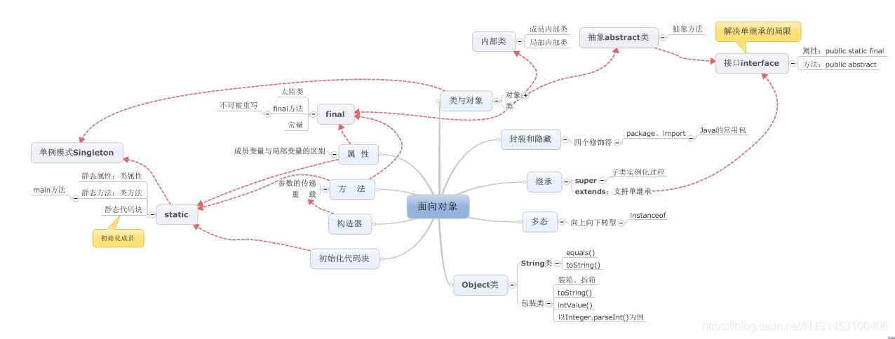
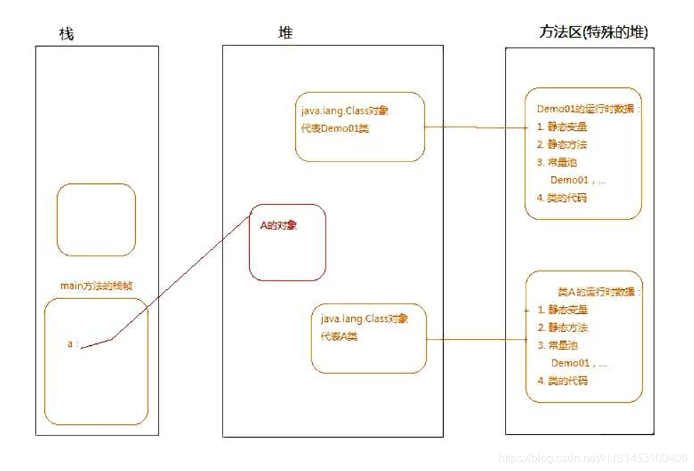

## 面向对象



**面向对象的三条主线：**  
 1.类和类的组成  
 2.面向对象的三大特性  
 3.其他关键及

  

### 一、类和类的组成

#### 1.概念

对于Java来说，程序的设计无外乎就是“**类**”的设计，从代码角度来看，类与类之间的架构为“并列”的关系，但是从运行的角度来看，类与类之间的关系有**关联**、**集成**、**聚合**等关系。

```
class A{
}
class b{
 A b=new A();
}
```

  

#### 2.类的成分：

类的成分主要有：**属性**、**方法**、**构造器**、**代码块**、**内部类**

##### 2.1 属性：

[详细的博客链接](https://blog.csdn.net/HJS1453100406/article/details/104189365)

1.变量的分类：成员变量（属性、Field）**VS** 局部变量（方法的形参、方法内部、代码块内部）

2.变量的类型：基本数据类型（8中）**VS** 引用数据类型（数组、类、接口 （初始值都为null））

3.属性声明的格式：修饰符 数据类型 变量名 = 所赋予的值；//java是强数据类型语言

4.对属性赋值的操作：1.默认初始化、2.显示的初始化、3.代码块初始化、4.构造器初始化、5.调用方法、属性进行赋值。

  

##### 2.2方法

[详细的博客链接](https://blog.csdn.net/HJS1453100406/article/details/104293872)

1.格式：修饰符 （可选：关键字（static、final、abstract）） 返回值类型 方法名 （形参列表）{//方法体}

```
public static void eat(int x){
          //方法体
        }
```

2.方法的重载(overload)（多个同名不同参的方法）**VS** 方法的重写(override overwrite)（子类中同名同参不同体的方法）

3.方法的参数传递机制：值传递

##### 2.3构造器

[详细的博客链接](https://blog.csdn.net/HJS1453100406/article/details/104318638)

1.作用 ：创建类的对象、初始化对象的成员变量

2.构造器具有重载的特性

```
class A{
    public A(){
        
    }
    public A(int x){
        
    }
}
```

  

##### 2.4代码块

[详细的博客链接](https://blog.csdn.net/HJS1453100406/article/details/104606029)

①.主要作用：用来初始化类的成员变量

2.分类：静态代码块（static）**VS** 非静态代码块

```
class  A{
   static int a;
   static String B;

    {
        a=4;
        B="hhhh";
    }

    static{//只能修饰静态的属性
        a=5;
        B="kkkk";
    }
}
```

##### 2.5内部类

[详细的博客链接](https://blog.csdn.net/HJS1453100406/article/details/106047033)

1.分类：成员内部类（static的成员 vs 非static的成员） **VS** 局部内部类（方法内部声明的类）

2.需要掌握  
 ①如何创建成员内部类的对象（如：创建Bird类和Dog类的对象）  
 ②如何区分调用外部类、内部类的变量(尤其是变量重名时)  
 ③局部内部类的使用

#### 3.类的初始化（创建对象）

  

##### 3.1如何创建类的对象

```
public class ceshi {
    public static void main(String[] args){
        Person1 a=new Person1();
    }
}
class Person1{

}
```

##### 3.2内存解析

①栈：存放局部变量、对象的引用名、数组的引用名；  
 ②堆：存放实例化（new出来的东西）；  
 ③方法区：（字符串常量池）  
 ④静态域：存放类中的静态变量  
 

##### 3.3子类对象实例化全过程

[详细的博客链接](https://blog.csdn.net/HJS1453100406/article/details/104390755?ops_request_misc=%257B%2522request%255Fid%2522%253A%2522158943831419725211922951%2522%252C%2522scm%2522%253A%252220140713.130102334.pc%255Fblog.%2522%257D&request_id=158943831419725211922951&biz_id=0&utm_medium=distribute.pc_search_result.none-task-blog-2~blog~first_rank_v2~rank_v25-1-104390755.nonecase&utm_term=%E5%AD%90%E7%B1%BB)

### 二、面向对象的三大特性

  

#### 1 .封装性

[详细的博客链接（封装和多态）](https://blog.csdn.net/HJS1453100406/article/details/104418764)

**操作**：  
 ① 私有化类的成员变量，外部只能通过get和set方法来调用和修改；  
 ②可以对类的其他结构进行封装；  
 ③权限修饰符：public 、protected、缺省、private；

#### 2.多态性

①方法的重载与重写，子类对象的多态性；

②子类对象多态性的使用：虚拟方法调用；

③向上转型 向下转型 Student s = (Student)p; //建议在向下转型之前： if ( p instanceof Student)避免出现ClassCastException的异常

#### 3.继承性

[详细的博客链接](https://blog.csdn.net/HJS1453100406/article/details/104390755)

①通过让一个类A继承一个类B，就可以使得A类获得B类中的结构（属性、方法、构造器）

②Java中的类继承是单继承的

### 三、其他关键字

1.this:修饰属性、方法、构造器 。表示：当前对象或当前正在创建的对象

2.super：修饰属性、方法、构造器。显式的调用父类的相应的结构，尤其是子父类有重名的方法、属性

3.static : 修饰属性、方法、代码块、内部类。随着类的加载而加载!

4 . final：修饰类、属性、方法。表示“最终的”

5.abstract : 修饰类、方法

6.interface：表示是一个接口，（接口是与类并列的一个结构）。类与接口之间同时“implements”发生关系。

7.package打包、import 引入包。