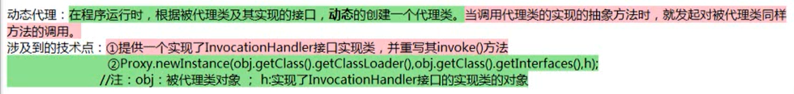
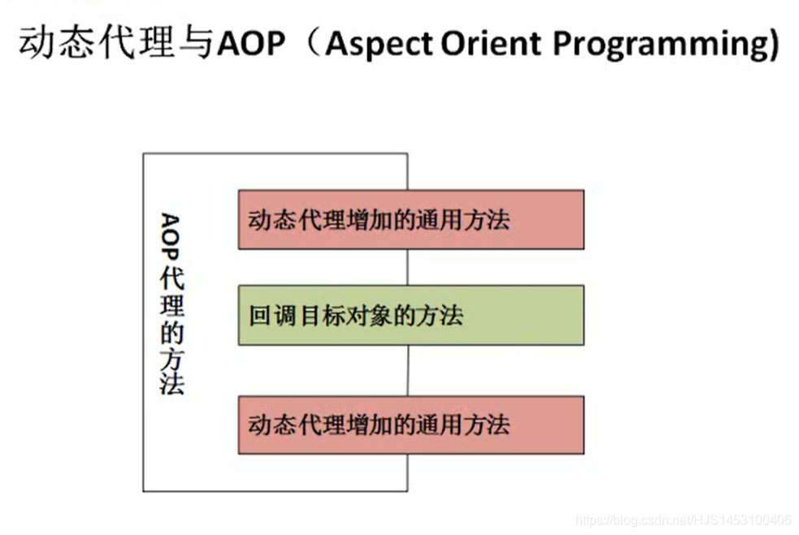
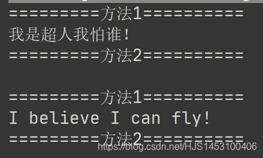

#### 反射

- [一、概括](#_1)
- - - [1. java.lang.Class:是反射的源头；](#1_javalangClass_5)
    - [2.如何获取Class的实例（4种）](#2Class4_18)
    - [3.关于类加载器](#3_50)
    - [4.需要掌握](#4_82)
- [二、通过Class获得实例以后可以做的事情](#Class_120)
- - - [1.创建运行时类的对象](#1_122)
    - [2.通过反射获取类的完整结构](#2_209)
    - - [1.获取当前类和父类声明为public的属性](#1public_210)
      - [2.获取当前类本身的所有属性](#2_221)
      - [3.获取当前类本身的所有属性详细信息](#3_233)
      - [4.获取当前类和父类声明为public的方法](#4public_258)
      - [5.获取当前类本身所有的方法](#5_269)
      - [6.获取当前类本身所有方法的详细信息](#6_280)
      - [7.获取当前类所有的构造器](#7_322)
      - [8.获取当前类运行时类的父类](#8_331)
      - [9.获取带泛型的父类](#9_338)
      - [10.获取父类的泛型](#10_345)
      - [11.获取实现的接口](#11_357)
      - [12.获取所在的包](#12_366)
      - [13.获取类的注解](#13_373)
- [三、动态代理](#_384)
- - - [1.代理](#1_385)
    - [2.静态代理](#2_393)
    - [3.动态代理](#3_440)
    - [4.动态代理与AOP](#4AOP_520)

## 一、概括

正常方法：引入“包类”的名称 ——> 通过new实例化对象 ——> 取得实例化对象  
 反射方式：实例化对象 ——> getClass()方法 -->得到完整的“包类”的名称

#### 1. java.lang.Class:是反射的源头；

- 1.每次创建一个类，通过编译（java.exe），生成对应的.class文件。
- 2.之后我们使用java.exe加载程序（JVM的类加载器完成的）
- 3.此.class文件加载到内存以后就是一个“运行时类”，存放在缓存区，其本身就是一个Class的实例  
   例如：Class clazz =String.class;实例化一个Class的对象指向String的实体
- 4.每一个运行时类只加载一次（第二次直接调用缓存中的实例）
- 5.有了Class的实例以后，我们才可以进行如下的操作：  
   1)创建运行时类的对象  
   2)获取对应的运行时类的完整结构（属性、方法、构造器、内部类、父类、所在的包、异常、注解等…）  
   3)调用对应的运行时类的指定结构（属性、方法、构造器）  
   4)反射的应用：动态代理

#### 2.如何获取Class的实例（4种）

- 1)调用运行时类本身的.class属性  
   例：

  ```
  Class clazz=Person.class;
  System.out.println(clazz.getName());
  ```
- 2)通过运行时类的对象获取  
   例：

  ```
  Person p=new Person();
  Class clazz=p.getClass();
  System.out.println(clazz.getName());
  ```
- 3)通过Class的静态方法（具有动态性）  
   例：

  ```
  String className="Main.Person";//路径Main包下的Person类
  Class clazz=Class.forName(className);//存在异常，有可能路径不存在
  System.out.println(clazz.getName());
  ```
- 4)通过类的加载器  
   例：

  ```
  String className="Main.Person";
  //获取当前运行时类的类加载器
  ClassLoader classLoader=this.getClass().getClassLoader();
  //使用获取到的类加载器加载指定的类(Person)
  Class clazz=classLoader.loadClass(className);
  System.out.println(clazz.getName());
  ```

#### 3.关于类加载器

关于类的加载器：**`ClassLoader`**

- 系统类加载器——>拓展类加载器——>引导类加载器 ：检查是否将类装载到内存
- 引导类加载器——>拓展类加载器——>系统类加载器 ：尝试加载类

```
1) ClassLoader loader1=ClassLoader.getSystemClassLoader();//获取系统类加载器
   System.out.println(loader1);//sun.misc.Launcher$AppClassLoader@18b4aac2

2) ClassLoader loader2=loader1.getParent();//获取父类的加载器(拓展类加载器)
   System.out.println(loader2);//sun.misc.Launcher$ExtClassLoader@156643d4

3) ClassLoader loader3=loader2.getParent();////获取父类的加载器(引导类加载器)
   System.out.println(loader3);//null(引导类加载器无法被直接获取)
```

  

自定义类由系统类加载器加载

```
Class clazz=Person.class;
ClassLoader loader1=clazz.getClassLoader();
System.out.println(loader1);//sun.misc.Launcher$AppClassLoader@18b4aac2
```

核心类由引导类加载器加载

```
Class clazz=String.class;
ClassLoader loader1=clazz.getClassLoader();
System.out.println(loader1);//null
```

  

#### 4.需要掌握

类加载器使用：获取具体包下的配置文件

```
      @Test
       public void Test1() throws IOException {
        //1.获取当前运行时类的类加载器
        ClassLoader loader = this.getClass().getClassLoader();
        //2.向getResourceAsStream()方法中指明配置文件的路径，返回值类型为输入流
        InputStream i = loader.getResourceAsStream("Main\\jdbc.Properties");
        //3.java.util.Properties:该类主要用于读取Java的配置文件
        Properties pros=new Properties();
        //4.load(i)从输入字节流中读取属性列表（键和元素对)
        pros.load(i);
        //5.输出配置信息
        // getProperty(String key)
        // 在此属性列表中搜索具有指定键的属性。
        // 如果在此属性列表中找不到该键，则会检查默认属性列表及其默认值（递归）。
        // 如果未找到该属性，则该方法返回默认值参数。
        System.out.println(pros.getProperty("user"));//root
        System.out.println(pros.getProperty("password"));//111111
    }
```

对比：获取当前工程下的配置文件

```
    @Test
    public void Test2() throws IOException {
        FileInputStream fil=new FileInputStream(new File("jdbc1.Properties"));
        Properties pro=new Properties();
        pro.load(fil);
        System.out.println(pro.getProperty("user"));//root
        System.out.println(pro.getProperty("password"));//111111
    }
```

  

## 二、通过Class获得实例以后可以做的事情

#### 1.创建运行时类的对象

```
@Test
    public void Test() throws ClassNotFoundException, IllegalAccessException, InstantiationException {
        String str="Main.Person";//包名.类名
        Class clazz=Class.forName(str);
        //创建运行时类的对象
        //使用newInstance()，实际上就是调用了运行时类的空参的构造器
        //要想创建成功
        //1.要求对应的类有空参的构造器 
        //2.构造器的权限修饰符的权限要足够（默认或者public）
        Object obj=clazz.newInstance();
        Person p=(Person)obj;
        System.out.println(p);
    }
```

```
public class TestString {
   
    public static void main(String[] args) throws Exception {
        //clazz指向Person的实体
        Class clazz = Person.class;
        
        //创建Clazz运行时类Person类的对象
        Person p = (Person) clazz.newInstance();
        System.out.println(p);

        //通过反射调用属性
        //import java.lang.reflect.Field;
        //1.
        Field f1 = clazz.getField("name");//name必须是public的
        f1.set(p, "xiaoming");
        System.out.println(p);
        //2.
        //getField只能调用public声明的方法，而getDeclaredField基本可以调用任何类型声明的方法
        Field f2 = clazz.getDeclaredField("age");//此时age并非public
        f2.setAccessible(true);//获取时候不考虑修饰符
        f2.set(p, 60);
        System.out.println(p);

        //3.通过反射调用方法
        //1.
        Method m1 = clazz.getMethod("getName");//（“方法名”,形参1,形参2....）
        System.out.println(m1.invoke(p));//调用p对象的getName方法

        Method m2 = clazz.getMethod("show", String.class);//形参必须是class类型的
        m2.invoke(p, "好好学习");//调用p对象的show方法

    }
}

class Person {
    private int age;
    public String name;

    @Override
    public String toString() {
        return "Person{" +
                "age=" + age +
                ", name='" + name + '\'' +
                '}';
    }

    public int getAge() {
        return age;
    }

    public void setAge(int age) {
        this.age = age;
    }

    public String getName() {
        return name;
    }

    public void setName(String name) {
        this.name = name;
    }

    public void show(String str) {
        System.out.println(str);
    }

}
```

#### 2.通过反射获取类的完整结构

##### 1.获取当前类和父类声明为public的属性

```
     //import java.lang.reflect.Field;
     
	 Class clazz=Person.class;
	 //getFields()只能获取运行时类及其父类中声明为public的属性
 	 Field [] fields=clazz.getFields();
 	 for (int i = 0; i <fields.length ; i++) {
   	 System.out.println(fields[i]);//public java.lang.String Main.Person.name
	}
```

##### 2.获取当前类本身的所有属性

```
		//import java.lang.reflect.Field;
		
		Class clazz=Person.class;
        //getDeclaredFields()获取运行时类本身声明的所有属性（不包括父类）
        Field[] fileds1=clazz.getDeclaredFields();
        for (Field f:fileds1) {
            //System.out.println(f);
            System.out.println(f);
        }
```

##### 3.获取当前类本身的所有属性详细信息

```
		   //import java.lang.reflect.Field;
		   
           Class clazz=Person.class;
           Field[] fields=clazz.getDeclaredFields();

           for(Field f:fields){
            //1.获取权限修饰符
            //修饰符整形：0 /public :1/private :2/protected :4
            int i=f.getModifiers();
            //Modifier.toString()将获取到的整形转为修饰符字符串
            String str=Modifier.toString(i);
            System.out.print(str+" ");

            //2.获取属性的类型
            Class type=f.getType();
            System.out.print(type+" ");

            //3.获取属性名
            System.out.print(f.getName());

            System.out.println();
          }
```

##### 4.获取当前类和父类声明为public的方法

```
		//import java.lang.reflect.Method;
		
        Class clazz=Person.class;
        //获取当前运行时类及其父类所有声明为public的方法
        Method[] m1=clazz.getMethods();
        for(Method m:m1){
            System.out.println(m);
        }
```

##### 5.获取当前类本身所有的方法

```
		//import java.lang.reflect.Method;
		
        Class clazz=Person.class;
		//获取运行时类本身所有的方法
        Method[] m2=clazz.getDeclaredMethods();
        for (Method m:m2){
            System.out.println(m);
        }
```

##### 6.获取当前类本身所有方法的详细信息

```
          //import java.lang.reflect.Method;

           Class clazz = Person.class;

           Method[] m1 = clazz.getDeclaredMethods();
           for (Method m : m1) {
            //1.获取注解
            Annotation[] ann = m.getAnnotations();
            for (Annotation a : ann) {
                System.out.println(a);
            }

            //2.获取权限修饰符
            int i = m.getModifiers();
            //Modifier.toString()将获取到的整形转为修饰符字符串
            String str = Modifier.toString(i);
            System.out.print(str + " ");

            //3.返回值类型
            Class returnType=m.getReturnType();
            System.out.print(returnType.getName()+" ");

            //4.方法名
            System.out.print(m.getName());

            //5.形参列表的类型
            System.out.print("(");
            Class [] Parame= m.getParameterTypes();
            for (Class p:Parame){
                System.out.print(p+" ");
            }
            System.out.println(")");

            //6.抛出的异常
            Class [] exp=m.getExceptionTypes();
            for (Class e:exp){
                System.out.println(e);
            }
        }
```

##### 7.获取当前类所有的构造器

```
        String str="Main.Person";
        Class clazz=Class.forName(str);
        Constructor[]constructors=clazz.getDeclaredConstructors();
        for (Constructor a:constructors) {
            System.out.println(a);
        }
```

##### 8.获取当前类运行时类的父类

```
		String str="Main.Person";
        Class clazz=Class.forName(str);
        Class superclass=clazz.getSuperclass();
        System.out.println(superclass);
```

##### 9.获取带泛型的父类

```
       String str="Main.Person";
        Class clazz=Class.forName(str);
        Type t=clazz.getGenericSuperclass();
        System.out.println(t);
```

##### 10.获取父类的泛型

```
        String str="Main.Person";
        Class clazz=Class.forName(str);
        Type t1=clazz.getGenericSuperclass();
        ParameterizedType param=(ParameterizedType)t1;
        Type[] args=param.getActualTypeArguments();
        for (Type a:args) {
            System.out.println(a.getTypeName());
        }
```

##### 11.获取实现的接口

```
		String str="Main.Person";
        Class clazz=Class.forName(str);
        Class[] interfacrs=clazz.getInterfaces();
        for (Class c:interfacrs) {
            System.out.println(c.getName());
        }
```

##### 12.获取所在的包

```
        String str="Main.Person";
        Class clazz=Class.forName(str);
        Package packae=clazz.getPackage();
        System.out.println(packae.getName());
```

##### 13.获取类的注解

```
        String str="Main.Person";
        Class clazz=Class.forName(str);
        Annotation[] annotations=clazz.getAnnotations();
        for (Annotation a:annotations) {
            System.out.println(a);
        }
```

  

## 三、动态代理

#### 1.代理

代理模式设计原理：  
 使用一个代理将对象包装起来，然后该代理对象取代原始对象，任何原始代理的对象都通过代理,代理对象决定是否以及何时将方法转移到原始对象上。

**被代理对象 ——> 代理对象 ——> 实现**

#### 2.静态代理

**特征**：代理类和目标代理的对象都是在编译期间确定的，不利于程序的拓展， 同时每一个代理类只能为一个接口服务,如果存在多种任务就需要多个代理对象。

```
//要实现的接口
interface realization{
    void produce();
}

//被代理类
class Nike implements realization{
    public void produce() {
        System.out.println("Nike工厂生产");
    }
}

//代理类
class Agent implements realization{
    //声明接口的引用
    realization rea;

    public Agent(){

    }
    //创建代理类的对象时，实际传入被代理类的对象
    public Agent(realization rea){//传入Nike的对象
        this.rea=rea;
    }

    public void produce() {
       System.out.println("代理类开始执行");
       rea.produce();//调用Nike的produce();
    }
}

public class Main {
    public static void main(String[] args){
        //创建被代理类的对象
        Nike nike=new Nike();
        //创建代理类的对象
        Agent agent=new Agent(nike);//传入Nike的对象
        agent.produce();//输出：代理类开始执行 '换行' Nike工厂生产
    }

}
```

  

#### 3.动态代理

```
//动态代理的使用
import java.lang.reflect.InvocationHandler;
import java.lang.reflect.Method;
import java.lang.reflect.Proxy;

//创建接口
interface Subject {
    void action();
}

//被代理类
class RealSubject implements Subject {
    public void action() {
        System.out.println("我是被代理类");
    }
}

//代理类(动态代理)
//动态代理必须实现InvocationHandler接口
class MyInvocation implements InvocationHandler {

    Object obj;//实例化一个代理准备的对象，实现了接口的被代理对象的声明

    public Object blind(Object obj) {
        this.obj = obj;//1.给被代理的对象实例化

        //2.返回一个代理类的对象（动态）
        return Proxy.newProxyInstance(//Proxy.newProxyInstance（）创建一个代理类的实例
                obj.getClass().getClassLoader(),//动态获取与被代理类相同的类加载器

                obj.getClass().getInterfaces(),//动态代理类与被代理类相同的实现的接口

                this//实现了InvocationHandler接口的类对象
                //动态代理方法在执行时，会调用this里面的invoke方法去执行
        );

    }

    //动态代理类方法调用
    //代理对象调用的“被代理对象中重写接口的方法”会转为对invoke（）方法的调用
    public Object invoke(Object proxy,//需要传入被代理类的实例
                         Method method,//需要传入被代理对象中重写接口的方法
                         Object[] args)//需要传入被代理类实例中方法的参数
            throws Throwable {

        Object returnVal = method.invoke(obj, args);

        return returnVal;
    }
}

public class Test {
    public static void main(String[] args) {
        //1.创建被代理类的对象
        RealSubject rea = new RealSubject();
        //2.创建被代理类的对象
        //现实了InvocationHandler接口的对象
        MyInvocation myInvocation = new MyInvocation();

        //3.调用blind()方法返回动态的实现列InvocationHandler接口的rea所在的类的对象
        Object obj = myInvocation.blind(rea);
        Subject sub = (Subject) obj;//此时sub为代理类的对象

        sub.action();//我是被代理类
                     //转到对InvocationHandler接口的实现类的invoke（）方法调用

        //再举一例
        Nike nike = new Nike();
        Object obj1 = myInvocation.blind(nike);
        realization realization = (realization) obj1;//realization为代理类的对象
        realization.produce();//Nike工厂生产
    }
}
```



#### 4.动态代理与AOP

**概念：**  
 

**练习：**

```
import java.lang.reflect.InvocationHandler;
import java.lang.reflect.Method;
import java.lang.reflect.Proxy;

interface Human {
    void info();

    void fly();
}

//被代理类
class Superman implements Human {

    @Override
    public void info() {
        System.out.println("我是超人我怕谁！");
    }

    @Override
    public void fly() {
        System.out.println("I believe I can fly!");
    }
}

//声明写死的方法
class HumanUtil {
    public void method1() {
        System.out.println("=========方法1==========");//写死的方法
    }

    public void method2() {
        System.out.println("=========方法2==========");//写死的方法
    }
}

//被代理类
class MyInvocationHandler implements InvocationHandler {
    Object obj;//被代理对象的声明

    public void setObjet(Object obj) {
        this.obj = obj;//实例化被代理对象
    }

    @Override
    public Object invoke(Object proxy, Method method, Object[] args)
            throws Throwable {

        HumanUtil humanUtil = new HumanUtil();//实例化写死方法的对象

        humanUtil.method1();//调用写死的方法1
        Object returnval = method.invoke(obj, args);//调用obj的抽象方法（动态方法）
        humanUtil.method2();//调用写死的方法2

        return returnval;
    }
}

//动态创建代理类的对象
class Myproxy {
    public static Object getProxyInstance(Object obj) {
        MyInvocationHandler myInvo = new MyInvocationHandler();
        myInvo.setObjet(obj);
        return Proxy.newProxyInstance(obj.getClass().getClassLoader(),
                obj.getClass().getInterfaces(), myInvo);
    }
}

public class TestAOP {
    public static void main(String[] args) {
        Superman superman=new Superman();//创建了一个被代理类的对象
        Object obj=Myproxy.getProxyInstance(superman);//返回一个代理类的对象

        Human human=(Human)obj;//将代理类对象转换为和被代理同样的实现接口的类型

        human.info();
        System.out.println();
        human.fly();
    }
}
```

