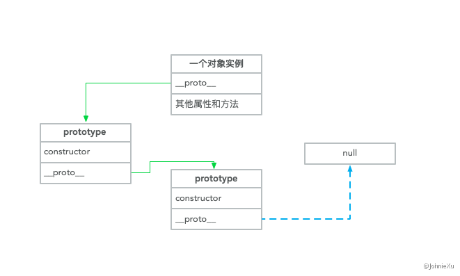
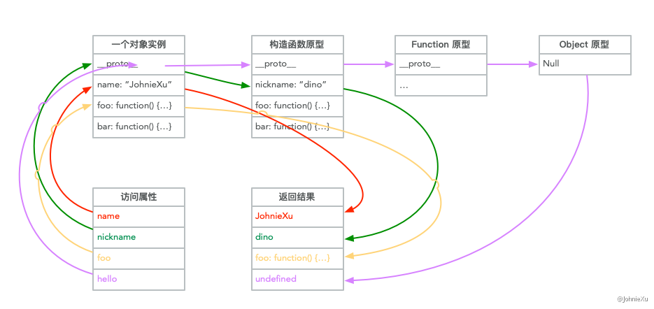
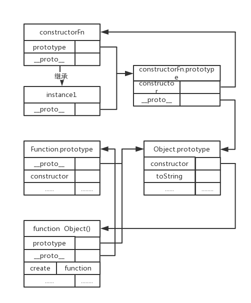
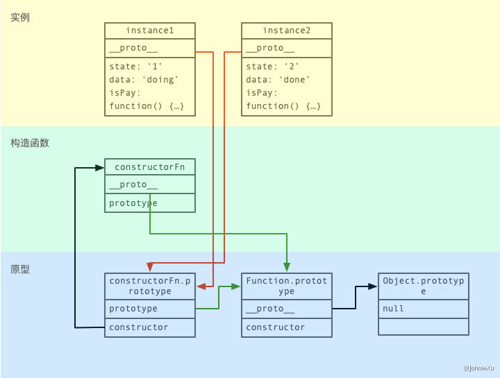
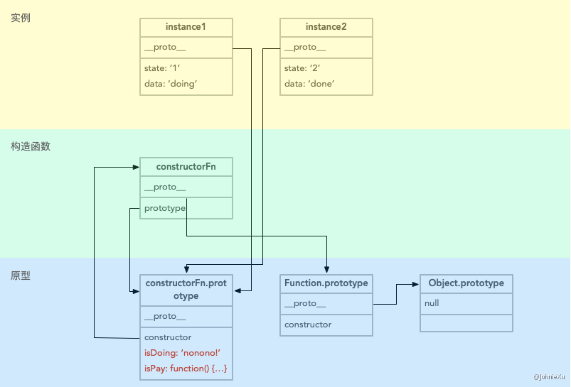
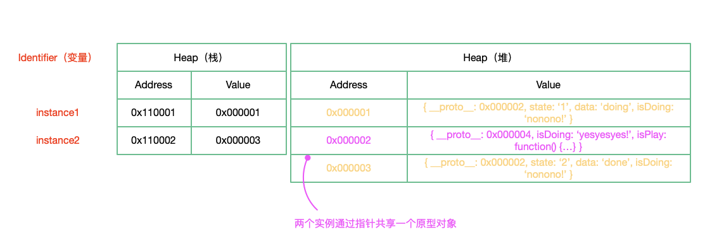
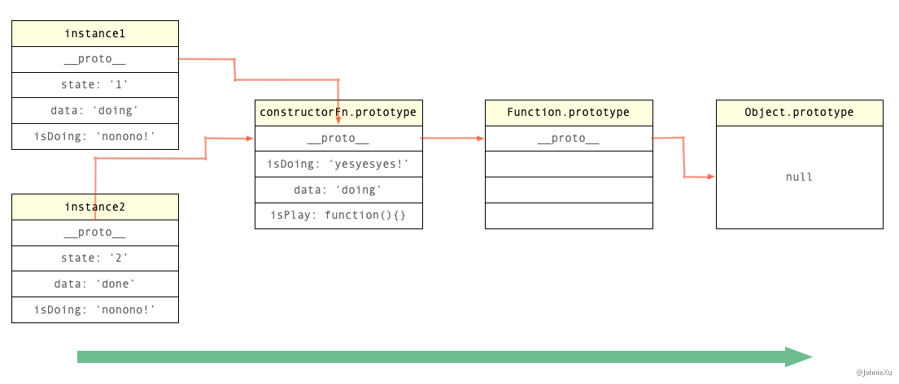
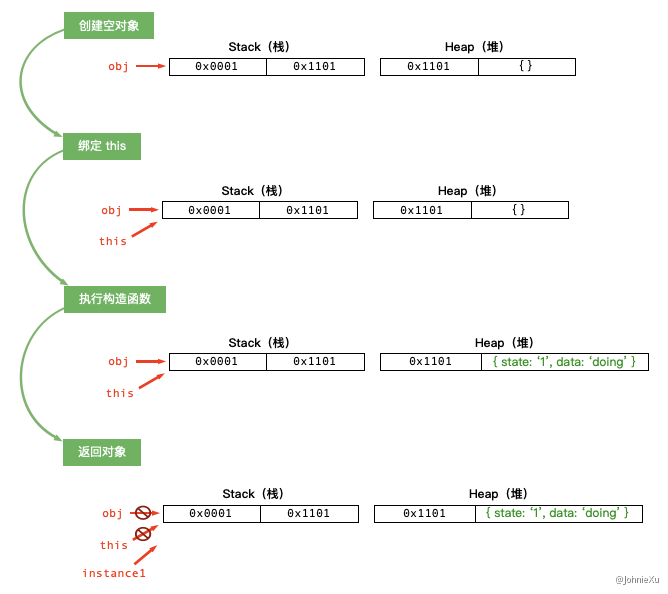

## 前言

最近在整体地复习一遍现代前端必备的核心知识点，将会整理成一个前端分析总结文章系列。这篇是其中的第三篇，主要是总结下JS中原型与继承等核心知识点。（另外，此系列文章也可以在语雀专栏——[硬核前端系列](https://www.yuque.com/johniexu/frontend)查看）。

## 一、原型机制


> “每个构造函数都有一个原型对象，原型对象都包含一个指向构造函数的指针，实例都包含一个指向原型对象的内部指针。”
> ——《JavaScript高级程序设计》


### 核心总结


实例对象是通过 `new` 操作符来操作构造函数 `constructor` 生成的。实例对象具有 `__proto__` 属性，构造函数具有 `prototype` 属性。

原型（`prototype`）本身也是一个对象，称为**原型对象**。构造函数上的属性 `prototype` 指向原型对象，实例上的属性 `__proto__` 指向原型对象。




`prototype` 与 `___proto___` 的指向关系图


借助原型实现继承的核心思想是：对象在查找属性和方法时首先看对象自身是否存在，不存在则去原型对象上查找，若未找到则继续到原型对象的原型对象上查找，依次进行下去直到查找到内置对象`Object`。即，**实例属性访问是沿着原型链向上递归查找**。



实例属性访问时沿原型链递归查找


原型对象也是对象也存在自己的原型对象，这里的原型对象形成的链条就是**原型链**。内置对象 `Object` 的原型对象是 `null`，`Object` 对象是所有对象最顶层的原型对象。

完整的构造函数、原型、原型链组成及之间的关系如下图所示：




### 实例分析


以下面这个基础的继承实现为例：


```javascript
function constructorFn (state, data) {
    this.state = state;
    this.data = data;
    this.isPlay = function () {
        return this.state + ' is ' + this.data;
    }
}
var instance1 = new constructorFn ('1', 'doing');
var instance2 = new constructorFn ('2', 'done');
console.log(instance1.isPlay()); // 1 is doing
console.log(instance2.isPlay()); // 2 is done
```


这里分别生成了两个实例：`instance1` 和 `instance2`，其构造函数通过对 `this` 进行赋值使得各自实例有各自的独立属性和方法。

这种情况下的实例、原型对象、构造函数之间的关系图如下：





实例、原型对象、构造函数之间的关系图


上面例子中的 `isPlay` 方法在各自的实例对象上进行了重复定义，方法的逻辑是一样的可以进行复用，下面采用 `prototype` 来优化。


```javascript
function constructorFn (state, data) {
    this.state = state;
    this.data = data;
}
constructorFn.prototype.isPlay = function () {
    return this.state + ' is ' + this.data;
}
var instance1 = new constructorFn ('1', 'doing');
var instance2 = new constructorFn ('2', 'done');
instance1.isDoing = 'nonono!';
instance2.isDoing = 'nonono!';
console.log(instance1.isPlay()); // 1 is doing
console.log(instance2.isPlay()); // 2 is done
console.log(instance1.isDoing); // nonono!
console.log(instance2.isDoing); // nonono!
```


这里将 `isPlay` 方法存到构造函数的原型对象上面，然后分别给两个实例对象添加 `isDoing` 属性。此时实例对象的 `isPlay` 方法是通过其 `__proto__` 指向的原型对象而访问到构造函数原型 `prototype` 上的 `isPlay` 方法，而实例对象的 `isDoing` 属性是其实例对象本身的属性。


这种情况下的实例、原型对象、构造函数之间的关系图如下：





实例、原型对象、构造函数之间的关系图


这时候通过构造函数的 `prototype` 修改原型对象属性，所有继承自原型的属性都被修改，而实例对象自身的属性不会改变。


```javascript
constructorFn.prototype.isDoing = 'yesyesyes!';
console.log(instance1.isDoing); // yesyesyes!
console.log(instance2.isDoing); // yesyesyes!
```


同样，通过实例的 `__proto__` 修改原型对象属性，所有继承自原型的属性都被修改，而实例对象自身的属性不会改变。


```javascript
- constructorFn.prototype.isDoing = 'yesyesyes!';
+ instance1.__proto__.isDoing = 'yesyesyes!';
console.log(instance1.isDoing); // yesyesyes！
console.log(instance2.isDoing); // yesyesyes！
```

上述情况下的内存模型如下：




上述实例部分内存模型


**多个实例对象的 `___proto___` 属性通过指针指向同一个原型对象——构造函数的原型对象；而实例本身的属性则是指向存储在对象本身。**


如果直接修改实例自身的属性 `isDoing` ，则另一个实例的属性不会跟着修改。


```javascript
- constructorFn.prototype.isDoing = 'yesyesyes!';
+ instance1.isDoing = 'yesyesyes!';
console.log(instance1.isDoing); // yesyesyes!
console.log(instance2.isDoing); // nonono!
```


#### 属性方法的查找过程

从对象本身开始，沿着原型组成的原型链逐级往上查找所访问的属性，找到相应的属性就返回，若直到 `Object.prototype` 还未找到则返回 undefined。这里属性方法沿原型链的查找过程就是所谓的属性继承、方法重写以及继承方案的本质。





属性沿着原型链查找示意图


## 二、new的本质


```javascript
var obj = {};
obj.__proto__ =  constructorFn.prototype;
constructorFn.call(obj);
```


`new` 主要做了以下四件事情


- 创建一个空对象
- 将上面创建对象的原型 `__proto__` 指向构造函数的原型 `prototype`
- 将构造函数上下文 `this` 指向创建的对象然后执行
- 返回上面创建的对象


### 实例分析


还是使用原型机制中用过的例子进行分析


```javascript
function constructorFn (state, data) {
    this.state = state;
    this.data = data;
}
constructorFn.prototype.isPlay = function () {
    return this.state + ' is ' + this.data;
}
constructorFn.prototype.isDoing = 'nonono!';
var instance1 = new constructorFn ('1', 'doing');
var instance2 = new constructorFn ('2', 'done');
console.log(instance1.isPlay()); // 1 is doing
console.log(instance2.isPlay()); // 2 is done
console.log(instance1.isDoing); // nonono!
console.log(instance2.isDoing); // nonono!
```


对于 `var instance1 = new constructorFn ('1', 'doing');` 执行过程如下图所示。




new 的执行过程图示


## 三、this 的指向问题


- this 永远指向函数的直接调用者
- 如果存在 new 关键字，则 this 指向 new 出来的那个对象
- 在事件中，this 指向触发这个事件的对象，特殊的是，IE 中的 attachEvent 中的 this 总是指向全局对象 window


```javascript
function constructorFn (state, data) {
    this.data = data;
    this.state = state;
  	console.log(this);
}
var obj = {
	constructorFn
};
constructorFn('a', 'b'); // Window
obj.constructorFn('a', 'b'); // obj
var instance1 = new constructorFn('a', 'b'); // instance1
```


对于 `constructorFn('a', 'b');` 函数体内部 this 指向 Window 对象；对于 `obj.constructorFn('a', 'b');` 函数体内部 this 绑定到了 obj；对于 `var instance1 = new constructorFn('a', 'b');` 函数体内部 this 绑定到了 new 出来的那个对象 instance1。


### 函数嵌套的情况


```javascript
function a() {
  return () => {
    return () => {
      console.log(this)
    }
  }
}
console.log(a()()())
```


首先箭头函数其实是没有 this 的，箭头函数中的 this 只取决包裹箭头函数的第一个普通函数的 this。在这个例子中，因为包裹箭头函数的第一个普通函数是 a，所以此时的 this 是 window。另外对箭头函数使用 bind这类函数是无效的。


最后种情况也就是 bind 这些改变上下文的 API 了，对于这些函数来说，this 取决于第一个参数，如果第一个参数为空，那么就是 window。


### call、apply、bind

三者都是将第一个参数作为上下文绑定到其调用者的上下文 this 上，如果第一个参数不存在则默认绑定 Window 到调用者的上下文 this。

call 以散列值的形式将函数参数传入前面调用函数并执行；apply 以数组的形式将函数参数传入前面调用函数并执行；bind 仅绑定前面函数的上下分 this 不执行前面函数。

### 使用多次 bind 绑定 this

```javascript
let a = {}
let fn = function () { console.log(this) }
fn.bind().bind(a)() // Window
```

上述代码等价于：


```javascript
let fn2 = function fn1() {
  return function() {
    return fn.apply()
  }.apply(a)
}
fn2()
```

就是说：**多次使用 bind 绑定 this 只有第一次绑定 this 生效**


如果存在多次绑定函数的上下文 this，则按照优先级进行判断

> 首先，new 的方式优先级最高，接下来是 bind 这些函数，然后是 obj.foo() 这种调用方式，最后是 foo 这种调用方式，同时，箭头函数的 this 一旦被绑定，就不会再被任何方式所改变。

## 四、类型判断

### instanceof

主要用法如下：

```javascript
function constructorFn (state, data) {
    this.data = data;
    this.state = state;
}
var instance1 = new constructorFn('a', 'b')
console.log(instance1 instanceof constructorFn) // true || false
```

内部原理如下：

**instanceof 主要的实现原理就是只要右边变量的 prototype 在左边变量的原型链上即可。因此，instanceof 在查找的过程中会遍历左边变量的原型链，直到找到右边变量的 prototype，如果查找失败，则会返回 false。**

### Object.prototype.toString.call()

主要用法如下：

```javascript
function constructorFn (state, data) {
    this.data = data;
    this.state = state;
}
var instance1 = new constructorFn('a', 'b');
var array1 = [1, 2, 3];
var boolean1 = true;
var string1 = 'a';
var number1 = 123;
var set1 = new Set();
var map1 = new Map();
class Class1 {};
var symbol1 = new Symbol();
console.log(Object.prototype.toString.call(instance1)); 	// [object Object]
console.log(Object.prototype.toString.call(array1)); 			// [object Array]
console.log(Object.prototype.toString.call(boolean1)); 		// [object Boolean]
console.log(Object.prototype.toString.call(string1)); 		// [object String]
console.log(Object.prototype.toString.call(number1)); 		// [object Number]
console.log(Object.prototype.toString.call(constructorFn));// [object Function]
console.log(Object.prototype.toString.call(null)); 				// [object Null]
console.log(Object.prototype.toString.call(set1)); 				// [object Set]
console.log(Object.prototype.toString.call(map1)); 				// [object Map]
console.log(Object.prototype.toString.call(Class1)); 			// [object Function]
console.log(Object.prototype.toString.call(symbol1)); 		// [object Symbol]
```

用法原理如下：

**对象可以有自己的 toString 方法，也可以由从父类继承过来的 toString 方法，这些方法的执行逻辑可能被更改过，估计直接通过 `instance1.toString() 方`法不能准确获取对象类型信息。**

这种用法的思路是将 `Object.prototype.toString` 方法内部 this 绑定到当前的对象上调用，这样不管当前的对象有没有提供或继承别的 toString 方法只会执行 `Object.prototype` 上的 toString 方法，确保了可以准确打印对象的类型信息。

## 五、常用继承方案

### 原型链继承

将子类的原型 prototype 指向父类的实例对象来实现父类属性和方法的继承；因为父类实例对象的构造函数 constructor 指向了父类原型，所以需要将子类原型构造函数 constructor 指向子类构造函数。


```javascript
function Animal (name) {
    this.name = name;
}
Animal.prototype = {
    canRun: function () {
        console.log('it can run!');
    }
}
function Cat () {
    this.speak = '喵！';
} 
Cat.prototype = new Animal('miao');
Cat.prototype.constructor = Cat;
```

### call、apply 实现继承

通过 call、apply 改变函数的 this 指向，来将子类的 this 指向父类，在父类构造函数用当前子类 this 执行完成后，当前子类 this 即有了父类定义的属性和方法。


```javascript
function Animal (name) {
    this.name = name;
}
Animal.prototype = {
  canRun: function () {
    console.log('it can run!');
  }
}
function Cat (name) {
  Animal.call(this, name);
  this.speak = '喵！';
} 
```

### 组合继承


> 原型链继承与 call、apply 实现继承的结合应用

核心是在子类的构造函数中通过 `Animal.call(this)` 继承父类的属性，然后改变子类的原型为父类实例对象来继承父类的方法。

```javascript
function Animal(name) {
  this.name = name
}
Animal.prototype.getName = function() {
  console.log(this.name)
}
function Cat(name) {
  Animal.call(this, name)
}
Cat.prototype = new Animal()

const cat1 = new Cat(1)

cat1.getName() // 1
cat1 instanceof Animal // true
```

这种继承方式优点在于构造函数可以传参，不会与父类引用属性共享，可以复用父类的函数，但是也存在一个缺点就是在继承父类函数的时候调用了父类构造函数，导致子类的原型上多了不需要的父类属性，存在内存上的浪费。

### class 实现继承


> 说明下： es6 中的 class 类其实只是语法糖，上面打印 class 的类型信息可以发现其本质还是函数，只不过通过 extends、super等关键字对原型和构造函数的操作进行了简化。


```javascript
class Animal {
  constructor(name) {
    this.name = name
  }
  getValue() {
    console.log(this.name)
  }
}
class Cat extends Animal {
  constructor(name) {
    super(name)
    this.name = name
  }
}
let cat1 = new Cat(1)
cat1.getName() // 1
cat1 instanceof Animal // true
```


class 实现继承的核心在于使用 extends 表明继承自哪个父类，并且在子类构造函数中必须调用 super，因为这段代码可以看成 `Animal.call(this, value)`。


### TS 中 class 实现继承


TS 中的 class 继承其实是向 ECMAScript 规范靠近的，两者用法并无二致。


```typescript
class Animal {
  public name: string | null = null
  constructor(name: string) {
    this.name = name
  }
}
class Cat extends Animal {
  constructor(name: string) {
    super(name)
  }
  getName () {
    console.log(this.name)
  }
}
let cat1 = new Cat('1')
cat1.getName() // 1
cat1 instanceof Animal // true
```

## 参考文章


- [https://www.typescriptlang.org/v2/docs/handbook/classes.html#public-private-and-protected-modifiers](https://www.typescriptlang.org/v2/docs/handbook/classes.html#public-private-and-protected-modifiers)
- [https://developer.mozilla.org/zh-CN/docs/Web/JavaScript/Inheritance_and_the_prototype_chain](https://developer.mozilla.org/zh-CN/docs/Web/JavaScript/Inheritance_and_the_prototype_chain)
- [http://zzfed.com/#/detail/5bab326aa696b41dfdc00fe8](http://zzfed.com/#/detail/5bab326aa696b41dfdc00fe8)

