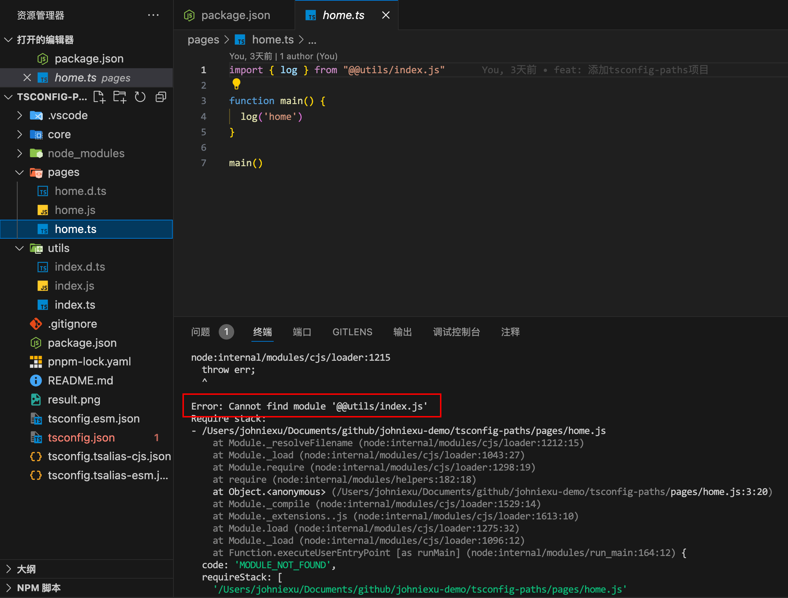
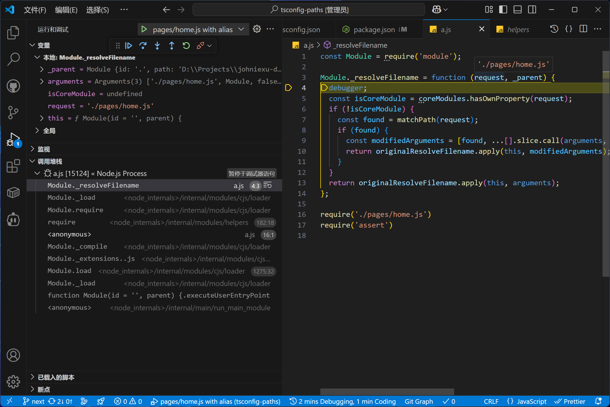
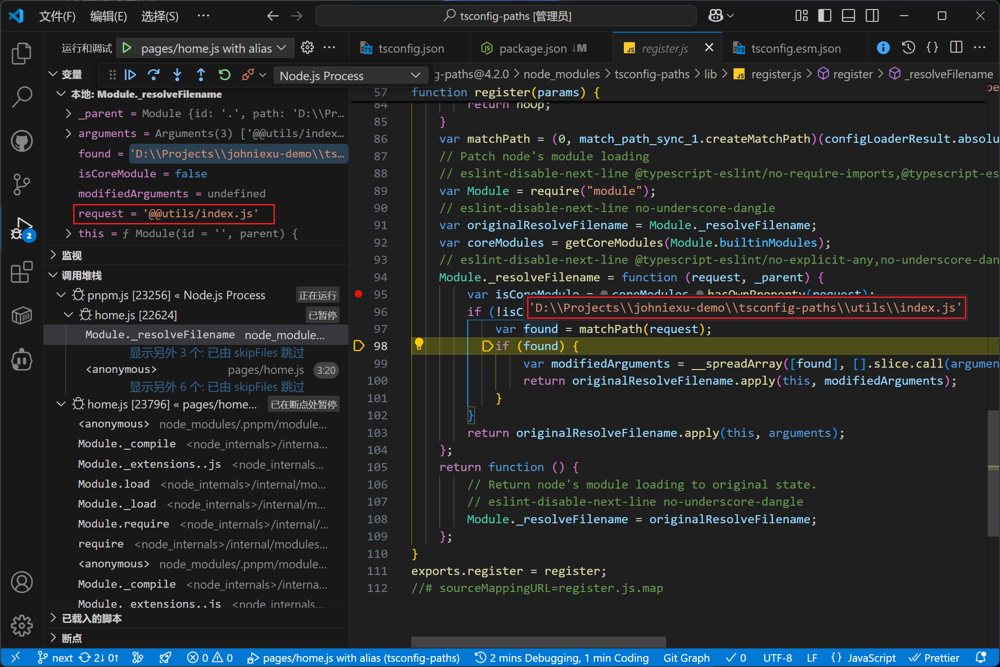
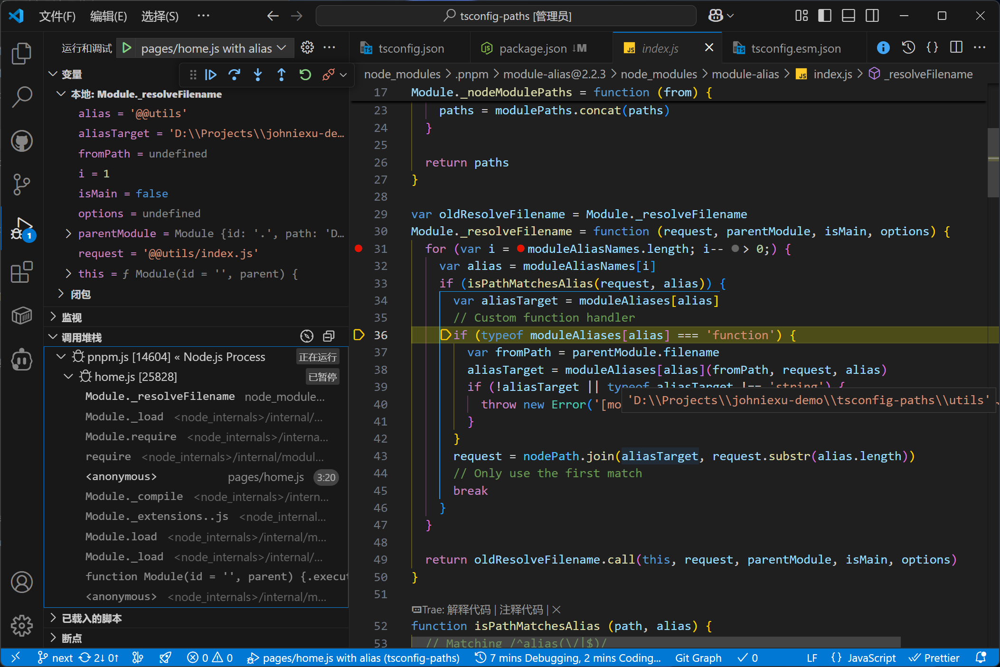
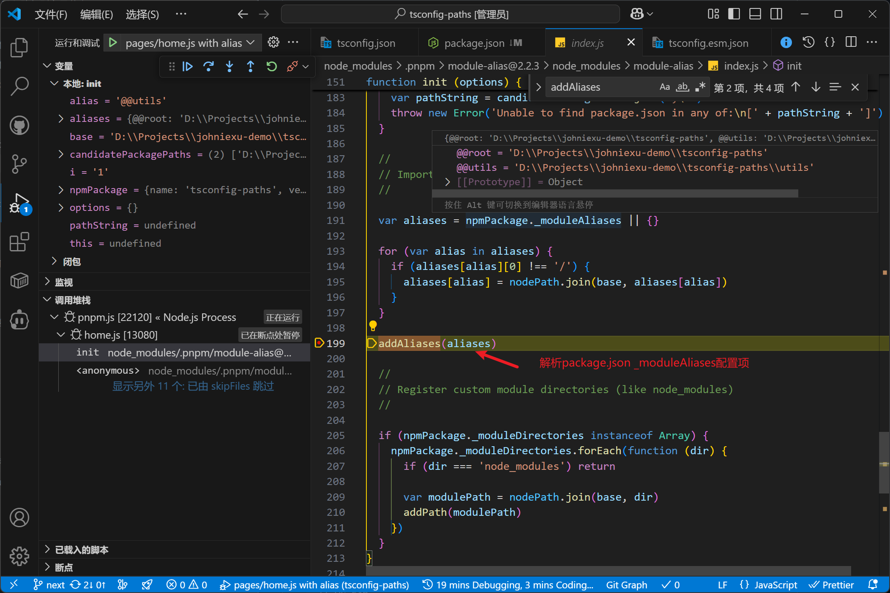
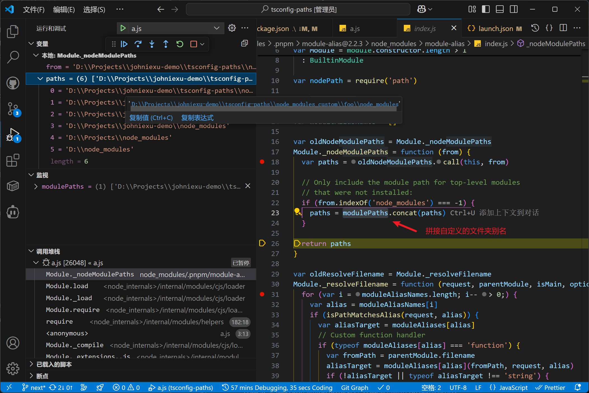

## 前言

### 路径别名是什么

一般 `pnpm create vite` 创建的前端项目都内置了对路径别名的支持，路径别名配置的写法：

```ts
// vite.config.js 或 vite.config.ts
import { defineConfig } from 'vite';
import { fileURLToPath, URL } from 'url';

export default defineConfig({
  resolve: {
    alias: {
      '@': fileURLToPath(new URL('./src', import.meta.url)),
    },
  },
});

```

在代码中可以使用 `@` 前缀导入模块：

```js
// 使用 @ 别名
import MyComponent from '@/components/MyComponent.vue';
import { formatDate } from '@/utils/helper.js';
```

对比未使用别名的用法：

```js
import MyComponent from '../../../../components/MyComponent.vue';
import { formatDate } from '../../../../utils/helper.js';
```

**导入路径** 别名可以彻底告别繁琐的  `../../` ，让导入语句清晰易懂。

### 普通项目存在问题

当我们在开发**不带编译打包器的项目**时，路径别名功能在 Node.js 下就不支持了。比如：下面使用 TypeScript 开发 CLI 工具项目，使用路径别名导入模块执行时报错。



本文会分析这一场景下路径别名导入功能的实现，介绍各实现的基本原理和用法。

## 最佳方案（tsc-alias）

目前找到的最佳方案是使用  [`tsc-alias`](https://github.com/justkey007/tsc-alias.git)  来处理。

`tsc-alias` 读取并解析编译后 JS 代码中的 `import` 或 `require` 模块导入写法，将路径别名替换为相对路径。

需要增加一步编译流程：

```json
// package.json
// 脚本名称可以随意，不需要叫做 build
{
    "script": {
        "build": "tsc-alias -p tsconfig.json"
    }
}
```

TS 项目 `tsconfig.json` 里面至少需要配置 `paths` 和 `outDir`，同样 JS 项目使用 `jsconfig.json` 配置。

`paths`: `tsc-alias` 据此解析别名配置
`outDir`：`tsc-alias`据此查找需要转换的代码，在 TS 项目对应编译输出的代码路径

完整代码 demo 在[这里](https://github.com/JohnieXu/demo/tree/next/tsconfig-paths)可以找到，一个真实项目 [JohnieXu/public_actions](https://github.com/JohnieXu/public_actions)。

## 其他方案分析

路径别名的本质是**通过别名到真实路径的映射查找出真实文件路径的过程**。Webpack、Rollup 等打包工具各自实现了这个转换的过程，但在**原生 Node.js 中不支持通过路径别名查找模块**。

要 Node.js 支持路径别名，有两种实现思路：

- **运行时**：修改 require 的运行时实现，将别名转换为真实文件路径再 require
- **编译时**：本地编译构建时先把别名映射转换到真实文件路径，require 中使用真实文件路径（相对路径）

基于这个思路，有下面三种具体实现。

## tsconfig-paths

https://github.com/jonaskello/tsconfig-paths

### 实现原理

修改 Node.js 内置模块 `module` 的静态方法 `Module._resolveFilename`，用 require 导入模块时会走到这个方法。

依次判断导入的模块是否内置模块、是否匹配上别名，匹配上别名则转换为对应的相对路径，再交给 Node.js 处理。



### 使用方法

在入口 JS 文件顶部引入  `require('tsconfig-paths/register')`  ，TS 源代码和编译后的 JS 代码还是保持别名导入。

源代码：

```ts
import { log } from "@@utils/index.js"

function main() {
  log('home')
}

main()
```

编译之后：

```js
"use strict";
Object.defineProperty(exports, "__esModule", { value: true });
const index_js_1 = require("@@utils/index.js");
function main() {
    (0, index_js_1.log)('home');
}
main();
```


## module-alias

https://github.com/ilearnio/module-alias

### 实现原理

和 tsconfig-paths 实现相似，都是对 `Module._resolveFilename` 方法进行 hook，以实现在 require 之前根据别名配置转换路径。



不过，这里别名配置的解析和 tsconfig-paths 不同，是从 `pacakge.json` 的 `_moduleAliases` 配置项解析的。



另外，**自定义模块目录**是通过对 `Module._nodeModulePath` 方法 hook 来实现的。



### 使用方法

在  `package.json`  中添加路径别名的配置，需要和  `tsconfig.json`  中的  `paths`  配置保持一致。

```json
{
    "_moduleAliases": {
        "@@root": ".",
        "@@utils": "utils"
     }
}
```

然后在入口 JS 文件顶部执行  `require('module-alias/register')` ，TS 源代码和编译后的 JS 代码还是保持别名导入。

**自定义模块目录**

还支持配置自定义的模块目录，作用和 `node_modules` 一样，例如：
```json
{
    "_moduleDirectories": ["miniprogram_dist", "uni_modules"]
}
```
可以将私有的 npm 包安装到这些目录中，在代码中使用包名直接引入。

## tsc-alias

https://github.com/justkey007/tsc-alias

### 基本原理

`tsc-alias` 通过读取解析编译后 JS 代码中的 `import` `require` 写法，将路径别名替换为相对路径，编译输出新代码。

替换的过程采用正则表达式处理，没有使用复杂的 AST 解析，也不会对代码做任何压缩、编译、poflyfill 等其他操作。

### 使用方法

修改构建脚本，在 `tsc` 编译后执行  `tsc-alias -p tsconfig.json`  。TS 配置项的 paths 对应所有可用的别名。

TS 配置（tsconfig.json）：

```json
{
    "compilerOptions": {
        "paths": {
            "@@utils/*": ["./src/utils/*"]
        }
    }
}
```

源代码：

```ts
import { log } from "@@utils/index.js"

function main() {
  log('home')
}

main()
```

编译之后：

```js
import { log } from "../utils/index.js";
function main() {
    log('home');
}
main();
```

源码使用 `require('@@utils/index.js')` 语法也支持。

## 总结

在基于 Node.js 运行的CLI、后端服务等项目，由于没有采用构建打包工具，对路径别名导入的支持需要第三方库实现。实现方案有文中提及的多种，比较推荐的是 `tsc-alias` 实现，没有运行时代码。

最后，整理了三者横向对比，供大家查阅。

| 功能          | tsconfig-paths                                                                                                                                | module-alias                                                                                                               | tsc-alias                                                           |
| ----------- | --------------------------------------------------------------------------------------------------------------------------------------------- | -------------------------------------------------------------------------------------------------------------------------- | ------------------------------------------------------------------- |
| 解决阶段        | 运行时 (Runtime)                                                                                                                                 | 运行时 (Runtime)                                                                                                              | 编译后/构建时 (Post-compile)                                              |
| 核心机制        | 动态修改 Node.js 模块加载。通过 require 钩子（Hook）修补 Node.js 的 Module._resolveFilename 方法。                                                                 | 动态修改 Node.js 模块加载。通过修补 Node.js 的内部方法 Module._resolveFilename 和 Module._nodeModulePaths 来注册别名。                              | 静态重写 JS 文件内容。在 tsc 编译完成后，将编译出的 JavaScript 文件中的别名导入路径替换为运行时可识别的相对路径。 |
| 配置来源        | 直接读取 tsconfig.json 或 jsconfig.json 中的 paths。                                                                                                  | 读取 package.json 中的 _moduleAliases 字段。也可以通过编程方式配置。                                                                          | 读取 tsconfig.json 或 jsconfig.json 中的 paths。                          |
| 集成方式        | 在应用的主文件最顶部调用 require('tsconfig-paths/register')。<br>通过 Node.js 的 -r (require) 选项进行注册：node -r tsconfig-paths/register main.js。或与 ts-node 一起使用。 | 在应用的主文件最顶部调用 require('module-alias/register')。<br>或通过 Node.js 的 -r (require) 选项进行注册：node -r module-alias/register main.js。 | 作为构建流程的后处理步骤运行：tsc-alias -p tsconfig.json。                          |
| 对TS配置的依赖    | 强依赖：旨在实现 tsconfig.json paths 的运行时功能。                                                                                                          | 不依赖：使用自己的配置格式，与 tsconfig.json 的 paths 字段不直接关联。                                                                             | 强依赖：用于处理 tsconfig.json paths 编译后的结果。                                |
| 已知限制        | 与 TypeScript 路径配置保持同步，是 Node.js 环境下路径别名最常用的运行时解决方案。                                                                                           | 通用性高，允许注册自定义模块目录（类似于 node_modules）。                                                                                        | 编译时完成替换，没有运行时依赖。生成的 JS 文件是“纯净”的相对路径，更适用于最终部署环境。                     |
| 与Webpack的关系 | 不直接兼容，对于 Webpack，官方推荐使用配套的 tsconfig-paths-webpack-plugin。                                                                                     | 不兼容：明确指出设计用于服务器端，不适用于前端 WebPack 项目；WebPack 建议使用其内置的 resolve.alias 机制。                                                      | 兼容：由于输出是纯 JS，WebPack 无需特殊插件即可打包。                                    |
| 模块格式支持      | 支持 CJS，不支持 ESM                                                                                                                                | 支持 CJS，不支持 ESM                                                                                                             | ESM/CJS 都支持                                                         |

## 参考资料

- https://stackoverflow.com/questions/58809944/cannot-find-module-typescript-path-alias-error
- https://www.geeksforgeeks.org/node-js/how-to-have-path-alias-in-node-js/
- https://stackoverflow.com/questions/76765069/node-js-typescript-how-to-setup-path-alias
- https://www.typescriptlang.org/tsconfig/#paths
