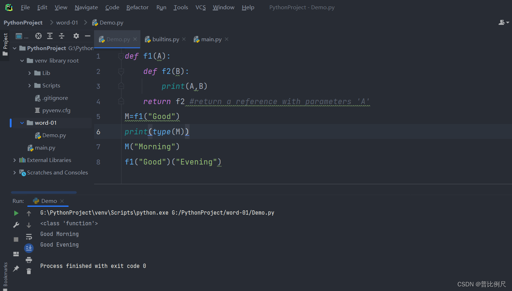

## 1:入口函数

虽然没有这样的东西，但是习惯要一个：

```
def main():
    pass
    
if __name__=="__main__":
    main()
```

## 2:闭包

！！！！这是一篇水博客，非教学！！！！！  
最近在学习python，只有一种感觉…  
竟然还存在这样的语言！！！  
  
这个<class ‘function’>看的我久久不能释然。。  
一个函数！一个带有参数的函数！！可以作为一个变量！！？？？封装使用？？？（结合5和7行）