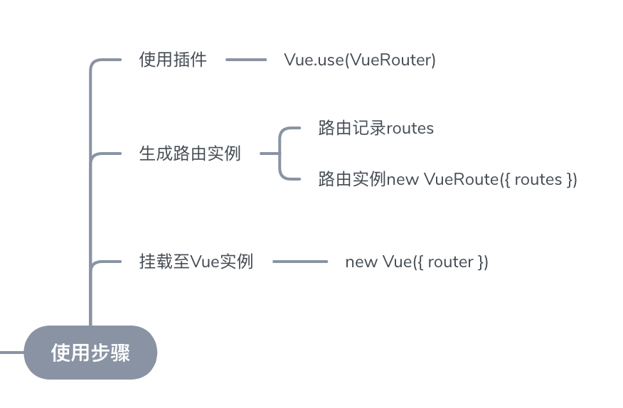
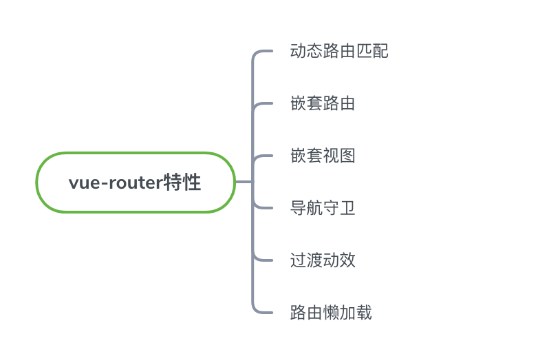
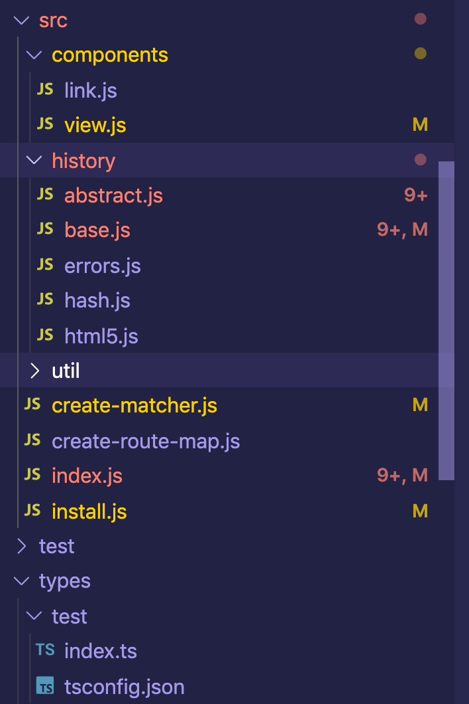
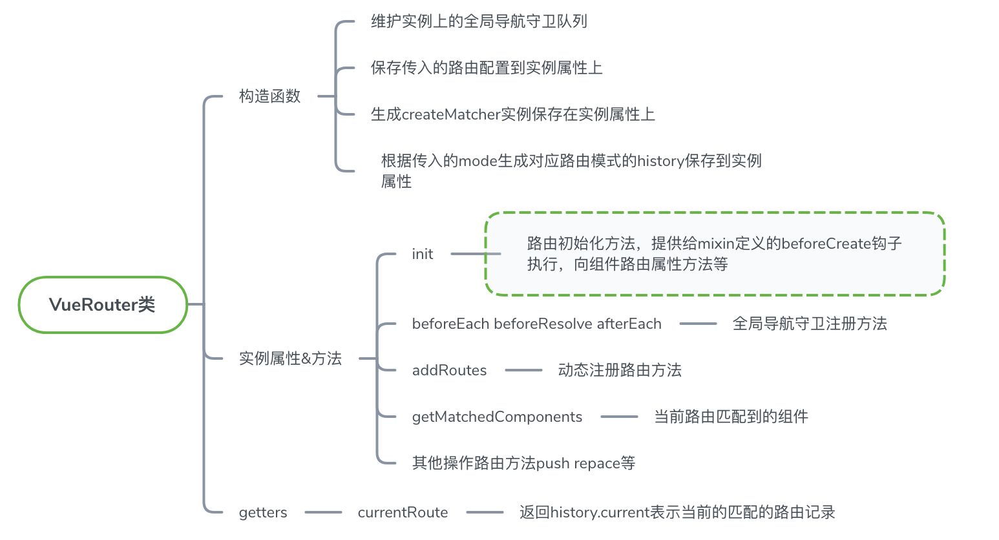
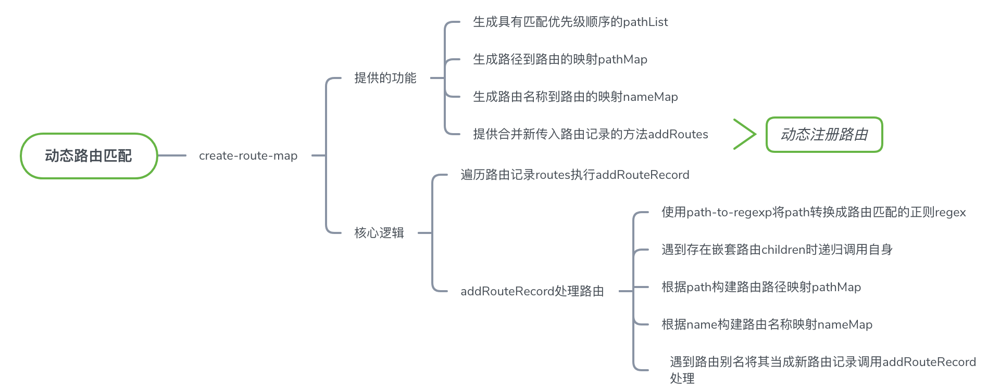
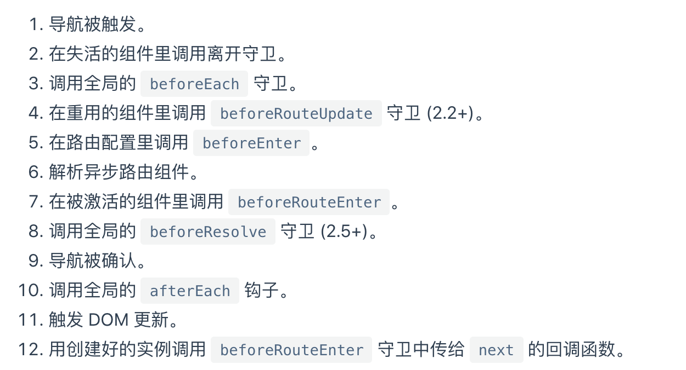

# 前言
在[前一篇文章](https://www.yuque.com/johniexu/frontend/dhgooo)中遇到的vue路由组件缓存问题已经解决并对项目进行了适当的优化改进，但是并未开探寻究vue-router的源码，这篇就继续上次的话题，深入分析vue-router源码中对导航守卫、动态参数匹配、过渡效果和异步组件等的实现。

> 本文分析的源码为vue-router@3.1.3，vue@2.6.11

# 万丈高楼平地起
参考官网的[起步中](https://v3.router.vuejs.org/zh/guide/#%E8%B5%B7%E6%AD%A5)的使用实例，vue-router的基本思路是根据路由记录生成VueRouter实例并传入Vue的app实例的router属性上，同时使用router-view来挂载路由匹配的路由组件到页面某一位置。

```javascript
const Foo = { template: '<div>foo</div>' }
const Bar = { template: '<div>bar</div>' }

const routes = [
  { path: '/foo', component: Foo },
  { path: '/bar', component: Bar }
]

const router = new VueRouter({
  routes // (缩写) 相当于 routes: routes
})

const app = new Vue({
  router
}).$mount('#app')
```

## 使用流程



> 这里vue-router的设计哲学与react-routerV4不太一样，前者是以路由配置来统一配置路由，后者是路由即组件的概念（不需要统一的路由配置，不过自行封装成路由配置）


## 核心特性



以上这些是vue-router提供的核心功能，完整的用法说明可以参考[官方文档](https://router.vuejs.org/zh/guide/essentials/dynamic-matching.html#%E5%93%8D%E5%BA%94%E8%B7%AF%E7%94%B1%E5%8F%82%E6%95%B0%E7%9A%84%E5%8F%98%E5%8C%96)，下面将逐步分析vue-router源码中是如何实现以上这些核心功能的。


# 阅读源码的前置条件

## 源码目录结构



源码结构算是秉承着vue系列的一目了然的特性，主要分为组件link和view、维护路由的history、vue插件的注册方法install.js、模块导出文件index.js

## 基础概念——路由实例router
路由实例router是在使用vue-router的时候通过传入路由记录等配置而生成的实例对象，重点在于其VueRouter类的实现。



### init方法的实现
这里的init方法与install.js中注册的全局mixin关联最大，是vue组件在create时执行的初始化路由方法，需要重点分析一下。

```javascript
init (app: any /* Vue component instance */) {
  this.apps.push(app)

  app.$once('hook:destroyed', () => {
    const index = this.apps.indexOf(app)
    if (index > -1) this.apps.splice(index, 1)
    if (this.app === app) this.app = this.apps[0] || null
  })

  if (this.app) {
    return
  }

  this.app = app

  const history = this.history

  if (history instanceof HTML5History) {
    history.transitionTo(history.getCurrentLocation())
  } else if (history instanceof HashHistory) {
    const setupHashListener = () => {
      history.setupListeners()
    }
    history.transitionTo(
      history.getCurrentLocation(),
      setupHashListener,
      setupHashListener
    )
  }

  history.listen(route => {
    this.apps.forEach((app) => {
      app._route = route
    })
  })
}
```
源码：[L83](https://github.com/vuejs/vue-router/blob/dev/src/index.js#L83)

这里的app是vue组件的实例，通过 `app.$once('hook:destroyed', () => {}` 声明式地注册组件destroyed生命周期钩子，保证对应组件销毁时组件app实例从`router.apps`上移除。

**保证路由初仅始化一次**：由于init是被全局注册的mixin调用，此处通过this.app是否存在的判断逻辑保证路由初始化仅仅在根组件 `<App />` 上初始化一次，`this.app`最后保存的根据组件实例。

**触发路由变化&开始路由监听**：使用 `history.transitionTo` 分路由模式触发路由变化，使用 `history.listen` 监听路由变化来更新根组件实例 `app._route` 是当前跳转的路由。

## 基础概念——路由匹配器matcher
路由匹配器macther是由create-matcher生成一个对象，其将传入VueRouter类的路由记录进行内部转换，对外提供根据location匹配路由方法——match、注册路由方法——addRoutes。

- [match](https://github.com/vuejs/vue-router/blob/dev/src/create-matcher.js#L26)方法：根据内部的路由映射匹配location对应的路由对象route
- [addRoutes](https://github.com/vuejs/vue-router/blob/dev/src/create-matcher.js#L22)方法：将路由记录添加到matcher实例的路由映射中

### 生成matcher
```javascript
// src/index.js
constructor (options: RouterOptions = {}) {
    ...
    this.matcher = createMatcher(options.routes || [], this)
  	...
}
```
源码：[L42](https://github.com/vuejs/vue-router/blob/dev/src/index.js#L42)

`options.routes`为进行 `new VueRoute` 操作是传入的路由记录

### createMatcher内部
createMatcher来自于`import { createMatcher } from './create-matcher'`, 内部进行路由地址到路由对象的转换、路由记录的映射、路由参数处理等操作

```javascript
// src/create-matcher.js
export function createMatcher (
  routes: Array<RouteConfig>,
  router: VueRouter
): Matcher {
  ...
  function addRoutes (routes) {
    createRouteMap(routes, pathList, pathMap, nameMap)
  }
  function match (
    raw: RawLocation,
    currentRoute?: Route,
    redirectedFrom?: Location
  ): Route {
    ...
  }
  function _createRoute (
    record: ?RouteRecord,
    location: Location,
    redirectedFrom?: Location
  ): Route {
    ...
  }
    
  return {
    match,
    addRoutes
  }
}
```
源码：[L16](https://github.com/vuejs/vue-router/blob/dev/src/create-matcher.js#L16)

createRoute：将外部传入的路由记录转换成统一的route对象，传入**组件实例的$route**就是此处返回的
alias：处理路由别名
nameMap：处理命名路由
**路由参数解析**：解析路由location.params、query参数、hash等，**动态路由匹配正是来自此处**

# 动态路由匹配&嵌套路由
## 动态路由匹配
动态路由匹配指的是可以在路径中设置多段参数，参数将会被设置到 `$route.params` 上，例如：

| **模式** | **匹配路径** | **$route.params** |
| :---: | :---: | :---: |
| /user/:username | /user/evan | { username: 'evan' } |
| /user/:username/post/:post_id | /user/evan/post/123 | { username: 'evan', post_id: '123' } |

参考：[官网例子](https://router.vuejs.org/zh/guide/essentials/dynamic-matching.html#%E5%8A%A8%E6%80%81%E8%B7%AF%E7%94%B1%E5%8C%B9%E9%85%8D)

## 嵌套路由
嵌套路由指的是路由可以像组件一样具有嵌套关系，一条路由记录下可以通过 `children` 属性嵌套由多个子路由记录组成的数组，例如：

```javascript
const router = new VueRouter({
  routes: [
    { path: '/user/:id', component: User,
      children: [
        {
          // 当 /user/:id/profile 匹配成功，
          // UserProfile 会被渲染在 User 的 <router-view> 中
          path: 'profile',
          component: UserProfile
        },
        {
          // 当 /user/:id/posts 匹配成功
          // UserPosts 会被渲染在 User 的 <router-view> 中
          path: 'posts',
          component: UserPosts
        }
      ]
    }
  ]
})
```
参考：[官网例子](https://router.vuejs.org/zh/guide/essentials/nested-routes.html)

在项目中只要使用vue-router，几乎不可避免要使用到动态路由匹配和嵌套路由，可见两个功能在vue-router是何等重要，在研究其源码时这两个功能肯定是要研究的，下面将探究上述功能在vue-router是如何实现的。

## 主要实现思路
要实现动态路由匹配主要是要实现路由记录的path属性与实际的路由路径的参数进行匹配，而要实现嵌套路由则需要根据嵌套规则对路由记录解析，这两个都在create-route-map进行实现，实现的思路如下：



create-route-map中的核心代码如下：

```javascript
export function createRouteMap (
  routes: Array<RouteConfig>,
  oldPathList?: Array<string>,
  oldPathMap?: Dictionary<RouteRecord>,
  oldNameMap?: Dictionary<RouteRecord>
): {
  pathList: Array<string>,
  pathMap: Dictionary<RouteRecord>,
  nameMap: Dictionary<RouteRecord>
} {
 	...
 	routes.forEach(route => {
    addRouteRecord(pathList, pathMap, nameMap, route)
  })
  ...
  /**
   * TODO:
   * 处理路由的优先级循序：将路由记录中的通配符*表示的路由按循序移动到路由记录末尾
   * 采用的哪种排序算法？
   */
  for (let i = 0, l = pathList.length; i < l; i++) {
    if (pathList[i] === '*') {
      pathList.push(pathList.splice(i, 1)[0])
      l--
      i--
    }
  }
  ...
  /**
   * TODO:
   * 路由记录，将路由所有的路由记录映射到pathMap、nameMap中，pathMap：按路径映射，nameMap：按名称映射，pathList所有路由path组成的数组
   * 处理嵌套路由：递归调用此方法，parent表示父级路由
   * 处理路由别名：把路径别名看成是指向同一个组件的路由记录，由此方法处理一遍这个别名组成的路由
   * 处理路由名称：若存在路由名称，则将该路由映射到nameMap中存储
   */
  function addRouteRecord (
    pathList: Array<string>,
    pathMap: Dictionary<RouteRecord>,
    nameMap: Dictionary<RouteRecord>,
    route: RouteConfig,
    parent?: RouteRecord,
    matchAs?: string
  ) {
    ...
  }
  ...
  return {
    pathList,
    pathMap,
    nameMap
  }
}
```
源码：[L7](https://github.com/vuejs/vue-router/blob/dev/src/create-route-map.js#L7)

`createRouteMap`方法主要是遍历路由配置routes，调用 `addRouteRecord` 方法来处理路由，处理完路由后得到 `pathList` `pathMap` `nameMap` ，并将其组成对象并返回。

### 动态路由匹配的实现
在 `addRouteRecord` 方法处理路由的实现中由将 `route.path` 使用path-to-regexp转换成正则表达式， `record` 是处理完成后保存在 `pahtMap` `nameMap` 映射中的值。

```javascript
const record: RouteRecord = {
	...
  regex: compileRouteRegex(normalizedPath, pathToRegexpOptions),
  ...
}
...
/**
 * TODO:
 * 调用path-to-regexp生成路由匹配用的正则
 */
function compileRouteRegex (
  path: string,
  pathToRegexpOptions: PathToRegexpOptions
): RouteRegExp {
  const regex = Regexp(path, [], pathToRegexpOptions)
  if (process.env.NODE_ENV !== 'production') {
    const keys: any = Object.create(null)
    regex.keys.forEach(key => {
      warn(
        !keys[key.name],
        `Duplicate param keys in route with path: "${path}"`
      )
      keys[key.name] = true
    })
  }
  return regex
}
```
源码：[L178](https://github.com/vuejs/vue-router/blob/dev/src/create-route-map.js#L178)

然后在create-matcher提供的match方法中根据 `route.name` 、 `route.path` 进行路由匹配，**匹配的时候回调用上述得到的正则表达式进行路由匹配及参数解析**，从而得到路径或者路由名称匹配的路由以及动态参数。

### 嵌套路由的实现
`addRouteRecord` 方法实现嵌套路由部分的源码如下：

```javascript
export function createRouteMap (
  routes: Array<RouteConfig>,
  oldPathList?: Array<string>,
  oldPathMap?: Dictionary<RouteRecord>,
  oldNameMap?: Dictionary<RouteRecord>
): {
  pathList: Array<string>,
  pathMap: Dictionary<RouteRecord>,
  nameMap: Dictionary<RouteRecord>
} {
 	...
  if (route.children) {
    route.children.forEach(child => {
      const childMatchAs = matchAs
        ? cleanPath(`${matchAs}/${child.path}`)
        : undefined
      addRouteRecord(pathList, pathMap, nameMap, child, record, childMatchAs)
    })
  }
  ...
}
```
源码：[L102]()

路由记录的children表示当前路由下嵌套的路由记录，当其存在时递归处理路由；处理子路由时会拼接完整的路由path放入 `pathMap` `nameMap` 。

故不论是否嵌套路由与否，最后都是进行评级的路由映射，统一路由match方法进行路由匹配。

# 导航守卫机制
导航守卫给给路由使用者传入自定义的控制路由跳转逻辑的钩子方法，通过 `next` 方法串行执行下一个路由的匹配逻辑，根据定义导航守卫的位置不同可以将其分为三类：**全局导航守卫、路由独享守卫、组件内部导航守卫**。


## 导航守卫的注册
用注册导航守卫方法或导航守卫配置会被注册到执行队列中，在路由跳转时根据根据路由配置映射计算出组件实例的更新、替换、重用等情况，然后在对应组件上遍历执行导航守卫队列。

### 注册全局导航守卫
全局导航守卫分为：全局前置导航守卫、全局解析守卫、全局后置守卫，分别通过 `router.beforeEach` `router.beforeResolve` `router.afterEach` 进行注册。

```javascript
// src/index.js
beforeEach (fn: Function): Function {
  return registerHook(this.beforeHooks, fn)
}

beforeResolve (fn: Function): Function {
  return registerHook(this.resolveHooks, fn)
}

afterEach (fn: Function): Function {
  return registerHook(this.afterHooks, fn)
}
```
源码：[L133](https://github.com/vuejs/vue-router/blob/dev/src/index.js#L133)

注册全局导航守卫是调用 `registerHook` 方法向钩子函数队列中推入钩子函数，同时返回删除钩子函数的方法。

> 这是常见队列入栈出栈用法，vue源码中很常见的一种用法


registerHook方法源码如下：
```javascript
// src/index.js
function registerHook (list: Array<any>, fn: Function): Function {
  list.push(fn)
  return () => {
    const i = list.indexOf(fn)
    if (i > -1) list.splice(i, 1)
  }
}
```

### 注册路由独享守卫
路由独享守卫是以路由配置的形式进行注册，例如：
```javascript
const router = new VueRouter({
  routes: [
    {
      path: '/foo',
      component: Foo,
      beforeEnter: (to, from, next) => {
        // ...
      }
    }
  ]
})
```

### 注册组件内部守卫
组件内部守卫是通过配置组件的导航守卫属性进行注册，例如：
```javascript
const Foo = {
  template: `...`,
  beforeRouteEnter (to, from, next) {
    // 在渲染该组件的对应路由被 confirm 前调用
    // 不！能！获取组件实例 `this`
    // 因为当守卫执行前，组件实例还没被创建
  },
  beforeRouteUpdate (to, from, next) {
    // 在当前路由改变，但是该组件被复用时调用
    // 举例来说，对于一个带有动态参数的路径 /foo/:id，在 /foo/1 和 /foo/2 之间跳转的时候，
    // 由于会渲染同样的 Foo 组件，因此组件实例会被复用。而这个钩子就会在这个情况下被调用。
    // 可以访问组件实例 `this`
  },
  beforeRouteLeave (to, from, next) {
    // 导航离开该组件的对应路由时调用
    // 可以访问组件实例 `this`
  }
}
```

## 导航守卫的解析流程
将上面在全局注册、路由配置注册、组件内部注册的导航守卫解析出来，按照**导航钩子解析顺序**推进队列中

```javascript
const queue: Array<?NavigationGuard> = [].concat(
  // in-component leave guards
  extractLeaveGuards(deactivated),  // 失效组件的beforeRouterLeave
  // global before hooks
  this.router.beforeHooks,					// 全局的前置钩子beforeEach
  // in-component update hooks
  extractUpdateHooks(updated),			// 重用的组件beforeRouteUpdate
  // in-config enter guards
  activated.map(m => m.beforeEnter),// 路由配置的beforeRouteEnter
  // async components
  resolveAsyncComponents(activated) // 路由配置中异步组件的加载解析
)
```
源码：[L133](https://github.com/vuejs/vue-router/blob/dev/src/history/base.js#L133)

**导航钩子的解析流程**


**导航钩子解析对应的源码**
```javascript
// 执行前置守卫
runQueue(queue, iterator, () => {
  const postEnterCbs = []
  const isValid = () => this.current === route
  const enterGuards = extractEnterGuards(activated, postEnterCbs, isValid)
  const queue = enterGuards.concat(this.router.resolveHooks)
  // 执行解析守卫
  runQueue(queue, iterator, () => {
    if (this.pending !== route) {
      return abort()
    }
    this.pending = null
    onComplete(route)
    if (this.router.app) {
      this.router.app.$nextTick(() => {
        // 执行后置守卫
        postEnterCbs.forEach(cb => {
          cb()
        })
      })
    }
  })
})
```
源码：[L179](https://github.com/vuejs/vue-router/blob/dev/src/history/base.js#L179)

# 路由懒加载
路由懒加载是以路由为基础单位对页面代码进行分包，在匹配到对应路由时候在异步下载对应路由组件的代码，以vue-cli新建的项目可以直接使用[webpack 的 code-splitting 功能](https://webpack.js.org/guides/code-splitting/)，一个结合[vue异步组件](https://cn.vuejs.org/v2/guide/components-dynamic-async.html#异步组件)+ES新语法的路由懒加载的例子如下：
```javascript
vue VueRouter({
	routes: [
    {
     	path: '/foot',
      component: () => import('./my-async-component')
    }
  ]
})
```

异步组件的加载需要关注其加载状态，在vue-router中的异步组件的加载状态只有loading、error等，而在vue-router是重新实现的组件懒加载实现了更细致的组件加载状态控制、路由解析控制。

vue-router的异步组件解析在[导航守卫队列的解析流程](#5Pm5h)里面，其中重点的解析异步组件的方法源码如下：
```javascript
// util/resolve-components.js
/**
 * TODO:
 * 异步路由解析：重写异步组件的resolve、reject方法，添加了组件加载状态控制、路由解析控制；对异步组件的传统写法及promise写进行兼容
 */
export function resolveAsyncComponents (matched: Array<RouteRecord>): Function {
  return (to, from, next) => {
    let hasAsync = false
    let pending = 0
    let error = null

    flatMapComponents(matched, (def, _, match, key) => {
      if (typeof def === 'function' && def.cid === undefined) {
        hasAsync = true
        pending++
        // 重写vue异步组件的resolve和reject方法
        const resolve = once(resolvedDef => {
          if (isESModule(resolvedDef)) {
            resolvedDef = resolvedDef.default
          }
          // save resolved on async factory in case it's used elsewhere
          def.resolved = typeof resolvedDef === 'function'
            ? resolvedDef
            : _Vue.extend(resolvedDef)
          match.components[key] = resolvedDef
          pending--
          if (pending <= 0) {
            next()
          }
        })

        const reject = once(reason => {
          const msg = `Failed to resolve async component ${key}: ${reason}`
          process.env.NODE_ENV !== 'production' && warn(false, msg)
          if (!error) {
            error = isError(reason)
              ? reason
              : new Error(msg)
            next(error)
          }
        })

        let res
        try {
          res = def(resolve, reject)
        } catch (e) {
          reject(e)
        }
        // 兼容异步组件的promise写法
        if (res) {
          if (typeof res.then === 'function') {
            res.then(resolve, reject)
          } else {
            // new syntax in Vue 2.3
            const comp = res.component
            if (comp && typeof comp.then === 'function') {
              comp.then(resolve, reject)
            }
          }
        }
      }
    })
  }
}
```
源码：[L6](https://github.com/vuejs/vue-router/blob/dev/src/util/resolve-components.js#L6)

重写了vue异步组件加载的resolve和reject方法来实现对路由解析是否进入下一个匹配的控制，加入了路由匹配的组件解析失败的异常处理，同时还对异步组件的promise写法也进行了兼容。

# router-view组件
router-view是vue-router提供的两个核心组件之一，它是一个函数式组件不存在自己的组件实例，只负责调用父组件上存储的 `keepAlive` `$route.match` 等相关的属性/方法来控制路由对应的组件的渲染情况。

router-view组件可以嵌套来配合实现嵌套路由，其自身所在的页面位置最终是其匹配上的路由组件所挂载的位置。

其源码render部分的核心源码如下：
```javascript
render (_, { props, children, parent, data }) {
  // 标识当前组件是router-view
  data.routerView = true
  const h = parent.$createElement
  const name = props.name
  const route = parent.$route
  const cache = parent._routerViewCache || (parent._routerViewCache = {})
  
  let depth = 0
  let inactive = false
  // 由router-view组件向上遍历直到跟组件，遇到其他的router-view组件则路由深度+1
  // vnodeData.keepAlivepj
  while (parent && parent._routerRoot !== parent) {
    const vnodeData = parent.$vnode ? parent.$vnode.data : {}
    if (vnodeData.routerView) {
      depth++
    }
    if (vnodeData.keepAlive && parent._directInactive && parent._inactive) {
      inactive = true
    }
    parent = parent.$parent
  }
  data.routerViewDepth = depth

	// 启用缓存时
  if (inactive) {
    const cachedData = cache[name]
    const cachedComponent = cachedData && cachedData.component
    if (cachedComponent) {
      if (cachedData.configProps) {
        fillPropsinData(cachedComponent, data, cachedData.route, cachedData.configProps)
      }
      return h(cachedComponent, data, children)
    } else {
      return h()
    }
  }

  const matched = route.matched[depth]
  const component = matched && matched.components[name]
  
  if (!matched || !component) {
    cache[name] = null
    return h()
  }

  cache[name] = { component }

  // 往父组件注册registerRouteInstance方法
  data.registerRouteInstance = (vm, val) => {
    // val could be undefined for unregistration
    const current = matched.instances[name]
    if (
      (val && current !== vm) ||
      (!val && current === vm)
    ) {
      matched.instances[name] = val
    }
  }
	...
  return h(component, data, children)
}
```
源码：[L13](https://github.com/vuejs/vue-router/blob/dev/src/components/view.js#L13)

## 路由缓存的判断
parent表示router-view组件的直接父级组件实例，从当router-view往外层组件遍历，遇到router-view则说明存在嵌套路由，路由深度+1，同时若满足条件则表示路由启用了缓存；

即如下结构会使用路由缓存

```html
<keep-alive>
  <router-view></router-view>
</keep-alive>
```

缓存的路由组件实例存在父级组件实例上，若启用了路由缓存则用父级缓存的已匹配的路由组件进行渲染，无则用 `$route.match` 来匹配 `matcher` 中匹配上的路由进行渲染。

**`parent._inactive`**由vue核心模块的`observer/scheduler`调度器更新
`**parent._directInactive**`由vue核心模块的`instance/lifecycle`更新，两者都是用于标识当前组件是否处于active状态，具体区别可参考这个issue[#1212](https://github.com/vuejs/vue-router/issues/1212)。

# router-link组件
router-link是vue-router提供的两个核心组件之一，它是一个普通组件，内部取消了`a标签`的默认跳转行为，并控制了组件与`control`、`meta`等按键同时存在的兼容性问题，提供了当前激活路由匹配时的样式类；

通过 `to` 来决定点击事件跳转的目标路由，通过 `append` `replace`等属性改变默认路由跳转的行为。

## 通过slot分发内容
```javascript
const scopedSlot =
  !this.$scopedSlots.$hasNormal &&
  this.$scopedSlots.default &&
  this.$scopedSlots.default({
    href,
    route,
    navigate: handler,
    isActive: classes[activeClass],
    isExactActive: classes[exactActiveClass]
  })

if (scopedSlot) {
  if (scopedSlot.length === 1) {
    return scopedSlot[0]
  } else if (scopedSlot.length > 1 || !scopedSlot.length) {
    if (process.env.NODE_ENV !== 'production') {
      warn(
        false,
        `RouterLink with to="${
          this.to
        }" is trying to use a scoped slot but it didn't provide exactly one child. Wrapping the content with a span element.`
      )
    }
    return scopedSlot.length === 0 ? h() : h('span', {}, scopedSlot)
  }
}
```
源码：[L91](https://github.com/vuejs/vue-router/blob/dev/src/components/link.js#L91)

## 统一处理点击事件兼容性

```javascript
function guardEvent (e) {
  // don't redirect with control keys
  if (e.metaKey || e.altKey || e.ctrlKey || e.shiftKey) return
  // don't redirect when preventDefault called
  if (e.defaultPrevented) return
  // don't redirect on right click
  if (e.button !== undefined && e.button !== 0) return
  // don't redirect if `target="_blank"`
  if (e.currentTarget && e.currentTarget.getAttribute) {
    const target = e.currentTarget.getAttribute('target')
    if (/\b_blank\b/i.test(target)) return
  }
  // this may be a Weex event which doesn't have this method
  if (e.preventDefault) {
    e.preventDefault()
  }
  return true
}
```
源码：[L158](https://github.com/vuejs/vue-router/blob/dev/src/components/link.js#L158)

## 查找渲染的a标签
递归查找children中的a标签作为组件默认插槽的默认替换内容

```javascript
function findAnchor (children) {
  if (children) {
    let child
    for (let i = 0; i < children.length; i++) {
      child = children[i]
      if (child.tag === 'a') {
        return child
      }
      if (child.children && (child = findAnchor(child.children))) {
        return child
      }
    }
  }
}
```
源码：[L177](https://github.com/vuejs/vue-router/blob/dev/src/components/link.js#L177)

# 总结
经过以上的种种分析，vue-router中的核心特性的实现基本已经分析完成。由于目前作者水平有限，部分源码的分析还不够彻底，比如：router-view源码中涉及到与vue核心相关部分，甚至有地方存在疏漏或者错误，还请各位读者指正。
