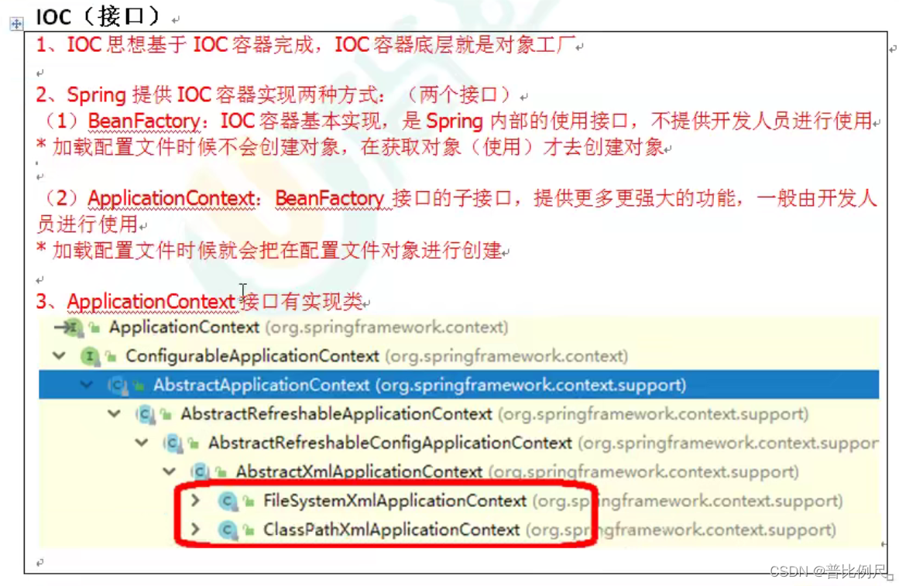
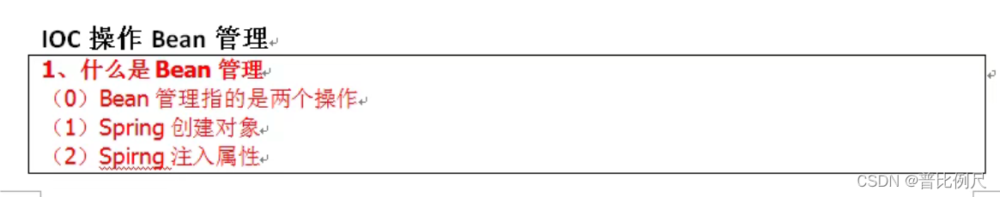
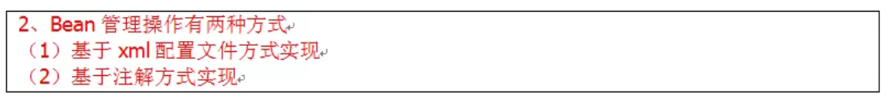
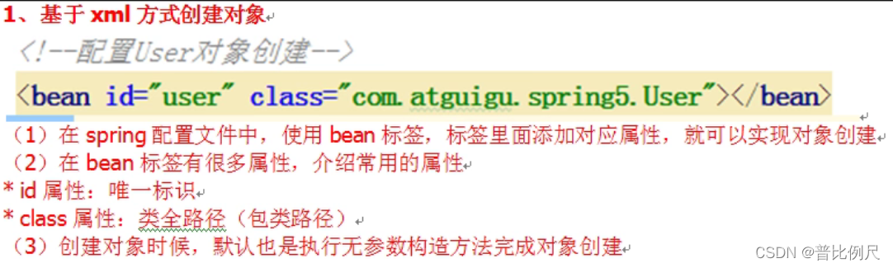
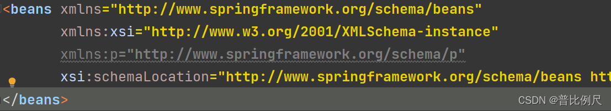
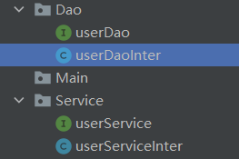
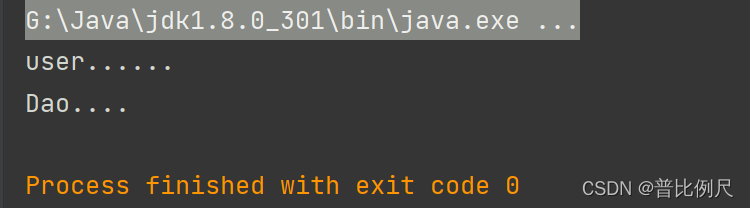
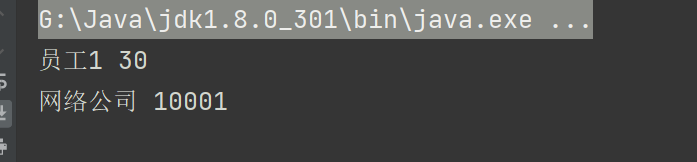
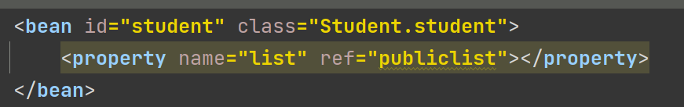
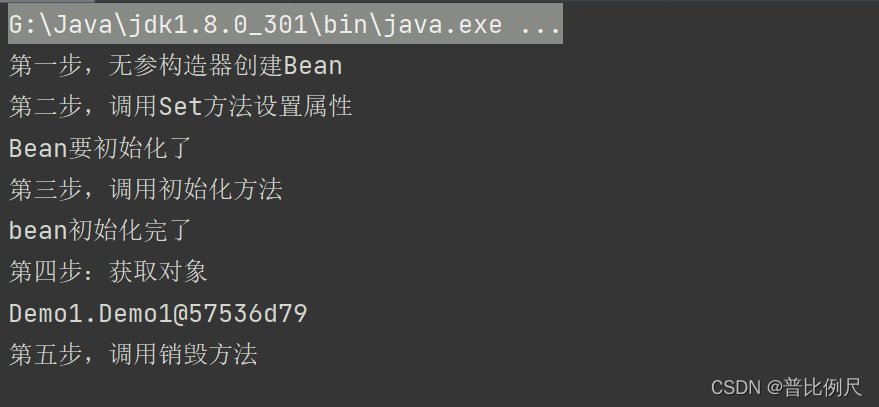

#### Spring笔记

- [Spring使用步骤文字说明](#Spring_1)
- [IOC](#IOC_7)
- - [1.IOC接口](#1IOC_8)
  - [2.IOC操作 Bean](#2IOC_Bean_14)
  - - [2.1 基于XML方式创建对象](#21_XML_18)
    - [2.2 ：注入依赖DI：基本属性注入](#22_DI_20)
    - - [1：第一种方法：set方法注入](#1set_21)
      - [2：第二种方法：P空间注入](#2P_69)
      - [3：第二种方法：有参构造器注入](#3_93)
    - [2.3 ：注入依赖DI：字面量注入](#23_DI_135)
    - - [1：空值注入](#1_136)
      - [2： 特殊符号注入](#2__146)
    - [2.4 ：外部Bean注入](#24_Bean_156)
    - [2.5 ：内部Bean注入](#25_Bean_211)
    - [2.6 ：级联Bean注入](#26_Bean_278)
    - [2.7 ：集合注入](#27__350)
    - - [2.7.1 ：在集合里注入对象](#271__408)
      - [2.7.2 ：在.xml文件中配置一个公共集合](#272_xml_459)
    - [2.8 ：普通Bean和工厂Bean（FactoryBean）](#28_BeanBeanFactoryBean_517)
    - [2.9 ：Bean的作用域](#29_Bean_560)
    - [2.10 ：Bean的生命周期](#210_Bean_568)
    - - [1：基本五步](#1_569)
      - [2：后置处理器七步](#2_615)
    - [2.11 ：自动装配](#211__652)
    - [2.12 ：引入外部配置文件，举例数据库链接](#212__660)
    - - - [1：一般的数据库连接](#1_661)
        - [2：引入外部配置文件](#2_678)
- [核心知识点](#_732)

## Spring使用步骤文字说明

> 1.导入Spring开发所用的包（如果使用Maven配置坐标即可）  
>  2.编写Dao接口和实现类  
>  3.根据实现类的内容创建Spring配置文件（.XML文件）  
>  4.根据对UserDao对象的要求配置.xml文件  
>  5.获取Spring所产生的Bean实例

## IOC

### 1.IOC接口

  
 说明：  
 FileSystemXmlApplicationContext：路径为盘符路径  
 ClassPathXmlApplicationContext：路径为文件路径

### 2.IOC操作 Bean

  
 

#### 2.1 基于XML方式创建对象



#### 2.2 ：注入依赖DI：基本属性注入

##### 1：第一种方法：set方法注入

第一步：创建一个类，设置属性以及对于的set方法

```
public class Book {
    public String auto;
    public String name;
    public void setAuto(String auto) {
        this.auto = auto;
    }
    public void setName(String name) {
        this.name = name;
    }
}
```

第二步：在spring配置文件（.xml文件）中配置对象的创建以及属性的注入

```
<!---bean：配置book对象的创建-->
<!--id：对象的唯一表示  class：创建对象的类的的路径-->
<bean id="book" class="Test_Spring5.Book">
      <!---property表示注入属性-->
      <!--name表示要注入的属性名 vlaue表示要注入的属性值-->
      <property name="auto" value="123"></property>
      <property name="name" value="456"></property>       
</bean>
```

**第三步：使用**  
 代码：

```
public class Main {
    public static void main(String[] args) {

       //1.加载spring配置文件
       //FileSystemXmlApplicationContext：路径为盘符路径
	   //ClassPathXmlApplicationContext：路径为文件路径
       ApplicationContext context=
               new ClassPathXmlApplicationContext("Test_spring5.xml");
       //2.创建对象
        /*
        getBean：Spring IOC容器中获取bean实例
        格式：getBean(String name,Class requiredType)
                name：要获取的javaBean的标识
                requiredType：要获取的javaBean的类型
        */
       Book book=context.getBean("book",Book.class);
       System.out.println(book.auto);
       }
    }
```

##### 2：第二种方法：P空间注入

这种方法底层还是使用set，但是更简化

第一步：在xml文件中的beans中添加`xmlns:p="http://www.springframework.org/schema/p"`  
   
 第二步：配置bean

```
<bean id="book" class="Test_Spring5.Book"
                p:auto="好好学习"
                p:name="天天向上"
></bean>
```

第三步：使用

```
public class Main {
    public static void main(String[] args) {
        ApplicationContext context=
                new ClassPathXmlApplicationContext("Test_spring5.xml");
        Book fin=context.getBean("book",Book.class);
        System.out.println(fin.auto+fin.name);
       }
}
```

##### 3：第二种方法：有参构造器注入

第一步：创建一个类，设置属性以及构造器

```
public class finance {
    public String date;
    public String name;
    public finance(String date, String name) {
        this.date = date;
        this.name = name;
    }
}
```

第二步：在xml文件里面配置

```
<!--bean：配置finance对象的创建-->
<bean id="finance" class="Test_Spring5.finance">
      <!---constructor-arg表示构造器注入-->
      <constructor-arg name="date" value="2021"></constructor-arg>
      <constructor-arg name="name" value="郝佳顺"></constructor-arg>
</bean>
```

或者

```
<bean id="finance" class="Test_Spring5.finance">
      <!---index为参数顺序的索引值-->
      <constructor-arg index="0" value="2021"></constructor-arg>
      <constructor-arg index="1" value="郝佳顺"></constructor-arg>
</bean>
```

第三步：使用

```
public class Main {
    public static void main(String[] args) {
        ApplicationContext context=
                new ClassPathXmlApplicationContext("Test_spring5.xml");
        finance fin=context.getBean("finance",finance.class);
        System.out.println(fin.date+fin.name);
       }
}
```

#### 2.3 ：注入依赖DI：字面量注入

##### 1：空值注入

```
<bean id="book" class="Test_Spring5.Book">
       <!--可以分开注入属性和值-->
       <property name="name">
        <!-- 空值注入 -->
        	<null/>
        </property>        
</bean>
```

##### 2： 特殊符号注入

```
<bean id="book" class="Test_Spring5.Book">
      <property name="name">
          <!--value标签里面的内容都为注入的内容，包括回车-->
          <value><![CDATA[<<特殊符号>>]]></value>
     </property>
</bean>
```

#### 2.4 ：外部Bean注入

第一步：创建两个不同的实现类  
   
 我们要做的是在Service中调用Dao里面的方法  
 也就是  
 在Service中注入Dao

第二步：在Service中创建Dao中属性并生成set方法

```
public class userServiceInter implements userService{
    
    public userDao demo;
    public void setDemo(userDao demo){
        this.demo=demo;
    }
    
    public void add() {
        System.out.println("user......");
        demo.add();//调用
    }
    
}
```

第三步：在.xml文件中配置

```
	<!-- 创建service和dao的bean（对象）创建-->
    <bean id="userService" class="Service.userServiceInter">
        <!--在service中注入dao对象-->
        <!--注入：
            name：service中创建的dao的对象
            ref：dao的对象（上面创建的）
         -->
        <property name="demo" ref="userDao"></property>
    </bean>

    <bean id="userDao" class="Dao.userDaoInter"></bean>
```

第四步：编写测试代码

```
public class Main {
    public static void main(String[] args) {
        //加载配置文件
        ApplicationContext context=
                new ClassPathXmlApplicationContext("bean.xml");

        //创建service的对象
        userService user=context.getBean("userService",userService.class);

        //输出
        user.add();
    }
}
```

结果：  
 

#### 2.5 ：内部Bean注入

举例部门与员工之间的一对多关系

第一步：创建员工类和部门类，生成对应的set方法

员工类：

```
public class Employee {
    String name;
    String age;
    //设置唯一的部门对象
    Department department;

    public void setDepartment(Department department) {
        this.department = department;
    }

    public void setName(String name) {
        this.name = name;
    }

    public void setAge(String age) {
        this.age = age;
    }

    public void add(){
        System.out.println(name+" "+age);
        department.add();
    }
}
```

部门类

```
public class Department {
    String name;
    String number;

    public void setName(String name) {
        this.name = name;
    }

    public void setNumber(String number) {
        this.number = number;
    }
    public void add(){
        System.out.println(name+" "+number);
    }
}
```

第二步：配置.xml文件

```
    <!-- 创建部门员工bean-->
    <bean id="employee" class="Employee.Employee">
        <!--注入属性-->
        <property name="name" value="员工1"></property>
        <property name="age" value="30"></property>
        
        <!--注入对象属性-->
        <property name="department">
            <bean id="department" class="Department.Department">
                <property name="name" value="科技公司"></property>
                <property name="number" value="139XXXXXX22"></property>
            </bean>
        </property>
    </bean>
```

#### 2.6 ：级联Bean注入

以下两种方法是在`内部Bean注入`的基础上改写

第一种：

```
<!-- 创建部门员工bean-->
   <bean id="employee" class="Employee.Employee">
       <property name="name" value="员工1"></property>
       <property name="age" value="30"></property>

       <!--级联赋值-->
       <property name="department" ref="department"></property>
    </bean>
    
    <bean id="department" class="Department.Department">
        <property name="name" value="科技公司"></property>
        <property name="number" value="150XXXX2631"></property>
    </bean>
```

第二种：  
 第一步：在员工类中添加get公司对象的方法

```
public class Employee {
    String name;
    String age;
    Department department;
    
    //get公司对象
    public Department getDepartment() {
        return department;
    }
    
    public void setDepartment(Department department) {
        this.department = department;
    }

    public void setName(String name) {
        this.name = name;
    }

    public void setAge(String age) {
        this.age = age;
    }

    public void add(){
        System.out.println(name+" "+age);
        department.add();
    }
}
```

第二步：修改.xml文件

```
    <bean id="employee" class="Employee.Employee">
        <property name="name" value="员工1"></property>
        <property name="age" value="30"></property>

        <!--级联赋值-->
        <property name="department" ref="department"></property>

        <!--得到的对象.属性 使用value直接赋值-->
        <property name="department.name" value="网络公司" ></property>
        <property name="department.number" value="10001" ></property>
    </bean>
    
    <bean id="department" class="Department.Department">
        <!--上面赋值以后，下面的内容就失效了-->
        <property name="name" value="科技公司"></property>
        <property name="number" value="150XXXX2631"></property>
    </bean>
```



#### 2.7 ：集合注入

```
public class exhi {
    public String srt[];
    public Map<String,String> map;
    public List<String> list;

    public void setSrt(String[] srt) {
        this.srt = srt;
    }
    public void setMap(Map<String, String> map) {
        this.map = map;
    }
    public void setList(List<String> list) {
        this.list = list;
    }

    public void add(){
        System.out.println(Arrays.toString(srt));
        System.out.println(list);
        System.out.println(map);
    }
}
```

```
<bean id="exhibition" class="exhibition.exhi">

    <!--数组类型注入-->
        <property name="srt">
            <!--array or list -->
            <array>
                <value>好好学习!</value>
                <value>天天向上!</value>
                <value>成长万岁！</value>
            </array>
        </property>

    <!--list属性注入-->
        <property name="list">
            <list>
                <value>好好想学习1</value>
                <value>天天向上1</value>
                <value>成长万岁1</value>
            </list>
        </property>

    <!--Map属性注入-->
        <property name="map">
            <map>
                <entry key="好好学习" value="天天向上"></entry>
            </map>
        </property>

    </bean>
```

##### 2.7.1 ：在集合里注入对象

1.在类中创建一个List集合，限定属性为对象

```
public class student {

    String name;
    String age;
    
    //在类中创建一个List集合，限定属性为对象：
    List<course> list;
    
    public void setName(String name) {
        this.name = name;
    }

    public void setAge(String age) {
        this.age = age;
    }

    public void setList(List<course> list) {
        this.list = list;
    }


}
```

2.配置文件

```
	<bean id="student1" class="Student.student">
        <property name="name" value="小明"></property>
        <property name="age"  value="17"></property>
        
        <!--list属性注入-->
        <property name="list">
            <list>
                <!--注入的是下面创建的对象-->
                <ref bean="course1"></ref>
                <ref bean="course2"></ref>
            </list>
        </property>
    </bean>
    
	 <!--对象创建-->
    <bean id="course1" class="Course.course">
        <property name="name" value="高数"></property>
    </bean>
    <bean id="course2" class="Course.course">
        <property name="name" value="计组"></property>
    </bean>
```

##### 2.7.2 ：在.xml文件中配置一个公共集合

在xml文件中设置一个公共的list集合

第一步：在xm头文件中添加和修改下面代码

```
源代码：
<beans xmlns="http://www.springframework.org/schema/beans"
       xmlns:xsi="http://www.w3.org/2001/XMLSchema-instance"
       xsi:schemaLocation="http://www.springframework.org/schema/beans http://www.springframework.org/schema/beans/spring-beans.xsd">

修改：
<beans xmlns="http://www.springframework.org/schema/beans"
       xmlns:xsi="http://www.w3.org/2001/XMLSchema-instance"
       
       添加1：
       xmlns:util="http://www.springframework.org/schema/util"
       
       添加2：复制下面代码并追加，将beans都修改为util
       xsi:schemaLocation="http://www.springframework.org/schema/beans http://www.springframework.org/schema/beans/spring-beans.xsd
						   http://www.springframework.org/schema/util http://www.springframework.org/schema/util/spring-util.xsd">
```

第二步：创建公用的list集合

```
<!--公用的list集合-->
    <util:list id="publiclist">
        <value>好好学习</value>
        <value>天天向上</value>
    </util:list>
```

第三步：使用

```
<bean id="student" class="Student.student">
    <property name="list" ref="publiclist"></property>
</bean>
```

完整代码：

```
<?xml version="1.0" encoding="UTF-8"?>
<beans xmlns="http://www.springframework.org/schema/beans"
       xmlns:xsi="http://www.w3.org/2001/XMLSchema-instance"
       xmlns:util="http://www.springframework.org/schema/util"
       xsi:schemaLocation="http://www.springframework.org/schema/beans http://www.springframework.org/schema/beans/spring-beans.xsd
                           http://www.springframework.org/schema/util http://www.springframework.org/schema/util/spring-util.xsd">
 <!--公用的list集合-->
    <util:list id="publiclist">
        <value>好好学习</value>
        <value>天天向上</value>
    </util:list>

    <bean id="student" class="Student.student">
        <property name="list" ref="publiclist"></property>
    </bean>
</beans>
```

#### 2.8 ：普通Bean和工厂Bean（FactoryBean）

普通bean：配置文件中限制了Bean的类型  
   
 工厂bean：返回的Bean的类型可以不是配置文件中的类型；  
 操作：

第一步：配置xml文件原始类的Bean

```
<bean id="cous" class="Couse.Cous"> </bean>
```

第二步：使原始类实现`FactoryBean``接口、限制泛型、重写方法

```
public class Cous implements FactoryBean<Teacher> {
    
    //定义返回的Bean
    @Override
    public Teacher getObject() throws Exception {
        Teacher tea=new Teacher();
        tea.setName("haohaohao");
        return tea;
    }

    @Override
    public Class<?> getObjectType() {
        return null;
    }

    @Override
    public boolean isSingleton() {
        return FactoryBean.super.isSingleton();
    }
}
```

第三步：使用

```
ApplicationContext context=new ClassPathXmlApplicationContext("bean.xml");

//获取的Bean的名称还是"cous"，但类型需要改变为Teacher.class
Teacher ter=context.getBean("cous",Teacher.class);

System.out.println(ter.name);
```

#### 2.9 ：Bean的作用域

Bean默认是单实例对象，如果想修改为多实例，可以修改xml配置文件实现

```
<bean id="cous" class="Couse.Cous" scope="prototype"> </bean>
scope="prototype" ：多实例，调用getBean()方法时候创建对象
scope="singleton" ：单实例（默认），加载配置文件时候创建对象
```

#### 2.10 ：Bean的生命周期

##### 1：基本五步

```
public class Demo1 {
    public String name;

    public Demo1(){
        System.out.println("第一步，无参构造器创建Bean");
    }

    public void setName(String name) {
        this.name = name;
        System.out.println("第二步，调用Set方法设置属性");
    }
    public void initMethod(){
        System.out.println("第三步，调用初始化方法");
    }
    public void destMethod(){
        System.out.println("第五步，调用销毁方法");
    }
}
```

```
public class Main {
    public static void main(String[] args) {
        //ApplicationContext 里面没有close方法，选择其子实现类
       ClassPathXmlApplicationContext context=
               new ClassPathXmlApplicationContext("bean1.xml");
       Demo1 demo1=context.getBean("Demo1",Demo1.class);
        System.out.println("第四步：获取对象");
        System.out.println(demo1);
        
        //第五步 销毁
       context.close();
    }
}
```

```
init-method:设置初始化方法
destroy-method：设置销毁方法

<bean id="Demo1" class="Demo1.Demo1" init-method="initMethod" destroy-method="destMethod">
    <property name="name" value="999999"></property>
  </bean>
```

##### 2：后置处理器七步

> 1.后置处理调用在获取对象的前后，目的是对配置文件中所有的bean对象进行设置  
>  2.继承BeanPostProcessor的类便为后置处理器的类

配置后置处理器

```
//继承BeanPostProcessor便为后置处理器的类
public class MebeanPost implements BeanPostProcessor {
    //@Override简单理解就是这个句话下边的方法是继承父类的方法，对其覆盖

    //Bean初始化前调用的方法
    @Override
    public Object postProcessBeforeInitialization(Object bean, String beanName) throws BeansException {
        System.out.println("Bean要初始化了");
        return bean;
    }

    //Bean初始化后调用的方法
    @Override
    public Object postProcessAfterInitialization(Object bean, String beanName) throws BeansException {
        System.out.println("bean初始化完了");
        return bean;
    }
}
```

```
<bean id="Demo1" class="Demo1.Demo1" init-method="initMethod" destroy-method="destMethod">
    <property name="name" value="999999"></property>
  </bean>

<!-- 配置后置处理器，处理所有的Bean-->
    <bean id="MebeanPost" class="Demo1.MebeanPost"></bean>
</beans>
```



#### 2.11 ：自动装配

```
//根据名称寻找对应的注入bean
<bean id="" class="" autowire="byName"></bean>

//确保类bean唯一，根据类型寻找对应的注入bean
 <bean id="" class="" autowire="byType"></bean>
```

#### 2.12 ：引入外部配置文件，举例数据库链接

###### 1：一般的数据库连接

引入德鲁伊连接池的jar包  
   
 配置，xml文件

```
<bean id="dataSource" class="com.alibaba.druid.pool.DruidDataSource">
    <!--数据库驱动名称-->
    <property name="driverClassName" value="com.mysql.jdbc.Driver"></property>

    <!--数据库地址-->
    <property name="url" value="jdbc:mysql://localhost:3306/数据库名称"></property>
   
    <!--链接数据库的用户名和密码-->
    <property name="username" value="root"></property>
    <property name="password" value="root"></property>
</bean>
```

###### 2：引入外部配置文件

1.创建properties文件

```
以键值对的方式写入，等号前面名称随便起

<!--数据库驱动名称-->
prop.driverClass=com.mysql.jdbc.Driver
<!--数据库地址-->
prop.url=jdbc:mysql://localhost:3306/数据库名称
<!--链接数据库的用户名和密码-->
prop.userName=root
prop,password=root
```

2.引入properties文件到Spring中  
 引入名称空间

```
xmlns:context="http://www.springframework.org/schema/context"

http://www.springframework.org/schema/context http://www.springframework.org/schema/context/spring-context.xsd
```

3.xml文件引入

```
<?xml version="1.0" encoding="UTF-8"?>
<beans xmlns="http://www.springframework.org/schema/beans"
       xmlns:xsi="http://www.w3.org/2001/XMLSchema-instance"
       xmlns:context="http://www.springframework.org/schema/context"
       xsi:schemaLocation
               ="http://www.springframework.org/schema/beans http://www.springframework.org/schema/beans/spring-beans.xsd
                http://www.springframework.org/schema/context http://www.springframework.org/schema/context/spring-context.xsd">


	//引入外部文件
	<context:property-placeholder location="classpath:jdbc.properties"/>
	//${}的方式提取
    <bean id="dataSource" class="com.alibaba.druid.pool.DruidDataSource">
        <!--数据库驱动名称-->
        <property name="driverClassName" value="${prop.driverClass}"></property>

        <!--数据库地址-->
        <property name="url" value="${prop.url}"></property>

        <!--链接数据库的用户名和密码-->
        <property name="username" value="${prop.userName}"></property>
        <property name="password" value="${prop,password}"></property>
    </bean>

</beans>
```

## 核心知识点

```
	1. getBean：Spring IOC容器中获取bean实例
	   格式：getBean(String name,Class requiredType)
		 name：要获取的javaBean的标识
		 requiredType：要获取的javaBean的类型
		
	2. FileSystemXmlApplicationContext：路径为盘符路径
	   ClassPathXmlApplicationContext：路径为文件路径

	3. property表示注入属性(set注入)
      name表示要注入的属性名 vlaue表示要注入的属性值
      <property name="auto" value="123"></property>
      <property name="name" value="456"></property>  

	4. constructor-arg表示构造器注入
      <constructor-arg name="date" value="2021"></constructor-arg>
      <constructor-arg name="name" value="郝佳顺"></constructor-arg>

	5. 级联赋值：ref与要赋予的bean的id同名
	  <bean id="employee" class="Employee.Employee">
       		<!--级联赋值-->
       		<property name="department" ref="department"></property>
      </bean>
    
     <bean id="department" class="Department.Department">
        <property name="name" value="科技公司"></property>
        <property name="number" value="150XXXX2631"></property>
     </bean>

	6.遍历数组：Arrays.toString(srt)；

	7.集合中注入对象
        <property name="list">
            <list>
                <!--注入的是下面创建的对象-->
                <ref bean="course1"></ref>
                <ref bean="course2"></ref>
            </list>
        </property>
	
	
```