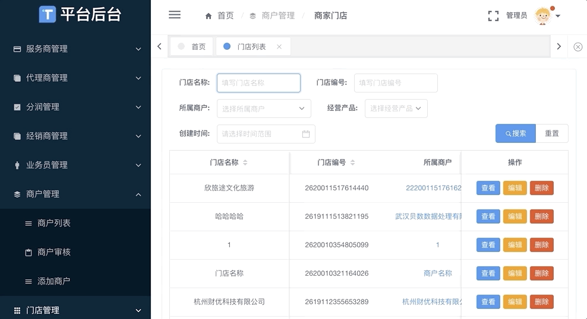
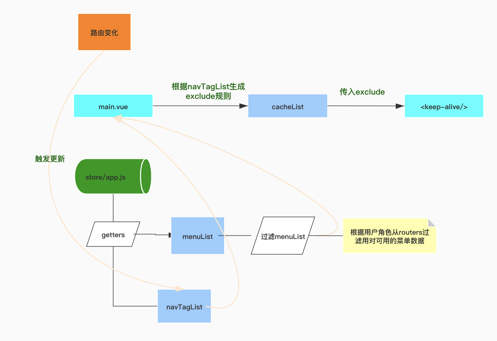
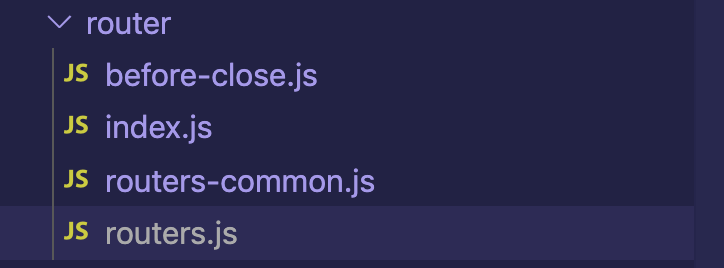

## 背景介绍
最近在做公司后台管理系统项目时遇到一个比较怪异的bug——采用`keep-alive+vue-router`实现的路由缓存遇到**缓存不生效**的情况。



<a name="2VhOm"></a>
## 项目背景
此项目是基于[iview-admin@2.0](https://github.com/iview/iview-admin/tree/2.0)进行开发的，全局状态管理采用vuex分module实现，路由采用vue-router进行路由配置表的方式实现。

项目属于基于[RBAC](https://www.cnblogs.com/niuli1987/p/9871182.html)的后台管理系统，需要多用户多角色的权限控制，同时路由功能菜单以及展示的字段需按角色划分，因此左侧系统菜单根据接口进行动态设置。

项目中可以进行菜单的图标、跳转路径、是否隐藏等进行配置，路径对应的前端路由则由前端的路由记录进行管理，即菜单管理功能设置的跳转路径是否可用由此路由记录决定。

<a name="PpZiO"></a>
## 解决过程

<a name="nC48B"></a>
### 核实路由缓存用法问题
发现这个bug之后梳理了一遍路由组件缓存的实现方案，同时仔细核对了一遍[vue-router的官方文档](https://router.vuejs.org/zh/api/#router-view)

官方推荐的用法如下：

```vue
<transition>
  <keep-alive>
    <router-view></router-view>
  </keep-alive>
</transition>
```

可以排除基本用法的问题，如是继续翻阅[vue的官方文档](https://cn.vuejs.org/v2/guide/components-dynamic-async.html#%E5%9C%A8%E5%8A%A8%E6%80%81%E7%BB%84%E4%BB%B6%E4%B8%8A%E4%BD%BF%E7%94%A8-keep-alive)，keep-alive的缓存匹配原理是根据组件的name作为key来进行缓存，官方的提示


随即检查代码中的路由记录的name以及对应component的name，发现都有定义好，因此**排除基本用法的错误导致。**

## iview-admin的不完善导致
进行上述问题排查后定位到此问题出在keep-alive组件的include参数处，keep-alive的参数说明如下：

> - `include` - 字符串或正则表达式。只有名称匹配的组件会被缓存。
> - `exclude` - 字符串或正则表达式。任何名称匹配的组件都不会被缓存。
> - `max` - 数字。最多可以缓存多少组件实例。


iview-admin@2.0中通过路由的meata参数——notCache来控制路由对应的组件是否进行缓存，其源码中有如下注释说明：

> _设为true后页面在切换标签后不会缓存，如果需要缓存，无需设置这个字段，而且需要设置页面组件name属性和路由配置的name一致_


其文档文档上关于路由meta参数的说明[在这里](https://github.com/iview/iview-admin/blob/2.0/src/router/routers.js#L13)。

**其注释说明说要让组件实现缓存必须要保证页面组件的name和路由配置的name一致，而该项目中路由配置根据由后台设置功能决定，故修改不能缓存的页面的路由配置的namne即可解决问题。**

仅仅是解决了此bug总感觉还不够，不如顺便研究一个iview-admin的源码是如何实现路由缓存的。

<a name="bpktj"></a>
#### iview-admin实现路由组件缓存原理



iview-admin中将navTagList、menuList等数据保存在全局的vuex的app模块中，navTagList是当前的当前打开过的标签页数组根据路由变化动态更新；menuList是当前登录用户的菜单数组，默认根据路由记录的meta参数的access字段进行过滤

cacheList是app模块的的getters之一，用户从tagNavList中计算出当前打开的标签页需要用keep-alive缓存的组件name数组，此处采用的是动态修改keep-alive组件的exclude的值来动态更新路由的缓存规则

<a name="mKsZi"></a>
### iview-admin的一些局限

iview-admin中的用户权限路由控制思路是：采用路由meata参数的access数组来标签当前路由可访问的用户角色，根据路由记录计算出对应用户的menuList进行渲染。

这个实现方案存在一些不足：

- 路由采用配置表的方式由前端进行配置，路由需要更新时需要前端更新代码进行打包部署的整套项目发布流程
- 菜单完全由路由配置即用户角色计算得出，后端不能够灵活的重置页面菜单显示

基于以上这些考虑对iview-admin默认的权限控制、路由配置进行如下的优化。

<a name="1I0lB"></a>
### 考虑优化方案
<a name="CvW0E"></a>
#### 路由分类划分
项目中的路由组件包括Man.vue进行布局控制，404.vue 500.vue等处理前端路由异常的展示，login.vue error_log.vue等展示用户注册登录日志记录等页面，这些页面路由通常不会经常更新不需要进行动态注册，而像其他的复杂业务逻辑处理页面需要接口进行动态配置。

故将路由进行拆分，基础路由——routers-common直接配置到router中，业务路由——routers进行动态注册



<a name="O2NSJ"></a>
#### 路由动态注册
vuex的store中的user模块添加获取用户路由配置的action——getUserRoutes，在用户登录成功后或者或者Main.vue的mounted生命周期中根据用户token调用接口获取用户路由配置

调用[router.addRoutes](https://router.vuejs.org/zh/api/#router-addroutes)方法进行路由的动态注册。

<a name="e1x10"></a>
## 更进一步
> 后续考虑更进一步的研究vue-router的view部分的源码，彻底弄懂router-view如何与keep-alive实现关联，后续的更新将尽快更新到此处。
