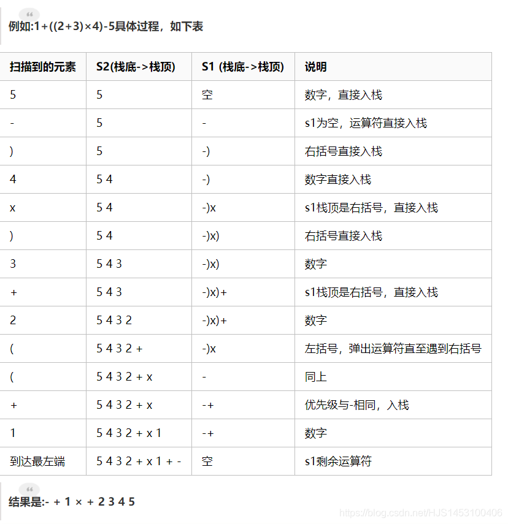
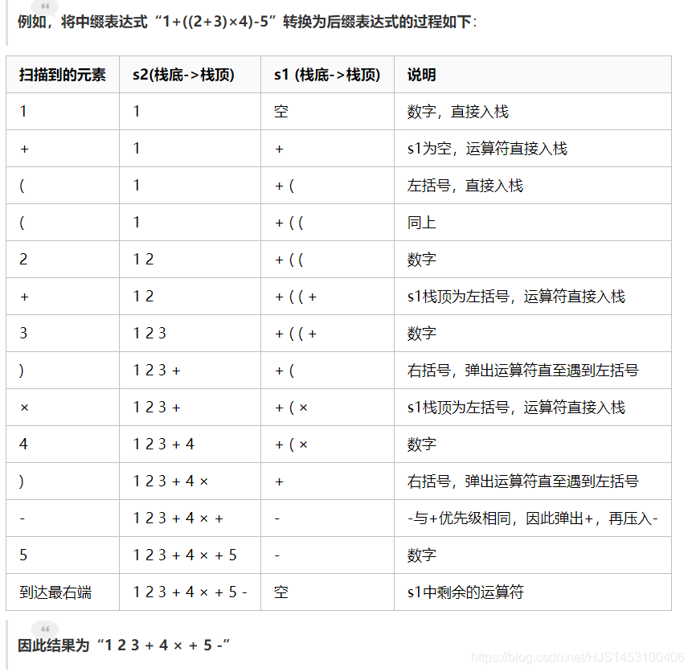

#### 表达式

- - - [1.中缀表达式：](#1_1)
    - [2.前缀表达式：](#2_4)
    - - [2.1中缀表达式转前缀表达式：](#21_7)
      - [2.2前缀表达式计算：](#22_24)
    - [3.后缀表达式：](#3_34)
    - - [3.1中缀表达式转后缀表达式：](#31_36)
      - [3.2后缀表达式计算：](#32_52)

#### 1.中缀表达式：

常见的表达式，例如：（3+4）\*4-7；

#### 2.前缀表达式：

前缀表达式的运算符位于操作数之前  
 例如：-\*+123；

##### 2.1中缀表达式转前缀表达式：

1.初始化两个栈:运算符栈s1，储存中间结果的栈s2  
 2.从右至左扫描中缀表达式  
 3.遇到操作数时，将其压入s2  
 4.遇到运算符时，比较其与s1栈顶运算符的优先级  
 4.1如果s1为空，或栈顶运算符为右括号“)”，则直接将此运算符入栈  
 4.2否则，若优先级比栈顶运算符的较高或相等，也将运算符压入s1  
 4.3否则，将s1栈顶的运算符弹出并压入到s2中，再次转到(4.1)与s1中新的栈顶运算符相比较  
 5.遇到括号时  
 5.1如果是右括号“)”，则直接压入s1  
 5.2如果是左括号“(”，则依次弹出S1栈顶的运算符，并压入S2，直到遇到右括号为止，此时将这一对括号丢弃  
 6.重复步骤2至5，直到表达式的最左边  
 7.将s1中剩余的运算符依次弹出并压入s2  
 8.依次弹出s2中的元素并输出，结果即为中缀表达式对应的前缀表达式

##### 2.2前缀表达式计算：

从右至左扫描表达式，遇到数字时，将数字压入堆栈，遇到运算符时，弹出栈顶的两个数，用运算符对它们做相应的计算（栈顶元素 op 次顶元素），并将结果入栈；重复上述过程直到表达式最左端，最后运算得出的值即为表达式的结果；

例如:- × + 3 4 5 6  
 1.从右至左扫描，将6、5、4、3压入堆栈  
 2.遇到+运算符，因此弹出3和4（3为栈顶元素，4为次顶元素，注意与后缀表达式做比较），计算出3+4的值，得7，再将7入栈  
 3.接下来是×运算符，因此弹出7和5，计算出7×5=35，将35入栈  
 4.最后是-运算符，计算出35-6的值，即29，由此得出最终结果

#### 3.后缀表达式：

后缀表达式与前缀表达式类似，只是运算符位于操作数之后。

##### 3.1中缀表达式转后缀表达式：

与转换为前缀表达式相似，遵循以下步骤：  
 (1) 初始化两个栈：运算符栈S1和储存中间结果的栈S2；  
 (2) 从左至右扫描中缀表达式；  
 (3) 遇到操作数时，将其压入S2；  
 (4) 遇到运算符时，比较其与S1栈顶运算符的优先级：  
 (4-1) 如果S1为空，或栈顶运算符为左括号“(”，则直接将此运算符入栈；  
 (4-2) 否则，若优先级比栈顶运算符的高，也将运算符压入S1（注意转换为前缀表达式时是优先级较高或相同，而这里则不包括相同的情况）；  
 (4-3) 否则，将S1栈顶的运算符弹出并压入到S2中，再次转到(4-1)与S1中新的栈顶运算符相比较；  
 (5) 遇到括号时：  
 (5-1) 如果是左括号“(”，则直接压入S1；  
 (5-2) 如果是右括号“)”，则依次弹出S1栈顶的运算符，并压入S2，直到遇到左括号为止，此时将这一对括号丢弃；  
 (6) 重复步骤(2)至(5)，直到表达式的最右边；  
 (7) 将S1中剩余的运算符依次弹出并压入S2；  
 (8) 依次弹出S2中的元素并输出，结果的逆序即为中缀表达式对应的后缀表达式（转换为前缀表达式时不用逆序）。例如，将中缀表达式“1+((2+3)×4)-5”转换为后缀表达式的过程如下：  
 

##### 3.2后缀表达式计算：

后缀表达式的计算机求值：  
 与前缀表达式类似，只是顺序是从左至右：  
 从左至右扫描表达式，遇到数字时，将数字压入堆栈，遇到运算符时，弹出栈顶的两个数，用运算符对它们做相应的计算（次顶元素 op 栈顶元素），并将结果入栈；重复上述过程直到表达式最右端，最后运算得出的值即为表达式的结果。  
 例如后缀表达式“3 4 + 5 × 6 -”：  
 (1) 从左至右扫描，将3和4压入堆栈；  
 (2) 遇到+运算符，因此弹出4和3（4为栈顶元素，3为次顶元素，注意与前缀表达式做比较），计算出3+4的值，得7，再将7入栈；  
 (3) 将5入栈；  
 (4) 接下来是×运算符，因此弹出5和7，计算出7×5=35，将35入栈；  
 (5) 将6入栈；  
 (6) 最后是-运算符，计算出35-6的值，即29，由此得出最终结果。

**本文非原创内容转载于：[链接](https://www.cnblogs.com/chensongxian/p/7059802.html)**
