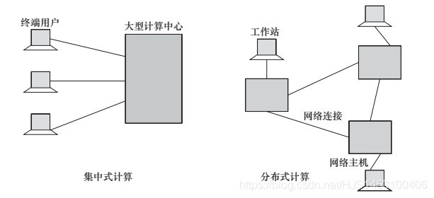
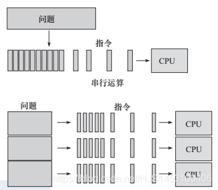
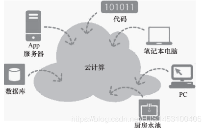

## 分布式计算的概念

“分布式计算是计算机科学的重要研究内容”  
其实他真的很重要，怎么说？  
他的研究对象主要是分布式（的）系统，一个分布式系统包含多台网络互联的计算机，由这些计算机软硬件资源组成的系统可以处理庞大的数据（项目），它可以理解为一种分而治之的方法。  
举个例子，有一个公司接到一个项目订单，但是处理该项目需要用到大量的计算和存储空间，公司的任何一台电脑或服务器都无法满足，怎么办？最直接的办法，去买一块更大的存储空间，换性能更好的处理器，这样可以解决问题，实际上，在分布式系统出现前，人们的确是这样做的，在互联网刚刚建立初期，所以很多公司的业务线都是垂直架构（“垂直架构”与“分布式系统”个人理解为一对“反义词”），如LAMP，在当时数据还算比较简单比较容易处理的时候，简单易上手的垂直架构还能很有效地支撑各个公司的业务发展。  
但是  
随着互联网的发展和普及，数据的产生远远不至于成倍增长。这个时候，垂直架构还可以解决问题吗？可以啊~ 怎么办？砸钱买更好的设备啊…  
对于资本主义国家来说，但凡谈到花钱的问题，总是会让他们大脑开发率到200%  
咳咳，跑题了。  
于是乎，为了解决问题（也为了省钱），分布式系统就诞生了！  
回到刚刚举的例子，公司不是任何一台计算机都处理不了这个订单吗？那为什么不大家一起做？  
把一块难啃的大骨头分成多块好肯的小骨头不就可以了？（写这个的时候突然想到了蒋介石评论博古的错误，有兴趣的可以去看一下）  
这样做的好处有很多：

1. 廉价的计算机和网络访问性可以处理大批量的数据。
2. 可以实现资源共享
3. 可拓展性强（计算机不够就增加连接的机数，多了就断开）
4. 容错性，数据可以实现多备份，一台机器OVER了别的机器上还可以在别的机器上找的到（只是这么理解，实际上一台计算机坏了就有可能影响整个网络系统）

凡事没有绝对性，有有点就会有缺点

1. 多点故障，由于连接的计算机比较多，并且都通过依赖网络通信，因此一台（或多台）计算机出现故障可能会使得整个分布式出现故障，类似与于网络中的总线型结构（用老祖宗的话讲：“都是一根绳上的蚂蚱”）注意：此处说的只是部分分布式系统结构，并不是所有，有的类似于网状形结构，单点故障不会影响全网。
2. 安全性低，由于电脑连的多了导致黑客可攻击的范围也就多了，就好像，有人问你家借钱，你老婆不借，于是找你借，结果你借出去了，总的来说，钱是你们家的，通过你老婆这台主机“攻击”失败后开始“攻击”你这台主机继而成功。

## 分布式计算的相关计算形式

1. 单机计算机（自己干）  
   单机计算是最简单的计算形式，即利用单台计算机（如PC）进行计算，此时计算机不与任何网络互连，因而只能使用本计算机系统内可被即时访问的所有资源。在最基本的单用户单机计算模式中，一台计算机在任何时刻只能被一个用户使用。用户在该系统上执行应用程序，不能访问其他计算机上的任何资源。在PC上使用的诸如文字处理程序或电子表格处理程序等应用就是单用户单机计算的计算形式。  
   多用户也可参与单机计算。在该计算形式中，并发用户可通过分时技术共享单台计算机中的资源，我们称这种计算方式为集中式计算。通常将提供集中式资源服务的计算机称为大型机（mainframe computing）。用户可通过终端设备与大型机系统相连，并在终端会话期间与之交互。  
   
2. 并行计算（大家一起干）  
   并行计算（或称并行运算）是相对于串行计算的概念（如图1-2所示），最早出现于20世纪六七十年代，指在并行计算机上所做的计算，即采用多个处理器来执行单个指令。通常并行计算是指同时使用多种计算资源解决计算问题的过程，是提高计算机系统计算速度和处理能力的一种有效手段。它的基本思想是用多个处理器来协同求解同一问题，即将被求解的问题分解成若干个部分，各部分均由一个独立的处理机来并行计算。  
   
3. 网络计算

网络计算是一个比较宽泛的概念，随着计算机网络而出现。网络技术的发展，在不同的时代有不同的内涵。例如，有时网络计算指分布式计算，有时指云计算或其他新型计算方式。总之，网络计算的核心思想是，把网络连接起来的各种自治资源和系统组合起来，以实现资源共享、协同工作和联合计算，为各种用户提供基于网络的各类综合性服务。网络计算在很多学科领域发挥了巨大作用，改变了人们的生活方式。

4. 网格计算

网格计算是指利用互联网把地理上广泛分布的各种资源（计算、存储、带宽、软件、数据、信息、知识等）连成一个逻辑整体，就像一台超级计算机一样，为用户提供一体化信息和应用服务（计算、存储、访问等）。网格计算强调资源共享，任何结点都可以请求使用其他结点的资源，任何结点都需要贡献一定资源给其他结点。

网格计算侧重并行的计算集中性需求，并且难以自动扩展。云计算侧重事务性应用、大量的单独的请求，可以实现自动或半自动的扩展。

5. 云计算（终于到重点了）

云计算这个概念最早由Google公司提出。2006年，Google高级工程师克里斯托夫·比希利亚第一次提出“云计算”的想法，随后Google推出了“Google 101计划”（101计划，一种实现大学教学资源共享的计划），该计划的目的是让高校的学生参与云的开发，为学生、研究人员和企业家提供Google式的无限计算处理能力，这是最早的“云计算”概念，如图1-3所示。云计算概念包含两个层次的含义：一是商业层面，即以“云”的方式提供服务；二是技术层面，即各种客户端的“计算”都由网络负责完成。通过把云和计算相结合，说明Google在商业模式和计算架构上与传统的软件和硬件公司不同。  

