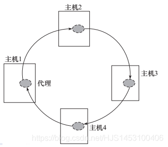
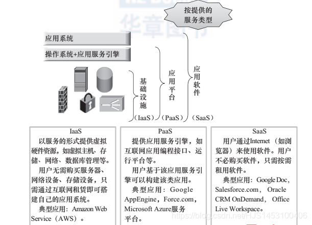

## 分布式计算，云计算与大数据概论（二）–分布式计算范型

现在开始讨论分布式计算的范型，也就是几个主流的分布式计算的应用。

### 1.消息传递性范型

消息的传递是进程间最基本的通信途径，一般有接收方和发送方组成，接收方和发送方可以是多个，所需的基本操作为send和seceive。对于面向连接的通信来说，还需connect（连接）操作和disconnected（拆除连接）操作。  
基于该范式的开发工具有socke应用程序接口（Socket API）和信息传递接口（MessagePassingInterface，MPI）等。  
举两个简单的应用的例子：QQ和微信，都是基于该范型的具体应用。

#### 2.客户/服务器范型

这个特别特别像网络结构中的C/S结构，或者说，他就是。  
客户/服务器范型简称C/S范型，是目前网络中最常用的一种范型，他的概念很简单，有效的抽象了网络的服务请求，服务器端是服务提供者，被动的等待服务的请求，客户端是请求者，向服务端发出请求。其实，双方都进行着进程监听和接收请求，服务器等着客户机，客户机等着操作者，操作者等着老板指示…  
代表实例：万维网

#### 3.P2P范型

所谓P2P，也就是对等网络结构，他的特点为无中心服务器，依靠用户之间的交换的互联网体系。在P2P中，每个结点既是服务器，又是一个结点。结点和结点之间无法之间通信，必须依靠用户群信息交流。此外，在P2P中，没有高低之分，所有的结点都是平等的，具有相同的功能和责任，每个参与者都可以向另外一个参与者发送信息，同样的，也可以接收其它参与者所发送的信息。  
代表实例：Napster，他是一个著名的P2P文件传输服务实例，基于P2P的一种在线音乐服务。

#### 4.消息系统范型

消息系统范型的原理很简单，范型将发送者发送的数据集中到消息系统中，在转发给接收者，作为发送方，只要将消息发送出去即可，无需等待与回应，发送后可立即进行其它操作。消息系统范型大致可以分为两大类：1.点对点消息范型 2.发布/订阅消息范型

##### （1）点对点消息范型

点对点消息范型中，发送者将自己发送的信息发送给消息系统，与基本的消息系统不同的是，点对点消息范型增加了一些存储空间，提供了消息暂存的功能，从而将消息的发送和接收分离开。  
也可以这么理解，点对点消息范型就是基本的消息范型增加了线程或者子进程的技术。

##### （2）发布/订阅消息范型

如果把点对点消息范型的原理理解为类似于电子邮件的传送过程，那么发布/订阅消息范型，顾名思义，真的是发布/订阅消息范型。简单来说，发布者发布了好多好多的消息，但在接收者的一方，用户可以自行选择要接收的内容，而后，由范型找到并发送给用户。发送者可以是多个，接收者也可以是多个。

#### 5.远程过程调用范型

这个就厉害了~~~~  
随着应用程序变的越来越复杂，人们就开始希望可以有一种范型能够使得开发人员编写分布式系统软件时候可以简单一点，于是乎，出现了远程过程调用的范型（RPC）。  
一句话可以理解他的原理：**“想获得进程就发送请求，发了就有”**  
假设有A，B两台计算机，如果计算机A的进程a想获得计算机B中的请求b，那么A可以向B发送一个过程调用，同时传递一组参数值，与本地过程调用的情况一样，该远程过程调用也会触发进程B所提供的一个过程的预定好的“动作”，执行完以后，B就返回b给A中的a。  
代表：COM、DCOM。

#### 6.分布式对象范型

分布式对象技术是在分布式环境下跨平台、跨语言的基于对象的分布式计算技术，它使得对象用户在使用对象时可以访问网络上任意有用的对象，而不必知道该对象所处的位置。 分布式对象技术是构建业务应用框架和软件构件的核心技术，它们中具有代表意义的有三类，即Microsoft 公司的 COM/DCOM/COM+ 技术、Sun公司的JavaBeans、RMI和OMG的CORBA技术。  
（1）远程方法调用  
远程方法调用（RMI）是面向对象版本的RPC。进程可以调用对象方法，该对象可以驻留于某远程主机中。  
（2）对象请求代理  
对象请求代理泛型有对象请求者、对象提供者和对象请求代理组成。进程向对象请求代理发出请求，对象请求代理将请求转发到能提供预期服务的对象。

#### 7.网络服务范型

网络服务范型由服务请求者、服务提供者（对象）和目录服务三者组成。网络服务范型的工作原理为：服务提供者将自身注册到网络上的目录服务器上；当服务请求者（进程）需访问服务时，则在运行时与目录服务器联系；然后，如果请求的服务可用，则目录服务器将向目录服务进程提供一个有关该服务的引用；最后，进程利用该引用来与所需的服务进行交互。  
该范型本质上是对远程方法调用范型的扩展，区别在于服务对象在全局目录服务中注册，允许网络中的服务请求者查询和访问这些服务。在理想情况下，可以采用全局唯一标志符注册和访问服务，在这种情况下，范型将提供额外的一种抽象：位置透明性。位置透明性允许软件开发者在访问对象或服务时，无需知道对象或服务所在的具体位置。  
Java的JINI（Java Intelligent Network Infrastructure）和Web Service都是属于该范型的网络设施。Web服务使用XML和XSD标准来自我描述，用简单对象访问协议（Simple Object Access Protocol，SOAP）交换数据。使用Web服务技术，能使运行于不同机器上的不同应用无需借助其他的支持就可以相互通信。Web服务向外界提供一个能够通过Web进行调用的API，即目录服务。服务访问者可以通过远程过程调用（RPC）的方式访问Web服务，无需知道服务的位置、工作的平台以及实现方式。

#### 8.移动代理范型

移动代理是一种可移动的程序或对象。如图2-13所示，在移动代理范型中，一个代理从源主机出发，然后根据其自身携带的执行路线，自动地在网上主机间移动。在每一主机上，代理访问所需的资源或服务，并执行必要的任务来完成其使命。

移动代理范型为可移动的程序或对象提供了抽象。这种范型不进行消息互换，而是当程序/对象在各个参与结点间移动时，携带并传递数据。支持移动代理范型的商业软件包有Concordia系统和IBM公司的Aglet系统。

一个移动代理的典型应用系统实例为Agent Tcl（Tool Command Language）。到目前为止，已经出现了多种移动代理应用，其中大部分系统还只是原型系统，它们的针对性不同，实现方法也不同。Dartmouth大学的D’Agents小组致力于移动代理的开发和应用，由他们研发的Agent Tcl系统实现了多语言跨平台的移动代理功能。  

#### 9.云服务范型

美国国家标准与技术研究院（NIST）定义了云计算的三种服务模型：基础设施即服务（IaaS）、平台即服务（PaaS）、软件即服务（SaaS）。3种类型云服务对应不同的抽象层次，如图2-14所示，它们的详细描述如下:  
(1）基础设施即服务：云供应处理、存储、网络以及其他基础性的计算资源，以供用户部署或运行自己的软件，包括操作系统或应用。用户并不管理或控制底层的云基础设施，但是拥有对操作系统、存储和部署的应用的控制，以及一些网络组件的有限控制。  
(2）平台即服务：用户可在云基础设施之上部署用户创建或采购的应用，这些应用使用服务商支持的编程语言或工具开发，用户并不管理或控制底层的云基础设施，包括网络、服务器、操作系统、或存储等，但是可以控制部署的应用，以及应用主机的某个环境配置。  
(3）软件即服务：用户可使用服务商运行在云基础设施之上的应用。用户使用各种客户端设备通过“瘦”客户界面（例如浏览器）等来访问应用（例如基于浏览器的邮件）。用户并不管理或控制底层的云基础设施，例如网络、服务器、操作系统、存储甚至其中的单个应用，除了某些有限用户的特殊应用配置项。  

