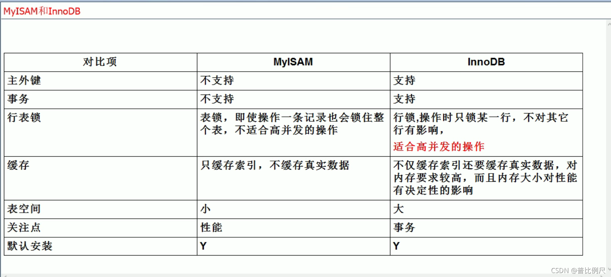

[参考文档](https://blog.csdn.net/w139074301/article/details/112004430#_44)

#### 第三天

- [1.存储引擎](#1_2)
- [2.事务](#2_4)
- [3.Mysql 什么情况会造成脏读、不可重复读、幻读？如何解决](#3Mysql__16)
- [4.Mysql 在可重复读的隔离级别下会不会有幻读的情况，为什么？](#4Mysql__24)
- [5. 什么是索引？](#5__27)

## 1.存储引擎

## 2.事务

**1. 事务是一个操作序列，这些操作要么全部执行，要么都不执行。**

**2. 事务具有四大特性：ACID:A（原子性）、C（一致性）、I（隔离性）、D（持久性）**

| 事务隔离级别 | 脏读 | 不可重复读 | 幻读 |
| --- | --- | --- | --- |
| 读未提交（`read-uncommitted`） | √ | √ | √ |
| 读已提交（`read-committed`） | X | √ | √ |
| 可重复读（`repeatable-read`） | X | X | √ |
| 串行化（`serializable`） | X | X | √ |

## 3.Mysql 什么情况会造成脏读、不可重复读、幻读？如何解决

1. **脏读**：有两个事务A和B，A读取已经被B修改但未提交的字段，此时B回滚，那么A读取的字段就是临时且无效的。可以提高隔离级别，改成读已提交
2. **不可重复读**： 有两个事务A和B，A读取了一个字段值，然后B更新并且提交事务，A再重新读取这个字段，就和之前不相等了。可以提高隔离级别，改成可重复读
3. **幻读**： 有两个事务A和B，A读取某个范围内的记录时，B又在该范围内插入了新的记录并提交，当事务A再次读取该范围的记录时，会产生幻行。可以升级隔离级别到串行化，或者使用 MVCC + next-key锁机制实现

## 4.Mysql 在可重复读的隔离级别下会不会有幻读的情况，为什么？

答：不会。InnoDB存储引擎默认隔离级别为RR，通过MVCC + next-key锁机制解决了幻读的问题。

## 5. 什么是索引？

- 简单来说，索引就是一种 **`排好序用于实现快速查找的数据结构`** ，在数据之外，**`数据库系统还维护着满足特定查找算法的数据结构`**,这些数据结构以某种方式指向数据，这样就可以在这些数据上实现高级查找算法，这就是索引。
- 一般来说索引本身也很大，不可能全部存储在内存中，因此索引往往是存储在 **`磁盘上的文件中`** 的（**可能存储在单独的索引文件中，也可能和数据一起存储在数据文件中**）。
- 如果我们平时所说的索引，如果没有特殊指名，指的都是 B+ 树索引（多路搜索树，并不一定是二叉的）结构组织索引，除了 B+ 树索引以外，还是 hash 索引。[补充](https://blog.csdn.net/qq_42534026/article/details/106197607)