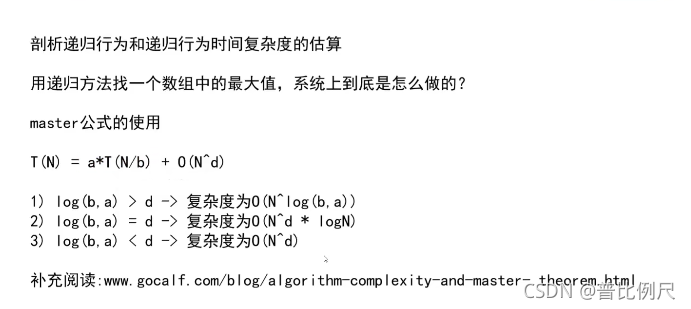

#### 第一天

- [1.选择排序](#1_1)
- [2.冒泡排序](#2_24)
- [3.提取一个数最右边的1](#31_53)
- [4.插入排序](#4_58)
- [5.对数器](#5_87)
- [6.提取数组中间数](#6_132)
- [7.master公式（递归时间复杂度）](#7master_149)
- [8.归并排序（二分）](#8_152)
- [9.快速排序](#9_200)

## 1.选择排序

```
public class Main {
    public static void main(String[] args) {
      int []arr={1,5,3,4,2};
      for(int i=0;i<4;i++){
          int index=i;//min_sub
          for (int j = i+1; j <5 ; j++) {
              index=arr[j]>arr[index]?index:j;//swap-sub
              swap(arr,i,index);
          }
      }
        for(int x:arr){
            System.out.println(x);
        }
    }
    public static void swap(int arr[],int a,int b){
        int tmp=arr[a];
        arr[a]=arr[b];
        arr[b]=tmp;
    }
}
```

## 2.冒泡排序

```
public class Main {
    public static void main(String[] args) {
      int []arr={1,5,3,4,2};
        for (int i = 4; i >0 ; i--) {//i=lengthen-1,从后向前确定

            for (int j = 0; j <i ; j++) {//核心：j<i;
                if (arr[j]>arr[j+1])
                    swap(arr,j,j+1);
            }
        }
        for(int x:arr){
            System.out.println(x);
        }
    }
    public static void swap(int arr[],int a,int b){
	//        int tmp=arr[a];
	//        arr[a]=arr[b];
	//        arr[b]=tmp;
        
        if(arr[b]==arr[a])
            return;
        arr[a]=arr[a]^arr[b];
        arr[b]=arr[a]^arr[b];
        arr[a]=arr[a]^arr[b];
    }
}
```

## 3.提取一个数最右边的1

```
int rightOne = eor & (~eor+1);//提取一个数最右边的1
```

## 4.插入排序

```
public class Main {
    public static void main(String[] args) {
      int []arr={1,5,9,5,6,4,7,8,5,3};
      
        for (int i = 1; i <arr.length ; i++) {//第一个数不用排序,0~i上有序
            
            //当前数和左边的所有数进行比较直到不能（不必）比较为止
            for (int j = i-1; j>=0 && arr[j+1]<arr[j]; j--) {//确定范围以后从后往前比较
                    swap(arr,j+1,j);
            }
        }

        for(int x:arr){
            System.out.println(x);
        }
    }
    public static void swap(int arr[],int a,int b){
            if(b==a)//确定两个区域的位置不相等，即内存不是同一块区域
            return;
            arr[a]=arr[a]^arr[b];
            arr[b]=arr[a]^arr[b];
            arr[a]=arr[a]^arr[b];
    }

}
```

## 5.对数器

```
import java.util.Arrays;

public class Main {
    public static void main(String[] args) {
        int testTime=500000;//测试次数
        int maxSize=100;//测试数组长度
        int maxValue=100;//测试范围

        boolean succed=true;//测试结果

        for (int i = 0; i <testTime ; i++) {
            int arr1[]=Randomlygeneratednumber(maxSize,maxValue);//随机生成测试数据
            int arr2[]=copy(arr1,arr1.length);

            MethodOne(arr1);//方法1测试数组1
            MethodTow(arr2);//方法2测试数组2

            if(!isEqual(arr1,arr2)){
                succed=false;
                break;
            }
        }
    }

    //随机生成数组
    public static int[] Randomlygeneratednumber(int maxSize,int maxValue){
        int arr[]=new int[(int)((maxSize+1)*Math.random())];//长度随机
        for (int i = 0; i <arr.length ; i++) {
            //内容随机
            arr[i]=(int)((maxValue+1)*(Math.random()))-(int)((maxValue)*(Math.random()));

        }
        return arr;
    }

    //cope数组
    public static int [] cope(int arr[],int length){
        //arr[]:原数组
        //length:新数组的长度
        return Arrays.copyOf(arr,length);
    }
}
```

## 6.提取数组中间数

```
public class Main {
    public static void main(String[] args) {
        int arr[]={1,2,3,4,5,6,7,8,9,10,11,12};
        int L=0;//起始位置
        int R=arr.length;//终点位置

        //int k=(L+R)/2;        //取一半的方法，可能会溢出
        
        //int k=L+(R-L)/2       //起点加距离的一半
        int k=L+(R-L)>>1;       //简化

        System.out.println(k);
    }
}
```

## 7.master公式（递归时间复杂度）



## 8.归并排序（二分）

```
public class Main {
    public static void main(String[] args) {
        int arr[]={6,5,6,15,8,63,12,102,4,5,1,0,1,23,2,1,69};

        process(arr,0,arr.length-1);

        for(int x:arr)
            System.out.println(x);

    }
    public static void process(int arr[],int L,int R){
        if(L==R) return;

        int mind =L+((R-L)>>1);

        process(arr,L,mind);
        process(arr,mind+1,R);

        //组合
        merge(arr,L,mind,R);
    }

    public static void merge(int arr[],int L,int mind,int R){
        //开辟组合数组
        int [] help=new int[R-L+1];

        int p1=L;
        int p2=mind+1;
        int i=0;
        while(p1<=mind && p2<=R){
            help[i++] = arr[p1] <= arr[p2] ? arr[p1++] : arr[p2++];
        }
        while(p1<=mind)
            help[i++]=arr[p1++];

        while(p2<=R)
            help[i++]=arr[p2++];

        for (int j = 0; j <help.length ; j++) {
            //L+j:当前起始位置
            arr[L+j]=help[j];
        }

    }
}
```

## 9.快速排序

```
public class Main {
    public static void main(String[] args) {
        int arr[]={6,5,6,15,8,63,12,102,4,5,1,0,1,23,2,1,69};

        quickSort(arr,0,arr.length-1);

        for(int x:arr)
            System.out.println(x);
    }
    //L:起始位置，R：终点位置;
    public static void quickSort(int arr[],int L,int R){
        if(L<R){
            //等概率随机选一个数和最后的数交换
            //当前数组中最后的数即为选择出的数
            swap(arr,L+(int)(Math.random()*(R-L+1)),R);

            //用选出的数R做分割
            //数组p里面包含的数为与随机选出的数相同的值，用来做划分中间点
            int [] p=partition(arr,L,R);

            quickSort(arr,L,p[0]-1); // < 区
            quickSort(arr,p[1],R); // > 区
        }
    }
    public static int[] partition(int arr[],int L,int R){
        int less=L-1;   // “小于区域” 的左边界
        int more=R;     // “大于区域” 的右边界

        while(L < more){
        	//如果当前值arr[L]<number值arr[R]
        	//1.当前值和小于区域（less，从-1开始）下一个区域（0）做交换
        	//2.小于区域右扩，L跳下一个
            if(arr[L]<arr[R])
                swap(arr,++less,L++);//小于
            
            
            //如果当前值arr[L]>number值arr[R] 
            //1.L原地不变
            //2.arr[L]和大于区域（more）前一个做交换   
            }else if (arr[L]>arr[R]){// 当前数 >  划分值
                swap(arr,--more,L);
              
                
            }else{//number与arr[L]相等，什么也不做直接跳下一个
                L++;
            }
        }
        swap(arr,more,R);

        return new int[]{
                less+1,more
        };
    }

    public static void swap(int arr[],int a,int b){
        if(a==b) return;

        arr[a]^=arr[b];
        arr[b]^=arr[a];
        arr[a]^=arr[b];
    }
}
```