PS：每每温故必而知新

#### 什么是神经网络？

- [一、一个单神经元的神经网络](#_3)
- [二、多个单神经元的神经网络](#_32)
- [三、到底什么是机器学习？（重点）](#_58)
- - [1：什么是机器学习的训练？](#1_59)
  - [2：什么是模型？权重
    W
    W
    W和偏差
    b
    b
    b又是什么？](#2Wb_68)
  - - [W
      W
      W：输入特征的权重](#W_69)
    - [b
      b
      b：每一个神经元的专属偏差](#b_81)
  - [3：神经元的里面是什么？](#3_100)
  - - [神经元里的基础函数：线性变换函数](#_101)
    - [神经元里为了多样化任务的函数：激活函数](#_107)
- [四、损失函数和代价函数](#_149)
- - [1.标签和预测](#1_152)
  - [2.损失函数](#2_170)
  - [3.代价函数（Cost Function）](#3Cost_Function_201)
- [五、梯度下降](#_234)
- - [1：什么是导数？能做什么？](#1_243)
  - [2: 梯度下降:
    w
    w
    w和
    b
    b
    b的更新](#2_wb_288)
- [六、反向传播](#_320)
- - [什么是反向传播？为什么要有反向传播？](#_321)
  - [链式法则](#_341)
- [七、常用函数 of Python](#_of_Python_370)
- - [0：关于矩阵乘法](#0_375)
  - - [1：两个一维数组（向量）：](#1_380)
    - [2：一维数组和二维数组的乘积:](#2_387)
    - [3：两个二维数组的乘积](#3_410)
  - [1：向量化：np.dot ()](#1npdot__424)
  - [2：指数计算：
    e
    x
    −
    n
    p
    .
    e
    x
    p
    (
    a
    )
    e^x-np.exp(a)
    ex−np.exp(a)](#2exnpexpa_447)
  - [3：矩阵内部求和：
    P
    .
    s
    u
    m
    (
    a
    x
    i
    s
    =
    0
    )
    P.sum(axis=0)
    P.sum(axis=0)](#3Psumaxis0_473)
  - [4：重新构建/确保数组形状：
    P
    .
    r
    e
    s
    h
    a
    p
    e
    (
    ?
    ,
    ?
    )
    P.reshape(?,?)
    P.reshape(?,?) // 最好经常使用！！](#4Preshape___490)
- [八、编写代码时的笔记](#_569)
- - [1：原始数组维度和计算公式](#1_574)
  - - [X
      X
      X：样本数组维度/输入数据维度](#X_575)
    - [Y
      Y
      Y/ 
      Y
      ^
      \hat Y
      Y^：标签/预测数组维度 ==（二分类）==](#Y_hat_Y__579)
    - [W
      W
      W：权重维度，作用于每一个输入（输入层接受的是“特征” 
      x
      i
      x\_i
      xi​，之后的层是前一个层的输出“预测”
      a
      i
      a\_i
      ai​）](#W_x_ia_i_583)
    - [b
      b
      b：偏差维度，作用于每一个神经元，一个神经元一个偏差 
      b
      b
      b](#b_b_587)
    - [Z
      Z
      Z：线性函数的输出值，作用于每一个神经元，一个神经元一个 
      Z
      Z
      Z 结果](#Z_Z__590)
    - [A
      A
      A：激活函数的输出值，作用于每一个神经元，一个神经元一个 
      A
      A
      A 结果，就是“预测”](#A_A__598)
  - [2：偏导数数组维度和计算公式](#2_607)
  - - [d
      Z
      dZ
      dZ：损失函数 
      L
      L
      L 对于线性函数
      Z
      Z
      Z的偏导](#dZ_L_Z_608)
    - [d
      W
      dW
      dW：损失函数 
      L
      L
      L 对于权重
      W
      W
      W的偏导](#dW_L_W_612)
    - [d
      b
      db
      db：损失函数 
      L
      L
      L 对于权重
      b
      b
      b的偏导](#db_L_b_616)
- [？、什么是深度学习？](#_624)

## 一、一个单神经元的神经网络

深度学习中的神经网络是一种受人脑结构启发的算法模型，主要用于模拟人脑处理和学习信息的方式。这种网络包括多层的 **“神经元”** 节点。

**每个节点都是一个计算单元，它们通过层与层之间的连接互相传递信息。**

**每个连接都有一个权重，这些权重在学习过程中会不断更新，以帮助网络更好地完成特定任务，如图像识别、语音理解或文本翻译。**

神经网络的基本组成包括：

1. **输入层**：接收原始数据输入，如图像的像素值、音频信号或文本数据。
2. **隐藏层**：一个或多个，负责从输入中提取特征。每个隐藏层都会将前一层的输出作为输入，通过激活函数进一步处理这些数据。
3. **输出层**：生成最终的输出，如分类任务中的类别标签。

举个简单的例子：我们希望预测**房间大小**和**房价**之间的关系。

假设我们有6个房价变化和房间大小变化的数据，我们把它们放在一个直角坐标系上。

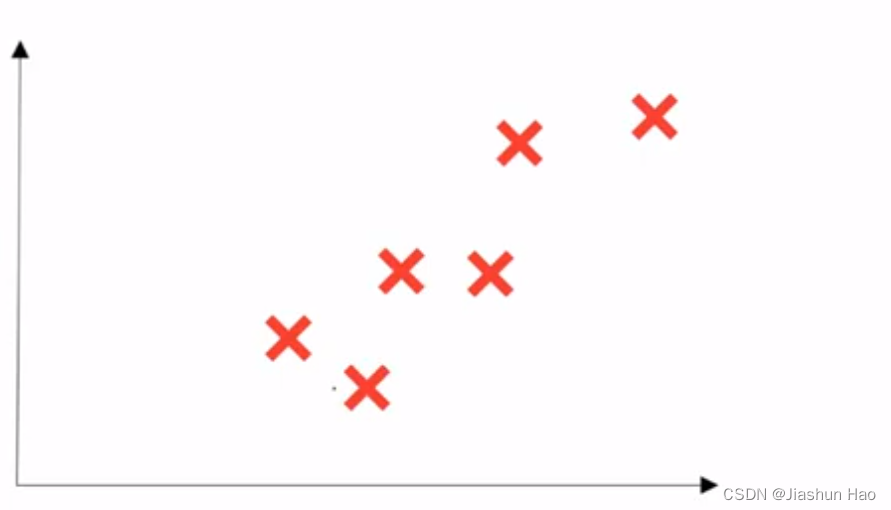  
 我们希望通过六个数据的信息，找到一个 **“房间大小和房价的关系函数”**。  
 当我们获得这个 “函数” ，我们只需要输入 **房间大小** 就可以计算出对应的 **房价** 。

对于这个简单的任务，函数即是初始为0的一个线性回归函数（X轴为房间大小，Y为价格）。

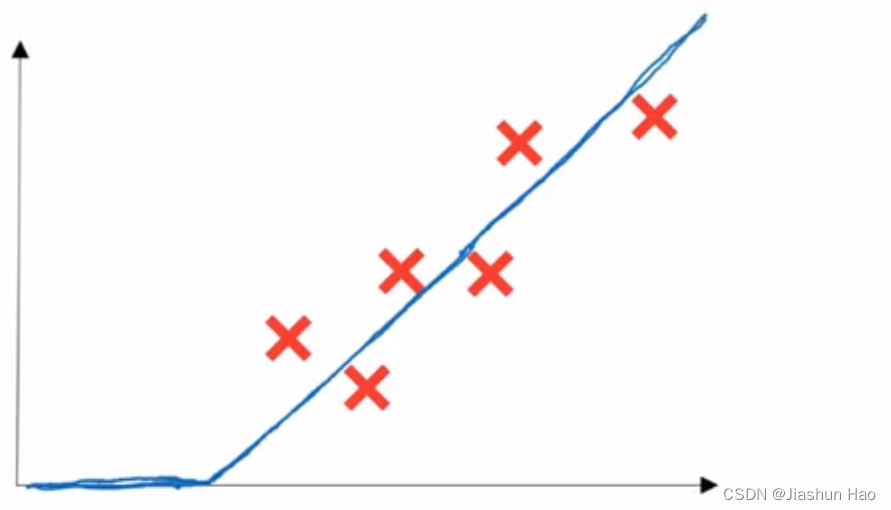  
 进一步，我们把这个 **“房间大小和房价的关系函数”** 抽象成一个小圆点，当输出**房间大小X**的时候，我们会得到一个对应的**房价Y**  
 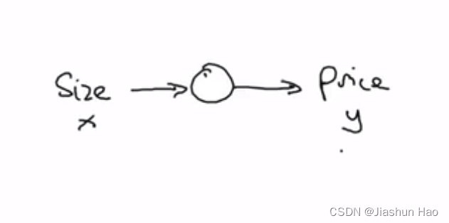

所以这个小圆点，就是神经网络中的一个 “神经元（Neurons）”  
 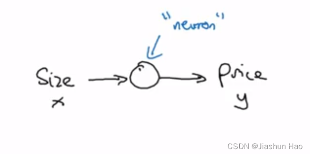

## 二、多个单神经元的神经网络

之前的输入数据，只有一个简单的"房子大小X". 即我们只需要考虑房子大小对于房价的影响。  
 那么，如果存在多个因素，比如*房子的房间数*、*房子处于的地段位置*、*房子的使用寿命*等…

这些考虑因素，输入数据中的 **属性** 或组成部分，在机器学习中叫 特征（Feature）。

假设，对于 **每一个房子**，现在我们要输入的特征有四个，分别是房子的大小（Size）、房间数量（Bedrooms）、房子的位置（Position）、周边富裕情况（Wealth）

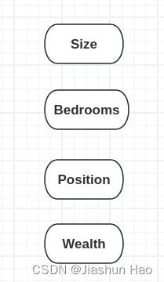  
 接下来，我们可以根据 **每一个房子** 的Size和Bedrooms，学习到一个函数（“小圆点/ 神经元”），来预测房子可以容纳人口的数量（Familys）

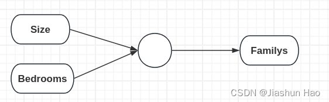  
 然后，我们可以根据 **每一个房子** 的Position，来预测房子的交通是否便利（Convenience）

  
 然后，我们也可以根据 **每一个房子** 的Position和Wealth来预测附近的教学质量（School）

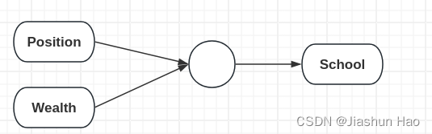  
 最后，我们可以通过 **每一个房子** 的人口的数量（Familys）、便利程度（Convenience）、教学质量（School）来学习到一个函数（“小圆点/ 神经元”），来预测 **每一个房子** 的价格。  
 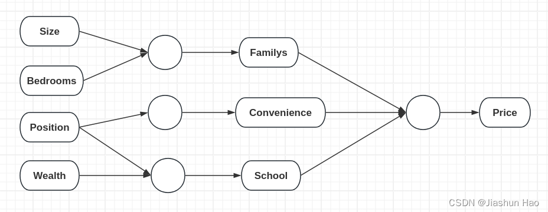  
 对于输入的，**每一个房子** 的四个原始特征，记作X。  
 对于最后得到的 **每一个房子** 的预测价格，记作Y

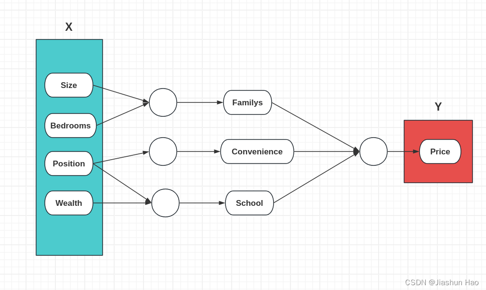

## 三、到底什么是机器学习？（重点）

### 1：什么是机器学习的训练？

1：我们需要搭建好神经网络的框架，设定好有多少层，每一层有多少神经元。  
 2：我们需要给每一个神经元设置一个固定的公式，和两个可变的参数（权重
W
W
W和偏差
b
b
b）  
 3：向这个框架给定 **训练数据集中的每一个数据的多个特征X**，然后也给定 **每一个数据的希望预测结果Y**  
 4：然后计算机就会根据“输入数据”和“理想结果”，自动学习 “怎么调节权重
W
W
W和偏差
b
b
b，可以使X变成Y？"

找权重
W
W
W和偏差
b
b
b的过程，就称为训练！

### 2：什么是模型？权重 W W W和偏差 b b b又是什么？

#### W W W：输入特征的权重

微观到每一个神经元来看，它们接受的输入的 **训练数据集中的每一个数据的多个特征** 
N
≥
1
N\geq1
N≥1，对于这**多个特征**，我们需要知道每一个输入特征在预测输出中的贡献大小。

哪些对于渴望的预测是是重要的，哪些是不重要的？  
 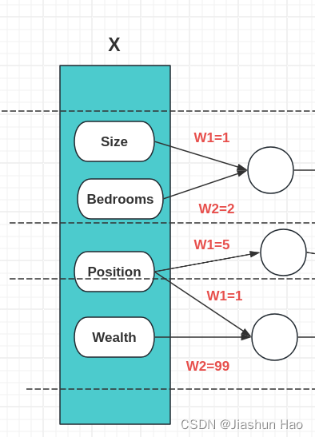

在每一个神经元中，我们给接收到的每一个特征一个自己的可变的权重，也就是
W
W
W

通过“学习”，模型可以自动增大对于渴望的预测有利的特征的权重，  
 通过“学习”，模型可以自动减小对于渴望的预测有利的特征的权重，

所以可以说，权重
W
W
W是作用于**每一个神经元**接收的**多个输入的特征上**。

#### b b b：每一个神经元的专属偏差

如果，无论怎么调整输入特征的权重，得到的计算公式还是不能把数据拟合成我们理想的输出该怎么办呢？  
 这个时候，我们可以引入偏差
b
b
b，来**辅助权重**
W
W
W调整神经元中的公式。

在每一个神经元中，权重
W
W
W的个数等于输入的特征的个数，即每一个特征都有一个自己的权重来微调。  
 而对于每一个神经元，有且只有一个单独的
b
b
b，用来直接调控当前神经元（当前的计算公式）。

此外，偏差的引入还有以下好处：

1. 增加偏移能力  
    假设一个线性模型没有偏差项，即模型的表达式为 ( y = Wx )，其中 ( W ) 是权重，( x ) 是输入。这种模型限制了输出 ( y ) 必须通过原点，即当 ( x = 0 ) 时 ( y ) 也必须为 0。这种限制减少了模型的灵活性，因为现实世界的数据往往不是完全通过原点的。引入偏差 ( b )（即 ( y = Wx + b )）可以允许输出有一个基线偏移，无论输入 ( x ) 的值如何。
2. 适应数据偏差  
    实际数据往往包含不同的偏差，如数据集整体可能偏向某个数值。没有偏差项的模型可能很难适应这种类型的数据结构，因为模型无法通过简单的权重调整来补偿这种偏向。偏差项可以帮助模型更好地适应数据的中心位置或其他统计特征。
3. 提高非线性  
    在包含非线性激活函数的神经网络中，每个神经元的输出不仅取决于加权输入和偏差，还取决于激活函数如何处理这个加权和。偏差可以调整在激活函数中加权和的位置，从而影响激活函数的激活状态。这种调整是非常重要的，因为它可以帮助网络捕捉更复杂的模式和关系。
4. 增加决策边界的灵活性  
    在分类问题中，决策边界是模型用来区分不同类别的界限。==如果没有偏差项，模型的决策边界可能只能是通过原点的直线或超平面，这大大限制了模型的有效性。==通过引入偏差，模型的决策边界可以是任意位置的直线或超平面，这大大提高了模型解决实际问题的能力。

### 3：神经元的里面是什么？

#### 神经元里的基础函数：线性变换函数

在深度学习中，每一个神经单元（通常称为神经元或单元）的基础，都是执行一个**线性变换函数**。  
 即：  
 
y
=
w
∗
x
+
b
y=w\*x+b
y=w∗x+b  
 其中, 
w
w
w 是权重, 
b
b
b 是偏置, 
x
x
x**是输入数据或前一层的输出**, 
y
y
y是得到的预测结果。  
 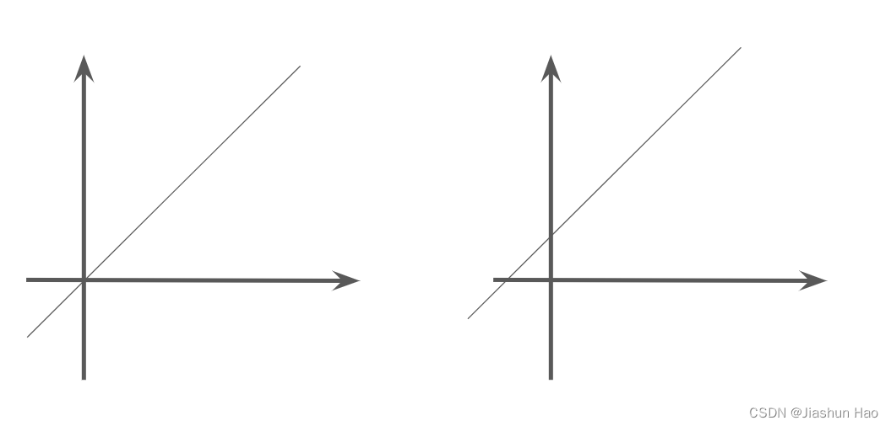

#### 神经元里为了多样化任务的函数：激活函数

可以看到，线性变化的范围，
x
x
x和
y
y
y成正比，无限增长或无限缩小。  
 单单依靠这简单的线性变化，无法满足多样的需求。

因此，我们需要在这个线性变化函数的外面嵌套一个函数，这样的函数也成为激活函数（Activation Function）。

那什么又是嵌套呢？即,将**线性变化函数的输出**结果，作为激活函数的输入值。

举例：

对于**逻辑回归任务**，即预测一个事件发生的概率，有**发生**和**不发生**两种情况（二分类任务）  
 如果我们只是使用简单的线性变化函数，得到的得到的结果、输入
x
x
x和输出
y
y
y的关系可能是这样（假设不考虑 
w
w
w和
b
b
b）

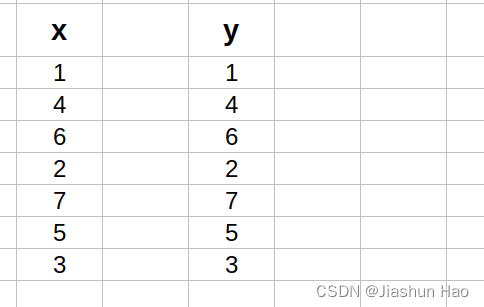  
 X有5种类型的输人，Y也有5种类型的输出，这样怎么判断事件发生的概率是**发生了**还是**不发生**呢？

聪明的小朋友也许想到了，我们可以以数字4为分界线，大于4的视为**发生了**，小于4的视为**不发生**。

在机器学习种，有一个思路和这样一模一样的函数专门应用于逻辑回归任务，即**sigmoid函数**。

对于它，只需要明白两点。

1. 无论输入大小，它的输出范围：[0,1]，它的图像是这样

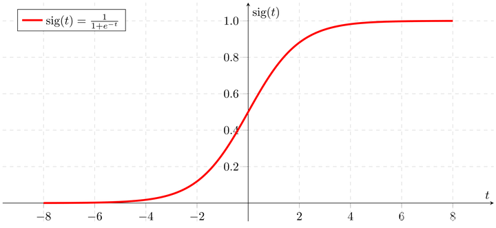  
 2. 公式如下：  
 
y
=
1
1
+
e
−
x
y = \frac{1}{1 + e^{-x}}
y=1+e−x1​  
 这个时候，我们就可以把得到的线性变化函数结果
y
y
y放到sigmoid函数里面— 或者直接将线性变化函数与sigmoid函数合并计算：

y
=
1
1
+
e
−
(
w
⋅
x
+
b
)
y= \frac{1}{1 + e^{-( w \cdot x + b)}}
y=1+e−(w⋅x+b)1​

那么得到的输出结果可能就是这样：  
 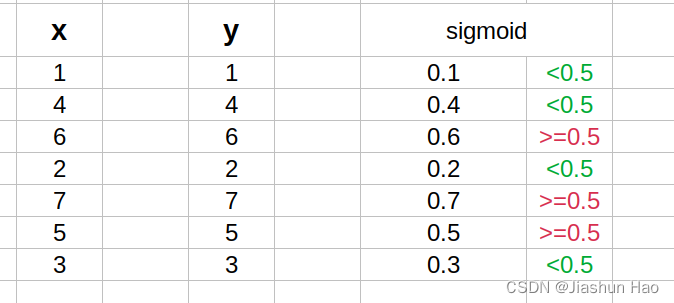

这里的**sigmoid函数**，即嵌套在线性函数外面用于多样化功能的函数，就叫激活函数.

## 四、损失函数和代价函数

在深度学习中，尤其是涉及到损失函数和激活函数时，**使用的对数通常是自然对数，即以 
e
e
e 为底的对数**

### 1.标签和预测

在监督学习中，每一个输入的训练数据都有一个自己对应的标签（label），也就是我们希望数据对应的预测结果。

比如，我们想区分猫和狗

用 1 来标记“猫”，用 0 来标记“狗”，此时 1 就是数据“猫”的标签， 0 就是“狗”的标签。

标签
标签
标签在深度学习中有一个专门的符号，即 
y
y
y。

当我们在模型使用/测试阶段的时候，我们会把“猫”和“狗”这俩个数据输入到模型中，让模型来捕获它们的信息给出预测， 那什么是预测呢？

预测
预测
预测，即是模型对于当前数据接近正类的概率，即是否为1的概率，在深度学习中也有一个专门的符号，即 
y
^
\hat{y}
y^​。

比如模型的识别度很高的话，

也许模型识别“猫”的概率为0.9，即
y
^
\hat{y}
y^​=0.9, 与“正类” 1 相近，归类为1。  
 也许模型识别“狗”的概率为0.1，即
y
^
\hat{y}
y^​=0.1, 与“正类” 1 相远，归类为0。

### 2.损失函数

所谓损失呢，就是判断预测值 
y
^
\hat{y}
y^​ 和标签 
y
y
y 相差多少。

我们已经知道机器学习就是学习权重
w
w
w和偏差
b
b
b，而损失函数就是为调整权重
w
w
w和偏差
b
b
b提供指导。

损失函数的公式如下：

L
o
s
s
=
L
(
y
,
y
^
)
=
−
[
y
log
⁡
e
(
y
^
)
+
(
1
−
y
)
log
⁡
e
(
1
−
y
^
)
]
Loss=L(y, \hat{y}) = -[y \log\_e(\hat{y}) + (1 - y) \log\_e(1 - \hat{y})]
Loss=L(y,y^​)=−[yloge​(y^​)+(1−y)loge​(1−y^​)]

这个公式非常巧妙，如果测值 
y
^
\hat{y}
y^​ 和标签 
y
y
y相差大，那么损失值 
L
o
s
s
Loss
Loss 会特别大，反之会特别小。我们来验证一下。

前提补充：  
 
l
o
g
e
(
约
2.71828
)
=
1
log\_e(约2.71828)=1
loge​(约2.71828)=1  
 
l
o
g
e
(
1
)
=
0
log\_e(1)=0
loge​(1)=0  
 
二分类任务：
0
<
y
^
<
1
二分类任务：0 < \hat{y} < 1
二分类任务：0<y^​<1

验证：假设 
y
=
1
y=1
y=1  
 
L
o
s
s
=
L
(
y
,
y
^
)
=
−
[
y
log
⁡
e
(
y
^
)
+
(
1
−
y
)
log
⁡
e
(
1
−
y
^
)
]
Loss=L(y, \hat{y}) = -[y \log\_e(\hat{y}) + (1 - y) \log\_e(1 - \hat{y})]
Loss=L(y,y^​)=−[yloge​(y^​)+(1−y)loge​(1−y^​)]  
 
L
o
s
s
=
−
[
log
⁡
e
(
y
^
)
]
Loss = -[\log\_e(\hat{y})]
Loss=−[loge​(y^​)]

如果这个时候 
y
^
\hat{y}
y^​ 的值为0.9，
−
log
⁡
e
(
0.9
)
≈
0.152
-\log\_e(0.9)\approx0.152
−loge​(0.9)≈0.152 ，损失小。

如果这个时候 
y
^
\hat{y}
y^​ 的值为0.1，
−
log
⁡
e
(
0.1
)
≈
3.322
-\log\_e(0.1)\approx3.322
−loge​(0.1)≈3.322 ，损失大。

### 3.代价函数（Cost Function）

上面的计算，我们都将输入的训练样本的个数视为1，所以只有一个标签 
y
y
y 和一个预测 
y
^
\hat{y}
y^​。

在训练中，我们时常有多个样本，数量计做为 
i
i
i

所以每一个输入的样本的标签和预测为 
y
i
y^i
yi 和 
y
^
i
\hat{y}^i
y^​i

因为，损失的计算是作用于整个网络的，不是单个的神经元

因此，我们需要计算整体网络的损失，也就是代价计算。

总数据为 
m
m
m 个 用 
i
i
i 遍历每一个。

代价函数：

J
=
1
m
∑
i
=
1
m
Loss
(
y
(
i
)
,
y
^
(
i
)
)
J= \frac{1}{m} \sum\_{i=1}^{m} \text{Loss}(y^{(i)}, \hat{y}^{(i)})
J=m1​i=1∑m​Loss(y(i),y^​(i))

又因为，我们计算损失，是为了找到合适的 
w
w
w 和 
b
b
b, 使得损失变为最小。  
 所以公式的写法一般会将
w
w
w 和 
b
b
b写入。

代价函数：

J
(
w
,
b
)
=
1
m
∑
i
=
1
m
L
(
y
(
i
)
,
y
^
(
i
)
)
J(w, b) = \frac{1}{m} \sum\_{i=1}^{m} \text{L}(y^{(i)}, \hat{y}^{(i)})
J(w,b)=m1​i=1∑m​L(y(i),y^​(i))

代价的函数的图片如图：

即由 
w
w
w 和 
b
b
b 和代价 
J
J
J 构成的三纬曲面

即存在一个 
w
w
w 和 
b
b
b 可以有一个最低的点 
J
J
J  
 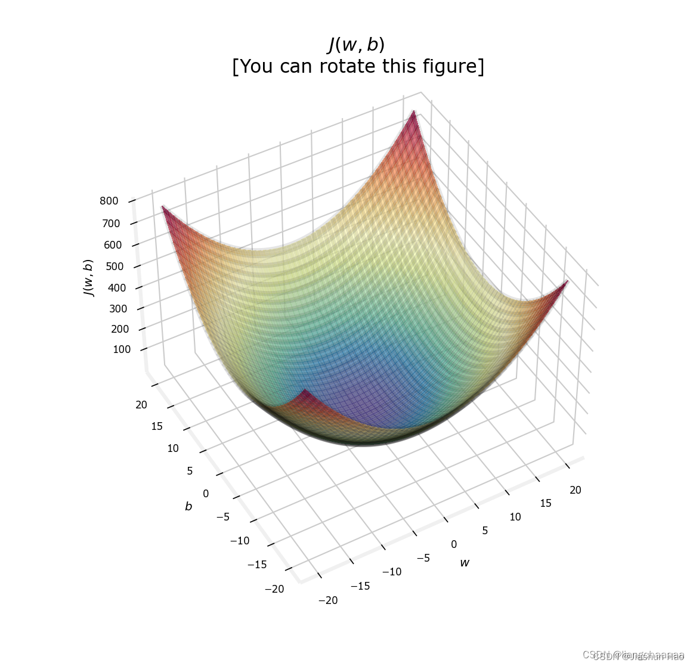  
 这个面通常是不规则的，上面为了说明找的特例。真实的情况可能是这样：


## 五、梯度下降

前面提到我们的预测结果
y
^
\hat{y}
y^​ 和 标签
y
{y}
y之间差异，构成的函数就是代价函数。

我们的目标，是找到在代价函数最低点，也就是损失最低， 也就综合考虑
y
^
\hat{y}
y^​ 和 
y
{y}
y之间最差异小的时候的 
w
w
w 和 
b
b
b.

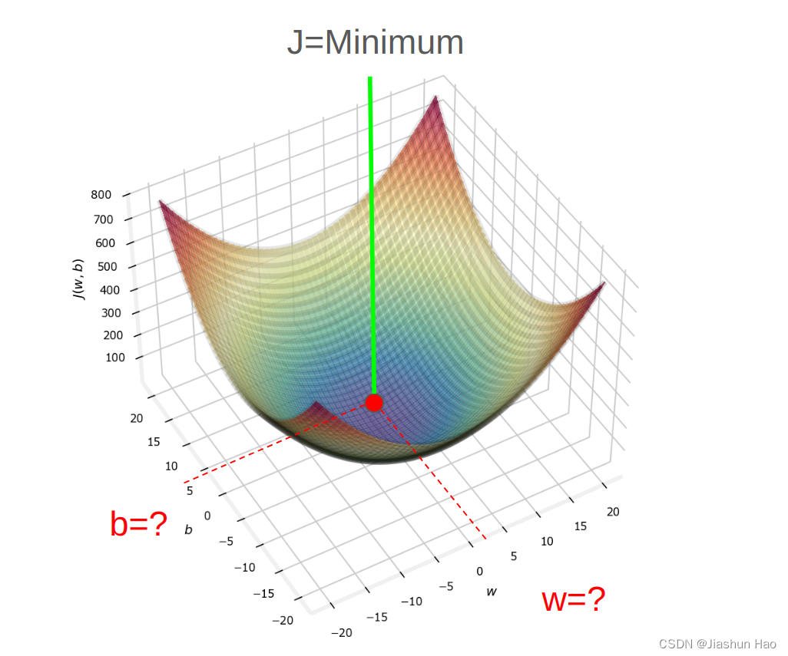

怎么找呢？使用梯度下降（Gradient Descent）。不过在此之前，需要先说明一个概念 – **导数的作用**。

### 1：什么是导数？能做什么？

假定：存在一个函数 F(x), 是一个凸函数，有最低点。

在函数 F(x)上取一点，过这一点，相较于X轴正方向做切线，获得切线与x轴的夹角 K。

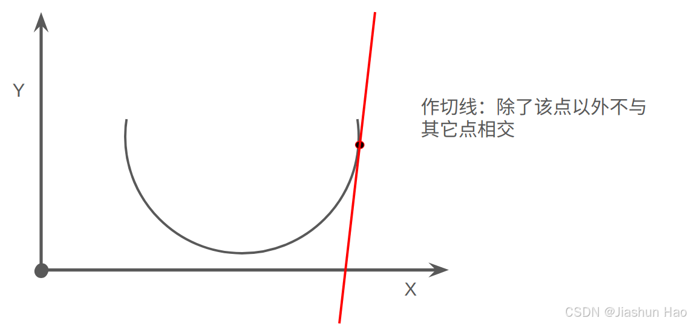  
 下面的图都画错了，但是CSDN太垃圾了，更新要卡半天。懒的改了  
 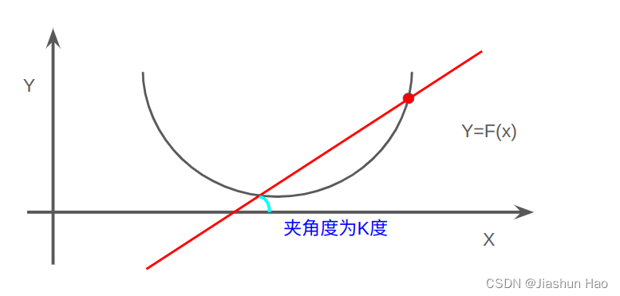  
 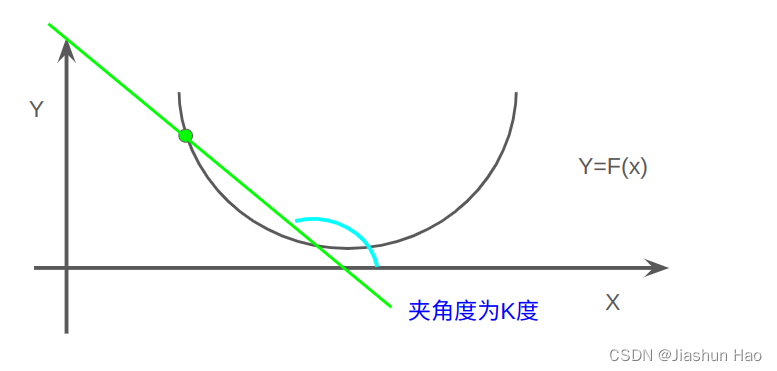  
 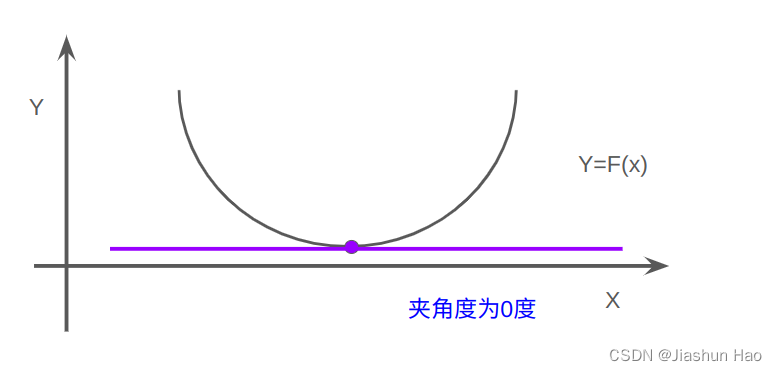

然后，计算 
t
a
n
(
K
)
tan(K)
tan(K) 的值

若 
t
a
n
(
K
)
>
0
tan(K)>0
tan(K)>0，则说明该点在此函数上，沿着x轴的正方向，随着x的增大而增大

若 
t
a
n
(
K
)
<
0
tan(K)<0
tan(K)<0，则说明该点在此函数上，沿着x轴的正方向，随着x的增大而减小

若 
t
a
n
(
K
)
=
0
tan(K)=0
tan(K)=0，则说明当x等于当前值的时候，该点即为函数最低点。

正方向通常指的是 坐标轴的增加方向（对于 x 轴，就是向右）。  
 如果当前梯度是正的，参数需要减小（往反方向走）。  
 如果当前梯度是负的，参数需要增大（继续往当前方向走）。

t
a
n
(
K
)
tan(K)
tan(K)的值，有三个你一定见过的称呼  
 1：函数F(x) 相较于**当前x值**的 斜率  
 2：函数F(x) 相较于**当前x值**的 导数，也就是函数F(x) 对于**当前x值 求导！**  
 3：函数F(x) 相较于**当前x值**的 **梯度**

我们再回到三维函数代价函数，

在代价函数中，我们要找的，不就是在**某一个位置上的
w
w
w和在某一个位置上的
b
b
b**，使得产生的预测
y
^
\hat{y}
y^​ 和 标签
y
{y}
y之间差异构成的函数代价的函数处于最低点吗？

不就是我们希望代价函数对参数
w
w
w和
b
b
b求导的值是最小的吗（接近于零）？

不就是希望
J
(
w
,
b
)
d
w
=
0
\frac{J(w, b)}{dw}=0
dwJ(w,b)​=0 和 
J
(
w
,
b
)
d
b
=
0
\frac{J(w, b)}{db}=0
dbJ(w,b)​=0 吗？

由于
J
(
w
,
b
)
J(w, b)
J(w,b) 函数有多个自变量,针对其中一个自变量求导，而将其他自变量视为常数, 所以我们需要使用偏导数符号，

∂
J
∂
w
/
∂
J
∂
b
\frac{\partial J}{\partial w}/\frac{\partial J}{\partial b}
∂w∂J​/∂b∂J​

### 2: 梯度下降: w w w和 b b b的更新

求完偏导数，如果当前
w
w
w和
b
b
b不是最小值，就需要更新
w
w
w和
b
b
b。

在梯度下降中，对于每一次更新:
w
w
w和
b
b
b，我们需要设置一个学习率 
α
\alpha
α，一般以0.01开始。

设置学习率的一个重要目的是控制每次参数更新的大小，以防止在梯度下降过程中一次更新太大而导致跳过了最优解附近的区域。

**对于
w
w
w的更新：**  
 
w
=
w
−
α
∂
J
∂
w
w = w - \alpha \frac{\partial J}{\partial w}
w=w−α∂w∂J​  
 或者  
 
w
=
w
−
α
1
m
X
(
Y
^
−
Y
)
T
w = w - \alpha \frac{1}{m} X (\hat{Y} - Y)^T
w=w−αm1​X(Y^−Y)T  
 PS1：
X
X
X是一个
m
∗
n
m \* n
m∗n的矩阵，其中 
m
m
m 是样本数量，
n
n
n是特征数量，所以
X
X
X矩阵就包括了所有
m
m
m 个样本的，
m
∗
n
m \* n
m∗n个特征。

PS2：（注意，这里是大 
Y
Y
Y）：
Y
^
\hat Y
Y^和
Y
Y
Y是也是矩阵，维度 
1
∗
m
1\*m
1∗m，存放着每一个样本自己的预测结果 
y
^
\hat y
y^​和标签
y
y
y。

w
w
w和
b
b
b的更新都是综合考虑同步进行，但是每一个样本的
w
w
w更新的不同正是由于每个样本的预测值
y
^
\hat y
y^​不同，导致了梯度的不同。

**对于
b
b
b的更新：**  
 
b
=
b
−
α
∂
J
∂
b
b = b - \alpha \frac{\partial J}{\partial b}
b=b−α∂b∂J​  
 或者  
 
b
=
b
−
α
1
m
∑
i
=
1
m
(
y
^
(
i
)
−
y
(
i
)
)
b = b - \alpha \frac{1}{m} \sum\_{i=1}^{m} (\hat{y}^{(i)} - y^{(i)})
b=b−αm1​i=1∑m​(y^​(i)−y(i))  
 PS：（注意，这里是小 
y
y
y）每一个标签 
y
y
y 和每一个预测 
y
^
\hat y
y^​ 都是常数的，所以直接累积就可。

## 六、反向传播

### 什么是反向传播？为什么要有反向传播？

我们现在知道，如果想更新
w
w
w和
b
b
b，我们需要损失函数的结果 
J
(
w
,
b
)
{J(w, b)}
J(w,b)，计算 
∂
J
∂
w
\frac{\partial J}{\partial w}
∂w∂J​和计算 
∂
J
∂
b
\frac{\partial J}{\partial b}
∂b∂J​

反向传播：即通过**最后一层输出层**的结果与标签计算得到的损失
J
(
w
,
b
)
{J(w, b)}
J(w,b)，反向的计算出每一个神经元中的
w
w
w和
b
b
b应该改变的值。

假设我们有一个简单的神经网络，一个输入层、一个隐藏层、一个输出层

输入的样本只有一个，特征也只有一个，所以每一层只有一个
w
w
w和一个
b
b
b，结构可能是下面这样  
 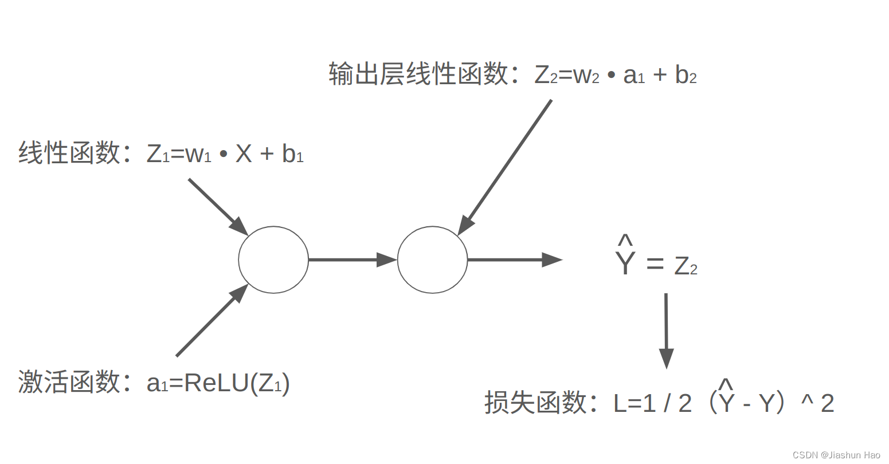如果我们想知道
w
1
w1
w1需要改变多少，就需要计算
∂
L
∂
w
1
\frac{\partial L}{\partial w1}
∂w1∂L​，也就是…

1
2
∂
(
W
2
・
R
e
L
U
(
w
1
・
X
+
b
1
)
+
b
2
−
Y
)
2
∂
w
1
\frac{\frac{1}{2}\partial(W2・ReLU(w1・X+b1)+b2-Y)^2}{\partial w1}
∂w121​∂(W2・ReLU(w1・X+b1)+b2−Y)2​

这样的计算很难，即使交给计算机也会消耗大量资源和时间。

有没有什么办法呢？

在求导的过程中，有这样一个法则-- **链式法则**

### 链式法则

链式法则是一个对于**复合函数求导**的重要法则，公式如下：

**存在函数 
y
=
f
(
g
(
x
)
)
y=f(g(x))
y=f(g(x))**  
 
d
y
d
x
=
d
g
d
x
⋅
d
f
d
g
\frac{dy}{dx} = \frac{dg}{dx} \cdot \frac{df}{dg}
dxdy​=dxdg​⋅dgdf​

回到刚刚的问题，我们希望计算的
∂
L
∂
w
1
\frac{\partial L}{\partial w1}
∂w1∂L​，可以化解为：  
 
∂
L
∂
w
1
=
∂
Z
1
∂
w
1
⋅
∂
a
1
∂
Z
1
⋅
∂
Z
2
∂
a
1
⋅
∂
L
∂
Z
2
\frac{\partial L}{\partial w1}=\frac{\partial Z1}{\partial w1}\cdot\frac{\partial a1}{\partial Z1}\cdot\frac{\partial Z2}{\partial a1}\cdot\frac{\partial L}{\partial Z2}
∂w1∂L​=∂w1∂Z1​⋅∂Z1∂a1​⋅∂a1∂Z2​⋅∂Z2∂L​

虽然，我们看起来还是一推求导的过程，但在实际的神经网络训练过程中，每一步求导的结果都是**具体的数值**，这些数值在反向传播过程中通过链式法则**只进行依次相乘**，便可以计算出最终的**梯度值**。

或者，我们可以直接使用这俩个公式：  
 
∂
L
∂
W
=
1
m
X
⋅
(
∂
L
∂
Z
)
T
\frac{\partial L}{\partial W}=\frac{1}{m}X\cdot (\frac{\partial L}{\partial Z})^T
∂W∂L​=m1​X⋅(∂Z∂L​)T  
 
∂
L
∂
b
=
1
m
∑
i
=
1
m
∂
L
∂
Z
\frac{\partial L}{\partial b}=\frac{1}{m} \sum\_{i=1}^{m} \frac{\partial L}{\partial Z}
∂b∂L​=m1​i=1∑m​∂Z∂L​

对于核心的
∂
L
∂
Z
\frac{\partial L}{\partial Z}
∂Z∂L​ 在以 **S
i
g
m
o
i
d
Sigmoid
Sigmoid** 为激活函数的时候  
 
∂
L
∂
Z
=
A
−
Y
（预测
−
标签）
\frac{\partial L}{\partial Z}=A-Y（预测-标签）
∂Z∂L​=A−Y（预测−标签）

## 七、常用函数 of Python

在深度学习中，处理的数据、无论是样本还是样本的特征以及权重，通常都是多维的矩阵。在代码中，对于它们的表示一般都是使用多维的数组进行处理，**那么也就必然会涉及到多维数组直接的乘法运算等操作**。

先补充一点前导的矩阵知识吧。。

### 0：关于矩阵乘法

**矩阵的表示 
(
n
,
m
)
(n,m)
(n,m)，即 
n
n
n 为行数，
m
m
m 为列数**

如果俩个矩阵可以被相乘，则必然满足下面的规则：

#### 1：两个一维数组（向量）：

如果 A 和 B 是**两个一维数组**，它们的长度必须相同。np.dot(a, b) 在这种情况下会计算它们的内积，结果是一个标量。  
 
A
⋅
B
=
a
1
×
b
1
+
a
2
×
b
2
+
a
3
×
b
3
.
.
.
.
\mathbf{A} \cdot \mathbf{B} = a\_1 \times b\_1 + a\_2 \times b\_2 + a\_3 \times b\_3....
A⋅B=a1​×b1​+a2​×b2​+a3​×b3​....

#### 2：一维数组和二维数组的乘积:

如果一个数组是一维的，另一个数组是二维的，**一维数组必须为左矩阵**，且**一维数组的长度**（元素数量）必须与**二维数组的行数**相同。  
 
A
=
[
a
1
,
a
2
,
a
3
]
A = \left[ a\_1, a\_2, a\_3\right]
A=[a1​,a2​,a3​]

B
=
[
b
11
b
12
b
21
b
22
b
31
b
32
]
B = \left[ \begin{array}{cc} b\_{11} &b\_{12} \\ b\_{21} &b\_{22} \\ b\_{31} &b\_{32} \\ \end{array} \right]
B=


​b11​b21​b31​​b12​b22​b32​​


​  
 结果：  
 
C
=
A
⋅
B
=
[
a
1
b
11
+
a
2
b
21
+
a
3
b
31
,
a
1
b
12
+
a
2
b
22
+
a
3
b
32
]
\mathbf{C} = {A} \cdot B = \left[ a\_1 b\_{11} + a\_2 b\_{21} + a\_3 b\_{31}, a\_1 b\_{12} + a\_2 b\_{22} + a\_3 b\_{32} \right]
C=A⋅B=[a1​b11​+a2​b21​+a3​b31​,a1​b12​+a2​b22​+a3​b32​]

**也可以这么理解：  
 形状：
A
A
A 为 1 X `3`，
B
B
B 为 `3` X 2，
C
C
C 结构一定是 1 X 2  
 内容：
A
A
A 的一行元素对应相称 
B
B
B的每一列的元素，并且求合。 
B
B
B有几列
C
C
C就有几个元素。**

#### 3：两个二维数组的乘积

两个二维数组的np.dot(a, b)，**执行的是矩阵乘法（点乘）**

两个二维数组相称，则必须满足**左数组的列数（第二参）** == **右数组的行数（第一参）**，即
A
A
A 为 J X K ，
B
B
B 必须 K X F。

形状：
A
A
A 为 J X `K`，
B
B
B 为 `K` X F，
C
C
C 结构一定是 J X F

内容：
C
C
C里面的每一个内容
C
j
f
C\_{jf}
Cjf​ == 
A
A
A的第 
j
j
j 行所有元素  对应相乘 
B
B
B的第 
f
f
f 列所有元素  再求和

**A
A
A 决定行数，
B
B
B 决定列数**

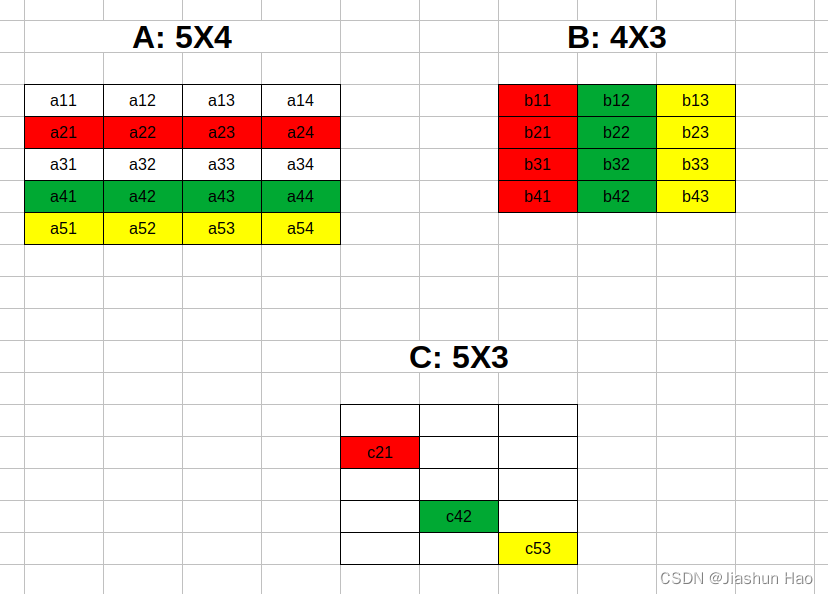

### 1：向量化：np.dot ()

在python的 `numpy` 包中提供了很多函数，一般通过`np.函数`进行调用，主要有以下的操作。

代替过去使用`for`循环提取每一个单个数字进行乘法运算, **`np.dot ()`可以直接用于进行数组(矩阵)的乘法运算**  
 （早知道这，当年打ACM的时候…哎…）

```
import numpy as np
#生成随机可计算矩阵
a=np.random.rand(5,2)
b=np.random.rand(2,3)

#矩阵乘法
c=np.dot(a,b)

print(c)
# 5 X 3的矩阵
# [[0.40588364 0.72359991 1.06770193]
#  [0.25421081 0.76920878 0.55936812]
#  [0.2377581  0.48192689 0.6053476 ]
#  [0.23772493 0.43346957 0.62200772]
#  [0.26465829 0.80355781 0.58141002]]
```

### 2：指数计算： e x − n p . e x p ( a ) e^x-np.exp(a) ex−np.exp(a)

```
import numpy as np
#单个数
a=3

c=np.exp(a)

print(c)
#20.085536923187668


#矩阵里面的所有数
b=np.random.rand(3,2)

c=np.exp(b)

print(c)
#[[1.46583214 2.18770474]
#[2.65302428 1.17295333]
#[2.07931534 1.53653021]]
```

还有很多，比如对数log、最大值最小值什么的，用到再查吧。

### 3：矩阵内部求和： P . s u m ( a x i s = 0 ) P.sum(axis=0) P.sum(axis=0)

假设有这样一组表格数据：  
 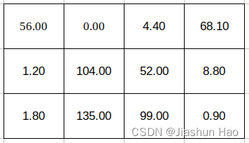  
 当我们遇到类似“将某一行的数据合并/将某一列的数据合并”的需求时，可以直接使用`sum(axis=)`的方法

```
import numpy as np
A=np.array([[56.0,0.0,4.4,68.1],
           [1.2,104.0,52.0,8.8],
           [1.8,135.0,99.0,0.9]])

cal=A.sum(axis=0)#按列求和
#cal=[ 59.  239.  155.4  77.8]

cal=A.sum(axis=1)#按行求和
#cal=[128.5 166.  236.7]
```

### 4：重新构建/确保数组形状： P . r e s h a p e ( ? , ? ) P.reshape(?,?) P.reshape(?,?) // 最好经常使用！！

`reshape`是一种常见的数组重塑操作，通常用于数组或矩阵的形状转换，规则可以概括如下：

**0: reshape不改变数组本身，需要再赋值**

```
import numpy as np
a = np.array([1, 2, 3, 4, 5, 6])

a.reshape(2, 3)
print(a)
# 输出:[1 2 3 4 5 6] #形状未改变

b = a.reshape(2, 3) #重新赋值
print(b)
# 输出:
# [[1 2 3]
#  [4 5 6]]
```

**1. 元素总数一致**：  
 目标形状的元素总数必须与原始数组的元素总数相等。即：原始数组的**元素个数**必须等于目标形状**各维度的乘积**。

```
import numpy as np
a = np.array([1, 2, 3, 4, 5, 6])#总数6

b = a.reshape(2, 3)#重塑为2*3
print(b)
# 输出:
# [[1 2 3]
#  [4 5 6]]
```

**2：进行重塑操作时，原数组的内容会被视为一个线性序列，按行优先的从左到右的顺序:**

```
a = np.array([[[1, 2, 3], [4, 5, 6]], [[7, 8, 9], [10, 11, 12]]]) #12个数
print(a.shape)
# 输出: (2, 2, 3)

s = a.reshape(1,12)
print(s)
# 输出: [[ 1  2  3  4  5  6  7  8  9 10 11 12]]

f = a.reshape(3, 2, 2)
print(f)
# 输出:
# [[[ 1  2]
#   [ 3  4]]
#
#  [[ 5  6]
#   [ 7  8]]
#
#  [[ 9 10]
#   [11 12]]]
```

**3: 维度为 -1 的使用:**  
 在我们只确一个维度的时候，可以使用 -1 可以自动计算某一维的大小，前提是其他维度已知且合法。但是-1 只能使用一次

```
import numpy as np
a = np.array([1, 2, 3, 4, 5, 6])

d = a.reshape(2, -1)#确定了行数但是不确定列数
print(d)
# 输出:
# [[1 2 3]
#  [4 5 6]]

e = a.reshape(-1, 2)#确定了列数但是不确定行数
print(e)
# 输出:
# [[1 2]
#  [3 4]
#  [5 6]]

c = a.reshape(2, -1, -1)#-1的使用超过一次
print(c)# ValueError: can only specify one unknown dimension
```

## 八、编写代码时的笔记

1：当我们谈论一个神经网络有多少层时，数量为除了输入层以外的所有层。  
 2：神经元接收的是输入数据的特征，而不是整个样本本身， 所以输入层的样本的个数，也可以看作是输入层的神经元个数 。

### 1：原始数组维度和计算公式

#### X X X：样本数组维度/输入数据维度

X
(
特征的个数，样本的总数
)
X(特征的个数 ，样本的总数)
X(特征的个数，样本的总数)  
 
X
的维度
(
n
,
m
)
，其中
n
是特征数，
m
是样本数
X的维度(n,m)，其中 n 是特征数，m是样本数
X的维度(n,m)，其中n是特征数，m是样本数

#### Y Y Y/ Y ^ \hat Y Y^：标签/预测数组维度 （二分类）

Y
(
1
，样本的总数
)
Y(1 ，样本的总数)
Y(1，样本的总数)  
 
Y
的维度
(
1
,
m
)
，其中
m
是样本数
Y的维度(1,m)，其中 m是样本数
Y的维度(1,m)，其中m是样本数

#### W W W：权重维度，作用于每一个输入（输入层接受的是“特征” x i x\_i xi​，之后的层是前一个层的输出“预测” a i a\_i ai​）

W
(
当前层的神经元个数，前一层传入的输入个数
)
W(当前层的神经元个数 ，前一层传入的输入个数)
W(当前层的神经元个数，前一层传入的输入个数)  
 
W
[
l
]
的维度
(
n
[
l
]
,
n
[
l
−
1
]
)
，其中
n
是神经元数，
l
是位置，表示当前是第几层
W^{[l]}的维度(n^{[l]},n^{[l-1]})，其中 n 是神经元数，l是位置，表示当前是第几层
W[l]的维度(n[l],n[l−1])，其中n是神经元数，l是位置，表示当前是第几层

#### b b b：偏差维度，作用于每一个神经元，一个神经元一个偏差 b b b

b
(
当前层的神经元个数，
1
)
b(当前层的神经元个数 ，1)
b(当前层的神经元个数，1)  
 
b
[
l
]
的维度
(
n
[
l
]
,
1
)
，其中
n
是神经元数，
l
是位置，表示当前是第几层
b^{[l]}的维度(n^{[l]},1)，其中 n 是神经元数，l是位置，表示当前是第几层
b[l]的维度(n[l],1)，其中n是神经元数，l是位置，表示当前是第几层

#### Z Z Z：线性函数的输出值，作用于每一个神经元，一个神经元一个 Z Z Z 结果

记录当前层中对于所有样本（输入）的线性函数的输出值，为激活函数做预测提供准备.  
 
Z
(
当前层的神经元个数，样本总数
)
Z(当前层的神经元个数 ，样本总数)
Z(当前层的神经元个数，样本总数)  
 
Z
[
l
]
的维度
(
n
[
l
]
,
m
)
，其中
n
是神经元数，
m
是样本数，
l
是位置，表示当前是第几层
Z^{[l]}的维度(n^{[l]},m)，其中 n 是神经元数，m 是样本数，l是位置，表示当前是第几层
Z[l]的维度(n[l],m)，其中n是神经元数，m是样本数，l是位置，表示当前是第几层  
 
Z
=
W
T
X
+
b
Z=W^TX+b
Z=WTX+b  
 或者  
 
Z
[
l
]
=
W
[
l
]
A
[
l
−
1
]
+
b
[
l
]
Z^{[l]} = W^{[l]}A^{[l-1]} + b^{[l]}
Z[l]=W[l]A[l−1]+b[l]

#### A A A：激活函数的输出值，作用于每一个神经元，一个神经元一个 A A A 结果，就是“预测”

记录当前层中对于所有样本（输入）的激活函数的预测值.  
 
A
(
当前层的神经元个数，样本总数
)
A(当前层的神经元个数 ，样本总数)
A(当前层的神经元个数，样本总数)  
 
A
[
l
]
的维度
(
n
[
l
]
,
m
)
，其中
n
是神经元数，
m
是样本数，
l
是位置，表示当前是第几层
A^{[l]}的维度(n^{[l]},m)，其中 n 是神经元数，m 是样本数，l是位置，表示当前是第几层
A[l]的维度(n[l],m)，其中n是神经元数，m是样本数，l是位置，表示当前是第几层  
 
A
=
激活函数（
Z
）
A=激活函数（Z）
A=激活函数（Z）  
 或者  
 
A
[
l
]
=
σ
(
Z
[
l
]
)
A^{[l]} = \sigma(Z^{[l]})
A[l]=σ(Z[l])

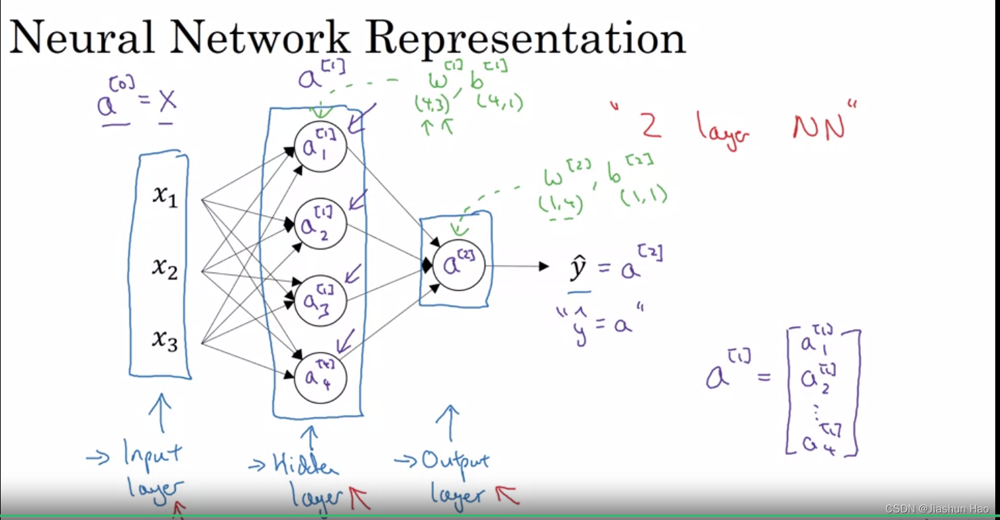

### 2：偏导数数组维度和计算公式

#### d Z dZ dZ：损失函数 L L L 对于线性函数 Z Z Z的偏导

d
Z
=
Y
^
−
Y
dZ = \hat{Y} - Y
dZ=Y^−Y  
 
d
Z
的维度：
(
n
[
l
]
,
m
)
 其中 n 是神经元数，m 是样本数，l是位置，表示当前是第几层
dZ的\text{维度：} (n^{[l]}, m)\text{ 其中 n 是神经元数，m 是样本数，l是位置，表示当前是第几层}
dZ的维度：(n[l],m) 其中 n 是神经元数，m 是样本数，l是位置，表示当前是第几层

#### d W dW dW：损失函数 L L L 对于权重 W W W的偏导

d
W
=
1
m
d
Z
A
[
l
−
1
]
T
dW = \frac{1}{m} dZ A^{[l-1]T}
dW=m1​dZA[l−1]T  
 
维度：
(
n
[
l
]
,
n
[
l
−
1
]
)
 其中 n 是神经元/样本数，l是位置，表示当前是第几层
\text{维度：} (n^{[l]}, n^{[l-1]}) \text{ 其中 n 是神经元/样本数，l是位置，表示当前是第几层}
维度：(n[l],n[l−1]) 其中 n 是神经元/样本数，l是位置，表示当前是第几层

#### d b db db：损失函数 L L L 对于权重 b b b的偏导

d
b
=
1
m
∑
i
=
1
m
d
Z
db = \frac{1}{m} \sum\_{i=1}^m dZ
db=m1​i=1∑m​dZ  
 
维度：
(
n
[
l
]
,
1
)
其中
n
是神经元
/
样本数，
l
是位置，表示当前是第几层
\text{维度：} \quad (n^{[l]}, 1) \text其中 n 是神经元/样本数，l是位置，表示当前是第几层
维度：(n[l],1)其中n是神经元/样本数，l是位置，表示当前是第几层

## ？、什么是深度学习？

深度学习的 **“深度”** 指的是神经网络中隐藏层的数量。  
 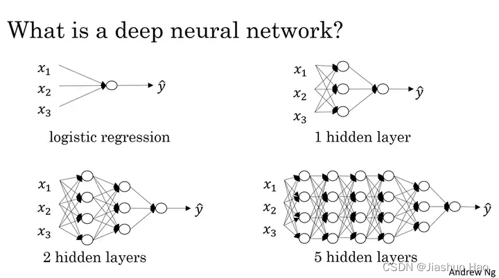  
 随着层数的增加，网络能够学习更复杂的特征，但同时也可能导致计算成本增加和模型训练难度加大。

神经网络通过一种叫做反向传播的学习算法来训练，它涉及到对网络输出的误差进行评估，并将误差反向传递回网络，以调整连接的权重，从而减少未来输出的误差。这个过程通常需要大量的数据和计算资源，这些我们下一篇再说。