#### 进阶知识补充

- [零、深度学习的技巧](#_1)
- - [1.偏差和方差解决技巧](#1_2)
  - [2.深度网络层数](#2_18)
- [一、深度学习的核心](#_20)
- - [1. 参数（Weights and Biases）](#1_Weights_and_Biases_22)
  - [2. 网络架构（Network Architecture）](#2_Network_Architecture_27)
  - - [2.1. 激活函数和其导数](#21__46)
    - - [Sigmoid 函数：](#Sigmoid__48)
      - [ReLU 函数：](#ReLU__53)
      - [Tanh 函数：](#Tanh__61)
  - [3. 损失函数（Loss Function）](#3_Loss_Function_66)
  - [4. 优化算法（Optimization Algorithm）](#4_Optimization_Algorithm_70)
  - [5. 正则化（Regularization）](#5_Regularization_74)
  - [6. 学习率（Learning Rate）](#6_Learning_Rate_78)
- [二、训练集、开发集、测试集](#_83)
- - [1：训练集（Training Set）：60-80%](#1Training_Set6080_84)
  - [2：开发集（或验证集，Development Set/Validation Set）：10-20%](#2Development_SetValidation_Set1020_87)
  - [2：测试集（Test Set）：10-20%](#2Test_Set1020_90)
- [三：Bias（偏差）和Variance（方差）](#BiasVariance_92)
- - [Bias（偏差）](#Bias_93)
  - [Variance（方差）](#Variance_103)
  - [Bias-Variance Tradeoff（偏差-方差权衡）](#BiasVariance_Tradeoff_115)
  - [解决方法](#_130)
- [四：正则化（Regularization）](#Regularization_146)
- - [1. 重要特征和最高权重](#1__153)
  - [2. L1正则化（Lasso正则化）：作用于损失函数和权重](#2_L1Lasso_167)
  - [3. L2正则化（Ridge正则化）：作用于损失函数和权重](#3_L2Ridge_199)
  - [4. Dropout正则化：作用于激活值](#4_Dropout_236)
  - [5. 其它正则化：](#5__286)
  - - [1.歪门邪道--数据扩增（Data Augmentation）](#1Data_Augmentation_287)
    - [2.早停法（Early Stopping）：基于验证集](#2Early_Stopping_292)
- [五、设置优化问](#_296)
- - [1. 输入：Normalizing化](#1_Normalizing_298)
  - [2. 防止梯度爆炸/梯度消失](#2__320)
  - - [1.对于ReLU作为激活函数: He](#1ReLU_He_331)
    - [2.对于Tanh\sigmoid 作为激活函数: Xavier](#2Tanhsigmoid__Xavier_337)
  - [3. 梯度检查（Gradient Checking）](#3_Gradient_Checking_350)
  - - [1. 中心差分公式](#1__358)
    - [2. 梯度检查](#2__367)
- [六、小批量梯度下降（Mini-batch gradient descent）](#Minibatch_gradient_descent_387)
- - - [1. 伪代码](#1__413)
    - [2. 实现代码](#2__440)
- [七、加权指数平均（Weighted Exponential Moving Average, WEMA）](#Weighted_Exponential_Moving_Average_WEMA_480)
- - - [1. 数学公式](#1__489)
- [八、带动力的梯度下降（Gradient descent with momentum）](#Gradient_descent_with_momentum_503)
- - - [1. 数学公式](#1__516)
    - [2. 代码公式](#2__526)
    - [3. 实现代码](#3__543)
- [九、RMSprop（Root Mean Square Propagation）](#RMSpropRoot_Mean_Square_Propagation_567)
- - - [1. 数学公式](#1__569)
    - [2. 代码公式](#2__581)
    - [3. 实现代码](#3__594)
- [十、Adam（Adaptive Moment Estimation）](#AdamAdaptive_Moment_Estimation_619)
- - - [1. 数学公式](#1__622)
    - [2. 代码公式](#2__646)
    - [3. 实现代码](#3__692)
- [十一、学习率衰减（Learning Rate Decay）](#Learning_Rate_Decay_734)
- - - [1：阶梯衰减率](#1_743)
    - [2：指数衰减率](#2_747)
- [PS、Python技巧](#PSPython_751)
- - [1.随机数 randn 和 rand 的区别](#1_randn__rand__752)
  - [2.同时设置网络层数](#2_776)
  - [3. 多维数组转一维向量](#3__797)
  - [4. 数组逐元素平方](#4__812)
  - [5. 拷贝数组矩阵](#5__830)
  - [6.随机打乱数据](#6_847)
  - - [6.1.随机打乱数据：生成指定范围的随机排列的列表](#61_848)
    - [6.2.随机打乱数据：数组切片语法](#62_859)
    - [6.3.随机打乱数据：高级索引：使用整数数组或列表来进行索引重新排序](#63_919)
  - [7. 向上取整和向下取整](#7__948)

## 零、深度学习的技巧

### 1.偏差和方差解决技巧

1 先要解决偏差问题，**当偏差解决以后**再考虑方差问题。

2 当进行方差操作以后，一定要再次测试新的策略的会不会再次导致**偏差**问题, 也就是当解决了**过拟合**操作以后，一定要再次测试一下会不会**欠拟合**

**减小偏差**

- 使用更复杂的模型
- 增加模型参数
- 减少正则化强度

**减小方差**

- 使用更多的训练数据
- 简化模型
- 增加正则化强度（如L2正则化）
- 使用集成方法（如bagging和boosting）

### 2.深度网络层数

先设计逻辑回归，然后一点点增加隐藏层的数量。

## 一、深度学习的核心

在深度学习中，模型的核心组成可以包括以下几个方面：

### 1. 参数（Weights and Biases）

- **权重 ( w )**：连接神经元之间的参数，用于调整输入特征的重要性。在深度神经网络中，每一个特征有自己的权重。宏观到每一层，不同的层都有自己的**权重矩阵**。
- **偏置 ( b )**：每个神经元都有一个偏置，用于调整模型的输出，使其更灵活地拟合数据。

### 2. 网络架构（Network Architecture）

- **层数（Layers）**：深度神经网络由多层神经元组成，包括输入层、隐藏层和输出层，但是在计算层数的时候不包括输出层。

  在计算的时候，一般使用 FORMULA\_PLACEHOLDER\_0\_END 或者 FORMULA\_PLACEHOLDER\_5\_END 来所在表示层的位置。
- **神经元数（Neurons）**：每一层中的神经元数，也决定了该层的复杂度。

  用 FORMULA\_PLACEHOLDER\_10\_END来表示神经元的数量，第 FORMULA\_PLACEHOLDER\_15\_END 层的神经元表示为FORMULA\_PLACEHOLDER\_20\_END
- **线性函数（Linear Functions）**：提供基本的线性函数计算。

  公式为 FORMULA\_PLACEHOLDER\_26\_END，第 FORMULA\_PLACEHOLDER\_34\_END 层的线性函数为FORMULA\_PLACEHOLDER\_39\_END，FORMULA\_PLACEHOLDER\_51\_END为前一层的激活值，对于第一层来说FORMULA\_PLACEHOLDER\_57\_END是输入层。

  FORMULA\_PLACEHOLDER\_63\_END表示第FORMULA\_PLACEHOLDER\_70\_END 层的第 FORMULA\_PLACEHOLDER\_75\_END 个神经元的激活值
- **激活函数（Activation Functions）** 转换线性函数到非线性，如ReLU、sigmoid、tanh等，用于引入非线性，使模型能够学习复杂的模式。

  公式为 FORMULA\_PLACEHOLDER\_80\_END，激活函数统一用 FORMULA\_PLACEHOLDER\_89\_END 表示，激活值为 FORMULA\_PLACEHOLDER\_94\_END，但是具体的算法则不一样。

#### 2.1. 激活函数和其导数

##### Sigmoid 函数：

FORMULA\_PLACEHOLDER\_99\_END  
 导数公式：  
 FORMULA\_PLACEHOLDER\_108\_END

##### ReLU 函数：

FORMULA\_PLACEHOLDER\_124\_END  
 导数公式：  
 FORMULA\_PLACEHOLDER\_131\_END

##### Tanh 函数：

FORMULA\_PLACEHOLDER\_146\_END  
 导数公式：  
 FORMULA\_PLACEHOLDER\_160\_END  
 FORMULA\_PLACEHOLDER\_173\_END

### 3. 损失函数（Loss Function）

- 用于衡量模型预测值与真实值之间的差距。常见的损失函数有均方误差（MSE）、交叉熵损失（Cross-Entropy Loss）等。

### 4. 优化算法（Optimization Algorithm）

- 用于更新模型参数以最小化损失函数。常见的优化算法有随机梯度下降（SGD）、Adam、RMSprop等。

### 5. 正则化（Regularization）

- 防止过拟合的技术，如L1/L2正则化、Dropout等。

### 6. 学习率（Learning Rate）

- 控制每次参数更新的步长大小，是优化过程中非常关键的超参数。

## 二、训练集、开发集、测试集

### 1：训练集（Training Set）：60-80%

训练集的作用是为了学习数据的特征和模式，使模型能够对输入数据进行准确的预测。  
 主要的任务是获得学习到的 “模型”，也就是 FORMULA\_PLACEHOLDER\_180\_END 和 FORMULA\_PLACEHOLDER\_185\_END 的值。

### 2：开发集（或验证集，Development Set/Validation Set）：10-20%

在使用训练集获得了模型，即确定了FORMULA\_PLACEHOLDER\_190\_END 和 FORMULA\_PLACEHOLDER\_195\_END 的值以后使用开发集来测试==**超参数**==调优，例如学习率、正则化系数等。

### 2：测试集（Test Set）：10-20%

检测最终的模型的性能，用于最终评估模型性能的数据集。

## 三：Bias（偏差）和Variance（方差）

### Bias（偏差）

偏差是指模型预测值与真实值之间的差异。  
 高偏差表示模型在训练数据和测试数据上的预测都较差，即模型欠拟合（underfitting）。偏差高的模型通常过于简单，无法捕捉数据中的复杂模式。

**特征：**

- 模型过于简单
- 无法很好地拟合训练数据
- 训练误差和测试误差都很高  
   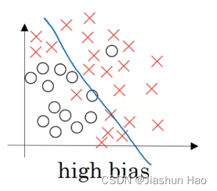

### Variance（方差）

方差是指模型对训练数据中随机噪声的敏感程度。  
 高方差表示模型在训练数据上表现很好，但在测试数据上表现较差，即模型过拟合（overfitting）。方差高的模型通常过于复杂，只记住训练数据中的噪声，但无法泛化到新的数据。

**特征：**

- 模型过于复杂
- 在训练数据上表现很好，但在测试数据上表现较差
- 训练误差低，测试误差高

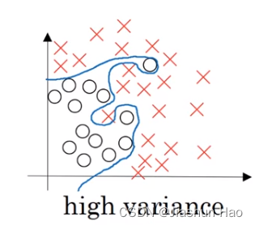

### Bias-Variance Tradeoff（偏差-方差权衡）

偏差和方差之间存在权衡关系，即在降低偏差的同时可能会增加方差，反之亦然。理想情况下，模型应当在偏差和方差之间找到一个平衡点，以确保其在训练数据和测试数据上都能有较好的表现。

1. **高偏差、低方差：**

   - 简单的线性模型
   - 训练误差和测试误差都较高
2. **低偏差、高方差：**

   - 复杂的神经网络模型
   - 训练误差低，测试误差高
3. **适中偏差、适中方差：**

   - 适度复杂的模型，如带有正则化的神经网络
   - 训练误差和测试误差都在合理范围内

### 解决方法

先要解决偏差问题，当偏差解决以后再考虑方差问题。

当进行方差操作以后，一定要再次测试新的策略的会不会再次导致**偏差**问题

**减小偏差**

- 使用更复杂的模型
- 增加模型参数
- 减少正则化强度

**减小方差**

- 使用更多的训练数据
- 简化模型
- 增加正则化强度（如L2正则化）
- 使用集成方法（如bagging和boosting）

## 四：正则化（Regularization）

正则化就是利用一些手段，在模型训练解决解决模型过拟合、提高范化能力等问题。

不同的方法作用的阶段不同。

不过这之前需要明白一个概念：重要特征和最高权重

### 1. 重要特征和最高权重

PS:以下全为个人抽象理解，未来有极大概率修改这段话，切勿照本宣科。

在深度学习中，重要特征指的是“对预测影响较大”的特征值。

假设样本X有俩个特征：x1为0.9，x2为0.1

如果此时标签Y是1,那么x1就是重要特征，如果标签为0,那么x2就是重要特征。

虽然最后的关于特征的表示，是特征\*权重，但是权重的值一般都比较小，类似0.01

即使一开始给非重要特征设置了高权重，在一次次优化中（类似梯度下降）非重要特征的权重也会变低，重要特征的权重会变高。

所以，从结果导向来看：**重要特征**就是**权重高**的特征，**非重要**特征就是**权重低**的特征

### 2. L1正则化（Lasso正则化）：作用于损失函数和权重

FORMULA\_PLACEHOLDER\_200\_END

FORMULA\_PLACEHOLDER\_220\_END

解析：简单来说Lasso正则化就是在原有的损失函数上增加了一个 FORMULA\_PLACEHOLDER\_232\_END 倍的权重的方差，这样会导致如下的结果：

1：由于增加的内容基于权重的值，对于大权重的特征来说，损失会增大，所以下一次更新的时候权重会被减少很多。  
 2：对于小权重的特征来说，损失也会增大，但也没有那么大，所以下一次更新的时候权重会减少但是没有很多。

抽象举例，假设：大权重为100,小权重为1

这样操作以后，下一次更新也许大权重会变为 1 , 减少了99，也许小权重会变为 0.1，减少了 0.9。

虽然大权重变少了很多，但是还是比小权重高，所以对于模型来说，**大权重的特征的重要性还是比小权重的特征的重要性要高。**

为什么降低特征的权重可以减少过拟合呢？

因为可以减少对**个别特征**的过度依赖。泛化能力不足往往与模型对个别特征的过度依赖有关

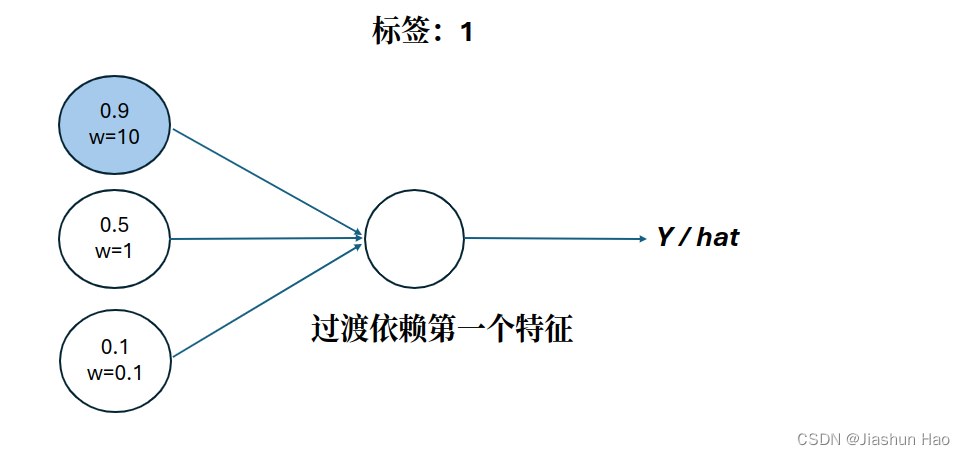  
 此外，降低权重还有另外作用，减小非重要特征的影响力–权重被趋近于0。**减小网络复杂度**  
 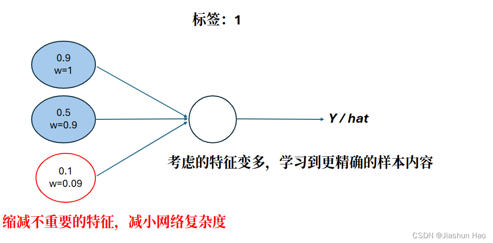

对第一层来说，减小的是输入的特征的权重，**优化的是输入样本的特征**。

但是对于深度网络的其它层来说，减小是上一层的输出的权重，优化的则是上一层神经网络

L1正则化前：  
 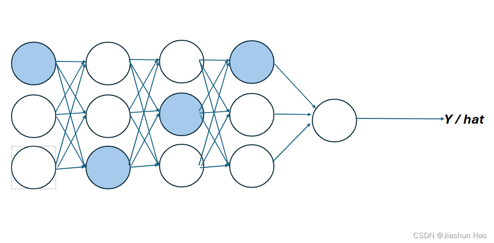L1正则化后：  
 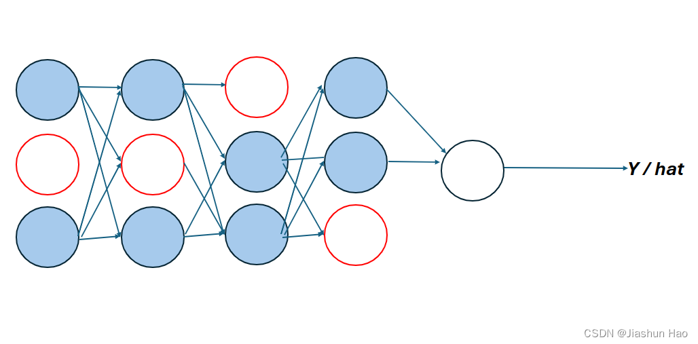

### 3. L2正则化（Ridge正则化）：作用于损失函数和权重

FORMULA\_PLACEHOLDER\_237\_END

FORMULA\_PLACEHOLDER\_259\_END  
 实现代码：

```
#np.square 数组里面每一个值都平方
regularization =(1/m)*(lambd/2)*(np.sum(np.square(W1))+np.sum(np.square(W2))+np.sum(np.square(W3)))
```

原理于L1类似，差异如下：

**区别**

- **L1正则化**会导致模型参数中许多值变为零，从而产生稀疏解。这是因为L1正则化倾向于在优化过程中沿参数的坐标轴将其推向零，这也有助于特征选择。
- **L2正则化**倾向于将参数值均匀地减小，而不是将它们推向零。这可以防止任何一个参数对模型结果产生过大影响，从而减轻模型过拟合的问题。

**对异常值的敏感度**

- **L1正则化**对于异常值较不敏感，因为它倾向于选择某些特征而忽略其他特征，这使得模型更加简单且稳健。
- **L2正则化**由于平方项的存在，对异常值较敏感，特别是当异常值的平方会对损失函数造成很大影响时。

**解的唯一性**

- **L1正则化**可能会因为稀疏性而不产生唯一解，特别是当一些特征高度相关时。
- **L2正则化**通常会产生唯一解，因为添加的惩罚项 FORMULA\_PLACEHOLDER\_271\_END 确保了损失函数是严格凸的。

**应用场景**

- **L1正则化**常用于特征选择和处理高维数据的场景，尤其是当一些特征是多余的或者相关性很高时。
- **L2正则化**更适用于防止模型复杂度过高，需要处理模型中所有特征大体上都是重要的情况。

选择L1还是L2正则化通常取决于具体问题的需求和数据的特性。

例如，如果你需要一个简化的模型来解释模型是如何做出决策的（特征选择），L1可能是更好的选择。

如果你需要确保模型的所有参数都小一些，从而增强模型的泛化能力，那么L2可能是更合适的选择。同时L2也是最常用的正则化手段。

在实践中，也可以同时使用L1和L2正则化，这种组合被称为弹性网（Elastic Net）正则化。

### 4. Dropout正则化：作用于激活值

Dropout正则化不能用于测试阶段！！Dropout正则化不能用于测试阶段！！

相较于L1和L2利用损失函数来间接的弱化一些不重要的神经元。

Dropout 的核心思想更直接，就是在每次训练迭代中，随机将一些神经元的激活值 FORMULA\_PLACEHOLDER\_280\_END 设置为零，每次训练设置的神经元都不同。

Dropout 丢弃的不是神经元，丢弃的是当前个别神经元对于样本的预测，

或者说丢弃的是**当前层**某一个神经元对于原始输入**样本的预测**，每次训练迭代中丢的都不一样。

这个过程涉及到公式不明朗（在我看来是这样…）所以在此直接记录完成的代码。

```
# A的维度（当前神经元个数，样本的个数）
# A3：存放第三层的5个神经元对于最开始输入的10个样本的预测
A3 = np.random.randn(5, 10)

# 开始
# 1.设置 keep_prob 为 0.8 (即有 0.2 的概率舍弃)
keep_prob = 0.8 #概率为1-keep_prob

# 2.设计一个和A3形状一样的随机数矩阵
D3 = np.random.rand(a3.shape[0], a3.shape[1]) # 这里用的是rand，在[0,1) 之间取值
D3 = D3 < keep_prob #用True 和 False 随机填充 D3

# 3.利用随机矩阵的True 和 False随机丢弃 A3中的值
A3 = A3 * D3 #True == 1 / False == 0

# 4.扩大A3的值
A3 = A3/keep_prob #因为有（1-keep_prob）也就是20%，的值被舍弃了，所以扩大20%。
# A3= A3 /（8/10）
# A3= A3 *（10/8） 

#......
# 5.更新导数，从后向前
dA3 = dA3 * D3               
dA3 = dA3 / keep_prob 

dA2 = dA2 * D2               
dA2 = dA2 / keep_prob 
#.....
```

为什么说设置 keep\_prob 为 0.8 (即有 0.2 的概率舍弃)？因为D3 = np.random.rand(a3.shape[0], a3.shape[1])采用的是rand随机，范围为0-1，所以当D3 = D3 < keep\_prob，有 0.2 的概率获得的值小于0.8。

此外， Dropout正则化的设置比较灵活，对于重要的层，比如最后的输出层，我们也可以不用 Dropout，把 keep\_prob 设置为1。  
 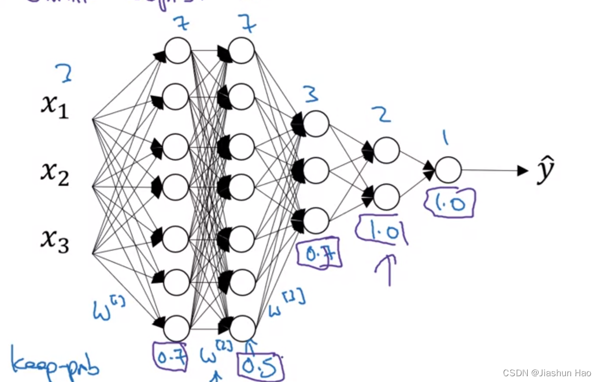

### 5. 其它正则化：

#### 1.歪门邪道–数据扩增（Data Augmentation）

简单来说就是修改当前有的数据集为新数据。

举例数据集数据为图片，那么就可以**水平反转图片、裁切图片、图片轻微扭曲**。

#### 2.早停法（Early Stopping）：基于验证集

简单来说，就是在测试寻找超参数（迭代次数、学习率等）的时候，找一个对于验证集来说损失最低的FORMULA\_PLACEHOLDER\_285\_END和FORMULA\_PLACEHOLDER\_290\_END, 即使这个FORMULA\_PLACEHOLDER\_295\_END和FORMULA\_PLACEHOLDER\_300\_END不是对于训练集的损失最低。  
 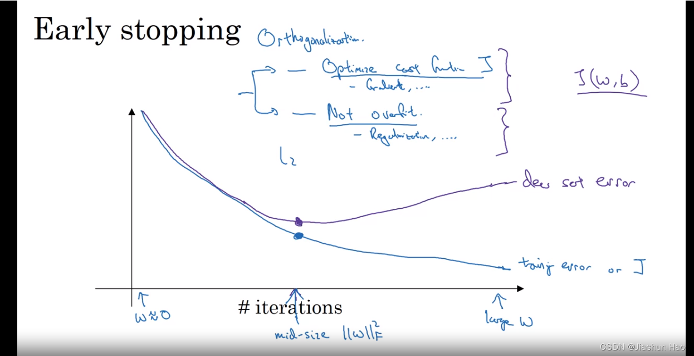

## 五、设置优化问

除了正则化以外，一些对于设置的优化方式，也可以帮助建立更好的模型，主要有以下几点。

### 1. 输入：Normalizing化

目的：可以将数据聚合到以0为原点，的方差标准化为 1。

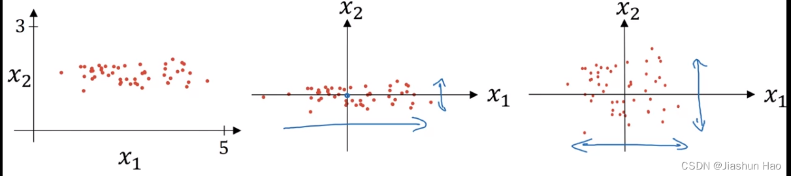  
 **公式：**

第一步，获得输入的均值：  
 FORMULA\_PLACEHOLDER\_305\_END  
 第二步，计算方差：  
 FORMULA\_PLACEHOLDER\_316\_END  
 于是标准差：  
 FORMULA\_PLACEHOLDER\_328\_END

第三步，最终的标准化数据：  
 FORMULA\_PLACEHOLDER\_340\_END

通过输入Normalizing化，可以让特征分布的更均匀，损失函数图形更像一个碗，更容易梯度下降。  
 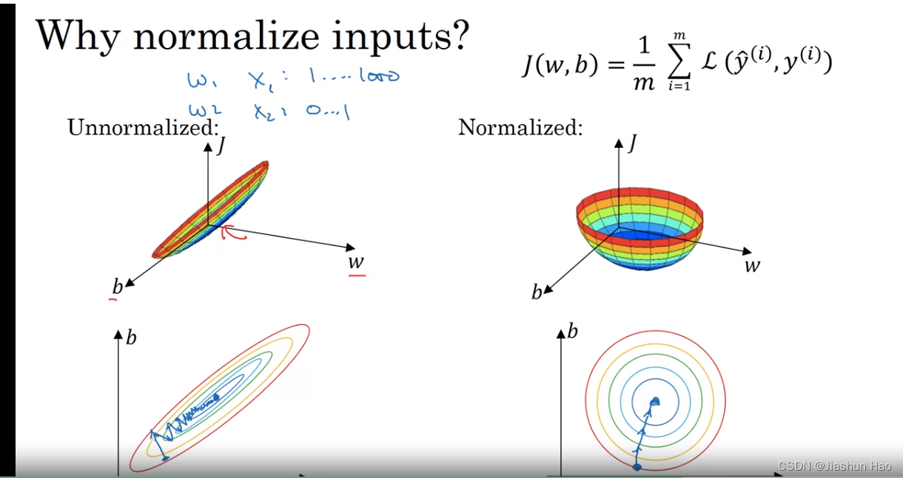

### 2. 防止梯度爆炸/梯度消失

防止梯度爆炸/梯度消失，主要是因为对于深层的神经网络，如果用统一的方式初始化 W 矩阵，W的初始值都相同。

在后续涉及到 W 乘法操作中可能会导致 **W 过大或者过小**，继而导致 **Z 过大或者过小**。  
 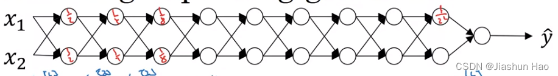

所以我们需要优化W的初始化，即对不同的层用不同的W初始化函数

对于不同的激活函数，初始化的方法也不一样

#### 1.对于ReLU作为激活函数: He

```
	WL=np.random.rand(shape) * np.sqrt( 2.0 / 前一层的神经元个数) # np.sqrt( 2 / n[l-1])
	# W的形状为（n[l], n[l-1]），n[l]为当前神经元个数； n[l-1]为前一层的神经元个数
```

#### 2.对于Tanh\sigmoid 作为激活函数: Xavier

```
	WL=np.random.rand(shape) * np.sqrt( 1.0 / 前一层的神经元个数) # np.sqrt( 2 / n[l-1])
	# W的形状为（n[l], n[l-1]），n[l]为当前神经元个数； n[l-1]为前一层的神经元个数
```

也有第二个版本

```
	WL=np.random.rand(shape) * np.sqrt( 2.0 / (前一层的神经元个数)+(当前层的神经元个数)) # np.sqrt( 2 / n[l-1])
	# W的形状为（n[l], n[l-1]），n[l]为当前神经元个数； n[l-1]为前一层的神经元个数
```

### 3. 梯度检查（Gradient Checking）

当模型出现一些问题的时候，我们需要逐一排查，其中一个很重要的部分是对 “**梯度下降算法**”和“**反向传播**”的检查，要进行梯度检查，必须要考虑下面这三点：

1. 只有在debug的时候，代码调式的时候才可以使用。训练测试的时候不要使用。
2. 考虑代码中是否用了正则化
3. 不能与 dropout 一起用

#### 1. 中心差分公式

梯度检查的核心来源于中心差分公式：  
 FORMULA\_PLACEHOLDER\_349\_END  
 FORMULA\_PLACEHOLDER\_363\_END

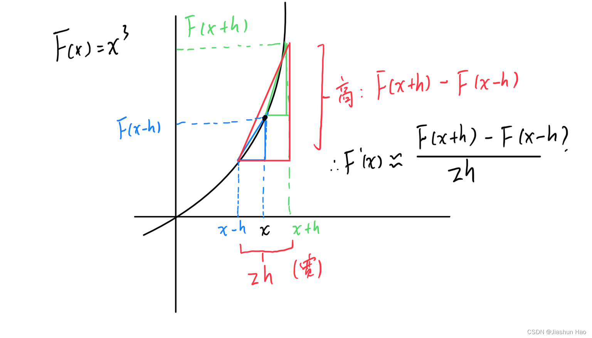  
 不过，这个方法有一个必要的前提条件，

那就是 FORMULA\_PLACEHOLDER\_375\_END, 这个移动的标量必须是一个极小值，类似FORMULA\_PLACEHOLDER\_380\_END

#### 2. 梯度检查

1. 首先，将所有 FORMULA\_PLACEHOLDER\_385\_END 层网络中的每一个 FORMULA\_PLACEHOLDER\_390\_END 和 FORMULA\_PLACEHOLDER\_395\_END 聚合为一个单位

```
# θ ={w1,b1,w2,b2....wl,bl}
theta=np.concatenate([w1.flatten(),b1 , w2.flatten(),b2 , w3.flatten(),b3 , .....)}
```

2. 然后，我们计算近似导数 dθ 的值

```
for i = L:
 dθ = (J(θ1,θ2,θ3.....θi+h,...,θL)-J(θ1,θ2,θ3.....θi-h,...,θL)) / 2h
```

3. 计算似导数 dθ 集与实际导集合的相对公差（relative error）

FORMULA\_PLACEHOLDER\_400\_END

这个移动的标量必须是一个极小值，类似 FORMULA\_PLACEHOLDER\_409\_END

如果 FORMULA\_PLACEHOLDER\_413\_END 是 FORMULA\_PLACEHOLDER\_418\_END ，那么relative error的值应该在 FORMULA\_PLACEHOLDER\_422\_END 到 FORMULA\_PLACEHOLDER\_426\_END 之间，否则为异常。

## 六、小批量梯度下降（Mini-batch gradient descent）

梯度下降的方法有两种，一种是之前一直使用的利用`全部的训练数据`进行梯度下降，专业名词叫批量梯度下降，这样做有以下的特点：

1. 使用整个训练集计算梯度并更新参数。
2. 优点：收敛方向稳定。
3. 缺点：计算代价高，特别是对于大数据集。

如果涉及到数据集很大，计算成本太高，所有有人提出了随机梯度下降，简单来说就是使用`一个`样本来进行梯度下降，这样可以很快速的**更新梯度**

1. 每次只使用一个样本计算梯度并更新参数。
2. 优点：计算代价低，可以更快地进行迭代。
3. 缺点：梯度更新的方向波动较大，导致收敛不稳定。不会收敛，在一个低点摆动。

结合二者的优点，提出了小批量梯度下降，即使用`1 < M < 训练样本总数` 的 数据去进行梯度下降，综合收敛方向稳定 和 计算代价低，可以更快地进行迭代 的优点  
 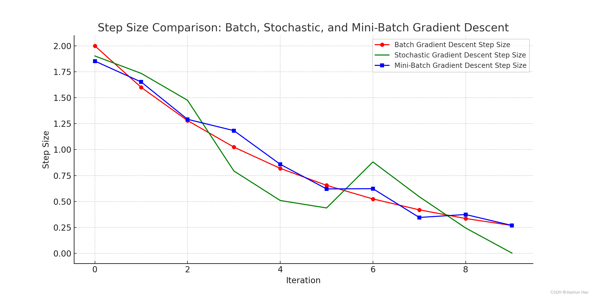  
 使用小批量梯度下降，建议遵守下面的规范：

1. 当数据量 >= 2000 时，再使用小批量梯度下降。数据量太小没意义
2. 每一个小批量集合里面的样本个数，遵循 FORMULA\_PLACEHOLDER\_430\_END ，建议使用64、128、256、512…
3. 确保所有的小批量集合可以被CPU和GPU所容纳。
4. 小批量集合的大小也是一个超参数！！ (可调)
5. 每一个小批量集合，用FORMULA\_PLACEHOLDER\_435\_END表示

#### 1. 伪代码

```
L = len(parameters) // 2 # number of layers in the neural networks

for l in range(1, L + 1): #神经网络层数
	#前向传播 : X[t]
	Z[1]=W[1]X[t]+b[1]
	A[1]=g[1](Z[1])
	....
	A[L]==g[L](Z[L])#L是层数
	
	# 计算损失函数：使用第t个小批量数据的预测值 Y_hat[t] 和真实值 Y[t]
	Cost J[t] = (1 / 小批量集规模) * np.sum(损失函数(Y[t], Y_hat[t])) + 正则化项
	
	#反向传播：计算J[t]的梯度，用X[t]和Y[t]
	dW[L], db[L] = 计算梯度(第L层, A[L], Y[t])
    ...
    dW[1], db[1] = 计算梯度(第1层, A[1], Y[t])
    
    #更新
	W[L] ：= W[L]- alpha * dW[L]
	b[L] ：= b[L]- alpha * db[L]
	....
	W[1] ：= W[1]- alpha * dW[1]
	b[1] ：= b[1]- alpha * db[1]
```

#### 2. 实现代码

```
X #input data, of shape (input size, number of examples)
Y #true "label" vector (1 for blue dot / 0 for red dot), of shape (1, number of examples)
m = X.shape[1]  #样本总数
mini_batch_size = 64 #小批量数据的大小
np.random.seed(seed)#随机种子，用于确保每次生成的随机小批量数据都是相同的。

#1：打乱数据
permutation = list(np.random.permutation(m))	#生成随机的顺序
shuffled_X = X[:, permutation]					#按照随机的顺序重新排列每一行
shuffled_Y = Y[:, permutation].reshape((1, m))

#2：分割数据
mini_batch_size= 10 # 每一个子集容纳的数据的大小

# 批次,要划分的子集的个数
# num_complete_minibatches=100 
num_complete_minibatches = math.floor(m / mini_batch_size) #总数除以每一个子集容纳的数据，然后向上取整数

for k in range(0, num_complete_minibatches):
	#使用切片截断取数
	mini_batch_X = shuffled_X[:, k * mini_batch_size : (k + 1) * mini_batch_size]
    mini_batch_Y = shuffled_Y[:, k * mini_batch_size : (k + 1) * mini_batch_size]
	
	#组合这些到一个列表，方便以后使用
	mini_batch = (mini_batch_X, mini_batch_Y)
    mini_batches.append(mini_batch)
    
#如果总数和划分的批次不是倍数关系，即存在没有被完整划分的剩余部分    
if m % mini_batch_size != 0:
	#num_complete_minibatches * mini_batch_size 等于整数划分的终点数
    mini_batch_X = shuffled_X[:, num_complete_minibatches * mini_batch_size : m] #从终点数到m的所有数被分为一个集合
    mini_batch_Y = shuffled_Y[:, num_complete_minibatches * mini_batch_size : m]
	
	#追加到列表
	mini_batch = (mini_batch_X, mini_batch_Y)
    mini_batches.append(mini_batch)
```

## 七、加权指数平均（Weighted Exponential Moving Average, WEMA）

存在一些比梯度下降更快的算法，但是为了学习这些算法，需要提前明白加权指数平均

加权指数平均（WEMA）的核心思想就是在考虑所有历史数据的基础上，通过赋予较新的数据点和旧数据点不同的权重，来计算局部平均值

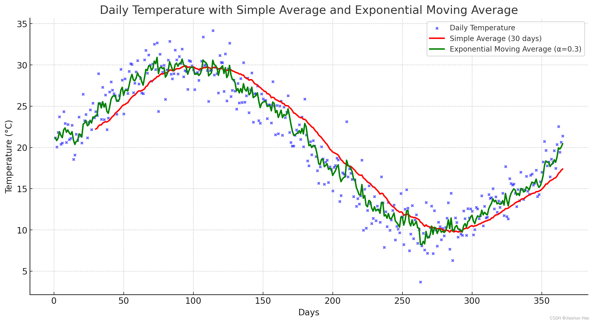

#### 1. 数学公式

FORMULA\_PLACEHOLDER\_441\_END  
 其中  
 FORMULA\_PLACEHOLDER\_454\_END  
 FORMULA\_PLACEHOLDER\_464\_END  
 假设FORMULA\_PLACEHOLDER\_472\_END推导出FORMULA\_PLACEHOLDER\_477\_END，那么FORMULA\_PLACEHOLDER\_482\_END就是以当前起点，约等于前10个样本平均值  
 假设FORMULA\_PLACEHOLDER\_488\_END推导出FORMULA\_PLACEHOLDER\_493\_END，那么FORMULA\_PLACEHOLDER\_498\_END就是以当前起点，约等于前2个样本平均值

## 八、带动力的梯度下降（Gradient descent with momentum）

这个算法的主要思想，是计算梯度的指数加权平均，然后使用这个梯度来更新权重

动量方法的核心就是增大过去值的影响力，减小新值的影响，来平滑下降过程，不至于太抖动。同时也可以使用大学习率了。

1. **平滑更新过程**：通过累积历史梯度，动量方法能够平滑参数的更新过程，减少在优化过程中的振荡或震荡。这是因为在每一步中，不仅考虑了当前的梯度，还有之前累积下来的梯度方向，使得更新方向更加稳定。
2. **使用更大的学习率**：由于动量帮助减少了更新中的随机波动，因此可以使用较大的学习率而不至于让模型的训练过程变得不稳定。较大的学习率可以帮助模型在训练初期快速下降，并在后期通过动量的平滑作用维持稳定。

它的原理很简单，

在持续方向上加速：如果连续多个梯度指向同一方向，动量会累积这个方向上的速度，使得参数更新更快，从而加速收敛。

在反向振荡时减速：如果梯度方向频繁改变（例如在陡峭的“峡谷”地形中），累积的动量可以减缓更新的步伐，从而减少在这些方向上的振荡。

#### 1. 数学公式

动力计算公式：  
 FORMULA\_PLACEHOLDER\_504\_END

参数更新公式：  
 FORMULA\_PLACEHOLDER\_517\_END

#### 2. 代码公式

1：FORMULA\_PLACEHOLDER\_529\_END 和 FORMULA\_PLACEHOLDER\_536\_END 被初始化为0 , 形状与 FORMULA\_PLACEHOLDER\_543\_END 相同.  
 2：FORMULA\_PLACEHOLDER\_551\_END 恒定为0.9  
 FORMULA\_PLACEHOLDER\_556\_END  
 FORMULA\_PLACEHOLDER\_571\_END  
 FORMULA\_PLACEHOLDER\_586\_END  
 FORMULA\_PLACEHOLDER\_597\_END

#### 3. 实现代码

```
L = len(parameters) // 2 # number of layers in the neural networks

for l in range(1, L + 1): #神经网络层数
	#1:使用原始的反向传播计算机dw和db
	dw,db
	
	#2:初始化Vdw和Vdb
	#Vdw =0,Vdb=0
	v["dW" + str(l)] = np.zeros_like(parameters["W" + str(l)])
	v["db" + str(l)] = np.zeros_like(parameters["b" + str(l)])
	
	#3:计算动力
	beta=0.9
	Vdw = beta * Vdw + (1-beta) * dw
	Vdb = beta * Vdb + (1-beta) * db
	
	#4:更新
	w = w - Lambda * Vdw
	b = b - Lambda * Vdb
```

## 九、RMSprop（Root Mean Square Propagation）

RMSprop算法通过引入指数加权移动平均（Exponential Moving Average, EMA）来调整每个参数的学习率，从而防止学习率过大或过小。

#### 1. 数学公式

在公式里面额外引入了一个非常小常数FORMULA\_PLACEHOLDER\_608\_END，这是为了防止**除数为0**, 常用的设置为 FORMULA\_PLACEHOLDER\_613\_END。FORMULA\_PLACEHOLDER\_618\_END 恒定为0.999

指数加权移动平均计算公式：  
 FORMULA\_PLACEHOLDER\_623\_END  
 更新公式：  
 FORMULA\_PLACEHOLDER\_636\_END

#### 2. 代码公式

FORMULA\_PLACEHOLDER\_651\_END  
 FORMULA\_PLACEHOLDER\_666\_END  
 FORMULA\_PLACEHOLDER\_681\_END  
 FORMULA\_PLACEHOLDER\_695\_END

#### 3. 实现代码

```
L = len(parameters) // 2 # number of layers in the neural networks

for l in range(1, L + 1): #神经网络层数

	#1:使用原始的反向传播计算机dw和db
	dw,db
	
	#2:初始化Sdw和Sdb
	#Sdw =0,Sdb=0
	S["dW" + str(l)] = np.zeros_like(parameters["W" + str(l)])
	S["db" + str(l)] = np.zeros_like(parameters["b" + str(l)])
	
	#3:计算加权移动
	beta=0.999
	epsilon = 1e-8
	
	Sdw = beta * Sdw + (1 - beta) * (dw ** 2)
	Sdb = beta * Sdb + (1 - beta) * (db ** 2)
	
	#4:更新
	w = w- Lambda * dw / (np.sqrt(Sdw) + epsilon)
	b = b- Lambda * db / (np.sqrt(Sdb) + epsilon)
```

## 十、Adam（Adaptive Moment Estimation）

Adam结合了动量法和RMSprop的优点，同时引入了偏差修正，以提高训练的效率和稳定性。

#### 1. 数学公式

可以用它来代替梯度下降算法。FORMULA\_PLACEHOLDER\_709\_END 为导数

公式一，动力计算：  
 FORMULA\_PLACEHOLDER\_715\_END  
 公式二，指数计算：  
 FORMULA\_PLACEHOLDER\_728\_END  
 公式三：偏差修正：  
 FORMULA\_PLACEHOLDER\_741\_END  
 FORMULA\_PLACEHOLDER\_752\_END  
 公式四：更新  
 FORMULA\_PLACEHOLDER\_763\_END

#### 2. 代码公式

1：FORMULA\_PLACEHOLDER\_778\_END 和 FORMULA\_PLACEHOLDER\_785\_END， FORMULA\_PLACEHOLDER\_792\_END 和 FORMULA\_PLACEHOLDER\_799\_END被初始化为0 , 形状与 FORMULA\_PLACEHOLDER\_806\_END 相同.

2：FORMULA\_PLACEHOLDER\_814\_END 恒定为0.9，FORMULA\_PLACEHOLDER\_819\_END 恒定为0.999

3： 小常数FORMULA\_PLACEHOLDER\_824\_END

Moment部分：  
 FORMULA\_PLACEHOLDER\_829\_END  
 FORMULA\_PLACEHOLDER\_844\_END

RMSprop部分：  
 FORMULA\_PLACEHOLDER\_859\_END  
 FORMULA\_PLACEHOLDER\_874\_END

偏差修正部分：

为什么要这个？

一开始我们默认的将FORMULA\_PLACEHOLDER\_889\_END 和 FORMULA\_PLACEHOLDER\_896\_END， FORMULA\_PLACEHOLDER\_903\_END 和 FORMULA\_PLACEHOLDER\_910\_END被初始化为0，这样会导致动量和梯度平方的指数加权移动平均值（EMA）未完全成熟而导致的偏差。我们需要消除这个偏差。

FORMULA\_PLACEHOLDER\_917\_END  
 FORMULA\_PLACEHOLDER\_946\_END

更新部分：  
 FORMULA\_PLACEHOLDER\_975\_END  
 FORMULA\_PLACEHOLDER\_998\_END

#### 3. 实现代码

```
#1：Vdw，Vdb，Sdw，Sdb 初始化为0，形状和W，b一样
L = len(parameters) // 2 # number of layers in the neural networks
for l in range(1, L + 1): #神经网络层数	
	v["dW" + str(l)] = np.zeros_like(parameters["W" + str(l)])
	v["db" + str(l)] = np.zeros_like(parameters["b" + str(l)])
	s["dW" + str(l)] = np.zeros_like(parameters["W" + str(l)])
	s["db" + str(l)] = np.zeros_like(parameters["b" + str(l)])

#2：动力和RMSprop计算
L = len(parameters) // 2                 # number of layers in the neural networks
v_corrected = {}                         # Initializing first moment estimate, python dictionary
s_corrected = {}                         # Initializing second moment estimate, python dictionary
learning_rate = 0.01, beta1 = 0.9, beta2 = 0.999,  epsilon = 1e-8
grads #存放反向传播的导数

for l in range(1, L + 1):
	#动力
    v["dW" + str(l)] = beta1*v["dW" + str(l)]+(1-beta1)*grads["dW" + str(l)]
    v["db" + str(l)] = beta1*v["db" + str(l)]+(1-beta1)*grads["db" + str(l)]
    
    #动力矫正
    v_corrected["dW" + str(l)] = v["dW" + str(l)]/(1-beta1**t)
    v_corrected["db" + str(l)] = v["db" + str(l)]/(1-beta1**t)
	
	#RMSprop
	s["dW" + str(l)] = beta2*s["dW" + str(l)]+(1-beta2)*grads["dW" + str(l)]*grads["dW" + str(l)]
    s["db" + str(l)] = beta2*s["db" + str(l)]+(1-beta2)*grads["db" + str(l)]*grads["db" + str(l)]
	
	#RMSprop矫正
	s_corrected["dW" + str(l)] = s["dW" + str(l)]/(1-beta2**t)
    s_corrected["db" + str(l)] = s["db" + str(l)]/(1-beta2**t)
	
	#更新
	parameters["W" + str(l)] -= learning_rate * v_corrected["dW" + str(l)]/(np.sqrt(s_corrected["dW" + str(l)])+epsilon)
    parameters["b" + str(l)] -= learning_rate * v_corrected["db" + str(l)]/(np.sqrt(s_corrected["db" + str(l)])+epsilon)
```

## 十一、学习率衰减（Learning Rate Decay）

学习率是控制模型更新步幅的超参数。

1：过高的学习率可能导致训练过程震荡甚至无法收敛  
 2：过低的学习率则可能导致训练速度过慢。

学习率衰减的目的是在**训练初期使用较大的学习率以快速逼近最优解**，然后逐步减小学习率以精细化模型参数，使模型更稳定地收敛到局部或全局最优点。

常用的两个更新公式：

#### 1：阶梯衰减率

FORMULA\_PLACEHOLDER\_1021\_END

#### 2：指数衰减率

FORMULA\_PLACEHOLDER\_1031\_END

## PS、Python技巧

### 1.随机数 randn 和 rand 的区别

在Python中，特别是在涉及到科学计算和数据处理的库NumPy中，`randn`和`rand`函数都用来生成随机数，但它们的用途和输出的随机数类型有所不同：

1. **`numpy.random.randn`**:

   - `randn`函数生成的是服从**标准正态分布**（均值为0，方差为1的正态分布）的随机数。
   - 可以生成任意形状的数组。
   - 例如，`np.random.randn(2, 3)`会生成一个2行3列的数组，数组中的每个元素都是从标准正态分布中随机抽取的。
2. **`numpy.random.rand`**:

   - `rand`函数生成的是在区间[0, 1)内均匀分布的随机数。
   - 同样可以生成任意形状的数组。
   - 例如，`np.random.rand(2, 3)`会生成一个2行3列的数组，数组中的每个元素都是从[0, 1)区间的均匀分布中随机抽取的。

简而言之，主要区别在于：

- `randn`用于生成符合标准正态分布的随机数。
- `rand`用于生成符合均匀分布的随机数。

具体到应用:

初始化权重矩阵：`randn`

Dropout正则化：`rand`

### 2.同时设置网络层数

在典型的神经网络实现中，参数字典 `parameters` 通常包含每一层的权重和偏置，通常以 `W1`, `b1`, `W2`, `b2`, …, `WL`, `bL` 这样的方式命名。

这里 `W` 代表权重矩阵，`b` 代表偏置向量，而数字表示对应的层。

比如，对于一个具有 ( L ) 层的神经网络，`parameters` 可能包含以下键值对：

- `W1`, `b1`: 第一层的权重和偏置
- `W2`, `b2`: 第二层的权重和偏置
- …
- `WL`, `bL`: 第 L 层的权重和偏置

这样，`parameters` 的键的数量总是 **( 2L )**（每一层有两个参数，一个权重矩阵和一个偏置向量）。

因此，`len(parameters)` 将返回字典中键的总数，即 ( 2L )。用这个总数除以 2 就得到了神经网络的层数 ( L )。

```
    L = len(parameters) // 2 # number of layers in the neural networks
    for l in range(1, L + 1):
    	#初始化操作。...
```

### 3. 多维数组转一维向量

`flatten` 操作通常用于将多维数组（如矩阵或张量）变为一维数组（向量）

```
import numpy as np

a=np.random.rand(3,3)
print (a)
# [[0.81326486 0.08026124 0.38529666]
#  [0.26521685 0.2712353  0.37634291]
#  [0.70843229 0.34048282 0.32902673]]

a=a.flatten()
print(a)
#[0.81326486 0.08026124 0.38529666 0.26521685 0.2712353  0.37634291 0.70843229 0.34048282 0.32902673]
```

### 4. 数组逐元素平方

`np.square` 是 NumPy 库中的一个函数，用于逐元素计算输入数组中每个元素的平方。该函数返回一个新数组，其中包含输入数组的每个元素的平方值。这个操作是逐元素的，因此对于输入数组中的每个元素，都有对应的平方值。

```
import numpy as np
a=np.random.rand(3,3)
print(a)
# [[0.60829188 0.462002   0.53711763]
#  [0.45887545 0.0317922  0.96084417]
#  [0.62161485 0.53259823 0.95088835]]

a=np.square(a)
print(a)
# [[0.37001901 0.21344585 0.28849535]
#  [0.21056668 0.00101074 0.92322152]
#  [0.38640502 0.28366088 0.90418865]]
```

### 5. 拷贝数组矩阵

`a=np.copy(b)` 用于创建一个数组的拷贝

```
import numpy as np
a=np.random.rand(3,3)
print(a)
# [[0.60829188 0.462002   0.53711763]
#  [0.45887545 0.0317922  0.96084417]
#  [0.62161485 0.53259823 0.95088835]]

b=np.copy(a)
print(b)
# [[0.60829188 0.462002   0.53711763]
#  [0.45887545 0.0317922  0.96084417]
#  [0.62161485 0.53259823 0.95088835]]
```

### 6.随机打乱数据

#### 6.1.随机打乱数据：生成指定范围的随机排列的列表

`permutation = list(np.random.permutation(m))`用于生成一个从`0` 到 `m` 的随机排列的列表

```
import numpy as np

m=5

permutation = list(np.random.permutation(m))

print(permutation) #[2, 4, 3, 1, 0]
```

#### 6.2.随机打乱数据：数组切片语法

切片的基本语法是 `start:stop:step`，其中：

start：切片开始的索引（包含）。  
 stop：切片结束的索引（不包含）。  
 step：步长（可选，默认为 1）。

```
# 创建一个示例数组
import numpy as np
data = np.array([1, 2, 3, 4, 5, 6, 7, 8, 9, 10])

# 提取前5个元素
print(data[:5])  # 输出: [1 2 3 4 5]

# 提取从索引2到索引7的元素（不包含索引7）
print(data[2:7])  # 输出: [3 4 5 6 7]

# 提取从索引2到索引7的每隔一个元素
print(data[2:7:2])  # 输出: [3 5 7]

# 提取数组的最后3个元素
print(data[-3:])  # 输出: [ 8  9 10]
```

还可以反转数组：

```
# 反转数组
print(data[::-1])  # 输出: [10 9 8 7 6 5 4 3 2 1]
```

**用于2D数组：`:` 代表所有，截断提取想要的数**

```
# 创建一个2D数组
matrix = np.array([[1, 2, 3],
                   [4, 5, 6],
                   [7, 8, 9]])

# 提取第一行
print(matrix[0, :])  # 输出: [1 2 3]

# 提取第二列
print(matrix[:, 1])  # 输出: [2 5 8]

# 提取前两行
print(matrix[:2, :])  # 输出: [[1 2 3]
                      #       [4 5 6]]

# 提取前两列
print(matrix[:, :2])  # 输出: [[1 2]
                      #       [4 5]
                      #       [7 8]]

# 提取第二行第二列以后的所有元素
print(matrix[1:, 1:])  # 输出: [[5 6]
                       #       [8 9]]
```

#### 6.3.随机打乱数据：高级索引：使用整数数组或列表来进行索引重新排序

使用指定范围的随机排列的列表和数组切片，可以将数组中的元素重新排序

```
import numpy as np

#原始数据
array=np.array([[1, 2, 3, 4, 5],
                [100, 200, 300, 400, 500],
                [1000,2000,3000,4000,5000]]
              )

x=[0,3,1,4,2]
ac=array[:,x]  # 每一行的数据按照指定的顺序重新排列
print(ac)
# [[   1    4    2    5    3]
#  [ 100  400  200  500  300]
#  [1000 4000 2000 5000 3000]]

y=[1,0,2]
ac=array[y,:] # 每一列的数据按照指定的顺序重新排列
print(ac)
# [[ 100  200  300  400  500]
#  [   1    2    3    4    5]
#  [1000 2000 3000 4000 5000]]
```

### 7. 向上取整和向下取整

向上取整，使用`math.ceil()`，入小数为1

```
import math

a=1.23

b=math.ceil(a)

print(b) #2
```

向下取整，使用`math.floor()`，舍弃小数

```
import math

a=1.23

b=math.floor(a)

print(b) #1
```
