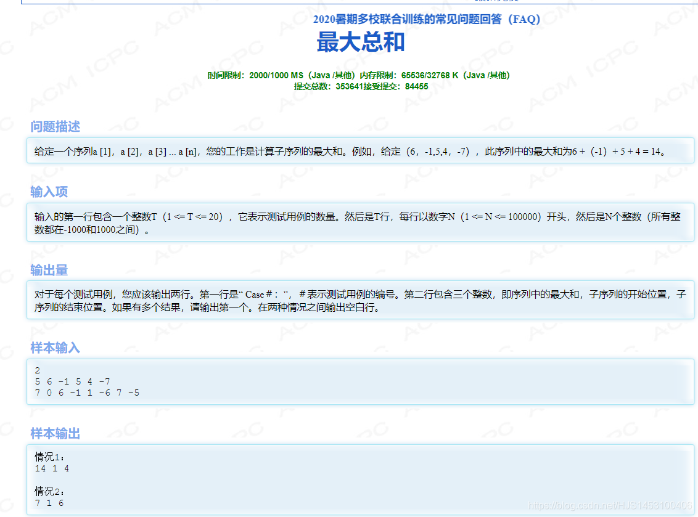

Max Sum
  

---

ime Limit: 2000/1000 MS (Java/Others) Memory Limit: 65536/32768 K (Java/Others)  
Total Submission(s): 353641 Accepted Submission(s): 84455

Problem Description  
Given a sequence a[1],a[2],a[3]…a[n], your job is to calculate the max sum of a sub-sequence. For example, given (6,-1,5,4,-7), the max sum in this sequence is 6 + (-1) + 5 + 4 = 14.

---

Input  
The first line of the input contains an integer T(1<=T<=20) which means the number of test cases. Then T lines follow, each line starts with a number N(1<=N<=100000), then N integers followed(all the integers are between -1000 and 1000).

Output  
For each test case, you should output two lines. The first line is “Case #:”, # means the number of the test case. The second line contains three integers, the Max Sum in the sequence, the start position of the sub-sequence, the end position of the sub-sequence. If there are more than one result, output the first one. Output a blank line between two cases.

---

Sample Input  
2  
5 6 -1 5 4 -7  
7 0 6 -1 1 -6 7 -5

Sample Output  
Case 1:  
14 1 4

Case 2:  
7 1 6

---

  
思路：  
这道题看着挺难，其实也没什么玄机；主要是搞清楚一个概念即可：

如果前面的数是非负数，累加后面的数一定比后面的数本身大  
如果前面的数是负数，即需要移动起始位置，寻找后面的数

```
import java.util.Scanner;
public class Main {
    public static void main(String[] args) {
     Scanner sc=new Scanner(System.in);
     int n=sc.nextInt();
     int S=1;//输出需要；
     while(n>0){

         int k=sc.nextInt();
         int [] sum=new int [k+1];
         for (int i = 0; i <k ; i++) {
             sum[i]=sc.nextInt();
         }
         int [] Text=new int[]{-10001,1,1};//范围在-1000到1000中；
         
         int Max=0,next=1;
         //Max中暂时存放当前最大的和;
         //next中存放序列的截至位置
         
         for (int i = 0; i <k ; i++) {
                Max+=sum[i];
                if (Max>Text[0]){
                    Text[0]=Max; //Text[0]中存放最大的和；
                    Text[1]=next;//Text[1]存放产生最大数的序列的起始位置
                    Text[2]=i+1;//Text[2]存放产生最大数的序列的终止位置
                }
                if (Max<0){//如果前面的数之和为负数，则改变起始位置，Max置零；
                    next=i+2;
                    Max=0;
                }
         }

         System.out.printf("Case %d:%n",S++);
         System.out.println(Text[0]+" "+Text[1]+" "+Text[2]);
         n--;
         if (n!=0)System.out.println();
     }
    }
```

总结：这是杭电oj的基础题，相较于我们学校的oj…你不服不行；
