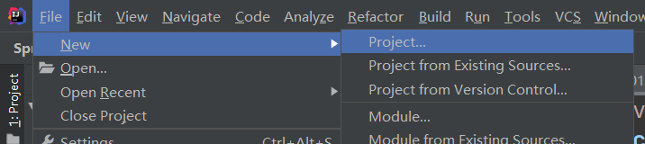
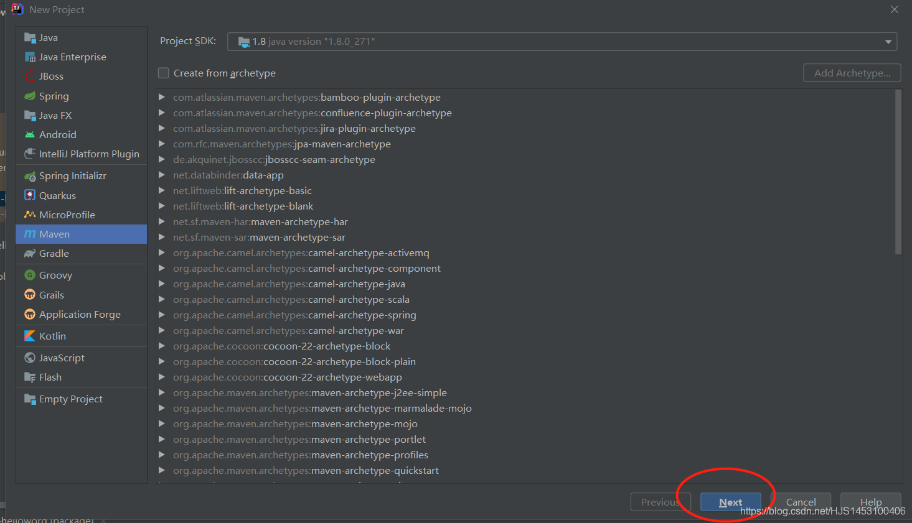
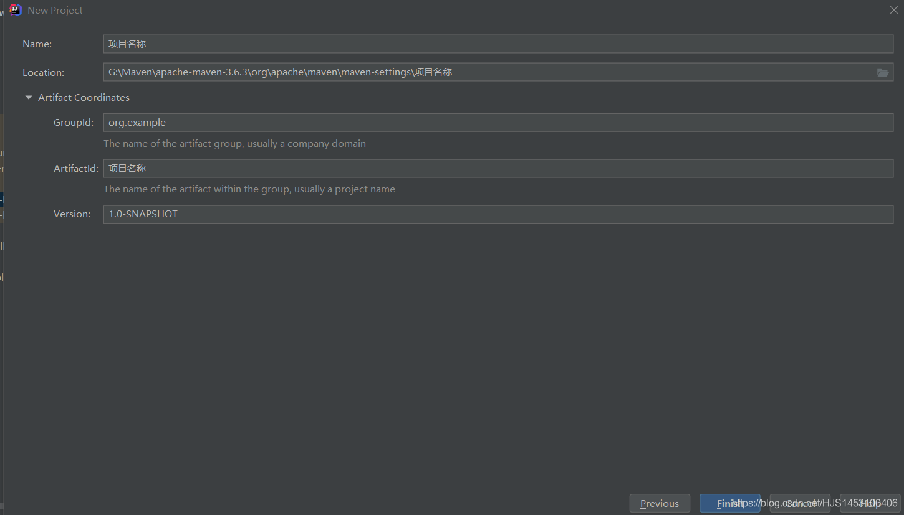
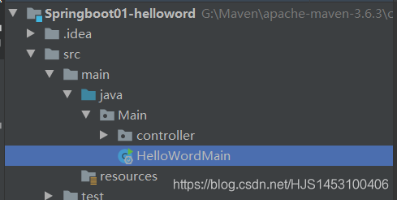
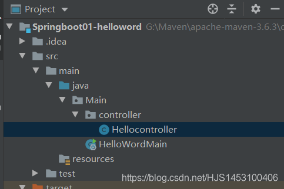
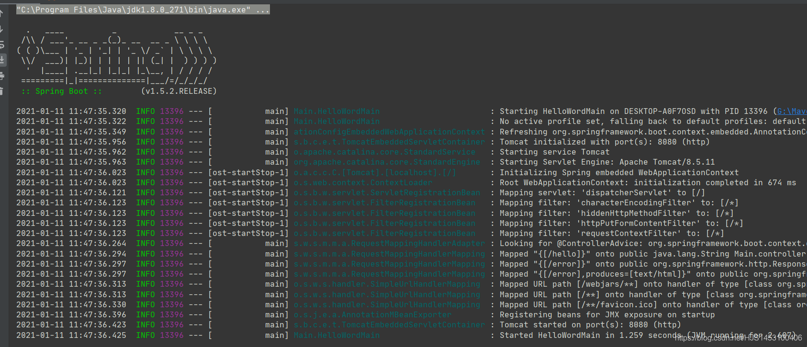
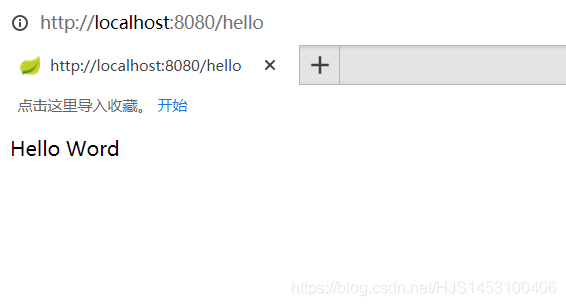

#### SpringBoot

- [一、使用](#_1)
- - [一.创建一个Mave项目](#Mave_2)
  - [二.添加在POM.XMl里添加依赖](#POMXMl_6)
  - [三.编写主程序类](#_36)
  - [四、创建Controller子文件夹并编写处理请求](#Controller_53)
  - [五、启动并测试](#_72)
- [二、解析POM文件](#POM_75)
- - [一.Spring Boot的版本仲裁中心](#Spring_Boot_76)
  - [二.启动器](#_98)
- [三、解析启动类和注解](#_112)

## 一、使用

### 一.创建一个Mave项目



### 二.添加在POM.XMl里添加依赖

```
<!--SpringBoot的核心依赖-->
    <parent>
        <groupId>org.springframework.boot</groupId>
        <artifactId>spring-boot-starter-parent</artifactId>
        <version>1.5.2.RELEASE</version>
    </parent>
```

```
<!--Web项目的依赖-->
    <dependencies>
        <dependency>
            <groupId>org.springframework.boot</groupId>
            <artifactId>spring-boot-starter-web</artifactId>
        </dependency>
    </dependencies>
```

```
<!--打包为jar包的插件-->
    <build>
        <plugins>
            <plugin>
                <groupId>org.springframework.boot</groupId>
                <artifactId>spring-boot-maven-plugin</artifactId>
            </plugin>
        </plugins>
    </build>
```

### 三.编写主程序类

  
 用`@SpringBootApplication`来标记是主程序的启动类

```
import org.springframework.boot.SpringApplication;
import org.springframework.boot.autoconfigure.SpringBootApplication;

//添加SpringBoot的注释
@SpringBootApplication
public class HelloWordMain {//主程序类
    public static void main(String[] args) {
        //启动SpringBoot程序
        SpringApplication.run(HelloWordMain.class,args);
    }
}
```

### 四、创建Controller子文件夹并编写处理请求



```
import org.springframework.stereotype.Controller;
import org.springframework.web.bind.annotation.RequestMapping;
import org.springframework.web.bind.annotation.ResponseBody;

//处理请求的注解
@Controller
public class Hellocontroller {

    @ResponseBody            //将请求写出去
    @RequestMapping("/hello")//接收浏览器的Hello请求
    public String hello(){
        return "Hello Word";
    }
}
```

### 五、启动并测试

  
 

## 二、解析POM文件

### 一.Spring Boot的版本仲裁中心

父项目（parent）

```
    <parent>
        <groupId>org.springframework.boot</groupId>
        <artifactId>spring-boot-starter-parent</artifactId>
        <version>1.5.2.RELEASE</version>
    </parent>
```

父项目的父项目

```
	<parent>
		<groupId>org.springframework.boot</groupId>
		<artifactId>spring-boot-dependencies</artifactId>
		<version>1.5.2.RELEASE</version>
		<relativePath>../../spring-boot-dependencies</relativePath>
	</parent>
```

1.用来管理SprinBoot应用里所有依赖的版本  
 2.默认导入依赖时（比如Mysql）不需要写版本号  
 3.没有在dependencies管理中写出的依赖需要单独声明版本号

### 二.启动器

1.`spring-boot-starter`为spring-boot的场景启动器  
 2.spring-boot将所有功能所需要的场景封装为多个starters（启动器），只需要将这些starter导入进来便可以使用这些场景,需要什么功能导入什么场景

例如：

```
<dependency>
	<groupId>org.springframework.boot</groupId>
	<!--导入WEB功能所需要的场景-->
	<artifactId>spring-boot-starter-web</artifactId>
</dependency>
```

  

## 三、解析启动类和注解

1.注解`@SpringBootApplication`标明过的类就是系统的启动类  
 2.SpringApplication.run（）方法中传入的类一定是被`@SpringBootApplication`标注的类

```
@SpringBootApplication  
public class HelloWordMain {//主程序类
    public static void main(String[] args) {
        //启动SpringBoot程序
        //传入的类一定是@SpringBootApplication标注的类
        SpringApplication.run(HelloWordMain.class,args);
    }
}
```

3.注解`@SpringBootApplication`是一个组合注解

```
@Target(ElementType.TYPE)
@Retention(RetentionPolicy.RUNTIME)
@Documented
@Inherited
@SpringBootConfiguration 
@EnableAutoConfiguration
@ComponentScan(
	excludeFilters = {
	@Filter(type = FilterType.CUSTOM, classes = TypeExcludeFilter.class),
	@Filter(type = FilterType.CUSTOM, classes = AutoConfigurationExcludeFilter.class) 
	}
)
```

**@SpringBootConfiguration** ：SpringBoot的配置类  
 1.该注解标志在某个类上，表示这是一个SpringBoot的配置类  
 2.底层为 **@Configuration**，用于定义配置类，可替换xml配置文件  
 3.配置类也是容器的一个组件

**@EnableAutoConfiguration**：开启自动配置功能  
 1.以前需要手动配置的东西SpringBoot自动帮我们配置，2.@EnableAutoConfiguration告诉SpringBoot开启自动配置功能  
 3.底层的两个组件：  
 第一个：**@AutoConfigurationPackage** 注解，自动配置包；  
 他的底层：**@Import**(AutoConfigurationPackages.Registrar.class)  
 Spring的底层注解@**Import**，给容器中导入一个组件；导入的组件由`AutoConfigurationPackages.Registrar.class`决定  
 将主配置类（@SpringBootApplication标注的类）的所在包及下面所有子包里面的所有组件扫描到Spring容器；

第二个：@**Import**(EnableAutoConfigurationImportSelector.class)； 给容器导入组件，`EnableAutoConfigurationImportSelector.class`为导入哪些组件的选择器。  
 将所有需要导入的组件以全类名的方式返回；这些组件就会被添加到容器中；  
 它会给容器中导入非常多的自动配置类（xxxAutoConfiguration）；就是给容器中导入这个场景需要的所有组件，并配置好这些组件；

有了自动配置类，免去了我们手动编写配置注入功能组件等的工作；​ `SpringFactoriesLoader.loadFactoryNames(EnableAutoConfiguration.class,classLoader)；`  
 Spring Boot在启动的时候从类路径下的META-INF/spring.factories中获取EnableAutoConfiguration指定的值，将这些值作为自动配置类导入到容器中，自动配置类就生效，帮我们进行自动配置工作；  
 以前我们需要自己配置的东西，自动配置类都帮我们；

J2EE的整体整合解决方案和自动配置都在spring-boot-autoconfigure-1.5.9.RELEASE.jar；