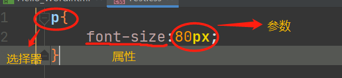

#### 自用JavaWEB备忘录

- [一、HTML](#HTML_1)
- [二、CSS](#CSS_17)
- - [2.1 CSS语法规则](#21_CSS_18)
  - [2.2 CSS样式写法](#22_CSS_23)
  - - [2.2.1 写法一](#221__24)
    - [2.2.2 写法二](#222__32)
    - [2.2.3 写法三](#223__56)
  - [2.3 选择器](#23__81)
  - - [2.3.1 标签名选择器：略](#231__83)
    - [2.3.2 ID选择器](#232_ID_84)
    - [2.3.3 CLASS类选择器](#233_CLASS_107)
    - [2.3.4 组合选择器](#234__138)
- [三、JavaScript](#JavaScript_165)
- - [3.1 JS与HTML结合写法](#31_JSHTML_166)
  - - [3.1.1 方法一.在head或者body标签中定义script标签](#311_headbodyscript_167)
    - [3.1.2 方法二.引入script标签](#312_script_185)
    - [3.1.3 Tip](#313_Tip_200)
  - [3.2 JS变量](#32_JS_217)
  - - [3.2.1变量类型](#321_220)
    - [3.2.2特殊的值](#322_228)
    - [3.2.2JS特殊的逻辑运算符](#322JS_234)
  - [3.3 JS数组](#33_JS_245)
  - - [3.3.1 定义](#331__246)
  - [3.4 JS函数](#34_JS_255)
  - - [3.4.1 第一种定义方式](#341__256)
    - [3.4.2 第二种定义方式](#342__277)
    - [3.4.3 JS函数的特点](#343_JS_298)
  - [3.5 JS自定义对象](#35_JS_323)
  - - [3.5.1使用类名](#351_324)
    - [3.5.2使用花括号](#352_342)

## 一、HTML

```
<form>标签：
            action属性：提交表单的服务器的ip地址
            method属性：提交的方式（GET或POST）
            表单不能发送给服务器的原因：
                1.表单项没有name属性（name属性用于给表单命名方便识别）
                2.单选、复选、下拉列表中的option属性都需要添加value属性识别表单元提交的元素（不然默认为 on和off）
                3.表单项目不在form标签中
                
<div>标签 ：独占一行

<span>标签：根据内容的决定标签长度

<p>标签：段落标签，独占一行，并且在（如果上方没有段落标签）上方和下方空一行
```

## 二、CSS

### 2.1 CSS语法规则

  
 **选择器：** 决定那些属性受影响；  
 **属性：** 要改变的样式，属性和参数间用`:`隔开

### 2.2 CSS样式写法

#### 2.2.1 写法一

**特点：修改单独的一个标签**

```
  <!--在标签的style属性上设置“key:value value;”-->
<div style="border: 1px solid blue">
        123456
</div>
```

#### 2.2.2 写法二

**特点：修改同一个页面中的所有标签**

```
<head>
    <meta charset="UTF-8">
    <title>Title</title>
     <!--写在head标签里-->
    <!--style标签专门用于定义CSS样式的代码-->
    <style type="text/css">
    /*这种方法将修改所有的div*/
        div{
            border: 1px solid red;
        }
    </style>
    
</head>
<body>

    <div >
        123456
    </div>

</body>
```

#### 2.2.3 写法三

**特点：** 单独写一个CSS文件

CSS:

```
div{
    border: 1px solid red;
}
```

HTML：

```
<head>
    <meta charset="UTF-8">
    <title>Title</title>
    <!-- 使用link标签引入CSS文件-->
    <link rel="stylesheet" type="text/css" href="Test.css">
</head>
<body>
    <div >
        123456
    </div>
</body>
```

  

### 2.3 选择器

> 标签对于选择器的使用优先级取决于**最后引用的选择器**

#### 2.3.1 标签名选择器：略

#### 2.3.2 ID选择器

**特点：** 一个标签选择性使用唯一的样式

```
<head>
    <meta charset="UTF-8">
    <title>Title</title>
    <style type="text/css">

       #Test1{/*用#号开头，id名称为Test1*/
           border: 1px solid red;
       }

    </style>

</head>
<body>

    <div id="Test1"><!--选择id为"Test1"的样式-->
        123456
    </div>

</body>
```

#### 2.3.3 CLASS类选择器

> **特点：** 多个标签选择性使用多个样式
>
> 1. id相当于身份证，不可重复；
> 2. class相当于姓名，可以重复。
> 3. 一个HTML标签只能绑定一个id属性
> 4. 一个HTML标签可以绑定多个class属性

```
<head>
    <meta charset="UTF-8">
    <title>Title</title>
    <style type="text/css">

       .class01{/*用.号开头，class类名为class01*/
           border: 1px;
       }
       .class02{
           border: solid red;
       }

    </style>

</head>
<body>
<!--选择class为"class01和class02"的样式-->
    <div class="class01 class02">
        123456
    </div>

</body>
```

#### 2.3.4 组合选择器

**特点：** 让多种选择器共用一组代码

```
<head>
    <meta charset="UTF-8">
    <title>Title</title>
    <style type="text/css">

       .class01,div,#id01{/*多选择器间使用逗号隔开*/
           border: solid red 1px;
       }
    </style>

</head>
<body>

    <div class="class01">
        123456
    </div>
    <table  id="id01">
        <tr>
            <td>123456</td>
        </tr>
    </table>
</body>
```

## 三、JavaScript

### 3.1 JS与HTML结合写法

#### 3.1.1 方法一.在head或者body标签中定义script标签

```
<html lang="zh-CN">
<head>
    <meta charset="UTF-8">
    <title>Title</title>

   <script type="text/javascript">
   		//写js代码
        alert("提示");//JavaScript警告框函数
   </script>

</head>
<body>
  
</body>
</html>
```

#### 3.1.2 方法二.引入script标签

**test.js**

```
alert(123);//写js代码
```

**test.html**

```
<head>
    <meta charset="UTF-8">
    <title>Title</title>

   <script type="text/javascript" src="test.js"></script>

</head>
```

#### 3.1.3 Tip

> 在一个script标签中只能选择方法一和方法二其中一个；  
>  多个script标签按照顺序执行

```
	//错误写法
   <script type="text/javascript" src="test.js">
       alert("ssss");
   </script>
```

```
//正确写法
	<script type="text/javascript" src="test.js"></script>

	<script type="text/javascript" >
  		alert("ssss");
	</script>
```

### 3.2 JS变量

> 在JS中，所有的`变量`都可以做boolean类型使用  
>  0、NULL、undefined、空串都为`false`

#### 3.2.1变量类型

| 类型 | 名称 |
| --- | --- |
| 数值 | number |
| 字符串 | string |
| 对象 | Object |
| 布尔 | boolean |
| 函数 | function |

#### 3.2.2特殊的值

| 值 | 含义 |
| --- | --- |
| NULL | 空值 |
| undefined | 未定义，js变量的默认值 |
| NAN | 非数字、非数值 |

#### 3.2.2JS特殊的逻辑运算符

| 运算符 | 特殊 |
| --- | --- |
| `&&` | 当表达式中的值为**真**的时候**返回`最后一个`表达式的值** |
| `&&` | 当表达式中的值为**假**的时候**返回`第一个`为假的表达式的值** |
| `||` | 当表达式中的值为**假**的时候**返回`最后一个`表达式的值** |
| `||` | 当表达式中**有一个为真**的时候**返回`第一个`表达式的值** |

总结：就是返回**最后判断的值**

### 3.3 JS数组

#### 3.3.1 定义

```
       var arr1=[];//定义空数组
       var arr2=[10,"abc"];//定义数组后赋值
```

> 1.JS的数组是可变长度的、弱类型数组  
>  2.如果将值附给**未定义的数组下标**数组将自动扩容  
>  3.数组的默认值为 **undefined**

### 3.4 JS函数

#### 3.4.1 第一种定义方式

```
<script type="text/javascript" >
      function fun(){    //无参
          alert();
      }
      fun();

      function fun1(a,b){   //有参
          alert("a的值为=>"+a+"b的值为=>"+b)
      }
      fun1(1,"bac");

      function fun2(a,b){   //有返回值
          return a+b;
      }
      alert(fun2(1,2));
  </script>
```

#### 3.4.2 第二种定义方式

```
<script type="text/javascript" >
        var fun1=function (){   //无参
            alert("1");
        }
        fun1();

        var fun2=function (a,b){    //有参
            alert("a="+a+" b="+b);
        }
        fun2(1,"abc");

        var fun3=function (){   //返回值
            return 123;
        }
        alert(fun3());
</script>
```

#### 3.4.3 JS函数的特点

> 1.JS中的函数不能重载，如果出现同名的函数之后出现的函数将会**覆盖**先定义的函数。

```
    <script type="text/javascript" >
        var fun1=function (){   //先定义
            alert("1");
        }
        
        var fun1=function (){    //后定义
            alert("2");
        }
        fun1();//输出的是2
    </script>
```

> 2.JS中的函数所接受的参数被收纳在一个**arguments**的隐式数组里。

```
    <script type="text/javascript" >
        var fun1=function (){   //先定义
            alert(arguments[1]);//输出的是2
            alert(arguments.length)//输出的是6
        }
        fun1(1,2,3,4,5,6);
    </script>
```

### 3.5 JS自定义对象

#### 3.5.1使用类名

```
    <script type="text/javascript" >
      class text1{} //自定义类

      var t=new text1();//实例化对象

      t.a="a";//直接属性赋值
      t.b=123;

      t.fun=function (){//函数赋值
          alert(this.b);
      }

      t.fun();//调用函数

  </script>
```

#### 3.5.2使用花括号

> 1.属性赋值的方法：`属性名:值`。  
>  2.多个属性和函数之间用`,`隔开，最后一个不用。

```
<script type="text/javascript" >

   var text={};//定义空对象

   var text={
       name:"郝佳顺",
       age:123456,
       fun:function (){
           alert("姓名为："+this.name+" 年龄为 "+this.age);
       }
   }

   text.fun();

</script>
```