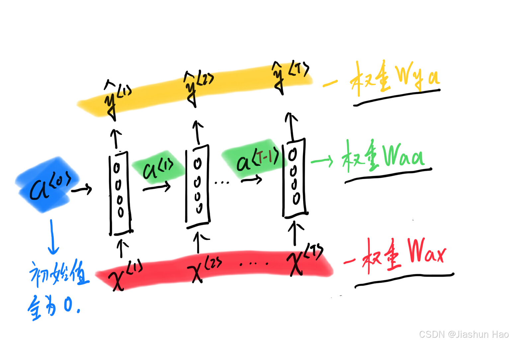
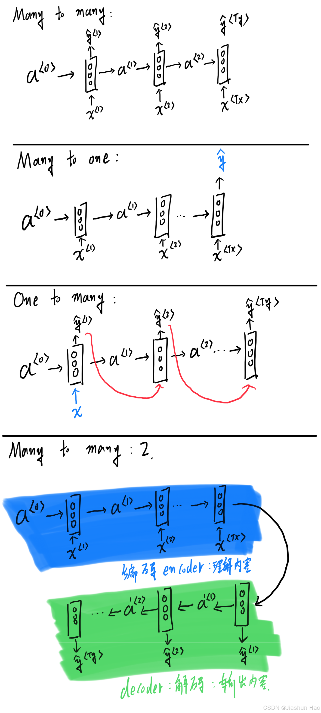
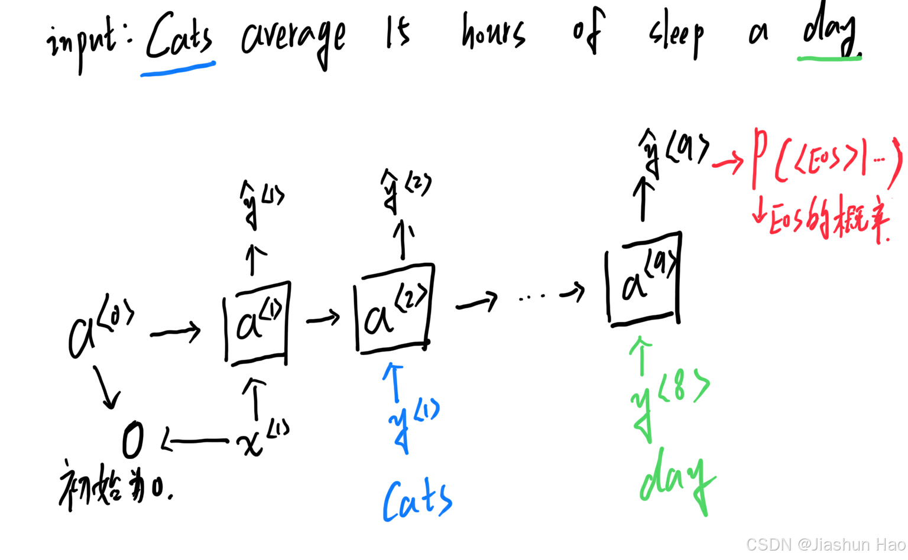
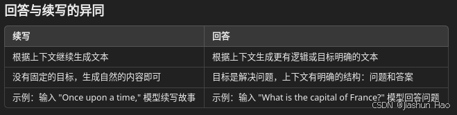
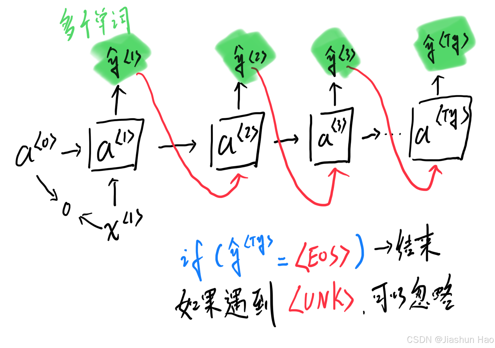
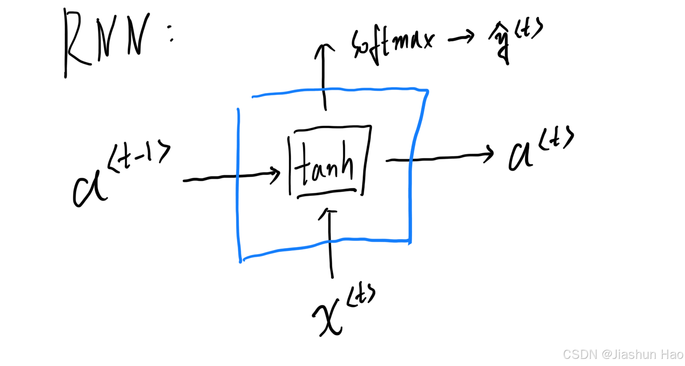
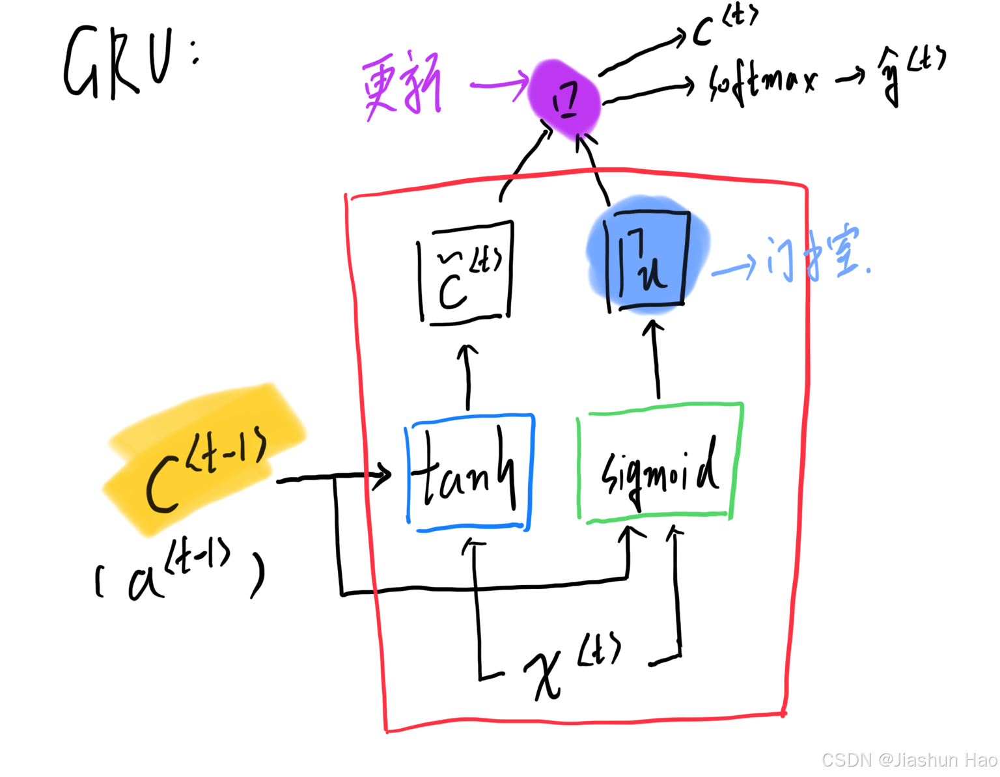
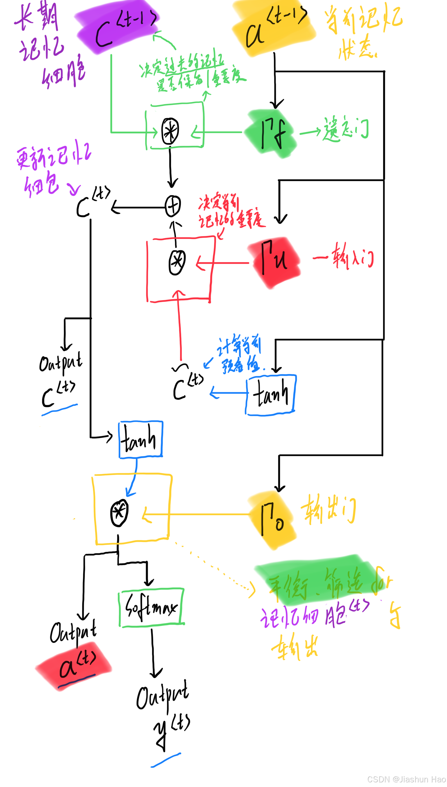

终于快要毕业了，乘着还在还在研究室，把最后一章sequence模型也学完吧。

#### Sequence Model

- [一：基础知识](#_2)
- - [1：符号的定义](#1_3)
  - [2：词典(Vocabulary) 与编码(Encoding)](#2Vocabulary_Encoding_23)
- [二：RNN(Recurrent Neural Networks) 循环神经网络](#RNNRecurrent_Neural_Networks__35)
- - [1：模型架构](#1_36)
  - [2：公式](#2_44)
  - [3：不同类型的RNN模型架构](#3RNN_66)
- [三：Language Model(LM) 语言模型](#Language_ModelLM__69)
- - [1：模型架构](#1_77)
  - [2：概率公式](#2_80)
  - [如何进行文本生成？](#_95)
  - [如何像ChatGPT一样对话呢？](#ChatGPT_110)
  - [ChatGPT也是依赖“问题-答案对”的样本训练吗？](#ChatGPT_118)
- [四：Sampling Novel Sequences 采样新序列](#Sampling_Novel_Sequences__125)
- [五：Vanishing Gradient (梯度消失) & (Exploding Gradient 梯度爆炸)](#Vanishing_Gradient___Exploding_Gradient__130)
- [六：Gated Recurrent Unit(GRU) : 门控循环单元. 一种改进梯度消失的方法。](#Gated_Recurrent_UnitGRU____152)
- - [1：基本模型架构](#1_153)
  - [2：基本GRU公式](#2GRU_165)
  - [3：Full GRU公式](#3Full_GRU_184)
- [七：Long Short-Term Memory(LSTM) : 长短期记忆](#Long_ShortTerm_MemoryLSTM___218)
- - [1：模型架构](#1_219)
  - [2：公式](#2_221)

## 一：基础知识

### 1：符号的定义

FORMULA\_PLACEHOLDER\_0\_END： 表示是一组输入的序列，也就是一段话，类似：

- FORMULA\_PLACEHOLDER\_5\_END “Cats average 15 hours of sleep a day.”
- 如果任务需要处理变长序列,则会用 `<EOS>` 标记序列结束  
   FORMULA\_PLACEHOLDER\_10\_END “Cats average 15 hours of sleep a day. `<EOS>`”

FORMULA\_PLACEHOLDER\_15\_END： 标签序列

FORMULA\_PLACEHOLDER\_20\_END **时间序列的总长度，也就是总时间步数**

- 一般用到的是很多个 FORMULA\_PLACEHOLDER\_25\_END 来表示某一个时刻。FORMULA\_PLACEHOLDER\_30\_END… FORMULA\_PLACEHOLDER\_35\_END
- **在词类的任务中 (word-level classification)** FORMULA\_PLACEHOLDER\_41\_END“Cast”、FORMULA\_PLACEHOLDER\_46\_END“average”…
- **在字母的任务中(character-level processing)** FORMULA\_PLACEHOLDER\_51\_END“C”、FORMULA\_PLACEHOLDER\_56\_END“a”…

除此之外，仍然用 FORMULA\_PLACEHOLDER\_61\_END 表示每一个单独的样本

FORMULA\_PLACEHOLDER\_66\_END 第 FORMULA\_PLACEHOLDER\_73\_END 个样本的第 FORMULA\_PLACEHOLDER\_78\_END 个词.

FORMULA\_PLACEHOLDER\_83\_END: 第 FORMULA\_PLACEHOLDER\_90\_END 个序列的长度.

### 2：词典(Vocabulary) 与编码(Encoding)

词典是一个映射关系，将数据中的每个唯一单词或字符分配一个唯一的索引。  
 One-hot 编码将每个类别或字符表示为一个**长度为词典长度**的二进制向量。

如果在输入的序列FORMULA\_PLACEHOLDER\_95\_END中遇到一个词 FORMULA\_PLACEHOLDER\_100\_END并且该词存在于一个词典 V={‘a’,‘ab’,‘abc’…‘zulu’}中,

使用One-hot对 ‘a’ 进行编码，则是[1,0,0,…,0]. 对 ‘zulu’ 进行编码则是[0,0,0,…,1].

如果一个单词、字符或子词不在词典中，通常会将其标记为 unknown word（未知词，简称 UNK）

并使用特殊符号 `<UNK>` 来表示。

## 二：RNN(Recurrent Neural Networks) 循环神经网络

### 1：模型架构

  
 其中，权重矩阵FORMULA\_PLACEHOLDER\_105\_END、FORMULA\_PLACEHOLDER\_112\_END、FORMULA\_PLACEHOLDER\_118\_END 的命名顺序是 **输出-输入**

为什么？

因为矩阵乘法的维度规则就是 **矩阵A(输出维度\隐藏维度，输入维度) × 矩阵B(输出维度\隐藏维度，输入维度)**

### 2：公式

FORMULA\_PLACEHOLDER\_125\_END  
 其中FORMULA\_PLACEHOLDER\_143\_END和FORMULA\_PLACEHOLDER\_149\_END可以堆积为FORMULA\_PLACEHOLDER\_156\_END

FORMULA\_PLACEHOLDER\_167\_END  
 FORMULA\_PLACEHOLDER\_182\_END

损失函数  
 FORMULA\_PLACEHOLDER\_197\_END

FORMULA\_PLACEHOLDER\_216\_END

### 3：不同类型的RNN模型架构

## 三：Language Model(LM) 语言模型

LM的核心目标就是根据已有的上下文（文本序列）来预测接下来的词语或句子。

- 输入：一个文本序列（或上下文）。
- 学习：隐藏状态FORMULA\_PLACEHOLDER\_230\_END或者FORMULA\_PLACEHOLDER\_236\_END。
- 输出：预测下一个词的概率分布，或评估整个序列的概率。
- 计算机损失：其中传统的标签FORMULA\_PLACEHOLDER\_242\_END就是序列训练样本中的单词。

### 1：模型架构

通过上一个词预测下一个词出现的概率  
 

### 2：概率公式

FORMULA\_PLACEHOLDER\_247\_END  
 FORMULA\_PLACEHOLDER\_265\_END

LM 的训练目标是通过大量的序列（例如句子）数据，学习这些序列的概率分布规律，从而捕捉语言中的结构和模式。

- (1) 文本生成
- (2) 机器翻译
- (3) 语音识别
- (4) 拼写纠正

### 如何进行文本生成？

文本生成的本质是让计算机学会“接着写”。具体来说：

- 你给它一个“开头”或“提示”。
- 它根据这个提示，想象后面应该接什么，像人类完成句子一样。
- 生成的内容要尽量看起来像“人写的”，语法正确、逻辑连贯。

模型如何完成？

- 它会看你给的开头（上下文）。
- 然后基于它学到的“写作经验”（训练数据），去推测下一个可能的内容并且输出。
- 它不会随便乱写，而是会挑选最符合上下文的词语或句子。
- 它不是真的理解，而是根据学习到的经验，找到可能性最高的下一个词，也就是去“猜”

### 如何像ChatGPT一样对话呢？

- 回答也是一种“接着写”，只是“接着写”这个过程被赋予了更复杂的规则和目标，从简单的续写变成了更有针对性的生成。
- 训练对话模型通常会使用“问题-答案对”作为训练样本 回答问题时，模型依然是在接着写，只不过上下文（提示）包含了一个明确的问题
- “问题-答案对”模式，生成最可能符合这个上下文的内容。

### ChatGPT也是依赖“问题-答案对”的样本训练吗？

并不完全是，ChatGPT 的训练过程分为两部分：预训练（Pre-training）和微调（Fine-tuning）

预训练：使用了大量的通用文本数据学习内容的分布，包括互联网文章、书籍、百科、代码片段等。这些数据并不是严格的“问题-答案对”，而是通用文本序列。

微调阶段：使用包含专门的“问题-答案对”，尤其是与对话相关的数据。

## 四：Sampling Novel Sequences 采样新序列

这个步骤的的主要目的是了解模型学到了什么，也就是希望训练好的模型输出一个句子的方法。

## 五：Vanishing Gradient (梯度消失) & (Exploding Gradient 梯度爆炸)

1. 梯度消失（Vanishing Gradient）  
    梯度消失指的是在反向传播过程中，模型的梯度在层层传递时逐渐变小，最终接近于零。这会导致深层网络的前面几层权重几乎不更新，使模型难以有效学习深层特征。
2. 梯度爆炸（Exploding Gradient）  
    梯度爆炸指的是在反向传播过程中，梯度在层层传递时不断增大，导致梯度值非常大，从而导致模型参数更新过大，甚至数值溢出出现`NaN`，模型无法正常训练。

解决方法：

梯度消失

- 改进激活函数：使用 ReLU、Leaky ReLU 或 Swish 等不会饱和的激活函数。
- 归一化技术：如 BatchNormalization，可以在每层网络中规范化激活值，防止数值过小。
- 权重初始化：使用合适的初始化方法（如 Xavier 或 He初始化），可以让激活值保持稳定范围。
- 残差网络（ResNet）：引入残差连接，允许梯度直接跳过多个网络层。

梯度爆炸

- 梯度裁剪(Gradient Clipping)：对梯度的大小设置上限，防止其值过大。
- 权重正则化：通过 L2 正则化限制权重值的大小。
- 权重初始化：合理初始化权重，避免初始值太大。

## 六：Gated Recurrent Unit(GRU) : 门控循环单元. 一种改进梯度消失的方法。

### 1：基本模型架构

普通的RNN单元  
 

GRU的单元  
 

相较于普通的RNN单元，GRU引入了一个新的组件，更新门FORMULA\_PLACEHOLDER\_284\_END.

这是一个通过学习而动态调整权重的组件，用于判断当前输入新信息对整体序列状态的重要性。

### 2：基本GRU公式

计算当前新输入FORMULA\_PLACEHOLDER\_289\_END与记录的历史状态的FORMULA\_PLACEHOLDER\_295\_END的隐藏状态：预备  
 FORMULA\_PLACEHOLDER\_301\_END

更新门：计算当前原始新输入对整体序列状态的重要性。  
 决定新输入FORMULA\_PLACEHOLDER\_316\_END与记录的历史状态的FORMULA\_PLACEHOLDER\_322\_END怎么融合

FORMULA\_PLACEHOLDER\_328\_END

更新隐藏状态：将当前新值的影响设为FORMULA\_PLACEHOLDER\_343\_END倍，旧状态的影响设为FORMULA\_PLACEHOLDER\_348\_END倍，维度相同，逐元素相乘。  
 FORMULA\_PLACEHOLDER\_353\_END为0时，不更新，保留旧的状态。  
 FORMULA\_PLACEHOLDER\_358\_END

### 3：Full GRU公式

FORMULA\_PLACEHOLDER\_371\_END的作用是控制当前输入的新信息与历史状态 的融合比例。换句话说，它决定 “当前输入的重要性有多大”。

然而，在某些场景中，历史信息可能有一部分是无关紧要的，或者对当前任务是“干扰信息”。单靠FORMULA\_PLACEHOLDER\_376\_END无法筛选出历史状态的哪些部分是重要的、哪些应该被忽略。

所以，我们需要一个控制历史信息的门：重置门FORMULA\_PLACEHOLDER\_381\_END

重置门FORMULA\_PLACEHOLDER\_386\_END 的主要作用是允许模型选择性地“忘记”部分历史状态，以便更好地捕获当前输入的重要特征。  
 FORMULA\_PLACEHOLDER\_391\_END

候选门：增加了重置门的候选值计算：  
 FORMULA\_PLACEHOLDER\_406\_END

更新门：计算当前原始新输入对整体序列状态的重要性。  
 决定新输入FORMULA\_PLACEHOLDER\_422\_END与记录的历史状态的FORMULA\_PLACEHOLDER\_428\_END怎么融合

FORMULA\_PLACEHOLDER\_434\_END

更新：

FORMULA\_PLACEHOLDER\_449\_END

FORMULA\_PLACEHOLDER\_462\_END

## 七：Long Short-Term Memory(LSTM) : 长短期记忆

### 1：模型架构

### 2：公式

注意！！！！！！

- FORMULA\_PLACEHOLDER\_471\_END(当前输入）才是关键的核心信息
- FORMULA\_PLACEHOLDER\_477\_END（上一时间步的隐藏状态）的作用是为了提供更多的上下文信息，帮助模型更准确地理解和处理当前输入。
- FORMULA\_PLACEHOLDER\_483\_END以帮助遗忘门、输入门和候选状态的计算更灵活

公式：

候选门：计算当前输入FORMULA\_PLACEHOLDER\_489\_END要保存到长期记忆细胞FORMULA\_PLACEHOLDER\_495\_END中的值作为候选:

FORMULA\_PLACEHOLDER\_501\_END

遗忘门FORMULA\_PLACEHOLDER\_516\_END：考虑当前输入FORMULA\_PLACEHOLDER\_521\_END和上一时间步的隐藏状态FORMULA\_PLACEHOLDER\_527\_END, 输出是一个逐元素向量，值范围在[0,1]  
 将来要使用这个范围在[0,1]的逐元素向量与长期记忆细胞FORMULA\_PLACEHOLDER\_533\_END相乘，来决定记忆是否保留。

FORMULA\_PLACEHOLDER\_539\_END

输入门FORMULA\_PLACEHOLDER\_554\_END：考虑当前输入FORMULA\_PLACEHOLDER\_559\_END和上一时间步的隐藏状态FORMULA\_PLACEHOLDER\_565\_END, 输出是一个逐元素向量，值范围在[0,1]  
 将来要使用这个范围在[0,1]的逐元素向量与候选值FORMULA\_PLACEHOLDER\_571\_END相乘，用于控制候选值中哪些部分需要加入到长期记忆细胞FORMULA\_PLACEHOLDER\_577\_END  
 FORMULA\_PLACEHOLDER\_583\_END

输出门FORMULA\_PLACEHOLDER\_598\_END：考虑当前输入FORMULA\_PLACEHOLDER\_603\_END和上一时间步的隐藏状态FORMULA\_PLACEHOLDER\_609\_END, 输出是一个逐元素向量，值范围在[0,1]  
 将来要使用这个范围在[0,1]的逐元素向量与长期记忆状态的非线性激活值 FORMULA\_PLACEHOLDER\_615\_END 相乘，得到当前隐藏状态FORMULA\_PLACEHOLDER\_623\_END  
 FORMULA\_PLACEHOLDER\_629\_END

更新门：  
 FORMULA\_PLACEHOLDER\_644\_END  
 FORMULA\_PLACEHOLDER\_657\_END
