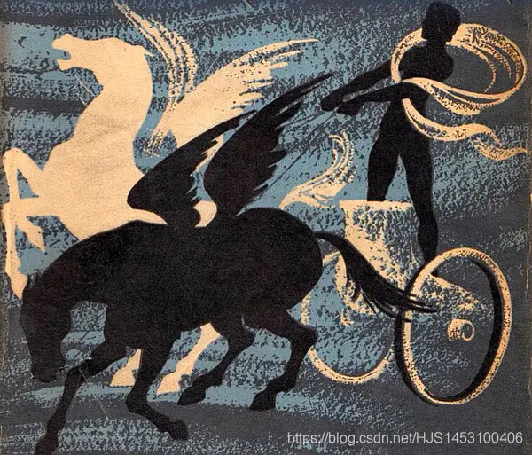

## 雨中闲

假期就快结束啦，却感觉什么都没有做，要开学的崽并没有想象中的那么期待。不过，这段既长大后在家呆过的最长时段，也并没有那样百无寥寂，相反，当我带着一个不算太幼稚的心去再面对成长的环境，那些人，那些事，原来看着也如此趣~  
这样回忆着，也这样想着，不如把想到的都写下来吧，算是给即将大三的我留一份日志。  
该有个标题，不知怎么为合适；正巧，窗外下着雨，就叫“雨中闲\*”吧，“闲”后面的字眼该是什么，又不知了，闲谈？只是我一人，闲想？我却觉得这文有意义。索然不去想了，就为**雨中闲**；

### 1.心情

我好像更清楚的认识到自己是什么样子的，是个认识到应该成熟却还没长大的孩子。这样是不好的，对于我，家庭，以及目前所处的环境，都容不下孤；  
在我看来，每一天都是那么的值得被期待却又是那么的平庸：

**天气：**  
若明天是晴，因为阳光，我会开心，“风和日丽”是自然给予生灵最慷慨的礼物；若明天是晴，我会不悦，因为炽阳对农村的家庭总不算那么友好，那片以“亩”计量的土地，不知溶进了几代的人的汗水。  
若明日是阴雨，因为那份清爽，追寻人类骨子里由阴雨带来的安全感，觉得舒服；亦若明日是阴雨，因为那片泥泞，原本计划今天要出地做的事情只能继续搁置，我是学生，不必焦虑；父母是农民，他们会着急，我是他们的孩子，我会着急。  
**索性我像个孩子，过好我自己的生活就好，天气就交给天吧。**

**大人：**  
爸爸妈妈很爱我，我感觉的到，就像他们厌恶我时那样强烈。  
会因为家里很忙的时候，暂时搁置自己已经习惯很久的学习计划，帮着家里做一份“一个劳动力”的工作，他们忙，我也忙。当月亮升起的时候，餐桌前面总是能听到一份不大不小的骄傲，骄傲的来源是因为我算“一个劳动力”，至于内容，有真有假。我确信他们的爱我的。  
如果今天算清闲，我不用出去，若做一些简单的工作没有完完全全的按照父亲的想法来做，又或者同样是在餐桌前，若不慎将一些汤撒了出，“这么大的人什么事情都做不好！！”.“你看看别人家的”,“我像你这么大的时候…”这时我是绝对绝对不能说话的，不然他的台词便又会多一句“光是顶嘴顶的这么厉害！！！”他们可能是厌恶我的吧，  
但他们是爱我的这一点我仍坚定不移的相信，哈，谁还没让自己的爸爸妈妈骂过或说过几次呢，我会生气，当时会很生气，但是他们所作的一切都是为了他们的这个孩子，每日的忙碌都是为此。我，即使当时会很生气，即使感觉他们很厌恶我。我仍然确定他们爱我。就因待我到校以后，他们会很想我，比我想他们更想。我一直为你们祈祷，祈祷你们健康平安  
**索性我像个孩子，无论怎么样的生气不会记得第二天**

#### 2.周围

我些眷恋这片土地；这些人有朴实，也有连一个小孩子都能一眼看穿的他们那些小聪明，和谐和情切穿插着敷衍与厌恶，这些构成了这片土地；  
他们很明确，善，是因“远亲不如近邻”所衍生出的一种亲情。  
他们也很显示，恶，只是为“自家几两纹银”或是“自己门前雪”。  
但若哪家有什么事情，“善”与“恶”对立时候，“自家、自己”之类的字眼往往就没有那么明确。  
我懂他们，也理解他们，但此时的我，我想努力从周围出去，因为外面我是男生，我该出去。

#### 3.学习

有状态时，无时间。  
有时间时，无状态。  
在柏拉图的画中，我便是个很差劲的骑手。  

该怎么办？不知，若知道，若能改变，倒也不至于此了。  
我曾试着不止一次将那里的紫色的我视为图腾的标志设为壁纸，或者写了很大很大的话。但是无用。

再次尝试吧；我希望：  
**“最难的修行就是忍受寂寞”**
